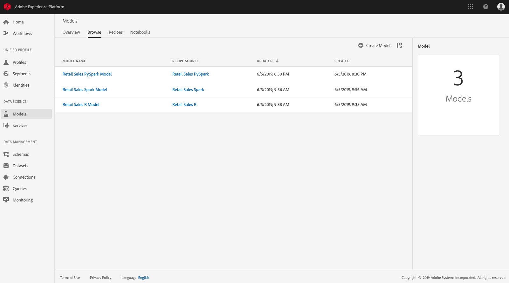
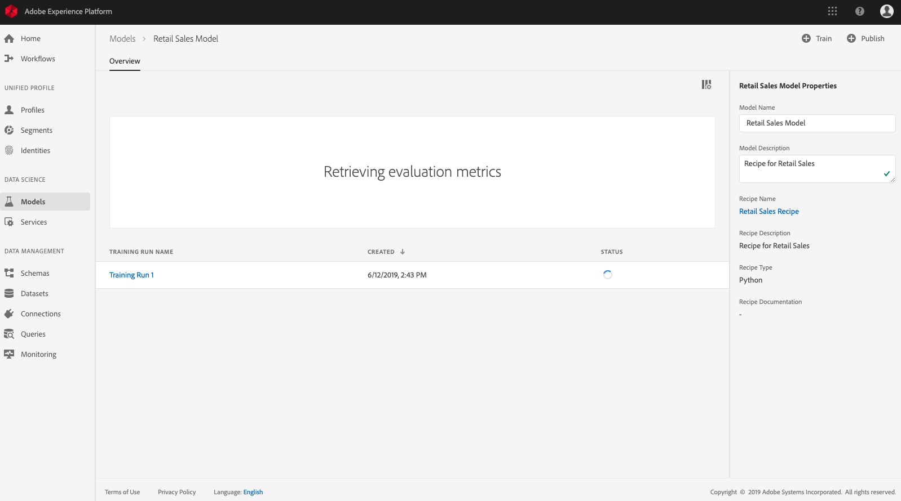
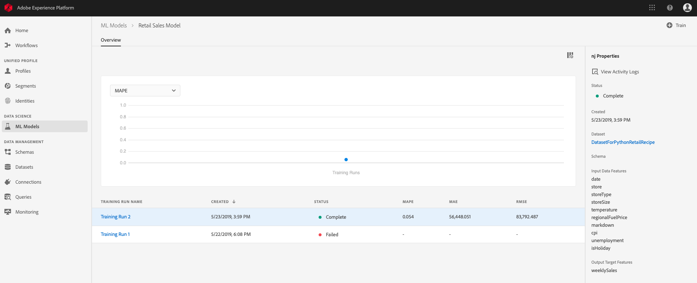
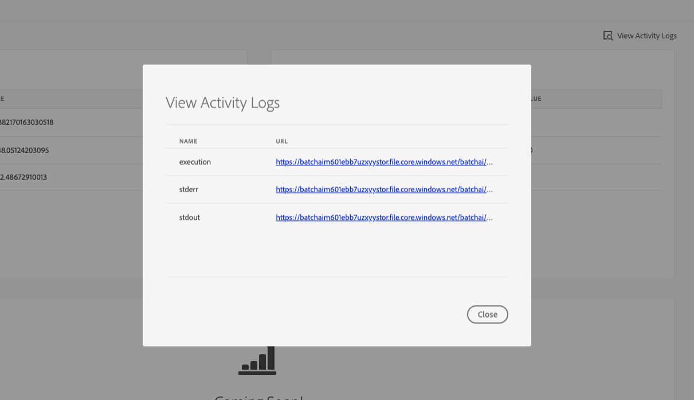

# Train and evaluate a Model in the UI <!-- omit in toc -->

- [Objective](#objective)
- [Prerequisites](#prerequisites)
- [UI workflow](#ui-workflow)
    - [Create a Model](#create-a-model)
    - [Create a Training Run](#create-a-training-run)
    - [Evaluate the Model](#evaluate-the-model)
- [Next steps](#next-steps)

---

## Objective

This tutorial will show you how to train and evaluate a Model in Adobe Experience Platform Data Science Workspace. A Model is created by incorporating an existing Recipe, refer to the section on [Author a Model]() for more information on creating and importing a Recipe into Data Science Workspace.

## Prerequisites

* A registered Adobe ID account
    * The Adobe ID account must have been added to an Organization with access to "Adobe Experience Platform"
* An existing Recipe for creating a Model.

## UI workflow

This section will show you the UI workflow on how to create, train, and evaluate a Model.
- [Create a Model](#create-a-model)
- [Create a training run](#create-a-training-run)
- [Evaluate the Model](#Evaluate-the-model)

### Create a Model

To begin, login to [Adobe Experience Platform](https://platform.adobe.com/). On the Left navigation panel, navigate into **Models**. You will be taken to the **Browse** tab which will list all existing Model's, including any new Model's you will be creating.

On the top right of the **Browse** screen, click on **Create Model** and a new Workflow should begin. There are three steps in the Model creation workflow: **Select Recipe**, **Select Dataset**, and **Name & Configure**.

#### Select Recipe

Browse through the list of existing Recipes, and select the Recipe you want to use to create the Model. Feel free to order the list of Recipes by simply clicking on either **Recipe Name**, **Created**, or **Type**.

Note that a Model is an instance of a Recipe with specific configurations, meaning many Models can be created from a single Recipe.

#### Select Dataset

In the **Select Dataset** step, select the dataset you previously [created and ingested data into](). You can view more details about a dataset by selecting it.

Once you've found the appropriate dataset for the Model you are creating, click **Next**.

#### Name & Configure

Finally, enter a model name as well as configurations for the Model. For the configuration, you can use the sample Retail Sales configuration file from the public repository [here](https://github.com/adobe/experience-platform-dsw-reference/blob/a74f65d2c6fcc3ae85414f74f003620a657e2d1c/recipes/python/retail/retail.config.json). Click on **Upload New Config** and drag the JSON file into the browser window. The training and scoring parameters should update according to the configuration file you uploaded.

Once you are done with naming and configuring your Model, click **Finish** to complete the Model creation workflow.

### Create a Training Run

After creating the new Model, you should see an overview page as seen below.

By default, model creation leads to a training run to be created and ran. This training run uses the default configuration parameters which you set during the Model creation workflow. 

To create a new training run, click the **Train** button on the top-right of the page. This will take you to a **Run Training** workflow. This workflow has two steps: **Training input**, and **Configuration**.

In the **Training input** step, you will need to select the source dataset for your training run. 

After selecting your dataset, click **Next** and you will be asked to configure your training run.

These configuration values are called hyperparameters. Hyperparameters cannot be learned - they must be assigned before training of the model. Adjusting the parameters may change the accuracy of the trained model.

The Retail Sales Forecasting Recipe uses the gradient boosting algorithm. Here are the associated hyperparameters:

Hyperparameter | Description | Recommended Range
--- | --- | ---
learning_rate | Learning rate shrinks the contribution of each tree by learning_rate. There is a trade-off between learning_rate and n_estimators. | 0.1 | [2 - 10] / number of estimators
n_estimators | The number of boosting stages to perform. Gradient boosting is fairly robust to over-fitting so a large number usually results in better performance. | 100 | 100 - 1000
max_depth | Maximum depth of the individual regression estimators. The maximum depth limits the number of nodes in the tree. Tune this parameter for best performance; the best value depends on the interaction of the input variables. | 3 | 4 - 10

Double-click on a key or value to modify the training run configuration. If you have another configuration file, you can also use the **Upload New Config** button as well. If you change your mind and made a mistake, you can click on **Reset fields** to revert all the changes you just made.

Click on **Finish** when you are happy with your configuration. You will be taken to the model's overview page.

When you are happy with the configuration, click **Finish**. Your training run will be created and will start running.

### Evaluate the Model

On the model overview page, you can see the status of each of the training runs. If at least one run is complete, you will be able to see metrics and visualizations for the completed runs.

> **NOTE:** The Mean Absolute Percent Error (MAPE) metric expresses accuracy as a percentage of the error. This is used to identify the top performing Experiment. The lower the MAPE, the better.

With completed multiple training runs, you can compare metrics across different training runs in the model evaluation chart.

> **NOTE:** The "Precision" metric describes the percentage of relevant Instances compared with the total *retrieved* Instances. Precision can be seen as the probability that a randomly selected outcome is correct.

You can click on a specific training run to view the details about the run. This can be done even before the run has been completed. Once in the run's detail page, you are able to see other evaluation metrics, configuration parameters, and visualizations specific to the training run.

A user can also download activity logs to see the details of the run. Logs are particularly useful for failed runs to see what went wrong.

## Next steps

This tutorial went over how to consume the APIs to create a Recipe, an Experiment, and trained Models. In the [next exercise](../how_to_score_with_recipe/how_to_score_with_recipe.md), you will be making predictions by scoring a new dataset using the top performing trained model.