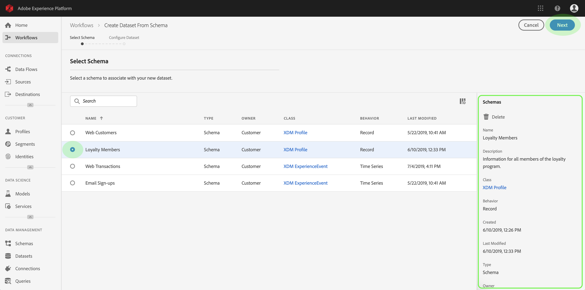
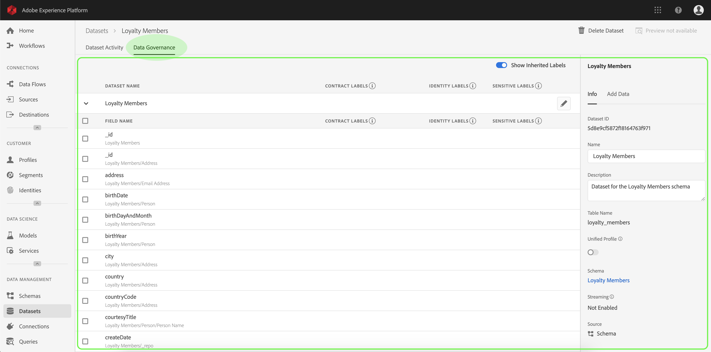
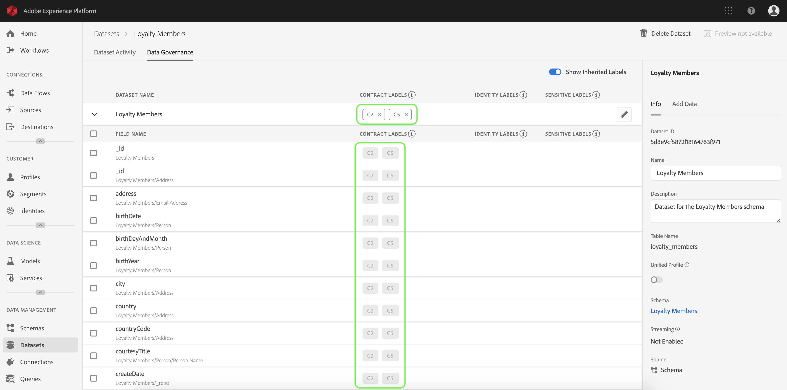
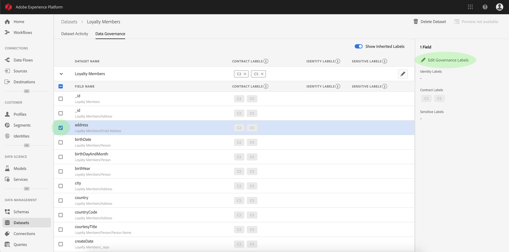
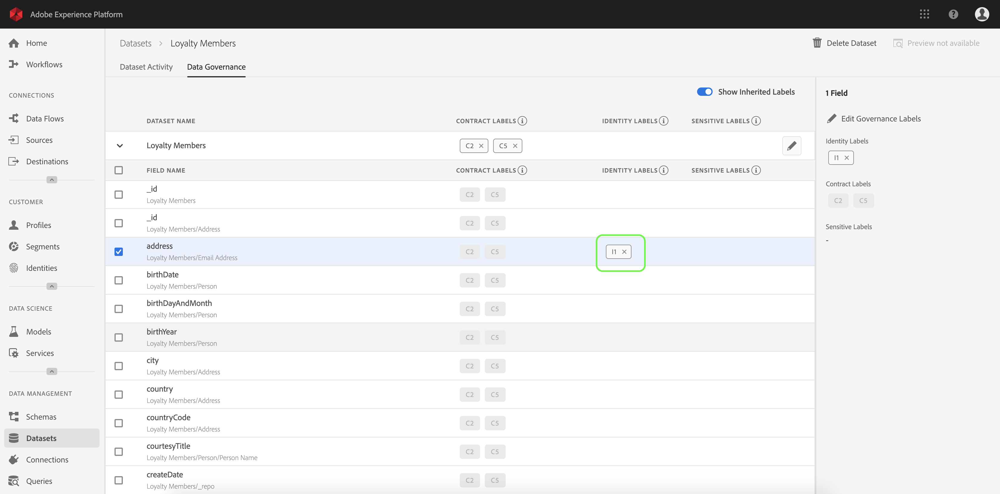
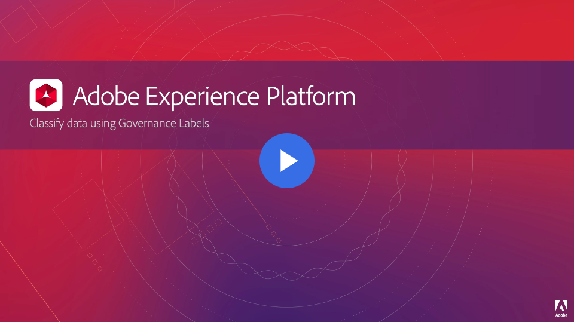

# Data usage labels user guide

Data Usage Labeling and Enforcement (DULE) is the core mechanism of Adobe Experience Platform Data Governance. DULE features enable you to apply data usage labels to datasets and fields, categorizing each according to related data usage policies.

This user guide covers steps for working with data usage labels (also known as DULE labels) within the Experience Platform user interface. Before using the guide, please see the [Data Governance overview](../../technical_overview/data_governance/dule_overview.md) for a more robust introduction to the DULE framework.

The following topics are covered:

* [Understanding data usage labels](#understanding-data-usage-labels)
* [Managing data usage labels at the dataset level](#managing-data-usage-labels-at-the-dataset-level)
* [Managing data usage labels at the dataset field level](#managing-data-usage-labels-at-the-dataset-field-level)

## Understanding data usage labels

Data usage labels allow you to categorize datasets and fields according to usage policies that apply to that data. Labels can be applied at any time, providing flexibility in how you choose to govern data. Best practices encourage labeling data as soon as it is ingested into Experience Platform, or as soon as data becomes available for use in Platform.

Data usage labels that are applied at the dataset level are propagated to all fields within the dataset. Labels can also be applied directly to individual fields (column headers) in a dataset, without propagation.

For more information on available data usage labels in Experience Platform and the usage policies they represent, see the guide on [supported data usage labels](../../technical_overview/data_governance/dule_supported_labels.md).

## Managing data usage labels at the dataset level

In order to manage data usage labels at the dataset level, you must select an existing dataset or create a new one. After logging into Adobe Experience Platform, select **Datasets** on the left-navigation to open the _Datasets_ workspace. This page lists all created datasets belonging to your organization, along with useful details related to each dataset. 

The next section provides steps for creating a new dataset to apply labels to. If you wish to edit labels for an existing dataset, select the dataset from the list and skip ahead to [adding data usage labels to the dataset](#add-data-usage-labels-to-the-dataset).

### Create a new dataset

> **Note**: In this example, a dataset is created using a pre-configured Experience Data Model (XDM) schema. For more information on XDM schemas, see the [XDM System overview](../../technical_overview/schema_registry/xdm_system/xdm_system_in_experience_platform.md) and [basics of schema composition](../../technical_overview/schema_registry/schema_composition/schema_composition.md).

To create a new dataset, click **Create Dataset** in the top-right corner of the _Datasets_ workspace.

The _Create Dataset_ screen appears. From here, click **Create Dataset from Schema**. 

The _Select Schema_ screen appears, which lists all available schemas that you can use for creating a dataset. Click the radio button next to a schema to select it. The _Schemas_ section on the right-hand side displays additional details about the selected schema. Once you have selected a schema, click **Next**.

The _Configure Dataset_ screen appears. Provide a **name** (required) and **description** (optional, but recommended) for your new dataset, then click **Finish**.

The _Dataset Activity_ page appears, displaying information about the newly created dataset. In this example, the dataset is named "Loyalty Members", therefore the top-navigation shows _Datasets > Loyalty Members_. 

### Add data usage labels to the dataset

After creating a new dataset or selecting an existing dataset from the list in the _Datasets_ workspace, click **Data Governance** to open the _Data Governance_ workspace. The workspace allows you to manage data usage labels at the dataset level and field level.

To edit data usage labels at the dataset level, start by clicking the pencil icon next to the dataset name.

The _Edit Governance Labels_ dialog opens. Within the dialog, check the boxes next to the labels you wish to apply to the dataset. Remember that these labels will be inherited by all fields within the dataset. The _Applied Labels_ header updates as you check each box, showing the labels you have chosen. Once you have selected the desired labels, click **Save Changes**.

 

The _Data Governance_ workspace reappears, showing the labels that you have applied at the dataset level. You can also see that the labels are inherited down to each of the fields within the dataset.

Notice that an "x" appears next to the labels at the dataset level, allowing you to remove the labels. The inherited labels beside each field do not have an "x" next to them and appear "greyed out" with no ability to remove or edit. This is because **inherited fields are read-only**, meaning they cannot be removed at the field level.

The **Show Inherited Labels** toggle is on by default, which allows you to see any labels inherited down from the dataset to its fields. Switching the toggle off hides any inherited labels within the dataset.

## Managing data usage labels at the dataset field level

Continuing the workflow for [adding and editing data usage labels at the dataset level](#add-and-edit-data-usage-labels-at-the-dataset-level), you can also manage field-level labels within the _Data Governance_ workspace for that dataset. 

To apply data usage labels to an individual field, select the checkbox next to the field name, then click **Edit Governance Labels**.  

The _Edit Governance Labels_ dialog appears. The dialog displays headers showing selected fields, applied labels, and inherited labels. Notice that the inherited labels (C2 and C5) are greyed out in the dialog. They are read-only labels inherited from the dataset level and are therefore only editable at the dataset level.  

 

Select field-level labels by clicking the checkbox next to each label you wish to use. As you select labels, the _Applied Labels_ header updates to show labels applied to the fields shown in the _Selected Fields_ header. Once you have finished selecting field-level labels, click **Save Changes**.

 

The _Data Governance_ workspace reappears, which now displays the selected field-level label(s) in the row next to the field name. Notice that the field-level label has an "x" next to it, allowing you to remove the label.  

You can repeat these steps to continue adding and editing field-level labels for additional fields, including selecting multiple fields to apply field-level labels simultaneously.  

It is important to remember that inheritance moves from the top-level down only (dataset → fields), meaning that labels applied at the field level are not propagated to other fields or datasets.

## Next steps

Now that you have added data usage labels at the dataset and field level, you can begin to ingest data into Experience Platform. To learn more, start by reading the [data ingestion documentation](../../technical_overview/ingest_architectural_overview/ingest_architectural_overview.md).

## Additional resources

The following video is intended to support your understanding of Data Governance, and outlines how to apply labels to a dataset and individual fields.

