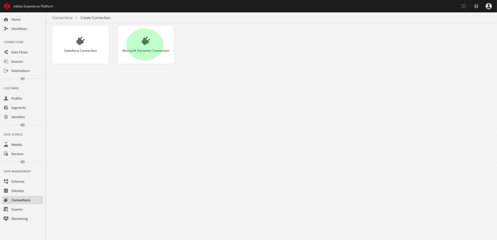
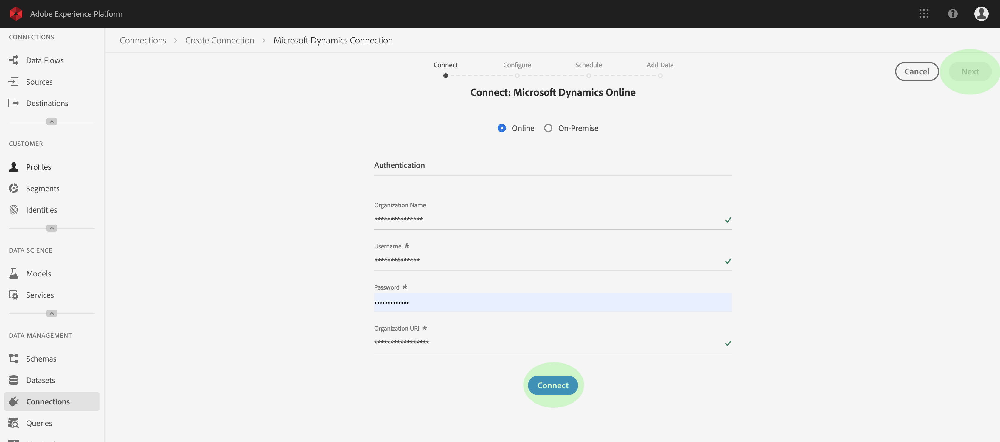
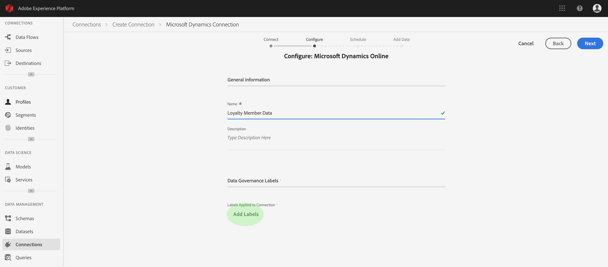
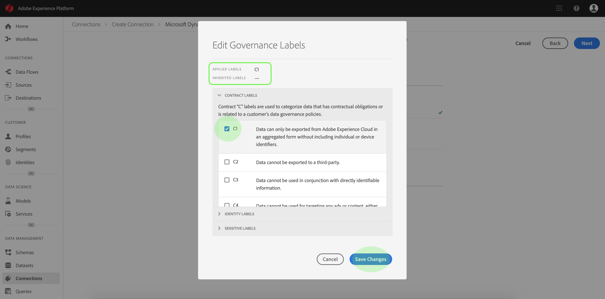
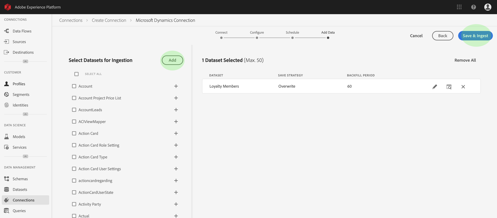
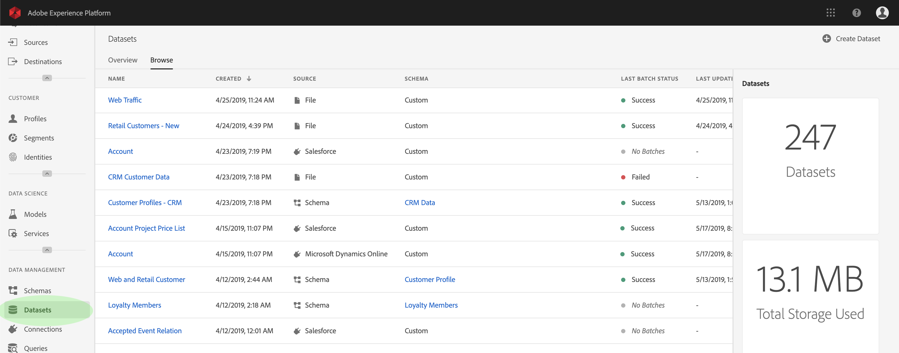
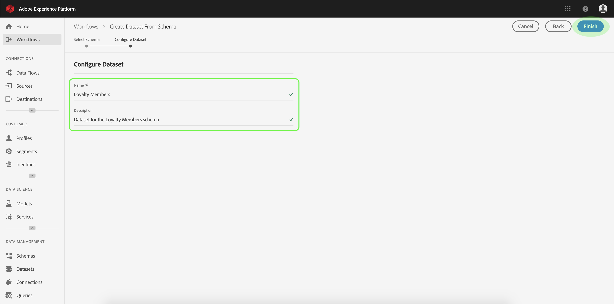
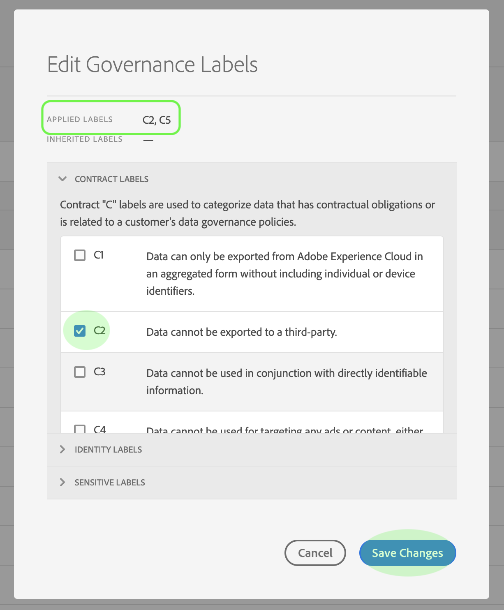
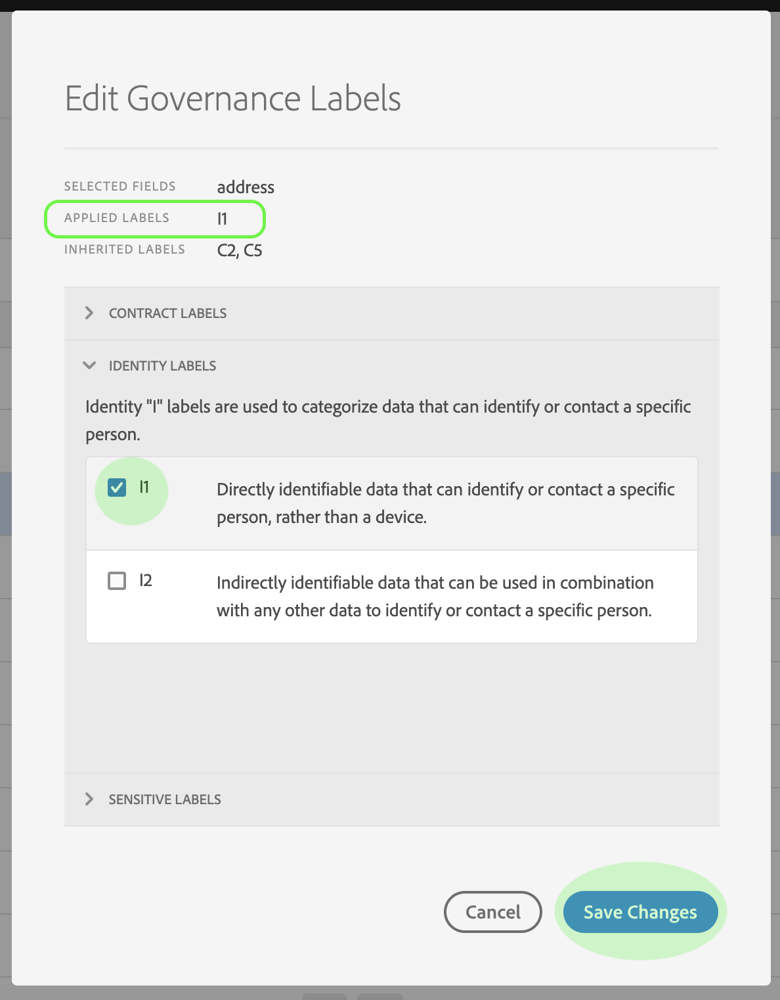
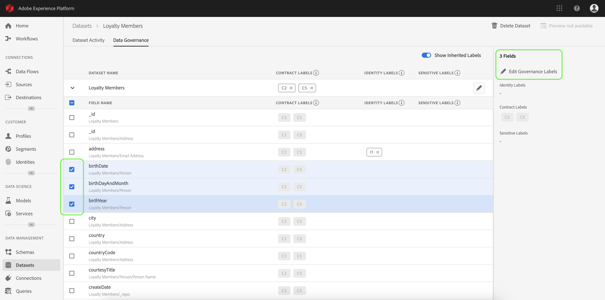

# Work with data usage labels

Data Usage Labeling and Enforcement (DULE) is at the core of the data governance infrastructure in Adobe Experience Platform. DULE features enable you to apply data usage labels to connections, datasets, and fields, categorizing each according to related data usage policies.

Labels can be applied at any time, providing flexibility in how you choose to govern data. Best practice encourages labeling data as soon as it is ingested into Experience Platform, or as soon as data becomes available in Platform.

Data usage labels are inherited down from connections to datasets, and from datasets to fields. This means that data usage labels applied at the connection level are propagated to all datasets and fields created from that connection, while labels applied at the dataset level are propagated to all fields within the dataset. Labels can also be applied directly to individual fields (column headers) in a dataset, without propagation.

Before beginning this tutorial, read the [Data Governance overview](../../technical_overview/data_governance/dule_overview.md) for a more robust introduction to the DULE framework.

## Tutorial

The examples in this tutorial walk through the steps to add and edit data usage labels at the connection, dataset, and field level using Adobe Experience Platform. 

This tutorial requires you to have an Adobe ID and access to Experience Platform.

## Add data usage labels at the connection level

Adding labels at the connection level requires first creating a connection. In order to create a connection, you need to have login credentials for the connector of your choice. In this tutorial, a connection is made to Microsoft Dynamics.

1. In Adobe Experience Platform, select **Connections** from the left-navigation. If connections have been made, they will be listed here with Name, Source, and Status. The Connections workspace also includes information regarding the number of connections in your organization, recently updated connections, and composition of connections across sources.  

1. To create a new connection, click **Create Connection** in the top-right of the Connections workspace.
1. On the **Create Connection** screen, select **Microsoft Dynamics Connection**.  

1. Use your Microsoft Dynamics credentials to complete the Authentication fields, then click **Connect**. Once the connection is confirmed, click **Next**.  

1. On the **Configure: Microsoft Dynamics Online** screen, give your connection a Name (required) and a Description (optional), then click **Add Labels** to begin adding labels.  

1. In the **Edit Governance Labels** dialog, expand each type of label to see all available options. Select the checkbox next to each label that you would like to add. The **Applied Labels** section at the top of the dialog shows the labels that you select. The **Inherited Labels** section will remain blank as connections do not inherit labels. Once you have finished selecting connection-level labels, click **Save Changes**.   

1. The connection labels you selected will now appear on the **Configure: Microsoft Dynamics Online** screen. Click **Add Labels** to add more connection-level labels, or click **Next** to continue.

1. On the **Ingestion Schedule** screen you can set the timing of data ingestion for this connector. Once complete, click **Next**.

1. You can now select datasets for ingestion. Once you have selected at least one dataset, click **Save & Ingest** to continue. 

1. On the **Connection Details** page, you will now see information related your connection, including the Ingestion Schedule and related Datasets information.

You have now successfully created a Microsoft Dynamics connection and applied DULE labels at the connection-level. In the future, all datasets created using this connection will inherit the connection-level labels to that dataset and to all individual fields within.

## Add and edit data usage labels at the dataset level

In order to add data usage labels at the dataset level, you must select an existing dataset or create a new one. In this example, a dataset is created using a pre-configured schema. For more information on dataset schemas and how to compose schemas for use with Experience Platform, read the [Basics of Schema Composition](../../technical_overview/schema_registry/schema_composition/schema_composition.md).

1. After logging into Adobe Experience Platform, select **Datasets** on the left-navigation. If datasets have been created, they will be listed here by Name, along with useful details related to each dataset. 

1. To create a new dataset, click **Create Dataset** in the top-right corner of the Datasets workspace.  
    
    _**To edit labels on an existing dataset, click on the name of the dataset and jump ahead to Step 6.**_

1. On the **Create Dataset** screen, click **Create Dataset from Schema**.  

1. The **Select Schema** screen lists all available schemas that you can use for creating a dataset. Clicking the radio button next to a schema will display additional schema details. Once you have found the schema you wish to use, click **Next**.  

1. On the **Configure Dataset** screen, provide a Name (required) and Description (optional, but recommended) for your new dataset and click **Finish**.    
  
1. The **Dataset Activity** page appears displaying information about the newly created dataset. In this example the dataset is named "Loyalty Members" therefore the top-navigation shows **Datasets > Loyalty Members**. 

    You can use the **Data Governance** tab (just below the top-navigation) to manage DULE labels for this dataset, including adding new labels at the dataset and field level or editing labels in the future should you need to make changes.  

1. To begin adding data usage labels at the dataset level, click on the pencil icon and the **Edit Governance Labels** dialog will open.
1. Within the **Edit Governance Labels** dialog, check the boxes next to the labels you wish to apply to the dataset. Remember that these labels will be inherited by all fields within the dataset. As you check each box the **Applied Labels** header will update showing the labels you have chosen. Once you have selected all of the desired labels, click **Save Changes**.  

1. The **Data Governance** tab now shows the labels that you have applied at the dataset level. You can also see that the labels are inherited down to each of the fields within the dataset.  

**Show Inherited Labels** 

The Show Inherited Labels toggle is on by default. This allows you to see any labels inherited down from the dataset to its fields. Notice that an "x" appears next to the labels at the dataset level, allowing you to remove the labels. The inherited labels beside each field do not have an "x" next to them and appear "greyed out" with no ability to remove or edit. This is because **inherited fields are read only**, meaning they cannot be removed at the field level. 

## Add data usage labels at the field level using dataset details 

Continuing the workflow for [adding and editing data usage labels at the dataset level](#adding-and-editing-data-usage-labels-at-the-dataset-level), you can also add and edit field-level labels from the **Data Governance** tab of the dataset. Each column in the dataset is represented by a row listed under Field Name.

1. To apply data usage labels to an individual field, select the checkbox next to the field name, then click **Edit Governance Labels**.  

1. In the **Edit Governance Labels** dialog, you will see headers showing Selected Fields, Applied Labels, and Inherited Labels. Notice that the inherited labels (C2 and C5) are greyed out in the dialog. They are read-only labels, inherited from the dataset level and are therefore only editable at the dataset level.  

1. Select field-level labels by checking the checkbox next to each label you wish to use. As you select labels, the Applied Labels header will update to show labels applied to the fields shown in the Selected Fields header.  

1. Once you have finished selecting field-level labels, click **Save Changes**.
1. You will now see the selected field-level label(s) in the row next to the field name. Notice that the field-level label has an "x" next to it, allowing you to easily remove the label.  

1. You can repeat these steps to continue adding and editing field-level labels for additional fields, including selecting multiple fields to apply field-level labels simultaneously.  

It is important to remember that inheritance moves from the top-level down only (Connection → Dataset → Fields), meaning that labels applied at the field level will not be propagated to other fields or upwards to the dataset or connection.

## Next steps

Now that you have added data usage labels at the connection, dataset, and field level, you can begin to ingest data into Experience Platform. To learn more, start by reading the [data ingestion documentation](../../technical_overview/ingest_architectural_overview/ingest_architectural_overview.md).