# Tutorial - Import, Train and Evaluate Recipe Tutorial via UI

## Objective
In this step by step tutorial, we will go over how to import a Recipe into the Data Science Workspace. From there, we will go over an example where we train and evaluate the Recipe.

---

## Prerequisites

* A registered Adobe ID account
    * The Adobe ID account must have been added to an Organization with access to "Adobe Cloud Platform"

## UI Workflow

In this section, we will go over creating a Recipe where you can import your Docker image. We went through the steps to create a Docker image in the [Package Recipe to Data Science Workspace tutorial](../package_recipe_to_import_into_dsw/package_recipe_to_import_into_dsw.md).

First, we launch the [Adobe Cloud Platform UI](https://platform.adobe.com/) and go to the `Data Science` tab in the top navigation bar. You will be taken to the `Overview` tab where you will see three sections:
* Recipes
* My Instances
* My Notebooks

For this tutorial, we will be focused on Recipes, Instances, and Experiments. The following chart outlines the relationship between the three and also introduces the idea of a trained model. 

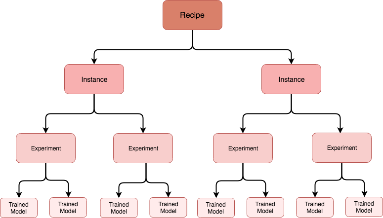

The Recipe section is a carousel that lists the recipes that you or others in your IMS Organization have created. A Recipe refers to a proprietary algorithm, or an ensemble of algorithms, to help solve specific business problems.

The Instances section is a list of recently updated Recipe Instances. An Instance is a snapshot of a Recipe that will be tailored towards solving a specific business problem. One Recipe can create many Instances.

In the UI, an Experiment is run within the context of an Instance and the Experiment Run will correspond to a Trained Model. Note that currently, a single Experiment will only associate with a single Experiment Run and thus a single Trained Model as well.

### New Recipe

We first want to create a new Recipe. From the Data Science Workspace overview page, click on the "New" button on the top right. From there, you will be given an option to create a Notebook or a Recipe. 

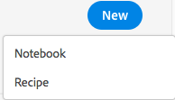

Choose Recipe and a "New Recipe" dialog will popup on the screen. The `*` indicate which fields require to be filled. 

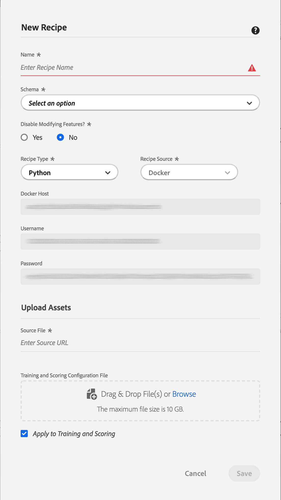

* **Name** - This is the name of your Recipe
* **Schema** - What XDM Schema you want to model your data with
* **Recipe Type** - What language or tool you're going to use
* **Recipe Source** - Where your image is uploaded to. Currently only supports Docker images or Binary artifacts, based on the selected Recipe type

Note that if Spark is selected for Recipe Type and Binary is set for Recipe Source, the asset that is expected will be a `.jar` file.

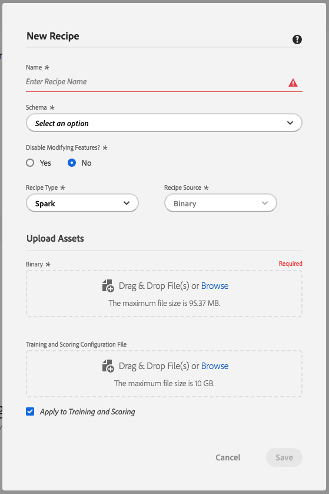

* **Docker Host** - Link to the Docker host to upload your Docker image to
* **Username/Password** - Credentials to the Docker host
* **Configuration File** - This file expects a JSON object containing parameters for the training and scoring of the Instance. You can leave this blank when creating the Recipe as the workflow will prompt you to enter the configuration when creating an Instance or an Experiment. Example of configuration file for the sentiment analysis sample application:

```JSON
[
    {
        "name": "train",
        "parameters": [
            {
                "key": "numFeatures",
                "value": "10"
            },
            {
                "key": "maxIter",
                "value": "2"
            },
            {
                "key": "regParam",
                "value": "0.15"
            },
            {
                "key": "trainingDataLocation",
                "value": "wasbs://intelligentservices@mlhackathon01.blob.core.windows.net/samples/sentiment_analysis/text_emotion_training.csv"
            }
        ]
    },
    {
        "name": "score",
        "parameters": [
            {
                "key": "scoringDataLocation",
                "value": "wasbs://intelligentservices@mlhackathon01.blob.core.windows.net/samples/sentiment_analysis/scoringdataemotions.csv"
            },
            {
                "key": "scoringResultsLocation",
                "value": "wasbs://intelligentservices@mlhackathon01.blob.core.windows.net/samples/sentiment_analysis/outputemotions"
            }
        ]
    }
]
```

For this tutorial, we will be creating a Python Recipe using the Docker image that we created in the [Package Recipe tutorial](../package_recipe_to_import_into_dsw/package_recipe_to_import_into_dsw.md). We are provided with the Docker host, username, and password values which we will be able to use to build our Docker image.

#### Build Docker Image
With our Dockerfile, we can build the Docker image. In the directory with your Dockerfile type the following commands:

``` BASH
#  These values are found in the New Recipe window
docker login -u <username> -p <password> <Docker host>
 
#  Build the Docker image: e.g., docker build -t <docker-path>/sample-python:1.0 .
docker build -t <Docker host>/<intelligent-service>:<version_tag> 
```

#### Push Docker Image

``` BASH
#  This URL is the same as the one in your build command.
docker push <Docker host>/<intelligent-service>:<version_tag>
```

---

Now insert the URL you have just built and pushed to the Docker host into the Source File field. After pressing "Save", we are taken to the new Recipe's overview page. From here we are able to view information about the Recipe we just created and are able to create Recipe Instances to run experiments.


### Create Instance

Now that we created a new Python Recipe and are taken to the Recipe Overview, we can create a Recipe Instance. Remember that an Instance is a snapshot of the Recipe configured that will be tailored to help solve specific business problems. One Recipe can create many Instances. Since the Recipe we created is new, it has no existing Instances so the user interface will show that you have an empty list of Instances and ask if you want to create your first Instance.

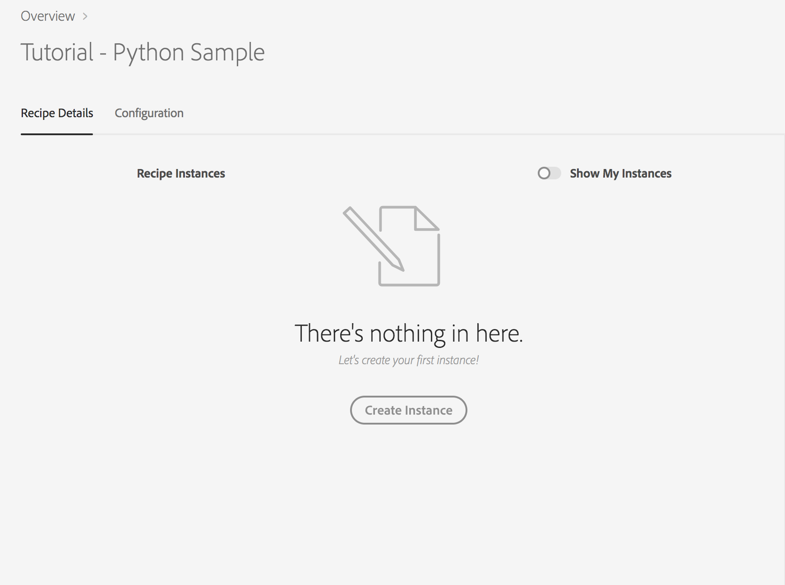

Click on either of the two "Create Instance" buttons and a New Instance dialog should appear. Fill in the name for your Instance and a description for your Instance. Adding a configuration file in this step is not required. If you do add a configuration file, it will merge with your existing configuration and add new fields if applicable.

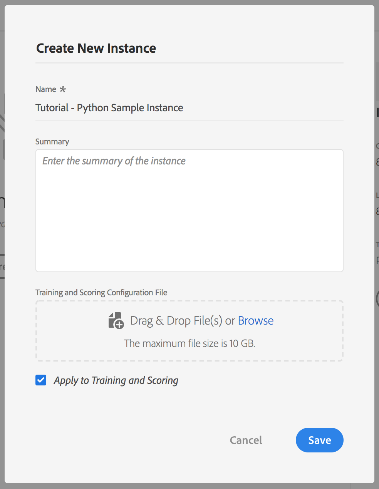

Click on Save once you have everything filled out. You will be taken to your Instance overview page.

### Create Experiment

After creating the new Instance, you should see an overview page as seen below.

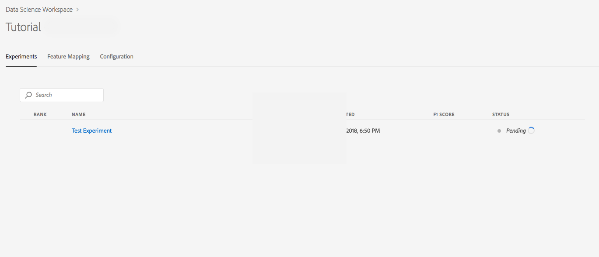

To create a new Experiment, we can use either of the "Create Experiment" buttons in the overview page. Once clicking on the "Create Experiment" buttons, a "New Experiment" dialog will appear. 

Note that as with the Instance creation, adding a configuration file in this step is not required. If you do add a configuration file, it will merge with your existing configuration and add new fields. Some Recipes have parameters hard-coded within its code. These Recipes will not even require a configuration file until they update the Recipe.

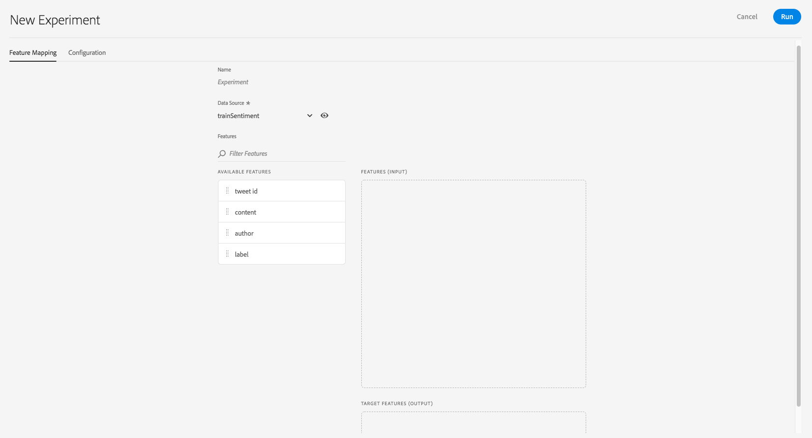

In the Create New Experiment page, the Data Source field specifies which data to use in the Experiment. The two fields below, Features and Target Features, represent the features that you want to be used as an input and features you want as an output. You can drag a feature from the list of Available Features to either the Features or Target Features field.

In the Configuration tab, you are shown the default configurations for your Experiment. You can add or edit the parameters in this page.

After clicking on the "Run" button, your experiment is created and you will be taken back to the Instance Overview page. The Experiment will automatically run in the background until the status is either Completed or Failed.

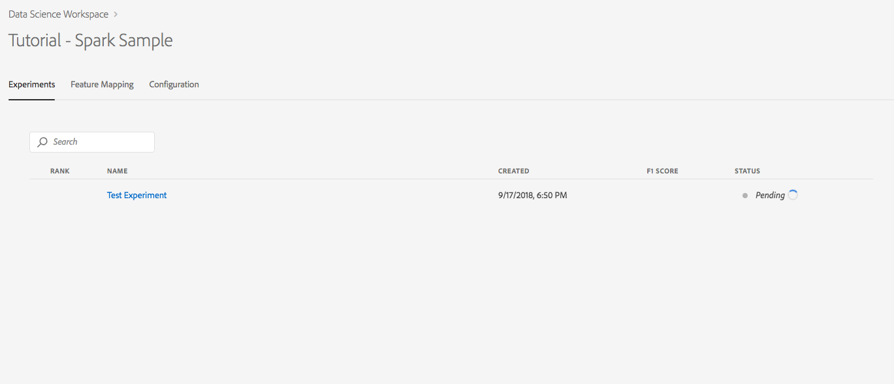

You can click on the Experiment to view the details about the Experiment. This can be done even before the Experiment Run has been completed. Once in the Experiment detail page, you can view all Experiment Runs. Clicking on the "Configuration" tab, we are able to see the Instance's default parameters.

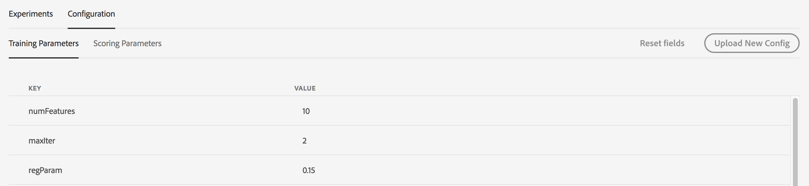

### Evaluating Experiment Results

After the evaluation is finished running, results will be shown under the "Evaluation Metrics" tab in the experiment page. Metrics are automatically generated depending on your model's algorithm type. For binary classification, the following metrics are generated:
* Measures
* Receiver Operator Characteristics
* Confusion Matrix

For other model types (e.g. regression), only the following metric is generated
* Measures

#### Measures Chart

The Measures chart displays key values which describe your results.

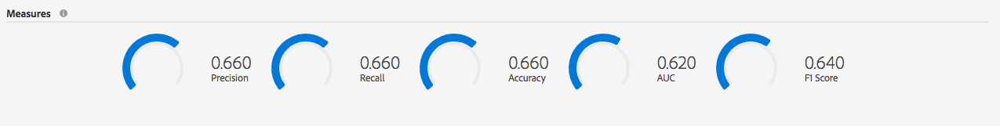


The "Precision" metric describes the percentage of relevant Instances compared with the total *retrieved* Instances while the "Recall" metric describes the percentage of relevant Instances that have been retrieved compared with the total amount of *relevant* retrieved Instances. Precision can be seen as the probability that a randomly selected outcome is correct, while recall is seen as the probability of a correctly selected outcome from a given dataset to be correctly selected.

Precision and recall are commonly used together for evaluation. In fact, the F1 score is the harmonic average of the precision and recall. The ideal F1 score would be 1 while the worse is at 0. 

The "Accuracy" metric compares the results with the expected outcome.

The "Area Under Curve" metric (AUC) is used to measure the efficiency of a binary classification algorithm.

#### Receiver Operator Characteristics

The Receiver Operating Characteristic curve (ROC curve) is a plot of true positive rates against the false positive rates. This relationship shows the tradeoff between sensitivity and specificity. The perfect curve would be one with a 0% false positive rate and a 100% true positive rate. This means the curve would hug the left and top axis of the chart. Conversely, as the curve appears closer to the diagonal line, the less accurate the test. The diagonal line represents if the results were decided randomly.

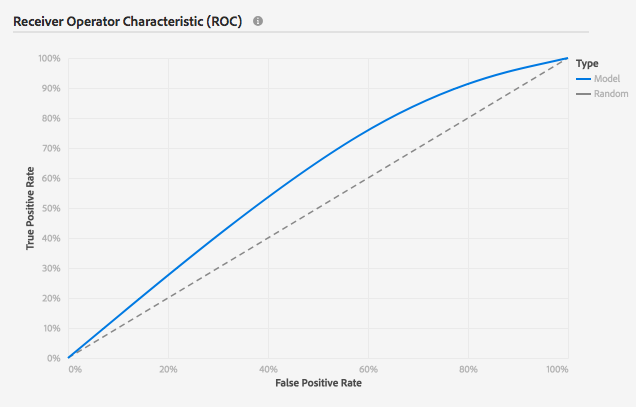


#### Confusion Matrix

The Confusion Matrix shows the distribution of predictions into the following four buckets:
* True Positive - Predicted positive correctly
* True Negative - Predicted negative correctly
* False Positive - Predicted positive incorrectly
* False Negative - Predicted negative incorrectly

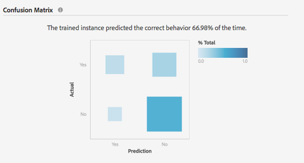


The total percentage of correctly predicted results is found by adding up the percentages for true positive and true negative results.
