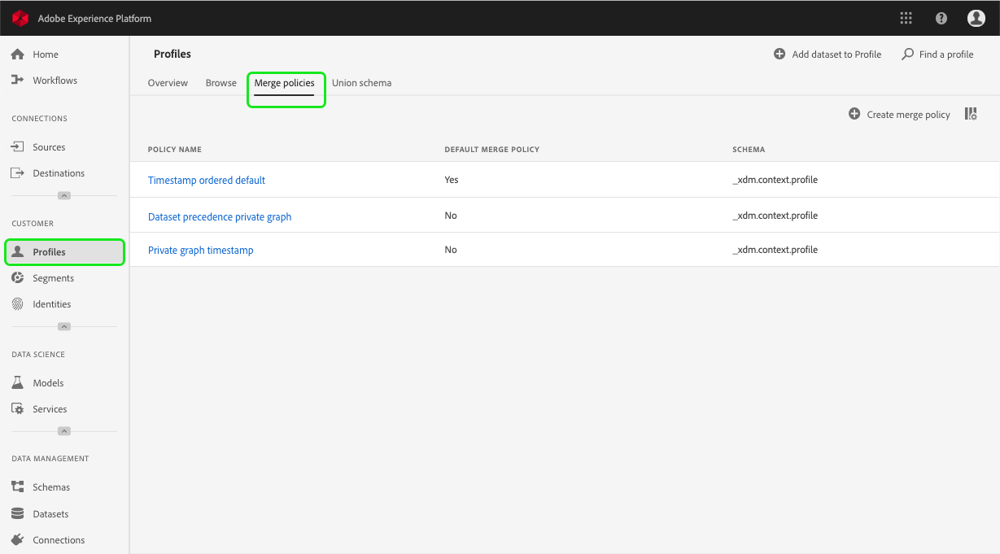
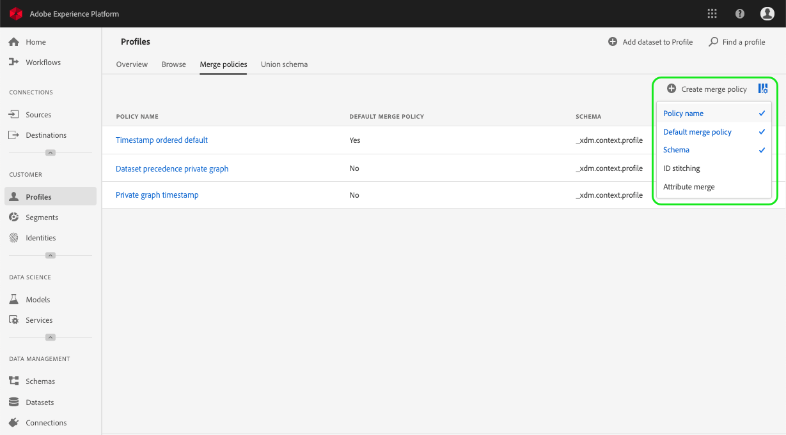
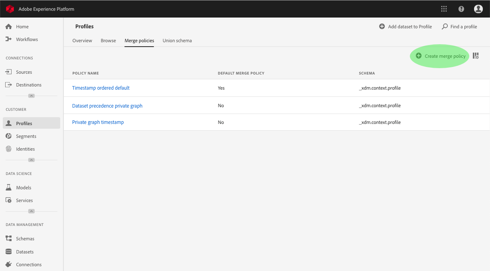
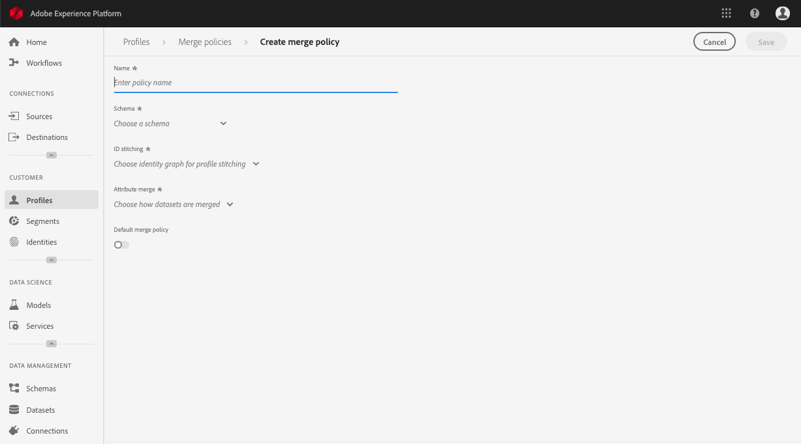
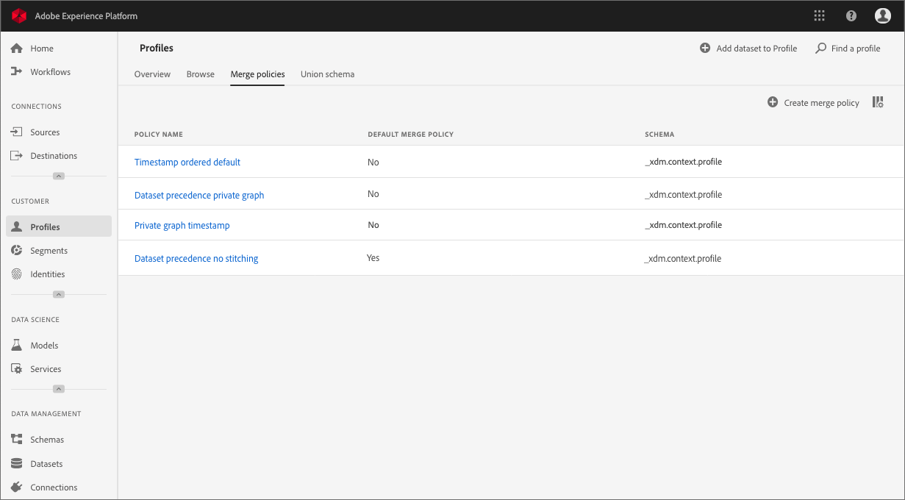
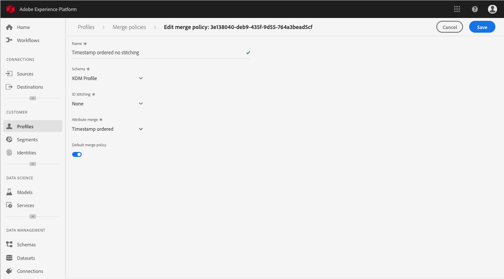

# Work with merge policies in the UI

Adobe Experience Platform enables you to bring data together from multiple sources and combine it in order to see a complete view of each of your individual customers. When bringing this data together, merge policies are the rules that Platform uses to determine how data will be prioritized and what data will be combined to create that unified view. 

Using RESTful APIs or the user interface, you can create new merge policies, manage existing policies, and set a default merge policy for your organization.

This tutorial provides step-by-step instructions for working with merge policies using the Adobe Experience Platform user interface, including:

* [Viewing merge policies](#view-merge-policies)
* [Creating a merge policy](#create-a-merge-policy)
* [Updating an existing merge policy](#edit-a-merge-policy)

If you would prefer to work with merge policies using the Real-time Customer Profile API, please follow the instructions outlined in the [merge policies API tutorial](/api-specification/markdown/narrative/tutorials/configuring_up_tutorial/configuring_merge_policies_tutorial.md).

## Getting started

This tutorial requires a working understanding of the various Experience Platform services involved with merge policies. Before beginning this tutorial, please review the documentation for the following services:

* [Real-time Customer Profile](../../technical_overview/unified_profile_architectural_overview/unified_profile_architectural_overview.md): Provides a unified, real-time consumer profile based on aggregated data from multiple sources.
* [Identity Service](../../technical_overview/identity_services_architectural_overview/identity_services_architectural_overview.md): Enables Real-time Customer Profile by bridging identities from disparate data sources being ingested into Platform.
* [Experience Data Model (XDM)](../../technical_overview/schema_registry/xdm_system/xdm_system_in_experience_platform.md): The standardized framework by which Platform organizes customer experience data.

## View merge policies

Within the Experience Platform user interface, you can begin to work with merge policies and see a list of your organization's exiting merge policies by clicking **Profile** in the left-rail and then selecting the **Merge policies** tab.

Details for each merge policy that exists for organization are visible on the landing page, including the *Policy Name*, *Default Merge Policy*, and *Schema*. 

To select which details are visible, or to add additional columns to the display, select the column chooser icon on the right and click on a column name to add or remove it from view.

## Create a merge policy

To create a new merge policy, click **Create merge policy** near the top-right of the **Merge policies** tab.

The **Create merge policy** screen appears, allowing you to provide important information for your new merge policy.

* **Name**: The name of your merge policy should be descriptive yet concise.
* **Schema**: The schema associated with the merge policy. This specifies the XDM schema for which this merge policy is created. Organizations can create multiple merge policies per schema.
* **ID stitching**: This field defines how to determine the related identities of a customer. There are two possible values:
  * **None**: Perform no identity stitching.
  * **Private Graph**: Perform identity stitching based on your private identity graph.
* **Attribute merge**: A profile fragment is the profile information for just one identity out of the list of identities that exist for an individual customer. When the identity graph type used results in more than one identity, there is the potential for conflicting profile property values and priority must be specified. Using *Attribute merge* allows you to specify which dataset profile values to prioritize if a merge conflict occurs. There are two possible values:
  * **Timestamp ordered**: In case of conflict, give priority to the profile which was updated most recently. 
  * **Dataset precedence** : Give priority to profile fragments based on the dataset from which they came. When selecting this option, you must select the related datasets and their order of priority. See the details on [dataset precedence](#dataset-precedence) below for more information.
* **Default merge policy**: A toggle button that allows you to select whether or not this merge policy will be the default for your organization. If the selector is toggled-on and the new policy is saved, your previous default policy is automatically updated to no longer be the default.

### Dataset precedence

When selecting an *Attribute merge* value, you can select *Dataset precedence* which allows you to give priority to profile fragments based on the dataset from which they came. 

An example use case would be if your organization had information present in one dataset that is preferred or trusted over data in another dataset. 

When selecting *Dataset precedence*, a separate panel opens requiring you to select from *Available datasets* (or use the checkbox to select all) which datasets will be included. You can then drag and drop those datasets into the *Selected Datasets* panel and drag them into the correct order of priority. The top dataset will be given highest priority, then second dataset will be second-highest, and so on.

Once you have finished creating the merge policy, click **Save** to return to the *Merge policies* tab where your new merge policy now appears in the list of policies.

## Edit a merge policy

You can modify an existing merge policy through the *Merge policies* tab by clicking on the *Policy Name* for the merge policy you wish to edit.

When the *Edit merge policy* screen appears, you can make changes to the *Name*, *Schema*, *ID stitching* type, and *Attribute merge* type, as well as select whether or not this policy will be the *Default merge policy* for your organization.

> Note: You cannot edit the merge policy ID, shown at the top of the edit screen. This is a read-only, system-generated ID that cannot be changed. 

Once you have made the necessary changes, click **Save** to return to the *Merge policies* tab where the updated merge policy information is now visible.

## Next steps

Now that you have created and configured merge policies for your IMS Organization, you can use them to create audience segments from your profile data. See the [Segment Builder guide](end-user/markdown/segmentation_overview/segment-builder-guide.md) for more information on how to create and work with segments using the Experience Platform user interface.