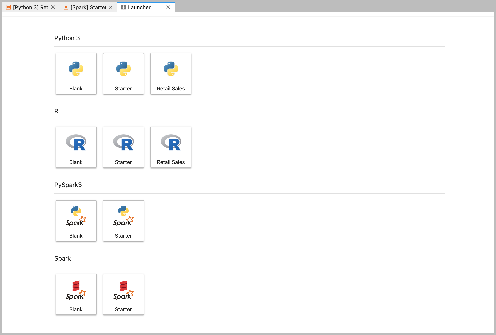
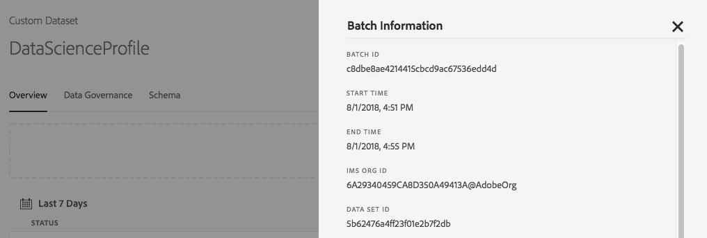

# Tutorial: How to Access and Explore Data in the Data Science Workspace

## Objective
In this step by step tutorial, we will focus on how to create a new Jupyter notebook in the Data Science Workspace to access data from Adobe Experience Platform. We will then explore the dataset to get a better understanding of the data. The steps that will be explained in this tutorial are:

1. Creating a new Jupyter notebook
2. Accessing Datasets and Schemas
3. Exploring Datasets 

We will go through the UI flow in this tutorial. The API tutorial can be found [here](../ml_api_access_and_explore_data_tutorial.md). The example we will use in the tutorial is with Python. Note that the Data Science Workspace also supports the following languages, but they will not be used in this tutorial:

* Scala
* PySpark
* Tensorflow
* R

---

## Prerequisites

* Access to an IMS Organization with Data Science flags enabled
* Existing data ingested into Platform via the API or the UI. Ingesting Data tutorials [via a file](../creating_a_dataset_tutorial.md) or [via a connector](../creating_a_connector_tutorial.md)

---

## Exploring the Data Science Workspace Notebook

The Data Science Workspace allows users to create Jupyter Notebooks through the JupyterLab platform where they can create and edit machine learning workflows. JupyterLab is a server-client collaboration tool that allows users to edit notebook documents via a web browser. These notebooks can contain both executable code and rich text elements. For our purposes, we will use Markdown for analysis description and executable Python code to perform data exploration and analysis.

### Choosing your Workspace

When launching JupyterLab, we are presented with a web-based interface for Jupyter Notebooks. Depending on which type of notebook we pick, a corresponding kernel will be launched.

When comparing which environment to use we must consider each service's limitations. For example, if we are using the [pandas](https://pandas.pydata.org/) library with Python, as a regular user the RAM limit is 2 GB. Even as a Power user, we would be limited to 20 GB of RAM. If dealing with larger computations, it would make sense to use Spark which offers 1.5 TB that is shared with all notebook instances. 

Currently, GPU support is not available in the workspace. However, this feature will be made available in future releases. Different intelligent services will benefit running on a CPU or on a GPU, so this will have to be considered when selecting an environment.

The table below shows additional Jupyter Notebook boundaries and thresholds which can be use to decide what service use. 

Area | Type | Description | Limit
--- | --- | --- | ---
File Size | Boundary | Size limit on the ability to import and consume notebook | 15 MB per notebook (Jupyterlab Hard Limit)
Instance VM | Threshold | RAM | Regular User - 2 GB
Instance VM | Threshold | RAM | Power User - 20 GB
Instance VM | Threshold | RAM | GPU User - 48 GB
Instance VM | Threshold | Hard Disk Space | TBD
Instance VM | Boundary | In-Memory Dataframe Max Size | Tied to RAM. 3GB of RAM allotment are used by the VM.
Instance VM | Boundary | On-Disk Dataframe Max Size | Tied to Hard-Drive Space
Compute Spark | Boundary | Total Cluster RAM | 2 TB of which 1.5 TB available - Shared by Notebook Instances
GPU Compute - External Customers | Boundary | TBD | TBD


### Create a new Notebook

In the Adobe Experience Platform UI, click on the Data Science tab in the top menu to take you to the Data Science Workspace. From this page, click on the JupyterLab tab which will open the JupyterLab launcher. You should see a page similar to this.



In our tutorial, we will be using Python 3 in the Jupyter Notebook to show how to access and explore the data. In the Launcher page, there are sample notebooks provided. We will be using the Retail Sales sample for Python 3.


### Accessing Data

We will go over accessing data internally from Adobe Experience Platform and data externally. We will be using the `data_access_sdk_python` library to access internal data such as datasets and XDM schemas. For external data, we will use the pandas Python library.

#### Adobe Experience Platform Data

First, we will go over accessing Adobe Experience Platform data. There are two methods data can be retrieved into the notebook:
* By Dataset ID
* By Batch ID

##### By Dataset ID

For this section, we are using the Retail Sales dataset which is the same dataset used in the Retail Sales sample notebook.

To ingest this data, navigate to the Datasets tab under the Data tab in the Adobe Experience Platform UI and click on "Create Dataset". From there, you can upload the "retail.csv" file found in the [public repository](https://github.com/adobe/acp-data-services-dsw-reference/tree/master/datasets/retail).

In our Jupyter Notebook, we can access our data from the Data tab on the left. Upon clicking the tab, you will be able to see two directories:

* **Datasets** - Contains all ingested datasets within the IMS Organization
* **Schemas** - Contains both core and custom dataset schemas in JSON format for users to preview

Navigating into the Datasets directory, we will be able to see all the ingested datasets. Note that it may take a minute to load all the entries if your directory is heavily populated with datasets.

To access data in the dataset, we can right click on your desired dataset and select the "Explore Data in Notebook" option in the dropdown. An executable code entry will appear in your notebook.

```PYTHON
from data_access_sdk_python.reader import DataSetReader
reader = DataSetReader()
df = reader.load(data_set_id="xxxxxxxx", ims_org="xxxxxxxx@AdobeOrg", start=0, limit=20)
df.head()
```

By default, the `DataSetReader()` is set to read from index 0 (`start=0`) and the number of batches to read is set to 20 (`limit=20`). If your dataset is not being read you can set `limit='all'` which will read starting from `start`. Note that if your dataset has many batches then the process may run out of memory.

Selecting the executable cell then pressing the play button in the toolbar will run the executable code. The output for `head()` will be be a table with your dataset's keys as columns and the first n rows in the dataset. `head()` accepts an integer argument to specify how many lines to output. By default this is 5.


##### By Batch ID

You can also specify a `batch_id` to load. Note that if `batch_id` is used, `start` and `limit` will be ignored.

```PYTHON
df = reader.read(view_id="12345", ims_org="12345@AdobeOrg", batch_id="12345")
```

A `batch_id` can be found by finding your Dataset in the Data tab in the Adobe Experience Platform UI. From there, click on a batch in the overview tab to open a modal which will show `batch_id`.



#### External Data

With the Retail Sales notebook opened, find the "Load Data" header. The following Python code uses pandas' `DataFrame` data structure and the [read_csv()](https://pandas.pydata.org/pandas-docs/stable/generated/pandas.read_csv.html#pandas.read_csv) function to read the CSV hosted on Github into the DataFrame:


Pandas' DataFrame data structure is a 2-dimensional labeled data structure. To quickly see the dimensions of our data, we can use the `df.shape`. This returns a tuple that represents the dimensionality of the DataFrame:


Finally, we can take a peek at what our data looks like. We can use `df.head(n)` to view the first `n` rows of the DataFrame:


### Exploring our Data

Now that we can access our data, let's focus on the data itself by using statistics and visualization. The dataset that we are using is a retail dataset which gives miscellaneous information about 45 different stores on a given day. Some characteristics for a given `date` and `store` include the following:
* `storeType`
* `weeklySales`
* `storeSize`
* `temperature`
* `regionalFuelPrice`
* `markDown`
* `cpi`
* `unemployment`
* `isHoliday`

#### Statistical Summary

We can leverage Python's pandas library to get the data type of each attribute. The output of the following call will give us information about the number of entries and the data type for each of the columns:

```PYTHON
df.info()
```


This information is useful since knowing the data type for each column will enable us to know how to treat the data.

Now let's look at the statistical summary. Only the numeric data types will be shown, so `date`, `storeType`, and `isHoliday` will not be outputted:

```PYTHON
df.describe()
```


With this, we can see there are 6435 instances for each characteristic. Also, statistical information such as mean, standard deviation (std), min, max, and interquartiles are given. This gives us information about the deviation for the data. In the next section, we will go over visualization which works together with this information to give us a good understanding of our data. 

Looking at the minimum and maximum values for `store`, we can see that there are 45 unique stores the data represents. There are also `storeTypes` which differentiate what a store is. We can see the distribution of `storeTypes` by doing the following:


This means 22 stores are of `storeType` `A`, 17 are `storeType` `B`, and 6 are `storeType` `C`.

#### Data Visualization

Now that we know our data frame values, we want to supplement this with visualizations to make things clearer and easier to identify patterns. Graphs are also useful when conveying results to an audience. Some Python libraries which are useful for visualization include:
* [Matplotlib](https://matplotlib.org/)
* [pandas](https://pandas.pydata.org/)
* [seaborn](https://seaborn.pydata.org/)
* [ggplot](https://ggplot2.tidyverse.org/)

In this section, we will quickly go over some advantages for using each library.

[Matplotlib](https://matplotlib.org/) is the oldest Python visualization package. Their goal is to make "easy things easy and hard things possible". This tends to be true as the package is extremely powerful but also comes with complexity. It is not always easy to get a reasonable looking graph without taking a considerable amount of time and effort.

[Pandas](https://pandas.pydata.org/) is mainly used for its DataFrame object which allows for data manipulation with integrated indexing. However, pandas also includes a built-in plotting functionality which is based off of matplotlib. 

[seaborn](https://seaborn.pydata.org/) is a package build on top of matplotlib. Its main goal is to make default graphs more visually appealing and to simplify creating complicated graphs.

[ggplot](https://ggplot2.tidyverse.org/) is a package also built on top of matplotlib. However the main difference is that the tool is a port of ggplot2 for R. Similar to seaborn, the goal is to improve upon matplotlib. Users that are familiar with ggplot2 for R should consider this library.


##### Univariate Graphs 

Univariate graphs are plots of an individual variable. A common univariate graph is used to visualize your data is the box and whisker plot.

Using our retail dataset from before, we can generate the box and whisker plot for each of the 45 stores and their weekly sales. The plot is generated using the `seaborn.boxplot` function.


A box and whisker plot is used to show the distribution of data. The outer lines of the plot show the upper and lower quartiles, while the box spans the interquartile range. The line in the box marks the median. Any points of data more than 1.5 times the upper or lower quartile are marked as a circle. These points are considered outliers.

##### Multivariate Graphs

Multivariate plots are used to see the interaction between variables. With the visualization, data scientists can see if there are any correlations or patterns between the variables. A common multivariate graph used is a correlation matrix. With a correlation matrix, dependencies between multiple variables are quantified with the correlation coefficient. 

Using the same retail dataset, we can generate the correlation matrix.


Notice the diagonal of 1's down the center. This shows that when comparing a variable to itself, it has complete positive correlation. Strong positive correlation will have a magnitude closer to 1 while weak correlations will be closer to 0. Negative correlation is shown with a negative coefficient showing an inverse trend.
