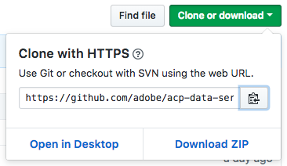

# Tutorial - Package Recipe to Import into the Data Science Workspace

## Objective
The objective of this tutorial is to show users how to author a recipe using various options and to import them to the Data Science Workspace. The source options we will cover include Git, Docker, and JAR. The languages for the recipe will be Python, <!--Scala, PySpark, -->Tensorflow, and R.

---

## Prerequisites
* Install Docker https://docs.docker.com/install/#supported-platforms

Depending on which code base you clone, install the language of that intelligent service:
* Python, <!---PySpark,--> Tensorflow - `brew install python`
<!---* Scala - `brew install sbt`-->


## Docker-Based Model Authoring

A Docker image is a recipe for which a Docker container is created during the `docker run` command. This container is built from the image and can be written to and modified by the user. A good analogy is that the Docker image is the blueprints and the Docker container is the building. You can make as many buildings as you like with the blueprints.

From there the Docker image we create will be stored in the Artifactory and can be accessed via a link by other users. The link will also be used in the platform UI when creating an instance. 

Reference example for each intelligent service:
* [Python](https://github.com/adobe/acp-data-services-dsw-reference/tree/master/recipes/python)
* [Tensorflow](https://github.com/adobe/acp-data-services-dsw-reference/tree/master/recipes/tensorflow)
* [R](https://github.com/adobe/acp-data-services-dsw-reference/tree/master/recipes/r)
<!---
* [Scala](https://github.com/adobe/acp-data-services-dsw-reference/tree/master/recipes/scala)
* [PySpark](https://github.com/adobe/acp-data-services-dsw-reference/tree/master/recipes/pyspark)
-->


### Building the Artifact for the Intelligent Service

Depending on which sample you downloaded, there will be a different procedure for creating your intelligent service. The sample codebase can be found [here](https://git.corp.adobe.com/ml).

This Sample Intelligent Service code performs Sentiment Analysis using the Natural Language Toolkit library (NLTK). First, the training and scoring data is loaded. The training data has values 0.0 which represent negative sentiment and 1.0 which represent positive sentiment. The result of the sentiment analysis done using NLTK will be compared with the scoring data in the future evaluation step to produce a score for your recipe. 

We will go over how to build each one. You can skip ahead to the section you need.
* [Building Python Retail Intelligent Service](#Building-Python-Retail-Intelligent-Service)
* [Building Tensorflow Perceptron Intelligent Service](#Building-Tensorflow-Perceptron-Intelligent-Service)
* [Building R Retail Intelligent Service](#Building-R-Retail-Intelligent-Service)

<!---
* [Building Scala Sentiment Analysis Intelligent Service](#Building-Scala-Sentiment-Analysis-Intelligent-Service)
* [Building PySpark Sentiment Analysis Intelligent Service](#Building-PySpark-Sentiment-Analysis-Intelligent-Service)
-->

### Building Python Retail Intelligent Service

To get the Python application, we run the following command to clone the Github repository to your local system.

``` BASH
git clone https://github.com/adobe/acp-data-services-dsw-reference.git
```

You can also download the application as a zip file. 



The Python code can be found under `/recipes/python`

``` BASH
cd recipes/python/
```

Now inside the repository, we can run the following commands to create the `.egg` file which consists of project-related metadata files, code and resources which is well-suited to distribution and importing.

``` BASH
cd retail
python setup.py install
```

The `.egg` file is generated in the `dist` folder.

Now you can move on to the next section [Create Dockerfile](#Create-Dockerfile)

<!---#### Building Scala Sentiment Analysis Intelligent Service

To get the Scala application, we run the following command to clone the Github repository to the local system.

``` BASH
git clone https://github.com/adobe/acp-data-services-dsw-reference.git
```

To create the assembly jar, follow the steps below.

``` BASH
cd recipes/scala/sentiment_analysis/
sbt assembly
```

To create a local jar, the following command can be used.

``` BASH
sbt clean package publish-local
```

The generated `.jar` artifact is generated in the `/target/scala-2.11/` folder

Now you can move on to the next section [Create Dockerfile](#Create-Dockerfile)

#### Building PySpark Sentiment Analysis Intelligent Service

To get the PySpark application, we run the following command to clone the Github repository to the local system.

``` BASH
git clone https://github.com/adobe/acp-data-services-dsw-reference.git
```

Now with the repository, we can run the following commands to create the `.egg` file which consists of project-related metadata files, code and resources which is well-suited to distribution and importing.

``` BASH
cd recipes/pyspark/sampleapp/
python setup.py install
```

The `.egg` file is generated in the `dist` folder.

Now you can move on to the next section [Create Dockerfile](#Create-Dockerfile)
-->
#### Building Tensorflow Perceptron Intelligent Service

To get the Tensorflow application, we run the following command to clone the Github repository to the local system.

``` BASH
git clone https://github.com/adobe/acp-data-services-dsw-reference.git
```

Now with the repository, we can run the following commands to create the `.egg` file which consists of project-related metadata files, code and resources which is well-suited to distribution and importing.

``` BASH
cd samples/tensorflow/samples/tensorflow/perceptron/
python setup.py install
```

The `.egg` file is generated in the `dist` folder.

Now you can move on to the next section [Create Dockerfile](#Create-Dockerfile)

#### Building R Retail Intelligent Service

For R the files needed to create the Docker image are already built in the repository. All we need to do is to clone it. The files are found in `/recipes/R` folder

``` BASH
git clone https://github.com/adobe/acp-data-services-dsw-reference.git
cd recipes/R/Retail\ -\ GradientBoosting/
```
Now you can move on to the next section [Create Dockerfile](#Create-Dockerfile)

### Create Dockerfile

We will need to create a Dockerfile that first takes the base image, installs dependencies, and copies over the packaged intelligent service we did in section [Create Dockerfile](#Create-Dockerfile). Since you are using the Sample Intelligent Service, the Dockerfile is provided in the directory. The example for Python is shown below:

``` Docker
FROM <docker-runtime-path>

#INSTALL NLTK and other modules needed by application
RUN /usr/bin/python3.5 -m pip install -U nltk
RUN /usr/bin/python3.5 -m pip install -U numpy

COPY dist/sampleapp*.egg /application.egg

ENV MODEL_DIR=/data/model_dir
ENV PYTHONPATH=$PYTHONPATH:/application.egg

# Below is needed for local test mode
COPY pipeline.json /pipeline.json
```

The base Python-based image is specified as the `FROM` argument. `RUN` installs NLTK and numpy which are dependencies. `ENV` updates the environment variable for the software the container installs. We are updating the environment variable with the application we build in the previous section.

### Build Docker Image
With our Dockerfile, we can build the Docker image. 

``` BASH
cd samples/scala/sentiment_analysis
 
#<artifactory-token> is from the Prerequisites #2 above.
docker login -u dsutil -p <artifactory-token> <docker-path>
docker login -u dsutil -p <artifactory-token> <docker-path>
 
#  Build the Docker image: e.g., docker build -t <docker-path>/sample-scala:1.0 .
docker build -t <docker-path>/<intelligent-service>:<version_tag> 
```

### Push Docker Image

``` BASH
docker push <docker-path>/<intelligent-service>:<version_tag>
```
