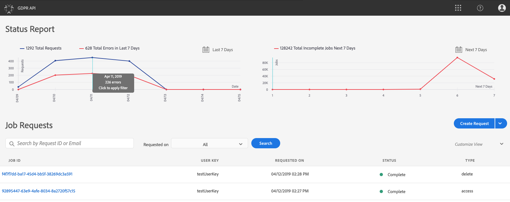

# Privacy Service UI tutorial

Adobe Experience Platform Privacy Service provides a RESTful API and user interface that allow you to coordinate privacy and compliance requests across various solutions. This document explores the Privacy Service UI. For information on using the API, please see the [Privacy Service API tutorial](privacy_service_api_tutorial.md). 

This document covers steps for performing the following tasks in the Privacy Service UI:

* [Log in to the Privacy Service UI](#log-in-to-the-privacy-service-ui) 
* [View job requests and statuses](#view-job-counts-and-statuses)
* [Create a new GDPR request](#create-a-new-gdpr-request), using one of the following methods:
    * [Use the Request Builder](#use-the-request-builder)
    * [Upload a JSON file](#upload-a-json-file)

## Log in to the Privacy Service UI

You must have an Adobe ID in order to authenticate to the Privacy Service UI. In addition, you must have System Administrator privileges within the organization your Adobe ID is associated with.

Navigate to the Adobe Experience Cloud sign-in page at https://marketing.adobe.com. Click **Sign In with an Adobe ID**.

Enter your Adobe ID credentials when prompted. Once you are signed in, click **Administration**.

> **Note:** The Administration tab only appears if you have system admin privileges within your organization.

Finally, select **Launch GDPR UI** on the next screen to open the Privacy Service UI.

## View job requests and statuses

The dashboard for the Privacy Service UI provides two widgets that allow you to view the status of your GDPR jobs: **Status Report** and **Job Requests**.

### Status Report

The graph on the left-hand side of the Status Report widget tracks submitted jobs against any jobs that may have reported back with errors. The graph on the right-hand side tracks jobs nearing the end of the 30-day compliance window (as defined by the GDPR law).

You can view the exact number of jobs associated with any data point on the graphs by hovering your mouse over the data point in question.

To view further details about a given data point, click the data point in question to display the associated jobs in the Job Requests widget. Take note of the filter that is applied just above the job list.

> **Note:** When a filter has been applied to the Job Requests widget, you can remove the filter by clicking the **X** on the filter pill. Job Requests then return to the default tracking list.

### Job Requests

The Job Requests widget lists all available job requests in your organization, including details such as the request type, current status, due date, and requestor email.

You can filter the list by typing keywords into the search bar below the Job Requests title. The list automatically filters as you type, showing requests that contain values that match your search terms. You can also use the **Requested on** dropdown menu to select a time range for the listed jobs.

To view the details of a particular job request, click the request's job ID from the list to open the *Job Details* page.

This dialog contains status information about each Experience Cloud solution and its current state in relation to the overall job. As every GDPR job is asynchronous, the page displays the latest communication date and time (GMT) from each solution, as some require more time than others to process the request.

If a solution has provided any additional data, it is viewable in this dialog. You can view this data by clicking on individual product rows.

To download the complete job data as a CSV file, click **Download** at the top-right of the window.

## Create a new GDPR request

The Privacy Service UI provides two methods to create new GDPR requests:

* Use the Request Builder
* Upload a JSON file

Steps for using each of these methods are provided in the following sections.

### Use the Request Builder

Using the Request Builder, you can manually create a new GDPR request in the user interface. The Request Builder is best used for simpler and smaller sets of requests, because the Request Builder limits requests to have only ID type per user. For more complicated requests, it may better to [upload a JSON file](#upload-a-json-file) instead.

To start using the Request builder, click **Create Request** below the Status Report widget on the right-hand side of the screen.

The *Create Request* dialog opens, displaying the available options for submitting a GDPR request.

Select the **Job Type** of the request ("Delete" or "Access") and one or more available **Products** from the list. Under **Consumer Emails**, provide a comma-separated list of email addresses. The addresses included in this list will receive a copy of any email notifications, which are sent when a job completes, finishes with errors, or times out. You can also add an optional **Ticket ID** if desired.

When finished, click **Create**. The dialog disappears, and the new job (or jobs) are listed in the Job Requests widget along with their current processing status.

### Upload a JSON file

When creating more complicated requests, such as those that use multiple ID types for each data subject being processed, you can create a request by uploading a JSON file.

Click the arrow next to **Create Request**, below the Status Report widget on the right-hand side of the screen. From the list of options that appears, select **Upload JSON**.

Click the button once it changes to **Upload JSON**.

The *Upload JSON* dialog appears, providing a window for you to drag and drop your JSON file into.

 

If you do not have a JSON file to upload, click **Download Adobe-GDPR-Request.json** to download a template that you can populate according to the values you have collected from your data subjects.

 

Locate the JSON file on your computer, and drag it into the dialog window. If the upload is successful, the file name appears in the dialog. You can continue to add more JSON files as necessary by dragging and dropping them into the dialog.

When finished, click **Create**. The dialog disappears, and the new job (or jobs) are listed in the Job Requests widget along with their current processing status.

### Next steps

Now that you have created a GDPR request, you can use the [previous steps](#view-job-requests-and-statuses) outlined in this document to view the details of the job, monitor its processing status, and download the results once it has completed.