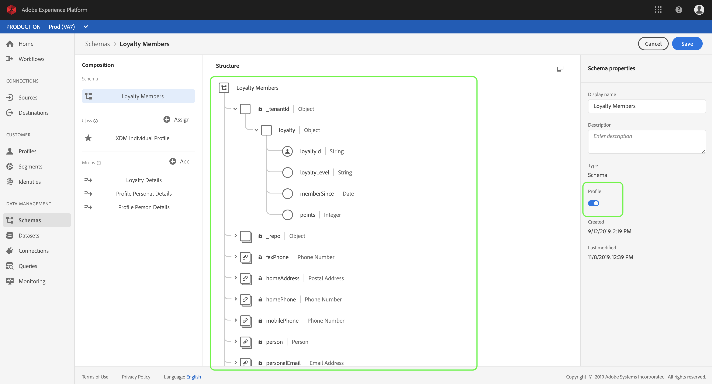
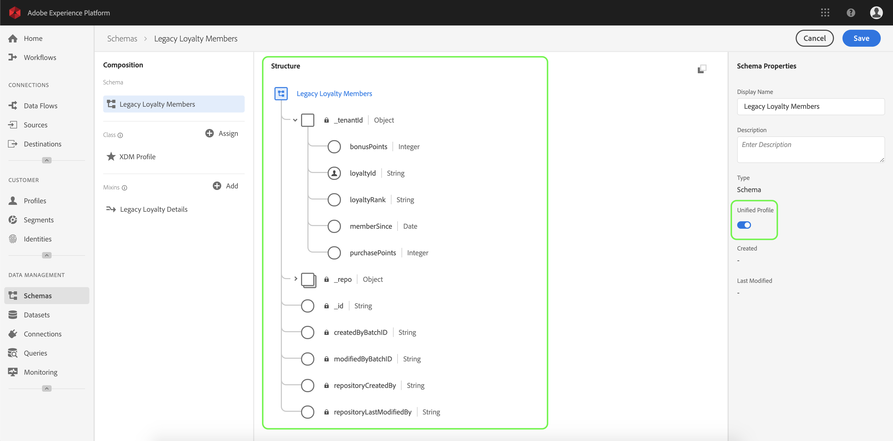
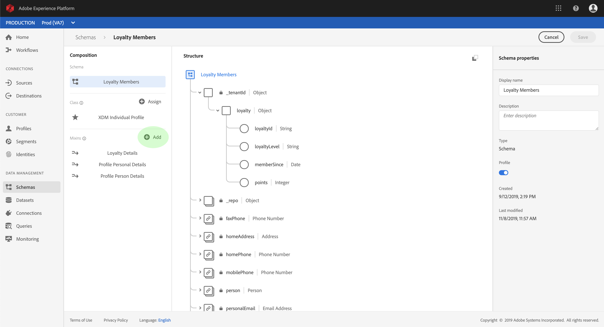
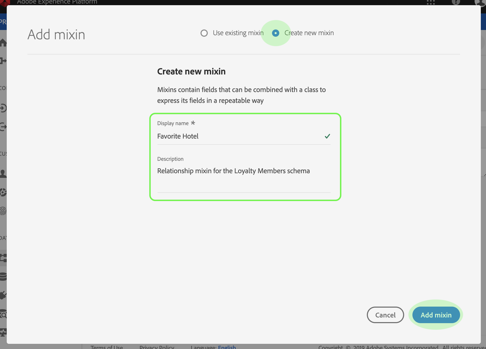
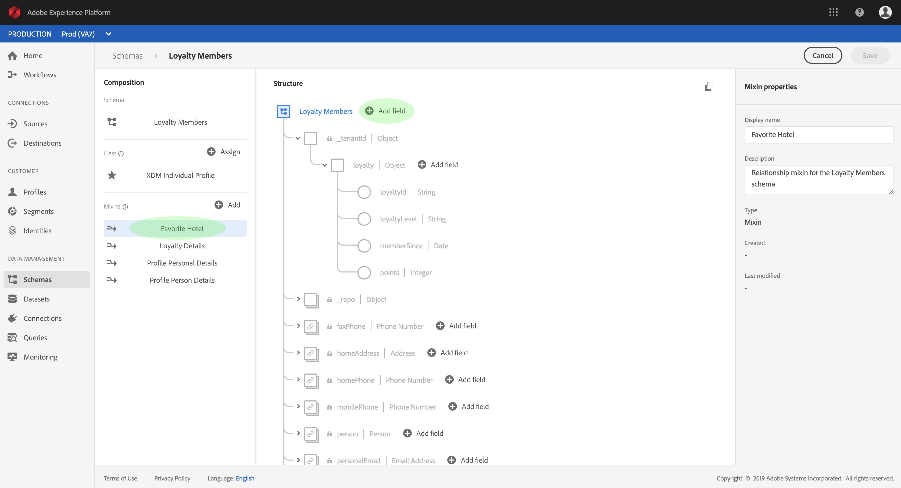
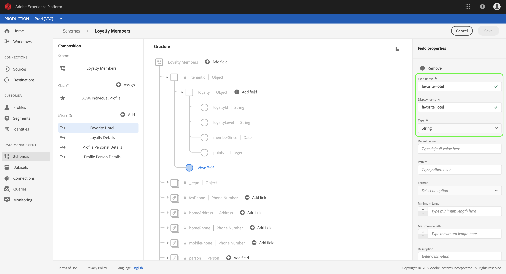
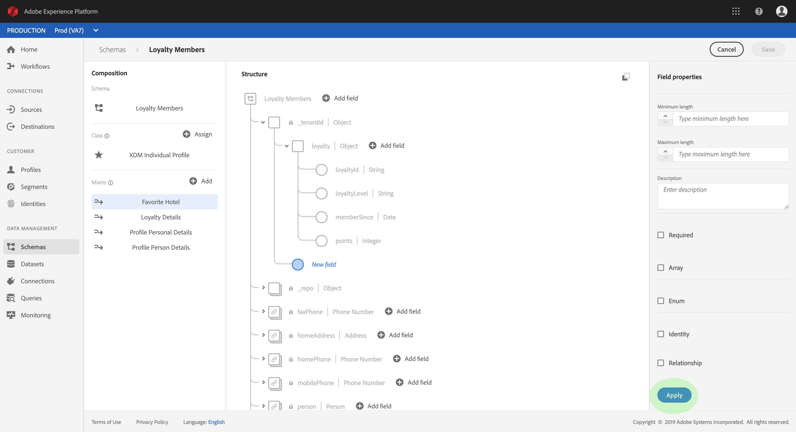
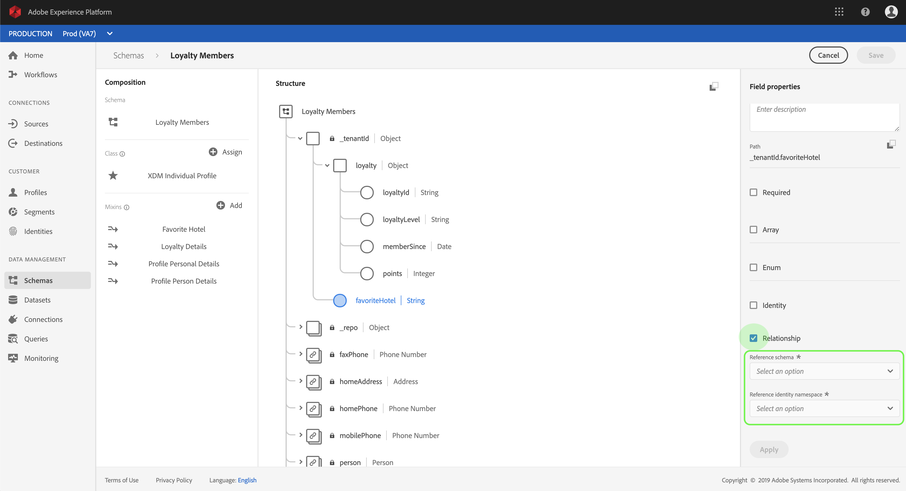
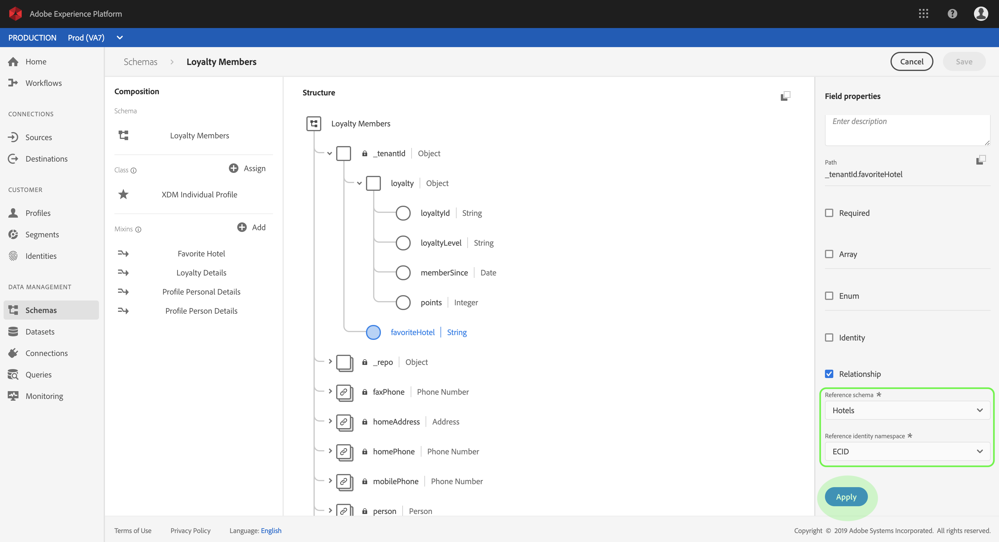

# Define a relationship between two schemas using the Schema Editor

The ability to understand the relationships between your customers and their interactions with your brand across various channels is an important part of Adobe Experience Platform. Defining these relationships within the structure of your Experience Data Model (XDM) schemas allows you to gain complex insights into your customer data.

This document provides a tutorial for defining a one-to-one relationship between two schemas defined by your organization using the Schema Editor in the Experience Platform user interface. For steps on defining schema relationships using the API, see the tutorial on [defining a relationship using the Schema Registry API](../schema_registry_api_tutorial/relationship_descriptor_tutorial.md).

This tutorial covers the following steps:

1. [Define a source and destination schema](#define-a-source-and-destination-schema)
1. _(Optional)_ [Create a relationship mixin](#create-a-relationship-mixin)
1. [Define a relationship field for the source schema](#define-a-relationship-field-for-the-source-schema)

## Getting started

This tutorial requires a working understanding of XDM System and the Schema Editor in the Experience Platform UI. Before beginning this tutorial, please review the following documentation:

* [XDM System in Experience Platform](../../technical_overview/schema_registry/xdm_system/xdm_system_in_experience_platform.md): An overview of XDM and its implementation in Experience Platform.
* [Basics of schema composition](../../technical_overview/schema_registry/schema_composition/schema_composition.md): An introduction of the building blocks of XDM schemas.
* [Create a schema using the Schema Editor](schema_editor_tutorial.md): A tutorial covering the basics of working with the Schema Editor.

## Define a source and destination schema

It is expected that you have already created the two schemas that will be defined in the relationship. For demonstration purposes, this tutorial creates a relationship between members of an organization's current loyalty program (defined in a "Loyalty Members" schema) with members of a previous loyalty program (defined in a "Legacy Loyalty Members" schema).

Schema relationships are represented by a **source schema** having a field that refers to another field within a **destination schema**. In the steps that follow, "Loyalty Members" will be the source schema, while "Legacy Loyalty Members" will act as the destination schema.

For reference purposes, the following sections describe the structure of each schema used in this tutorial before a relationship has been defined.

### Loyalty Members schema

The source schema "Loyalty Members" is the schema that was constructed in the tutorial for [creating a schema in the UI](schema_editor_tutorial.md). It includes a "loyalty" object under its "\_tenantId" namespace, which includes several loyalty-specific fields. One of these fields, "loyaltyId", serves as the primary identity for the schema. As seen under _Schema Properties_, this schema has been enabled for use in [Real-time Customer Profile](../../technical_overview/unified_profile_architectural_overview/unified_profile_architectural_overview.md).

### Legacy Loyalty Members schema

The destination schema "Legacy Loyalty Members" contains loyalty-specific fields under its "\_tenantId" namespace that are slightly different from those contained in the source schema. However, like "Loyalty Members", "Legacy Loyalty Members" contains a "loyaltyId" field that serves as its primary identity and is enabled for use in Real-time Customer Profile.

> **Note:** In order for a schema relationship to appear in a union, both schemas must be enabled for Real-time Customer Profile. If one of your schemas is Profile-enabled, you must ensure that the other schema has a primary identity field defined and is also enabled for use in Profile.

## Create a relationship mixin

> **Note:** This step is only required if your source schema does not have a dedicated field to be used as a reference to another schema. If this field is already defined in your source schema, skip to the next step of [defining a relationship field](#define-a-relationship-field-for-the-source-schema).

In order to define a relationship between two schemas in the UI, the source schema must have a dedicated field to be used as a reference to the destination schema. You can add this field to the source schema by creating a new mixin.

Start by clicking **Add** in the _Mixins_ section.

The _Add Mixin_ dialog appears. From here, click **Create New Mixin**. In the text fields that appear, enter a display name and description for the new mixin. Click **Add Mixin** when finished.

 

The canvas reappears with "Loyalty Relationship" appearing in the _Mixins_ section. Click the mixin name, then click **Add Field** next to the root-level "Loyalty Members" field.

A new field appears in the canvas under the "_tenantId" namespace. Under _Field Properties_, provide a field name and display name for the field, and set its type to "String".

When finished, click **Apply**.

The updated "loyaltyRelationship" field appears in the canvas. Click **Save** to finalize your changes to the schema.

## Define a relationship field for the source schema

Once your source schema has a dedicated reference field defined, you can designate it as a relationship field.

Click the reference field in the canvas, then scroll down under _Field Properties_ until the **Relationship** checkbox appears. Select the checkbox to reveal the required parameters for configuring a relationship field.

Click the dropdown for **Reference Schema** and select the destination schema for the relationship ("Legacy Loyalty Members" in this example). If the destination schema is union-enabled, the **Reference Identity Namespace** field is automatically set to the namespace of the destination schema's primary identity. If the schema is not union-enabled, you must manually select the namespace that you plan to use from the dropdown menu. Click **Apply** when finished.

The field appears as a relationship in the canvas, displaying the name and reference identity namespace of the destination schema. Click **Save** to save your changes and complete the workflow.

## Next steps

By following this tutorial, you have successfully created a one-to-one relationship between two schemas using the Schema Editor. For steps on how to define relationships using the API, see the tutorial on [defining a relationship using the Schema Registry API](../schema_registry_api_tutorial/relationship_descriptor_tutorial.md).