# Schema Editor tutorial

The Schema Registry provides a user interface and RESTful API from which you can view and manage all resources in the Adobe Experience Platform Schema Library. The Schema Library contains resources made available to you by Adobe, Experience Platform partners, and vendors whose applications you use, as well as resources that you define and save to the Schema Registry.

Using the Schema Editor within Experience Platform, this tutorial will walk you through the steps to [compose a schema](#create-schema), including showing you how to:

* [Name a schema](#schema-name) and [assign a class](#assign-class)
* [Add a mixin](#add-mixin) to a schema
* [Define a new mixin](#create-new-mixin)
* [Add fields to a mixin](#add-field-to-mixin), including best practices for defining fields
* Convert a multi-field structure into a [data type](#convert-data-type)
* Set a schema field as an [Identity field](#identity)
* Enable a schema for use with [Unified Profile Service](#use-in-unified-profile-service)

This tutorial also includes steps to [define a new class](#create-new-class) that you could then use to compose a schema.

## Getting started

Before starting this tutorial, it is recommended that you first review the [basics of schema composition](../../technical_overview/schema_registry/schema_composition/schema_composition.md) in order to better understand schemas and their building blocks: classes, mixins, data types, and fields.

This tutorial requires you to have access to Experience Platform. If you do not have access to an IMS Organization in Experience Platform, please speak to your system administrator before proceeding. 

If you would prefer to compose a schema using the Schema Registry API, please begin by reading the [Schema Registry developer guide](../../technical_overview/schema_registry/schema_registry_developer_guide.md) before attempting the [Schema Registry API tutorial](../schema_registry_api_tutorial/schema_registry_api_tutorial.md).

## Schemas workspace

The Schemas workspace within Experience Platform provides a visualization of the Schema Library, allowing you to view and manage all of the schemas available to you, as well as compose new ones. The workspace also includes the Schema Editor, the canvas on which you will compose a schema throughout this tutorial.

After logging into Experience Platform, click on Schemas in the left-hand navigation and you will be taken to the Schemas workspace. You will see a list of schemas, aka the Schema Library, where you can view, manage, and customize all schemas available to you.

The list includes the Name, Type, Class, and Behavior (Record or Time Series) on which the schema is based, as well as the date and time the schema was last modified. 

You can also click on the filter icon next to the Search bar to use filtering capabilities for all resources in the registry, including classes, mixins, and data types.

## Create schema

To begin composing a schema, click on the **Create Schema** button in the top right corner of the Schemas workspace. 

You will then be taken to the Schema Editor, the canvas upon which you will compose your schema. When you arrive at the editor, you will see an "Untitled Schema" in the **Structure** section of the canvas that is ready for you to begin customizing.

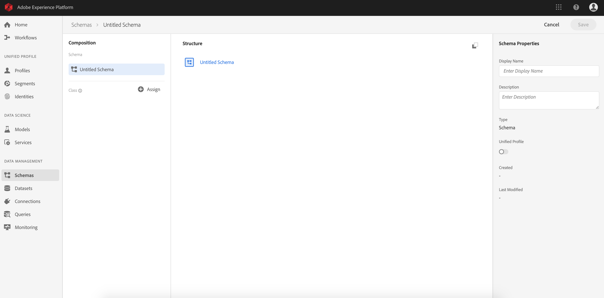

## Schema name

On the right-hand side of the editor are **Schema Properties** where you can provide a name for the schema (using the **Display Name** field). Once a name is entered, the canvas will update to reflect the new name of the schema.

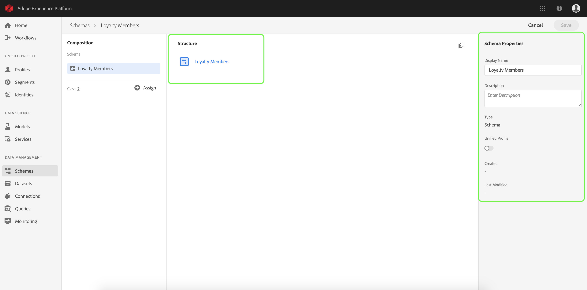

This tutorial composes a schema to ingest data related to the members of a loyalty program, therefore the schema is named "Loyalty Members". If your organization had separate loyalty programs for different brands, it would be wise to name your schema "Brand A Loyalty Members" to make it easy to distinguish from other loyalty-related schemas you might define later.

_**Notes on Schema Names:**_
* Schema names should be short and descriptive so that the schema can be easily found in the library later. 
* Schema names must be unique, meaning it should also be specific enough that it will not be reused in the future. 
* You also have the option to provide additional information about the schema using the **Description** field.

## Assign class

On the left-hand side of the editor is a section called **Composition**. It currently contains two sub-sections: **Schema** and **Class**. 

Now that the schema has a name, it is time to assign the class the schema will implement. Click **Assign** next to **Class** and the **Assign Class** dialog will open.

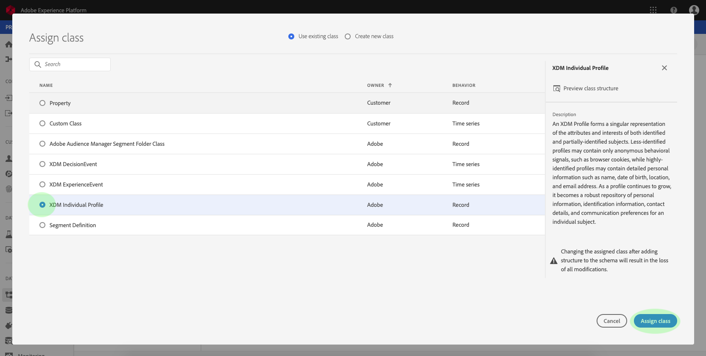

In the dialog, you will see a list of all available classes, including any defined by your organization (with a Type of "Customer") as well as standard classes defined by Adobe. 

Clicking on the class name will display the description of the class. You can also choose to **Preview Class Structure** to see the fields and metadata associated with the class.

This tutorial will use the **XDM Profile** class. Click the radio button beside the class to select it, then click the **Assign Class** button to assign the class and return to the editor. 

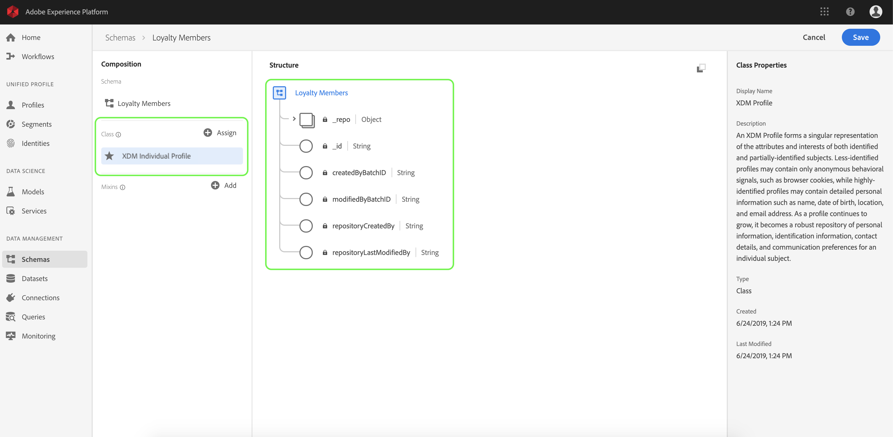

Back in the canvas, the **Class** section now contains the class we selected, XDM Profile, and you can see the fields contributed by the XDM Profile class are now visible within the **Structure** section.

The fields appear in the format "fieldName | Data Type". The proper way to define a field in the UI will be discussed in more detail later.

> **Note:** You can [change the class](#change-schema-class) at any point during the initial schema composition process before the schema has been saved, but this should only be done with extreme caution. Mixins are only compatible with certain classes, therefore changing the class will reset the canvas and any fields you have added to that point. 

## Add mixin

Now that a class has been assigned, the **Composition** section contains a third sub-section: Mixins. 

You can now begin to add fields to your schema by adding mixins. A mixin is a group of one or more fields that describe a particular concept. This tutorial uses mixins to describe the members of the loyalty program and capture key information such as name, birthday, phone number, address, and more.

To add a mixin, click **Add** in the **Mixins** sub-section to open the **Add Mixin** dialog.

Mixins are only intended for use with specific classes, therefore the list of mixins shows only those compatible with the class you selected (in this case, the XDM Profile class).

Selecting the radio button next to a mixin will give you the option to **Preview Mixin Structure**. Once you have found the mixin you wish to use, click **Add Mixin**.

The "Profile Person Details" mixin will be added first.

After clicking **Add Mixin**, you will be returned to the schema canvas. The **Mixins** section on the left now lists the "Profile Person Details" mixin and the **Structure** in the middle now includes the fields contributed by the mixin. 

This mixin contributes several fields under the top-level name "person" with the data type "Person". This group of fields describes information about an individual, including name, birth date, and gender. 

> **Note:** Remember that fields may use scalar types (such as string, integer, array, or date) as their data type, as well as any 'data type' (a group of fields representing a common concept) in the Schema Registry. 

Notice that the "name" field has a data type of "Person Name", meaning it too describes a concept and contains name-related sub-fields such as first name, last name, and full name.

Feel free to click around the canvas to try expanding different fields to see any additional fields they contribute to the schema structure.

## Add another mixin

You can now repeat the same steps to add another mixin. When you view the **Add Mixin** dialog this time, notice that the "Profile Person Details" mixin has been greyed out and the radio button next to it cannot be selected. This prevents you from accidentally duplicating mixins that you have already included in the current schema.

You can now add the "Profile Personal Details" mixin from the **Add Mixin** dialog.

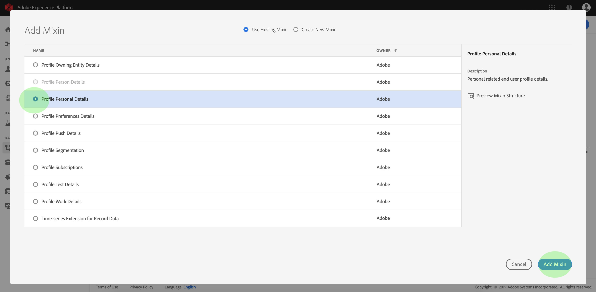

Once added, you can see that "Profile Personal Details" is now listed under **Mixins** in the **Composition** section, and fields for home address, mobile phone, and more have been added under **Structure**.

Similar to the "name" field, the fields you just added represent multi-field concepts. For example, "homeAddress" has a data type of "Address" and "mobilePhone" has a data type of "Phone Number". You can click on each of these fields to expand them and see the additional fields included in the data type.

## Create new mixin

The "Loyalty Members" schema is meant to capture data related to the members of a loyalty program, so it will require some specific loyalty-related fields. There are no standard mixins available that contains the necessary fields, therefore you will need to define a new mixin.

This time, when you open the **Add Mixin** dialog, select the **Create New Mixin** radio button at the top. You will then be asked to provide a **Display Name** and **Description** for your mixin. 

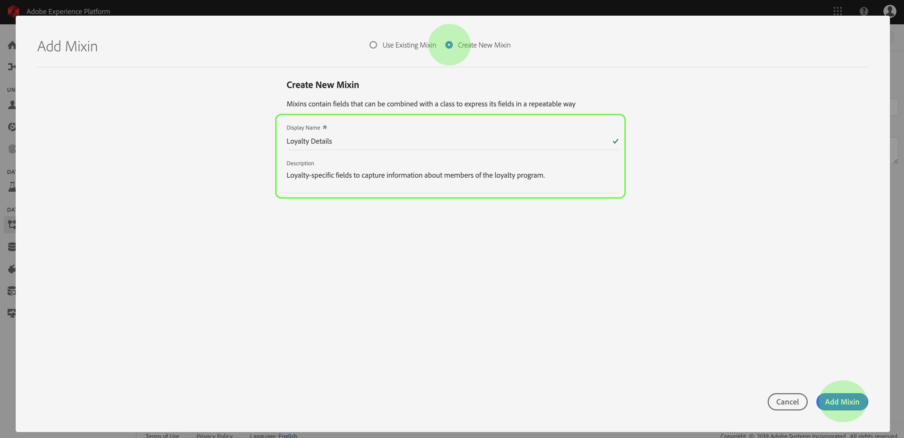

As with class names, the mixin name should be short and simple, describing what the mixin will contribute to the schema. These too are unique, so you will not be able to reuse the name and should therefore ensure it is specific enough. 

For this tutorial, the new mixin name will be "Loyalty Details".

After clicking **Add Mixin**, you will return to the schema editor. "Loyalty Details" should now appear under **Mixins** on the left-side of the canvas, but there are no fields associated with it yet and therefore no new fields appear under **Structure**.

## Add field to mixin

Now that you have created the "Loyalty Details" mixin, it is time to define the fields that the mixin will contribute to the schema.

To begin, click on the mixin name in the left-hand **Mixins** section. Once you do this, **Mixin Properties** will appear on the right-hand side of the editor and an **Add Field** button will appear next to the name of the schema under **Structure**.

Click **Add Field** next to "Loyalty Members" and a new node will appear in the structure. This node, called "_tenantId" in this example, represents your IMS Organization's tenant ID, preceded by an underscore. The presence of the tenant ID indicates that the fields you are adding are in your namespace. 

In other words, the fields you are adding are unique to your organization and are going to be saved in the Schema Registry in a specific area accessible only to your IMS Org. Fields you define must always be added to your namespace to prevent collisions with names from other standard classes, mixins, data types, and fields.

Inside that namespaced node is a "New Field", this is the beginning of the "Loyalty Details" mixin.

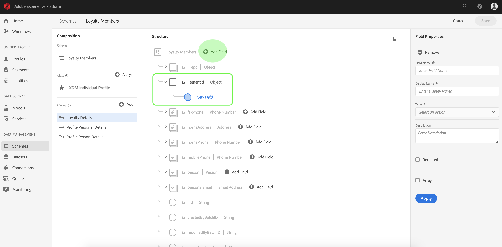

Using the **Field Properties** on the right-hand side of the editor, start by creating a "loyalty" field with type "Object" that will be used to hold our loyalty-related fields.

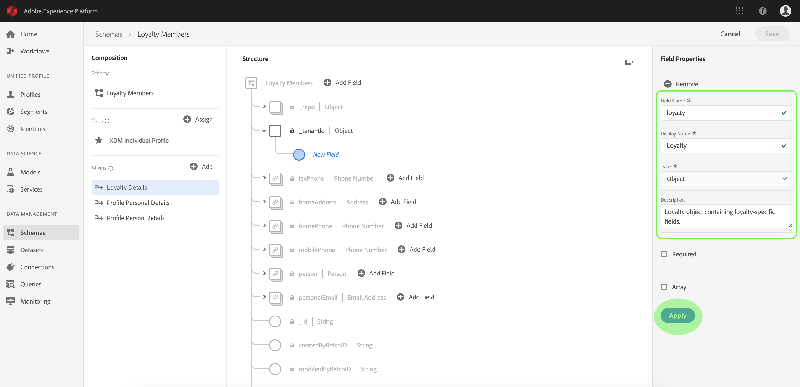

Form there, click the **Add Field** button next to the newly created "loyalty" object to add additional loyalty-related fields. A "New Field" will appear and **Field Properties** will be visible on the right-hand-side of the canvas.

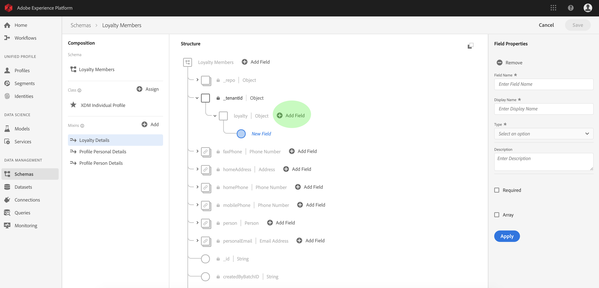

Each field requires the following information:
* **Field Name:** The name of the field, written in camel case. Example: loyaltyLevel
* **Display Name:** The name of the field, written in title case. Example: Loyalty Level
* **Type:** This includes basic scalar types and any data types defined in the Schema Registry. Examples: string, integer, boolean, Person, Address, Phone Number, etc.
* **Description:** An optional description of the field should be included, written in sentence case. (200 character max.)

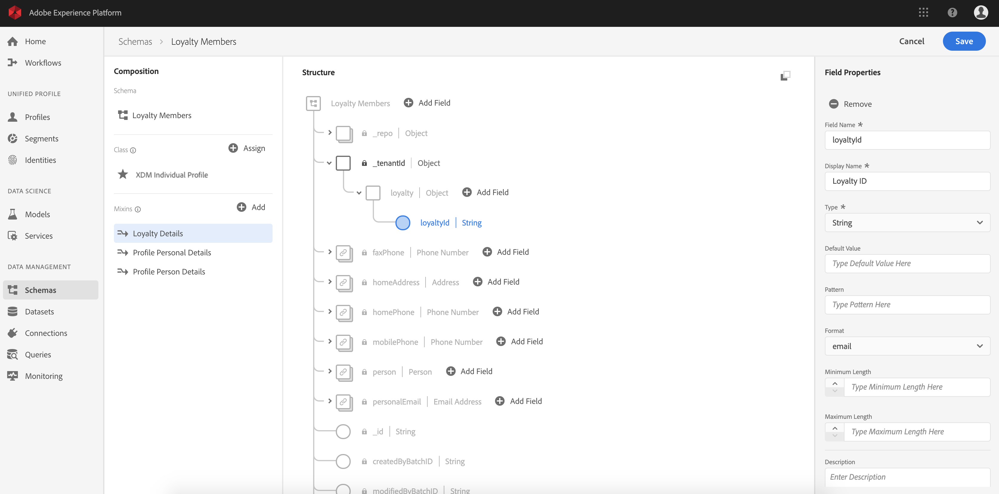

## Add more fields to mixin

Now that you have added the "loyaltyId" field, you can add additional fields to capture loyalty-related information such as:

* Points (Integer)
* Member Since (Date)

Each field is added by clicking **Add Field** on the loyalty object and filling in the required information.

When complete, the Loyalty object will contain fields for: Loyalty ID, Points, and Member Since.

## Add 'enum' field to mixin

When defining fields in the Schema Editor, there are some additional options that can be applied to basic field types in order to provide further constraints on the data the field can contain.

An example of this would be a "Loyalty Level" field, where the value can only be one of four possible options.

To add this field to the schema, click **Add Field** beside the "loyalty" object and complete the **Field Properties**. 

For **Type**, select "String" and you will see additional checkboxes appear for **Array**, **Enum**, and **Identity**. 

By selecting the **Enum** checkbox, you will be given the option to input the **VALUE** (each level in camelCase) and **LABEL** (an optional, reader-friendly name for each level in Title Case).

When you have completed all field properties, click **Apply** and the "loyaltyLevel" field will be added to the "loyalty" object.

More information about available additional constraints:
* **Array:** Indicates that the field contains an array of values, each with the data type specified. For example, selecting a Data Type of "String" and checking the "Array" checkbox means that the field will contain an array of strings.
* **Identity:** Indicates that this field contains an "Identity". More information regarding identities is provided later in this tutorial.
* **Enum:** Indicates that this field must contain one of the values from an enumerated (hence, "Enum") list of possible values.  

## Convert data type

After adding several loyalty-specific fields, the "loyalty" object now contains a common data structure that could be useful in other schemas. 

When you feel that a multi-field structure might be reusable, and you would like to have the flexibility to use that same data structure elsewhere, the Schema Editor makes it possible to convert that structure into a data type. 

Data types allow for the consistent use of multi-field structures and provide more flexibility than a mixin because they can be used anywhere within a schema. This is done by setting the **Type** of a field in a mixin to that of any data type defined in the registry.

To convert the "loyalty" object to a data type, click on the "loyalty" field under **Structure** and select **Convert to New Data Type** on the right-hand-side of the editor under **Field Properties**. 

After clicking on **Convert to New Data Type**, a small green pop-up appears confirming "Object Converted to Data Type". 

Now, when you look under **Structure**, you can see that the "loyalty" field has a data type of "Loyalty" and the fields have small lock icons beside them indicating they are no longer individual fields, but rather part of a multi-field structure.

In a future schema, you could now assign a field the **Type** of "Loyalty" and it would automatically include Loyalty Level, Points, Member Since, and Loyalty Id fields.

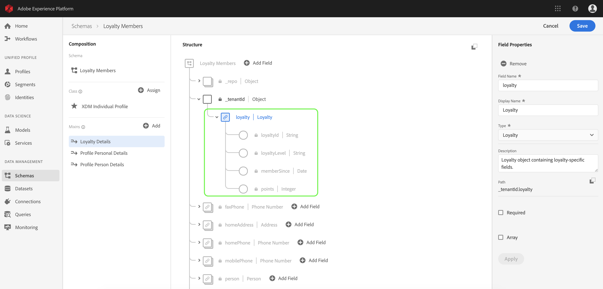

## Identity

Schemas are used for ingesting data into Experience Platform, and that data is ultimately used to identify individuals and stitch together information coming from multiple sources. To help with this process, key fields can be marked as "Identity" fields. 

Experience Platform makes it easy to denote an identity field through the use of an **Identity** checkbox in the Schema Editor.

For example, there may be thousands of members of the loyalty program belonging to the same "level", but each member of the loyalty program has a unique "loyaltyId" (which in this instance is the individual member's email address). The fact that "loyaltyId" is a unique identifier for each member makes it a good candidate for an identity field, whereas "level" is not.

In the **Structure** section of the editor, click on the "loyaltyId" field that you created and you will see the **Identity** checkbox appear under **Field Properties**. Check the box and you will have the option to set this as the **Primary Identity**. Check that box as well. 

You will then be required to provide an **Identity Type**. There are several pre-defined types, but since the "loyaltyId" is the member's email address, select "Email" from the dropdown list. You can now click **Apply** to confirm the updates to the "loyaltyId" field.

Now all data ingested into the "loyaltyId" field will be used to help identify that individual and stitch together a single view of that customer.

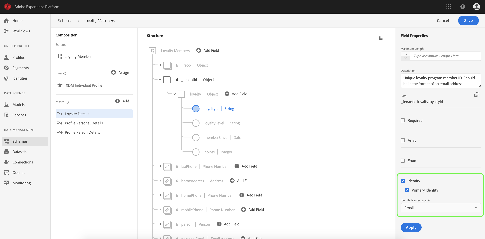

> **Note:** Once a schema field has been set as the primary identity, you will receive an error message if you later attempt to set another field in the schema as the primary. Each schema may contain only one primary identity field.

To learn more about working with identities, please review the [Identity Service](../../technical_overview/identity_services_architectural_overview/identity_services_architectural_overview.md) documentation.

<!-- ## Relationship

Schemas define a static view of a concept, but do not provide specific details on how data based on these schemas (datasets, etc) may relate to one another. Adobe Experience Platform allows you to describe these relationships through the **Relationship** checkbox in the schema editor. 

In order to define a relationship, click on the field and check the **Relationship** checkbox on the right-side of the canvas. 

More information about relationships and other schema metadata can be found in the [Schema Registry API Developer Guide](../schema_registry_developer_guide.md). -->

## Use in Unified Profile Service

The Schema Editor provides the ability to enable a schema for use with [Unified Profile Service](../../technical_overview/unified_profile_architectural_overview/unified_profile_architectural_overview.md) (UPS). UPS provides a holistic view of each individual customer by building a robust, 360&deg; profile of customer attributes as well as a timestamped account of every interaction that customer has had across any system integrated with Experience Platform. 

In order for a schema to be enabled for use with Unified Profile, it must have a primary identity defined. You will receive a "Missing Primary Identity" error message if you attempt to enable a schema without first defining a primary identity. The error message includes a checkbox for using an alternative primary identity. If you wish to use a primary identity defined in the identityMap field, you may select the checkbox and proceed with enabling your schema. 

To enable the "Loyalty Members" schema for use in Unified Profile, begin by clicking on "Loyalty Members" in the **Structure** section of the editor. 

On the right-hand side of the editor, under **Schema Properties**, you will see information about the schema including its **Display Name**, **Description**, and **Type**. In addition to this information, there is a toggle button entitled **Unified Profile**.

When you click to toggle-on Unified Profile, a pop-up will appear asking you to confirm that you wish to enable the schema for Unified Profile. 

> **Note:** Once a schema has been enabled for Unified Profile and saved, it cannot be disabled.

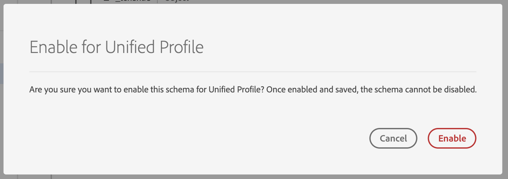

## Next steps

Now that you have finished composing a "Loyalty Members" schema, you can see the complete schema in the **Structure** section of the editor. Click **Save** and the schema will be saved to the Schema Library, making it accessible via the Schema Registry.

Your new schema is now able to be used to ingest data into Platform. Remember that once the schema has been used to ingest data, only additive changes may be made. See [Basics of schema composition](../../technical_overview/schema_registry/schema_composition/schema_composition.md) for more information on schema versioning.

The "Loyalty Members" schema is also available to be viewed and managed via the Schema Registry API. To begin working with the API, start by reading the [Schema Registry API developer guide](../../technical_overview/schema_registry/schema_registry_developer_guide.md).

## Appendix

The following information is supplemental to the Schema Editor Tutorial.

## Create new class

Experience Platform provides the flexibility to define a schema based on a class that is unique to your organization. 

When you open the **Assign Class** dialog (by clicking **Assign** in the **Class** section of the Schema Editor), instead of assigning an existing class, select the **Create New Class** radio button.

You can then give your new class a **Display Name** (a short, descriptive, unique, and user-friendly name for the class), a **Description**, and a **Behavior**  (Record or Time Series) for the data the schema will define. 

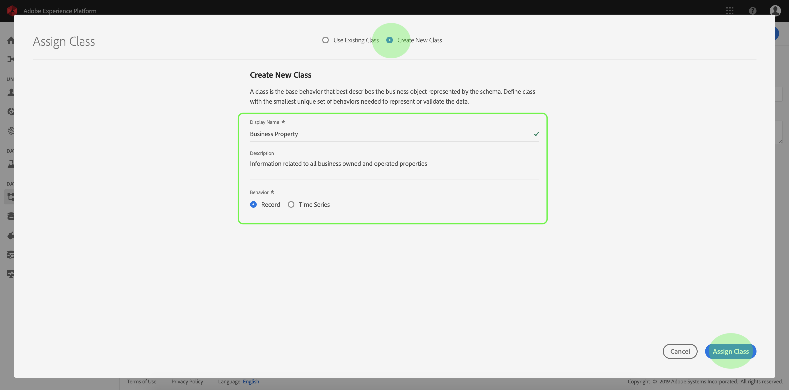

> **Note:** When building a schema that implements a class you define, remember that mixins are available for use only with compatible classes. Since the class you defined is new, there will be no compatible mixins listed in the **Add Mixin** dialog. Instead, you will need to select the radio button to **Create New Mixin** and define a mixin for use with that class. The next time you compose a schema that implements the new class, the mixin(s) that you defined will be listed and available for use.

## Change schema class

At any time during the initial schema composition process, before the schema is saved, you are able to change the class upon which the schema is based. 

> **Note:** Please exercise caution before changing the class. Mixins are only compatible with certain classes, therefore changing the class will reset the canvas and remove any fields you have added to that point. 

In order to change the class, click **Assign** next to **Class** in the **Composition** section of the editor. 

The **Assign Class** dialog will open and you may choose a new class from the list available. Once you click **Assign Class** a new dialog will open asking you to confirm that you wish to assign a new class. 

If you confirm the class change, the canvas will be reset and all composition progress will be lost.

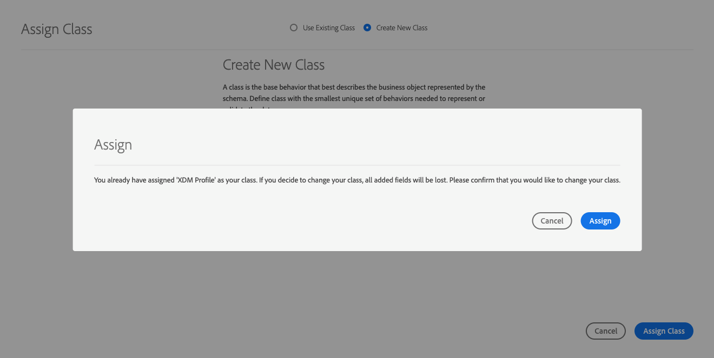

