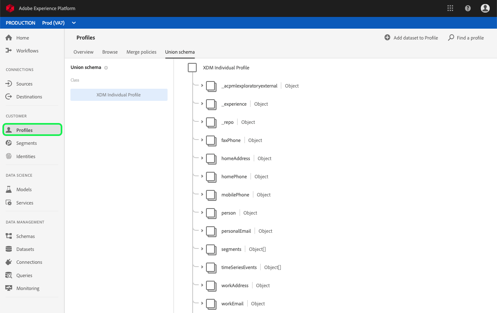

# Evaluate and access segment results

This document provides a tutorial for evaluating segments and accessing segment results using the [Real-time Customer Profile API](../../../../../../acpdr/swagger-specs/real-time-customer-profile.yaml). 

The tutorial covers the following steps:

1. [Evaluate a segment](#evaluate-a-segment)
    * [Create a segment job](#create-a-segment-job) 
    * [Lookup segment job status](#lookup-segment-job-status)
1. [Interpret segment results](#interpret-segment-results)
1. [Access segment results](#access-segment-results)
    * [Lookup a profile](#lookup-a-profile)
    * [Export a segment](#export-a-segment)

## Getting started

This tutorial requires a working understanding of the various Adobe Experience Platform services involved in creating audience segments. Before beginning this tutorial, please review the documentation for the following services:

- [Real-time Customer Profile](../../technical_overview/unified_profile_architectural_overview/unified_profile_architectural_overview.md): Provides a unified, consumer profile in real-time based on aggregated data from multiple sources.
- [Adobe Experience Platform Segmentation Service](../../../../../end-user/markdown/segmentation_overview/segmentation.md): Allows you to build audience segments from Real-time Customer Profile data.
- [Experience Data Model (XDM)](../../technical_overview/schema_registry/xdm_system/xdm_system_in_experience_platform.md): The standardized framework by which Platform organizes customer experience data.

This tutorial also requires you to have completed the [authentication tutorial](../authenticate_to_acp_tutorial/authenticate_to_acp_tutorial.md) in order to successfully make calls to Platform APIs. Completing the authentication tutorial provides the values for each of the required headers in all Experience Platform API calls, as shown below:

* Authorization: Bearer `{ACCESS_TOKEN}`
* x-api-key: `{API_KEY}`
* x-gw-ims-org-id: `{IMS_ORG}`

All POST, PUT, and PATCH requests require an additional header:

* Content-Type: application/json

## Evaluate a segment

Once you have developed, tested, and saved your segment definition, you can create a segment job to build an audience using the Real-time Customer Profile API. If you have not yet completed the [Create a segment using the Real-time Customer Profile API](../creating_a_segment_tutorial/creating_a_segment_tutorial.md) tutorial or created a segment definition using [Segment Builder](../../../../../end-user/markdown/segmentation_overview/segment-builder-guide.md), please do so before proceeding with this tutorial.

### Create a segment job

A segment job is an asynchronous process that creates a new audience segment. It references a segment definition, as well as any merge policies controlling how Real-time Customer Profile merges overlapping attributes across your profile fragments. When a segment job successfully completes, you can gather various information about your segment, such as any errors that may have occurred and the ultimate size of your audience.

You can create a new segment job by making a POST request to the `/segment/jobs` endpoint in the Real-time Customer Profile API.

#### API format

```http
POST /segment/jobs
```

#### Request

The following request creates a new segment job based on the two segment definitions provided in the payload.

```shell
curl -X POST \
  https://platform.adobe.io/data/core/ups/segment/jobs \
  -H 'Content-Type: application/json' \
  -H 'Authorization: Bearer {ACCESS_TOKEN}' \
  -H 'x-api-key: {API_KEY}' \
  -H 'x-gw-ims-org-id: {IMS_ORG}' \
  -d '[
        {
          "segmentId" : "42f49f2d-edb0-474f-b29d-2799d89cd5a6"
        },
        {
          "segmentId" : "54a20f19-9a0w-293a-9b82-409b1p3v0192"
        }
    ]'
```

* `segmentId`: The identifier of a segment definition from which to build the audience. At least one segment ID must be supplied in the payload array.

#### Response

A successful response returns the details of the newly created segment job.

```json
{
    "profileInstanceId": "ups",
    "computeJobId": 1,
    "id": "b0f99dde-6d3b-4d92-aa92-28072ded71a0",
    "status": "PROCESSING",
    "segments": [
        {
            "segmentId": "42f49f2d-edb0-474f-b29d-2799d89cd5a6",
            "segment": {
                "id": "42f49f2d-edb0-474f-b29d-2799d89cd5a6",
                "version": 1,
                "expression": {
                    "type": "PQL",
                    "format": "pql/text",
                    "value": "homeAddress.country = \"US\""
                },
                "mergePolicy": {
                    "id": "mpid1",
                    "version": 1
                }
            },
            "snapshot": {
                "name": "Canadian1",
                "ttlInDays": 1
            }
        },
        {
            "segmentId": "54a20f19-9a0w-293a-9b82-409b1p3v0192",
            "segment": {
                "id": "54a20f19-9a0w-293a-9b82-409b1p3v0192",
                "version": 1,
                "expression": {
                    "type": "PQL",
                    "format": "pql/text",
                    "value": "homeAddress.country = \"US\""
                },
                "mergePolicy": {
                    "id": "mpid1",
                    "version": 1
                }
            },
            "snapshot": {
                "name": "USA3",
                "ttlInDays": 1
            }
        }
    ],
    "updateTime": 1533581808162,
    "imsOrgId": "{IMS_ORG}",
    "creationTime": 1533581808162,
    "_links": {
        "cancel": {
            "href": "/segment/jobs/b0f99dde-6d3b-4d92-aa92-28072ded71a0",
            "method": "DELETE"
        },
        "checkStatus": {
            "href": "/segment/jobs/b0f99dde-6d3b-4d92-aa92-28072ded71a0",
            "method": "GET"
        }
    }
}
```
* `id`: The identifier of the new segment job, used for lookup purposes later in this tutorial.
* `status`: The current status of the segment job. Will be "PROCESSING" until processing is complete, at which point it becomes "SUCCEEDED" or "FAILED".

### Lookup segment job status

You can use the `id` for a specific segment job to perform a lookup request (GET) in order to view the current status of the job.

#### API format

```http
GET /segment/jobs/{segmentJobId}
```

* `{segmentJobId}`: The identifier of the segment job you want to access.

#### Request

```shell
curl -X GET \
  https://platform.adobe.io/data/core/ups/segment/jobs/80388706-29fa-40d3-81cf-a297d0224ad9 \
  -H 'Authorization: Bearer {ACCESS_TOKEN}' \
  -H 'x-api-key: {API_KEY}' \
  -H 'x-gw-ims-org-id: {IMS_ORG}'
```

#### Response

A successful response returns the details of the segmentation job, and will provide different information depending on the job's current status.

```json
{
    "profileInstanceId": "ups",
    "errors": [],
    "computeJobId": 13377,
    "modelName": "_xdm.context.profile",
    "id": "80388706-29fa-40d3-81cf-a297d0224ad9",
    "status": "SUCCEEDED",
    "segments": [
        {
            "segmentId": "b560a09a-de85-4a1c-8477-2f3da1d9e86b",
            "segment": {
                "id": "b560a09a-de85-4a1c-8477-2f3da1d9e86b",
                "version": 1,
                "expression": {
                    "type": "PQL",
                    "format": "pql/json",
                    "value": "homeAddress.country = \"US\""
                },
                "mergePolicy": {
                    "id": "0bf16e61-90e9-4204-b8fa-ad250360957b",
                    "version": 1
                }
            },
            "snapshot": {
                "name": "",
                "ttlInDays": 0
            }
        }
    ],
    "requestId": "prgu92v4VNvsGuuXticcsqX96UXGjXtS",
    "computeGatewayJobId": "a7c33b77-3aeb-497f-bc88-807915c57b5f",
    "metrics": {
        "totalTime": {
            "startTimeInMs": 1547063631503,
            "endTimeInMs": 1547063731181,
            "totalTimeInMs": 99678
        },
        "profileSegmentationTime": {
            "startTimeInMs": 1547063669001,
            "endTimeInMs": 1547063720887,
            "totalTimeInMs": 51886
        }
    },
    "updateTime": 1547063731181,
    "imsOrgId": "{IMS_ORG}",
    "creationTime": 1547063631503,
    "_links": {
        "cancel": {
            "href": "/segment/jobs/80388706-29fa-40d3-81cf-a297d0224ad9",
            "method": "DELETE"
        },
        "checkStatus": {
            "href": "/segment/jobs/80388706-29fa-40d3-81cf-a297d0224ad9",
            "method": "GET"
        }
    }
}
```

Repeat the above API call to continue retrieving the segment job until the `status` reaches "SUCCEEDED", indicating that you can export the segment to a dataset.

## Interpret segment results

When segment jobs are successfully run, the `segmentMembership` map is updated for each profile included within the segment. `segmentMembership` also stores any pre-evaluated audience segments that are ingested into Platform, allowing for integration with other solutions like Adobe Audience Manager.

The following example shows what the `segmentMembership` attribute looks like for each individual profile record:

```json
{
  "segmentMembership": {
    "UPS": {
      "04a81716-43d6-4e7a-a49c-f1d8b3129ba9": {
        "version": "15",
        "timestamp": "2018-04-26T15:52:25+00:00",
        "validUntil": "2019-04-26T15:52:25+00:00",
        "status": "existing"
      },
      "53cba6b2-a23b-454a-8069-fc41308f1c0f": {
        "version": "3",
        "lastQualificationTime": "2018-04-26T15:52:25+00:00",
        "validUntil": "2018-04-27T15:52:25+00:00",
        "status": "realized"
      }
    },
    "Email": {
      "abcd@adobe.com": {
        "version": "1",
        "lastQualificationTime": "2017-09-26T15:52:25+00:00",
        "validUntil": "2017-12-26T15:52:25+00:00",
        "status": "exited"
      }
    }
  }
}
```
* `version`: The version of the segment definition used in this segment assertion.
* `lastQualificationTime`: The timestamp when the assertion of segment membership was made and the profile entered or exited the segment.
* `validUntil`: The timestamp for when the segment assertion should no longer be assumed to be valid and should either be ignored or revalidated.
* `status`: The status of segment participation as part of the current request. Must be equal to one of the following known values:
    * `existing`: Entity continues to be in the segment.
    * `entering`: Entity is entering the segment.
    * `exited`: Entity is exiting the segment.

## Access segment results

Results of a segment job can be accessed in one of two ways: you can access individual profiles or export an entire audience to a dataset.

The following sections outline these options in more detail.

## Lookup a profile 

If you know the specific profile that you would like to access, you can do so using the Real-time Customer Profile API. 

Complete steps for accessing individual profiles are available in the [Access Real-time Customer Profile data using the Profile API](../consuming_unified_profile_data/consuming_unified_profile_data.md) tutorial.

## Export a segment

After a segmentation job has successfully completed (the value of the `status` attribute is "SUCCEEDED"), you can export your audience to a dataset where it can be accessed and acted upon. 

The following steps are required to export your audience:

1. [Create a target dataset](#create-a-target-dataset) - Create the dataset to hold audience members.
1. [Generate audience profiles in the dataset](#generate-xdm-profiles-for-audience-members) - Populate the dataset with XDM Profiles based on the results of a segment job.
1. [Monitor export progress](#monitor-export-progress) - Check the current progress of the export process. 
1. [Read audience data](#read-audience-data) - Retrieve the resulting XDM Profiles representing the members of your audience.

### Create a target dataset

When exporting an audience, a target dataset must first be created. It is important that the dataset be configured correctly to ensure the export is successful. 

One of the key considerations is the schema upon which the dataset is based (`schemaRef.id` in the sample request below). In order to export a segment, the dataset must be based on the XDM Profile Union Schema (`https://ns.adobe.com/xdm/context/profile__union`). A union schema is a system-generated, read-only schema that aggregates the fields of schemas which share the same class, in this case that is the XDM Profile class. For more information on union view schemas, please see the [Real-time Customer Profile section of the Schema Registry developer guide](../../technical_overview/schema_registry/schema_registry_developer_guide.md#real-time-customer-profile).

To view Union Schemas using the Adobe Experience Platform user interface, click **Profiles** in the left-navigation, then click on the *Union Schema* tab as shown below.



The following steps outline how to create a dataset that references the XDM Profile Union Schema using the [Catalog Service API](../../../../../../acpdr/swagger-specs/catalog.yaml). If you already have a compatible dataset and know its ID, you can proceed to the next step on [generating audience profiles](#generate-xdm-profiles-for-audience-members).

#### API format

```http
POST /dataSets
```
#### Request

The following request creates a new dataset, providing configuration parameters in the payload.

```shell
curl -X POST \
  https://platform.adobe.io/data/foundation/catalog/dataSets \
  -H 'Content-Type: application/json' \
  -H 'Authorization: Bearer {ACCESS_TOKEN}' \
  -H 'x-api-key: {API_KEY}' \
  -H 'x-gw-ims-org-id: {IMS_ORG}' \
  -d '{
	"name": "Segment Export",
	"schemaRef": {
		"id": "https://ns.adobe.com/xdm/context/profile__union",
		"contentType": "application/vnd.adobe.xed+json;version=1"
	},
	"fileDescription": {
		"persisted": true,
		"containerFormat": "parquet",
		"format": "parquet"
	},
	"aspect": "production"
}'
```

* `name`: A descriptive name for the dataset.
* `schemaRef.id`: The ID of the union view (schema) that the dataset will be associated with.
* `fileDescription.persisted`: A Boolean value that when set to `true`, enables the dataset to persist in the union view.

#### Response

A successful response returns an array containing the read-only, system-generated ID of the newly created dataset. Each dataset ID is unique. This ID will be used for lookup purposes later in this tutorial.

```json
[
  "@/datasets/5b020a27e7040801dedba61b"
] 
```

### Generate XDM Profiles for audience members

Once you have a union-persisting dataset, you can create an export job to persist the audience members to the dataset by providing the `datasetId` and the segments to export in a POST request to the `/export/jobs` endpoint in the Real-time Customer Profile API.

#### API format

```http
POST /export/jobs
```

#### Request

The following request creates a new export job, providing configuration parameters in the payload.

```shell
curl -X POST \
  https://platform.adobe.io/data/core/ups/export/jobs \
  -H 'Content-Type: application/json' \
  -H 'Authorization: Bearer {ACCESS_TOKEN}' \
  -H 'x-api-key: {API_KEY}' \
  -H 'x-gw-ims-org-id: {IMS_ORG}' \
  -d '{
    "fields": "identities.id,personalEmail.address",
    "mergePolicy": {
      "id": "e5bc94de-cd14-4cdf-a2bc-88b6e8cbfac2",
      "version": 1
    },
    "filter": {
      "segments": [
        {
          "segmentId": "4edc8488-2c35-4f6d-b4c6-9075c68d2df4",
          "segmentNs": "AAM",
          "status": ["realized"]
        },
        {
          "segmentId": "1rfe8422-334d-12f4-3sd4-12cf6g990g51",
          "segmentNs": "UPS",
          "status": ["exited"]
        }
      ],
      "segmentQualificationTime": {
            "startTime": "2019-09-01T00:00:00Z",
            "endTime": "2019-09-02T00:00:00Z"
        },
      "fromIngestTimestamp": "2018-10-25T13:22:04-07:00"
    },
    "additionalFields" : {
      "eventList": {
        "fields": "environment.browserDetails.name,environment.browserDetails.version",
        "filter": {
          "fromIngestTimestamp": "2018-10-25T13:22:04-07:00"
        }
      }
    },
    "destination": {
      "datasetId": "5b020a27e7040801dedba61b",
      "segmentPerBatch": true
    },
    "schema": {
      "name": "_xdm.context.profile"
    }
  }'
```

* `fields`: *(Optional)* Limits the data fields to be included in the export to only those provided in this parameter. The same parameter is also available when creating a segment, therefore the fields in the segment may have already been filtered. Omitting this value will result in all fields being included in the exported data.
* `mergePolicy`: *(Optional)* Specifies the merge policy to govern the exported data. Include this parameter when there are multiple segments being exported. Omitting this value will cause the Export Service to use the merge policy provided by the segment.
  * `id`: The ID of the merge policy.
  * `version`: The specific version of the merge policy to use. Omitting this value will default to the most recent version.
* `filter`: *(Optional)* Specifies one or more of the following filters to apply to the segment before export:
  * `segments`: *(Optional)* Specifies the segments to export. Omitting this value will result in all data from all segments being exported. Accepts an array of segment objects, each containing the following fields:
    * `segmentId`: **(Required if using `segments`)** Segment ID for profiles to be exported.
    * `segmentNs`: *(Optional)* Segment namespace for the given `segmentID`.
    * `status`: *(Optional)* An array of strings providing a status filter for the `segmentID`. By default, `status` will have the value `["realized", "existing"]` which represents all profiles that fall into the segment at the current time. Possible values include: `"realized"`, `"existing"`, and `"exited"`.
  * `segmentQualificationTime`: *(Optional)* Filter based on segment qualification time. The start time and/or end time can be provided. 
    * `segmentQualificationTime.startTime`: *(Optional)* Segment qualification start time for a segment ID for a given status. It not provided, there will be no filter on the start time for a segment ID qualification. The timestamp must be provided in [RFC 3339](https://tools.ietf.org/html/rfc3339) format.
    * `segmentQualificationTime.endTime`: *(Optional)* Segment qualification end time for a segment ID for a given status. It not provided, there will be no filter on the end time for a segment ID qualification. The timestamp must be provided in [RFC 3339](https://tools.ietf.org/html/rfc3339) format.
  * `fromIngestTimestamp`: *(Optional)* Limits exported profiles to only include those that have been updated after this timestamp. The timestamp must be provided in [RFC 3339](https://tools.ietf.org/html/rfc3339) format.
    * `fromIngestTimestamp` for **profiles**, if provided: Includes all the merged profiles where merged updated timestamp is greater than the given timestamp. Supports `greater_than` operand.
    * `fromTimestamp` for events: All events ingested after this timestamp will be exported corresponding to resultant profile result. This is not the event time itself but the ingestion time for the events.
* `additionalFields.eventList`: *(Optional)* Controls the time series event fields exported for child or associated objects by providing one or more of the following settings:
  * `eventList.fields`: Control the fields to export.
  * `eventList.filter`: Specifies criteria that limits the results included from associated objects. Expects a minimum value required for export, typically a date.
      * `filter.fromIngestTimestamp`: Filters time series events to those that have been ingested after the provided timestamp. This is not the event time itself but the ingestion time for the events.
* `destination`: **(Required)** Destination information for the exported data
  * `destination.datasetId`: **(Required)** The ID of the dataset where data is to be exported.
  * `destination.segmentPerBatch`: *(Optional)* A Boolean value that, if not provided, defaults to `false`. A value of `false` exports all segment IDs into a single batch ID. A value of `true` exports one segment ID into one batch ID.
* `schema.name`: **(Required)** The name of the schema associated with the dataset where data is to be exported.

#### Response

A successful response returns a dataset populated with profiles that qualified for the last completed run of the segment job. Any profiles that may have previously existed in the dataset but did not qualify for the segment during the last completed run of the segment job, have been removed.

```json
{
    "profileInstanceId": "ups",
    "jobType": "BATCH",
    "filter": {
      "segments": [
        {
          "segmentId": "4edc8488-2c35-4f6d-b4c6-9075c68d2df4",
          "segmentNs": "AAM",
          "status": ["realized"]
        },
        {
          "segmentId": "1rfe8422-334d-12f4-3sd4-12cf6g990g51",
          "segmentNs": "UPS",
          "status": ["exited"]
        }
      ]
    },
    "id": 24115,
    "schema": {
        "name": "_xdm.context.profile"
    },
    "mergePolicy": {
        "id": "0bf16e61-90e9-4204-b8fa-ad250360957b",
        "version": 1
    },
    "status": "NEW",
    "requestId": "IwkVcD4RupdSmX376OBVORvcvTdA4ypN",
    "computeGatewayJobId": {},
    "metrics": {
        "totalTime": {
            "startTimeInMs": 1559674261657
        }
    },
    "destination": {
      "dataSetId" : "5cf6bcf79ecc7c14530fe436",
      "segmentPerBatch": true,
      "batches" : [
        {
          "segmentId": "4edc8488-2c35-4f6d-b4c6-9075c68d2df4",
          "segmentNs": "AAM",
          "status": ["realized"],
          "batchId": "da5cfb4de32c4b93a09f7e37fa53ad52"
        },
        {
          "segmentId": "1rfe8422-334d-12f4-3sd4-12cf6g990g51",
          "segmentNs": "UPS",
          "status": ["exited"],
          "batchId": "df4gssdfb93a09f7e37fa53ad52"
        }
      ]
    },
    "updateTime": 1559674261868,
    "imsOrgId": "{IMS_ORG}",
    "creationTime": 1559674261657
}
```

If `destination.segmentPerBatch` had not been included (which defaults to `false`) or the value had been set to `false`, the response would include one batch containing all segment IDs, which would look like the following:

```json
  "destination": {
    "datasetId": "5cf6bcf79ecc7c14530fe436",
    "segmentPerBatch": false,
    "batchId": "da5cfb4de32c4b93a09f7e37fa53ad52"
  }
```

### List all export jobs

You can return a list of all export jobs for a particular IMS Organization by performing a GET request to the `export/jobs` endpoint. The request also supports the query parameters `limit` and `offset`, as shown below.

#### API format

```http
GET /export/jobs
GET /export/jobs?limit=4
GET /export/jobs?offset=2
```
* `limit`: Specify the number of records to be returned.
* `offset`: Offset the page of results to be returned by the number provided.


#### Request

```shell
curl -X GET \
  https://platform.adobe.io/data/core/ups/export/jobs/ \
  -H 'Authorization: Bearer {ACCESS_TOKEN}' \
  -H 'x-api-key: {API_KEY}' \
  -H 'x-gw-ims-org-id: {IMS_ORG}'
```

#### Response

The response includes a `records` object containing the export jobs created by your IMS Organization.

```json
{
    "records": [
        {
    "profileInstanceId": "ups",
    "jobType": "BATCH",
    "filter": {
        "segments": [
            {
                "segmentId": "52c26d0d-45f2-47a2-ab30-ed06abc981ff"
            }
        ]
    },
    "id": 726,
    "schema": {
        "name": "_xdm.context.profile"
    },
    "mergePolicy": {
        "id": "timestampOrdered-none-mp",
        "version": 1
    },
    "status": "SUCCEEDED",
    "requestId": "d995479c-8a08-4240-903b-af469c67be1f",
    "computeGatewayJobId": {
        "exportJob": "f3058161-7349-4ca9-807d-212cee2c2e94",
        "pushJob": "feaeca05-d137-4605-aa4e-21d19d801fc6"
    },
    "metrics": {
        "totalTime": {
            "startTimeInMs": 1538615973895,
            "endTimeInMs": 1538616233239,
            "totalTimeInMs": 259344
        },
        "profileExportTime": {
            "startTimeInMs": 1538616067445,
            "endTimeInMs": 1538616139576,
            "totalTimeInMs": 72131
        },
        "aCPDatasetWriteTime": {
            "startTimeInMs": 1538616195172,
            "endTimeInMs": 1538616195715,
            "totalTimeInMs": 543
        }
    },
    "destination": {
        "datasetId": "5b7c86968f7b6501e21ba9df",
        "batchId": "da5cfb4de32c4b93a09f7e37fa53ad52"
    },
    "updateTime": 1538616233239,
    "imsOrgId": "{IMS_ORG}",
    "creationTime": 1538615973895
},
        {
    "profileInstanceId": "test_xdm_latest_profile_20_e2e_1538573005395",
    "errors": [
        {
            "code": "0090000009",
            "msg": "Error writing profiles to output path 'adl://va7devprofilesnapshot.azuredatalakestore.net/snapshot/722'",
            "callStack": "com.adobe.aep.unifiedprofile.common.logging.Logger" 
        },
        {
            "code": "unknown",
            "msg": "Job aborted.",
            "callStack": "org.apache.spark.SparkException: Job aborted."
        }
    ],
    "jobType": "BATCH",
    "filter": {
        "segments": [
            {
                "segmentId": "7a93d2ff-a220-4bae-9a4e-5f3c35032be3"
            }
        ]
    },
    "id": 722,
    "schema": {
        "name": "_xdm.context.profile"
    },
    "mergePolicy": {
        "id": "7972e3d6-96ea-4ece-9627-cbfd62709c5d",
        "version": 1
    },
    "status": "FAILED",
    "requestId": "KbOAsV7HXmdg262lc4yZZhoml27UWXPZ",
    "computeGatewayJobId": {
        "exportJob": "15971e0f-317c-4390-9038-1a0498eb356f"
    },
    "metrics": {
        "totalTime": {
            "startTimeInMs": 1538573416687,
            "endTimeInMs": 1538573922551,
            "totalTimeInMs": 505864
        },
        "profileExportTime": {
            "startTimeInMs": 1538573872211,
            "endTimeInMs": 1538573918809,
            "totalTimeInMs": 46598
        }
    },
    "destination": {
        "datasetId": "5bb4c46757920712f924a3eb",
        "batchId": ""
    },
    "updateTime": 1538573922551,
    "imsOrgId": "{IMS_ORG}",
    "creationTime": 1538573416687
}
    ],
    "page": {
        "sortField": "createdTime",
        "sort": "desc",
        "pageOffset": "1538573416687_722",
        "pageSize": 2
    },
    "link": {
        "next": "/export/jobs/?limit=2&offset=1538573416687_722"
    }
}
```

### Monitor export progress

As an export job processes, you can monitor its status by making a GET request to the `/export/jobs/{exportJobId}` endpoint. The export job is complete once the `status` field returns the value "SUCCEEDED".

#### API format

```http
GET /export/jobs/{exportJobId}
```

* `{exportJobId}`: The ID of the export job you want to access.

#### Request

```shell
curl -X GET \
  https://platform.adobe.io/data/core/ups/export/jobs/24115 \
  -H 'Authorization: Bearer {ACCESS_TOKEN}' \
  -H 'x-api-key: {API_KEY}' \
  -H 'x-gw-ims-org-id: {IMS_ORG}'
```

#### Response

```json
{
    "profileInstanceId": "ups",
    "jobType": "BATCH",
    "filter": {
      "segments": [
        {
          "segmentId": "4edc8488-2c35-4f6d-b4c6-9075c68d2df4",
          "segmentNs": "AAM",
          "status": ["realized"]
        },
        {
          "segmentId": "1rfe8422-334d-12f4-3sd4-12cf6g990g51",
          "segmentNs": "UPS",
          "status": ["exited"]
        }
      ]
    },
    "id": 24115,
    "schema": {
        "name": "_xdm.context.profile"
    },
    "mergePolicy": {
        "id": "0bf16e61-90e9-4204-b8fa-ad250360957b",
        "version": 1
    },
    "status": "SUCCEEDED",
    "requestId": "YwMt1H8QbVlGT2pzyxgwFHTwzpMbHrTq",
    "computeGatewayJobId": {
      "exportJob": "305a2e5c-2cf3-4746-9b3d-3c5af0437754",
      "pushJob": "963f275e-91a3-4fa1-8417-d2ca00b16a8a"
    },
    "metrics": {
      "totalTime": {
        "startTimeInMs": 1547053539564,
        "endTimeInMs": 1547054743929,
        "totalTimeInMs": 1204365
      },
      "profileExportTime": {
        "startTimeInMs": 1547053667591,
        "endTimeInMs": 1547053778195,
        "totalTimeInMs": 110604
      },
      "aCPDatasetWriteTime": {
        "startTimeInMs": 1547054660416,
        "endTimeInMs": 1547054698918,
        "totalTimeInMs": 38502
      }
    },
    "destination": {
      "dataSetId" : "5cf6bcf79ecc7c14530fe436",
      "segmentPerBatch": true,
      "batches" : [
        {
          "segmentId": "4edc8488-2c35-4f6d-b4c6-9075c68d2df4",
          "segmentNs": "AAM",
          "status": ["realized"],
          "batchId": "da5cfb4de32c4b93a09f7e37fa53ad52"
        },
        {
          "segmentId": "1rfe8422-334d-12f4-3sd4-12cf6g990g51",
          "segmentNs": "UPS",
          "status": ["exited"],
          "batchId": "df4gssdfb93a09f7e37fa53ad52"
        }
      ]
    },
    "updateTime": 1559674261868,
    "imsOrgId": "{IMS_ORG}",
    "creationTime": 1559674261657
}
```

* `batchId`: The identifier of the batches created from a successful export, to be used for lookup purposes when reading audience data as outlined in the next section.

### Read audience data

Once the export has completed successfully, your data is available within the Data Lake in Experience Platform. You can then use the [Data Access API](../../../../../../acpdr/swagger-specs/data-access-api.yaml) to access the data using the `batchId` associated with the export. Depending on the size of the segment, the data may be in chunks and the batch may consist of several files.

For step-by-step instructions on how to use the Data Access API to access and download batch files, follow the [Data Access tutorial](../../tutorials/data_access_tutorial/data_access_tutorial.md).

You can also access successfully exported segment data using Adobe Experience Platform Query Service. Using the UI or a RESTful API, Query Service allows you to write, validate, and run queries on data within the Data Lake.

For more information on how to query audience data, please review the [Query Service documentation](../../../../../end-user/markdown/query-service/qs-intro.md).