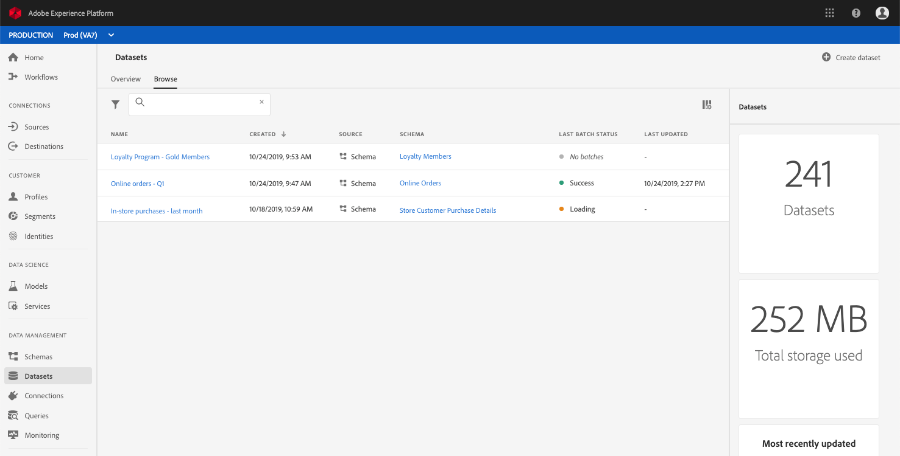
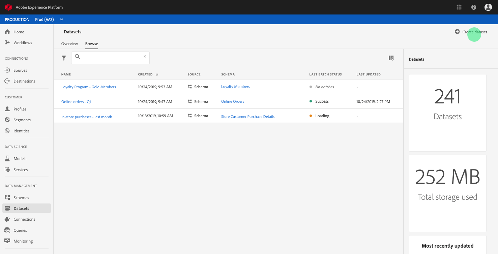
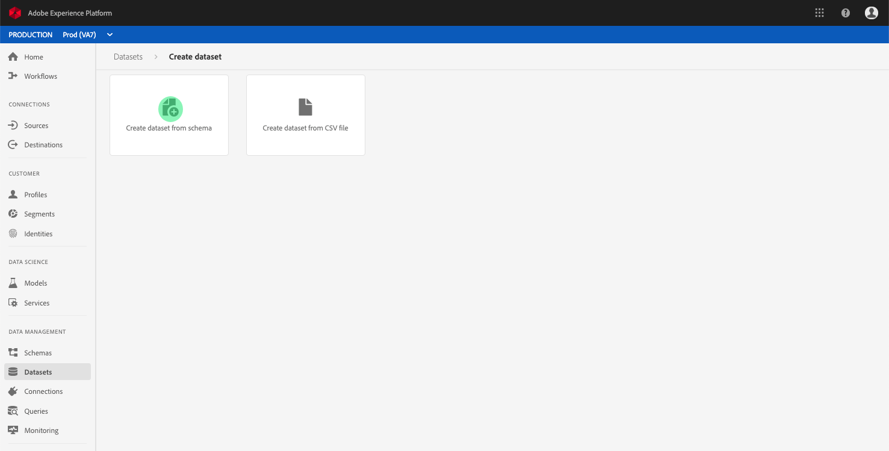
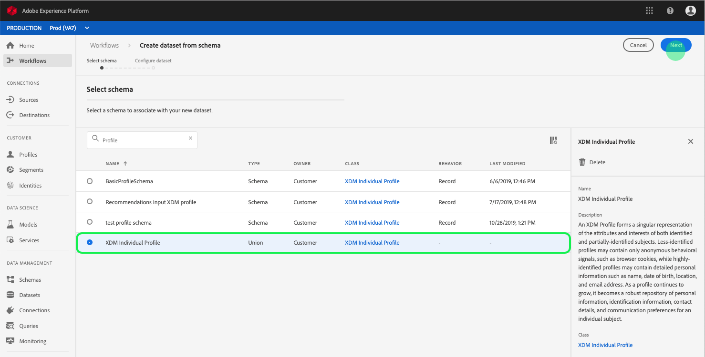
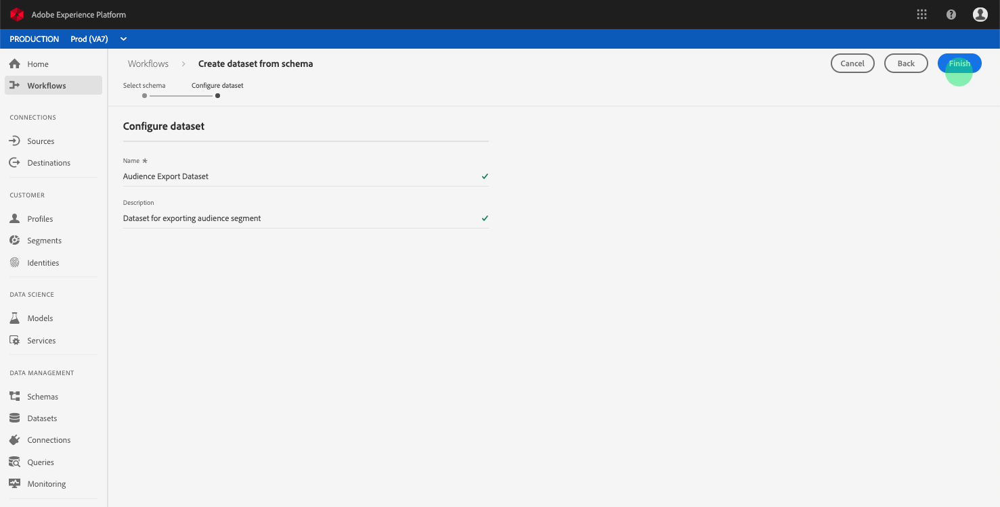
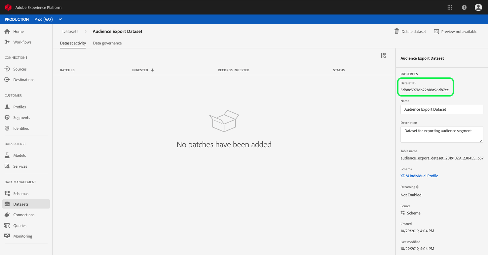

# Create a dataset for exporting an audience segment

Adobe Experience Platform allows you to easily segment customer profiles into audiences based on specific attributes. Once segments have been created, you can export that audience to a dataset where it can be accessed and acted upon. In order for the export to be successful, the dataset must be configured properly.

This tutorial walks through the steps required to create a dataset that can be used for exporting an audience segment using the Experience Platform UI.

This tutorial is directly related to the steps outlined in the tutorial for [evaluating and accessing segment results](https://www.adobe.io/apis/experienceplatform/home/tutorials/alltutorials.html#!api-specification/markdown/narrative/tutorials/segmentation/evaluate_segment.md). The evaluating a segment tutorial provides steps for creating a dataset using the Catalog API, whereas this tutorial outlines steps to create a dataset using the Experience Platform UI, including:

* [Creating a dataset](#create-a-dataset)
* [Selecting the XDM Individual Profile Union schema](#select-xdm-individual-profile-union-schema)
* [Configuring the dataset](#configure-dataset)
* [Finding the Dataset ID in the Dataset activity tab](#dataset-activity)

## Getting started

In order to export a segment, the dataset must be based on the XDM Individual Profile Union Schema. A union schema is a system-generated, read-only schema that aggregates the fields of all schemas that share the same class, in this case that is the XDM Individual Profile class. For more information on union view schemas, please see the [Real-time Customer Profile section of the Schema Registry developer guide](../../technical_overview/schema_registry/schema_registry_developer_guide.md#real-time-customer-profile).

To view union schemas in the UI, click **Profiles** in the left-navigation, then click on the *Union schema* tab as shown below.

## Datasets workspace

The datasets workspace within the Experience Platform UI allows you to view and manage all of the datasets that your IMS organization has made, as well as create new ones. 

To view the datasets workspace, click **Datasets** in the left-hand navigation, then click on the *Browse* tab. The datasets workspace contains a list of datasets, including columns showing *Name*, *Created* (date and time), *Source*, *Schema*, and *Last Batch Status*, as well as the date and time the dataset was *Last Updated*. Depending on the width of each column, you may be required to scroll left or right to see all columns. 

> **Note:** Click on the filter icon next to the search bar to use filtering capabilities to view only those datasets enabled for Real-time Customer Profile.

## Create a dataset

To create a dataset, click **Create Dataset** in the top right corner of the Datasets workspace. 

On the *Create Dataset* screen, click **Create Dataset from Schema** to continue.

## Select XDM Individual Profile Union Schema

To select the XDM Individual Profile Union Schema for use in your dataset, find the "XDM Individual Profile" schema with a type of "Union" on the *Select Schema* screen.

Selected the radio button next to **XDM Individual Profile**, then click **Next** in the top-right corner.

## Configure dataset

On the **Configure Dataset** screen, you will be required to give your dataset a *Name* and may also provide a *Description* of the dataset as well. 

**Notes on Dataset Names:**
* Dataset names should be short and descriptive so that the dataset can be easily found in the library later. 
* Dataset names must be unique, meaning it should also be specific enough that it will not be reused in the future. 
* It is best practice to provide additional information about the dataset using the description field, as it may help other users differentiate between datasets in the future.

Once the dataset has a name and description, click **Finish**.

## Dataset activity

An empty dataset has now been created and you have been returned to the *Dataset Activity* tab in the Datasets workspace. You should see the name of the dataset in the top-left corner of the workspace, along with a notification that "No batches have been added." This is to be expected since you have not added any batches to this dataset yet. 

On the right-hand side of the Datasets workspace you will see the **Info** tab containing information related to your new dataset such as *Dataset ID*, *Name*, *Description*, *Table Name*, *Schema*, *Streaming*, and *Source*. The Info tab also includes information about when the dataset was *Created* and its *Last Modified* date.

Please make note of the **Dataset ID**, as this value is required to complete the audience segment export workflow.

## Next steps

Now that you have created a dataset based on the XDM Individual Profile Union Schema, you can use the **Dataset ID** to continue the [evaluating and accessing segment results](evaluate_segment.md) tutorial.

At this time, please return to the evaluating segment results tutorial and pick up from the [Generate XDM Individual Profiles for audience members](evaluate_segment.md#generate-profiles-for-audience-members) step of the [exporting a segment](evaluate_segment.md#export-a-segment) workflow. 
