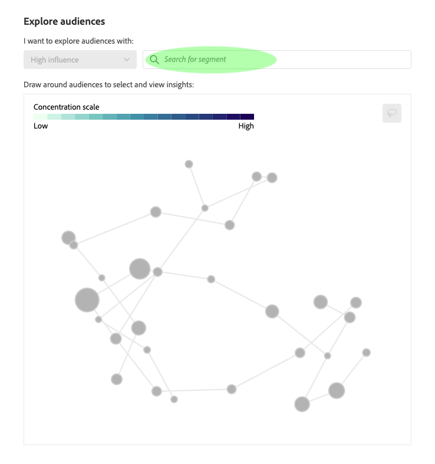
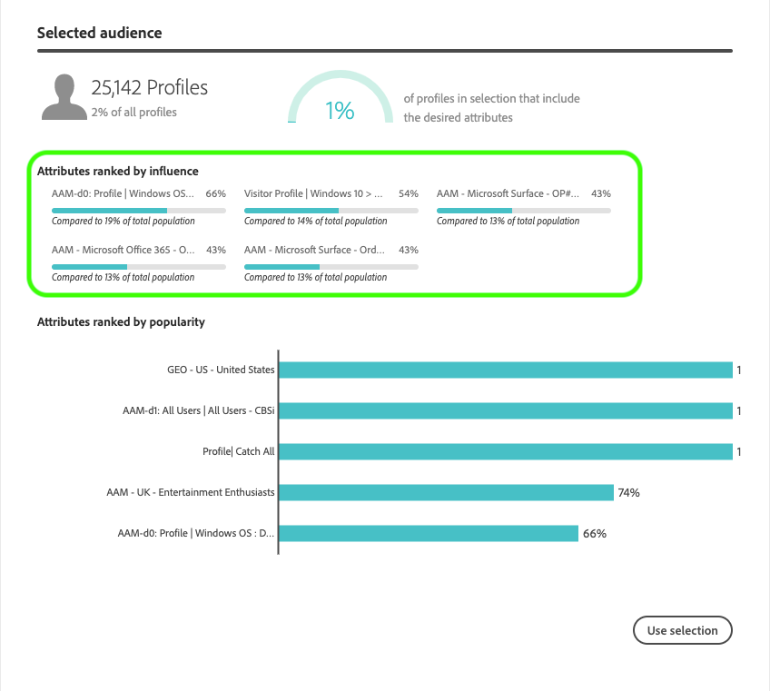

# Segment AI user guide (alpha)

> **Note:** Segment AI is currently in alpha, and therefore the functionalities outlined in this document are subject to change. In order to use Segment AI an instance must already be configured.

Segment AI is a deep learning model used to automatically identify audience segments in Real-time Customer Data Platform. Segments are generated based on your customers' journeys and their interactions with your products or services. The model provides insights to help you better understand your customers, and can generate audience segments known as clusters in order to target customers with similar traits at scale.

This document serves as a guide for interacting with Segment AI in the Real-time Customer Data Platform user interface. The following topics are covered:

- [Configuring an instance](#configuring-an-instance)
  - [Accessing Segment AI](#accessing-your-instance)
  - [Selecting an instance to explore](#selecting-an-instance)
- [Exploring audiences](#exploring-audiences)
  - [Search for a segment](#searching-for-segments)
  - [high influence and high popularity](#high-influence-and-high-popularity)
  - [The audience diagram](#understanding-the-audience-diagram)
  - [Selecting an audience](#selecting-an-audience)
- [Selected audience details](#selected-audience)
  - [Attributes ranked by influence](#attributes-ranked-by-influence)
  - [Attributes ranked by popularity](#attributes-ranked-by-popularity)
- [Exporting a selected audience as a segment](#exporting-a-selected-audience-as-a-segment)
- [Finding your exported selection in segment builder](#finding-your-selection-in-segment-builder-audiences)
- [Next steps](#next-steps)

## Getting started

This guide requires an understanding of the various Platform services involved with Segment AI. Before beginning this tutorial, please review the following documents:

*   [Real-time Customer Profile](https://www.adobe.io/apis/experienceplatform/home/profile-identity-segmentation/profile-identity-segmentation-services.html#!api-specification/markdown/narrative/technical_overview/unified_profile_architectural_overview/unified_profile_architectural_overview.md): Provides a unified, real-time consumer profile based on aggregated data from multiple sources.
*  [Segmentation Service](https://www.adobe.io/apis/experienceplatform/home/profile-identity-segmentation/profile-identity-segmentation-services.html#!end-user/markdown/segmentation_overview/segmentation.md): Adobe Experience Platform Segmentation Service provides a user interface and RESTful API that allows you to build segments and generate audiences from your Real-time Customer Profile data.
*   [Segment Builder](https://www.adobe.io/apis/experienceplatform/home/profile-identity-segmentation/profile-identity-segmentation-services.html#!end-user/markdown/segmentation_overview/segment-builder-guide.md): Segment Builder provides a rich workspace that allows you to interact with Profile data elements such as the audiences created through Segment AI.

## Configuring an instance

> Note: Instance configuration is currently in development. This guide only covers steps on how to utilize an instance that has already been created.  

### Accessing your instance

In the Real-time CDP UI, click **Services** in the left navigation. The Services browser appears and displays available Adobe Sensei services. In the container for Segment AI, click **Open**.

### Selecting an instance

After opening Segment AI, the *Overview* dashboard appears. The dashboard lists configured instances of Segment AI and displays information about them, including the name of the instance, the timeframe the input data was collected, when the instance was last updated, and the status of the last update. Click the **Name** of an instance to access and explore its insights.

 Selecting an instance opens the Segment AI audience exploration page for that instance. You are presented with the details of the instance along with *Explore audiences* and *About your data* sections. These sections are explained in detail as you progress through the guide. You can return to the Segment AI *Overview* dashboard at any time by clicking **View instances**.

## Exploring audiences

The *Explore audiences* section is used for finding and selecting audience clusters.

> **Note:** You cannot interact with your data until you search for a segment first.

### Searching for segments

Click **Search for segment** in the *Explore audiences* section to select a segment you are interested in exploring. 

As you type search terms, a dropdown list of resulting segments populates directly below. Click a segment from the list to explore it.

The selected segment replaces the search bar and the chart is populated below.

### high influence and high popularity

After a segment is selected, you are given the option to display audiences with high influence (the default) or high popularity.
- **High influence**: The diagram nodes are colored based on the percentage of profiles that relate to your segment search.
- **High popularity**: The diagram nodes are colored based on the total number of profiles that relate to your segment search.

Use the dropdown menu to switch the graph between influence and popularity.

### Understanding the audience diagram

The audience diagram is only populated after you have selected a segment. Once a segment has been selected, the diagram is created based on the data retrieved from your segment. The diagram visualization is a high level dimension result outputted in a 2D format. 
- The size of the nodes in the diagram are determined by how many profiles they contain.
- The color of the nodes indicate the density of an audience in relation to your search. A darker node indicates a higher density.
- The edges (lines) between the nodes represent the close relationship between nodes.

### Selecting an audience

To select an audience, hold down the left mouse button to use the lasso tool and draw around the nodes you wish to explore. 

The details pertaining to an audience appear under *Selected audience* on the right-hand side of the screen. If you selected more than one node, Segment AI automatically combines your selection results.

## Selected audience

Upon selecting an audience using the lasso tool, the *Selected audience* section is populated with details pertaining to your selection.

The top-left of the *Selected audience* section displays the number of profiles selected and the percentage of your complete profile store that this selection represents.

The top-right of the *Selected audience* section contains an infographic that shows how many of the currently selected profiles match your desired attributes. The percentage varies based on the search performed and the clusters of audiences you choose to explore. The populated data in this example includes only customers who clicked the Amazon buy button due to the segment that was searched earlier.

### Attributes ranked by influence

Attribute data thats been ranked by influence can be found under the *Attributes ranked by influence* subheading within the *Selected audience* section. This data contains what attributes in your selection are unique relative to other clusters in a segment. For example, one of the attributes in this selection indicates that 43% of the profiles use a Microsoft Surface. Below that, you can compare these results with the overall average. Hovering over any attribute displays its full name.

### Attributes ranked by popularity

Attribute data thats been ranked by popularity can be found under the *Attributes ranked by popularity* subheading within the *Selected audience* section. This data displays the total number of customers who fit into a particular attribute, such as total number of customers using Windows OS.

## Exporting a selected audience as a segment

To export selected clusters of audiences click **Use selection** located at the bottom-right of the *Selected audience* section.

The Segment properties window pops up asking you for a **name** and **description**, fill these out and click **save**. 

## Finding your selection in Segment Builder

The clusters you save can be used to create new segments using the Segment Builder. In the Real-time CDP UI, click **Segments** in the left-navigation, then click **Create segment**.

Under the left-hand *Fields* column, click the **Audiences** tab to display a list of folders. Click the folder named **Segment AI Segments**.

 A list of audience selections appear, including the one you recently created.

 
 
 ## Next Steps

 In this guide you used Segment AI to create an audience for use in building a segment. The next step is to use the Segment Builder to create your new segment. To learn more about building a segment visit the [Segment Builder user guide](https://www.adobe.io/apis/experienceplatform/home/profile-identity-segmentation/profile-identity-segmentation-services.html#!api-specification/markdown/narrative/technical_overview/segmentation/segment-builder-guide.md).
