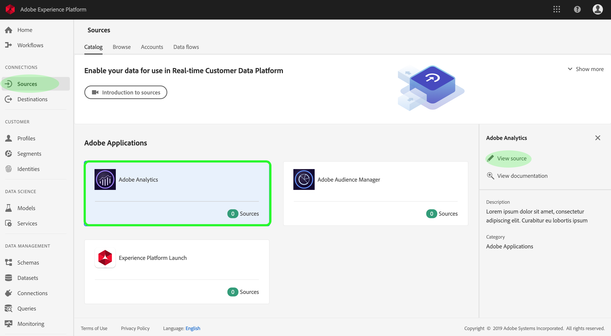
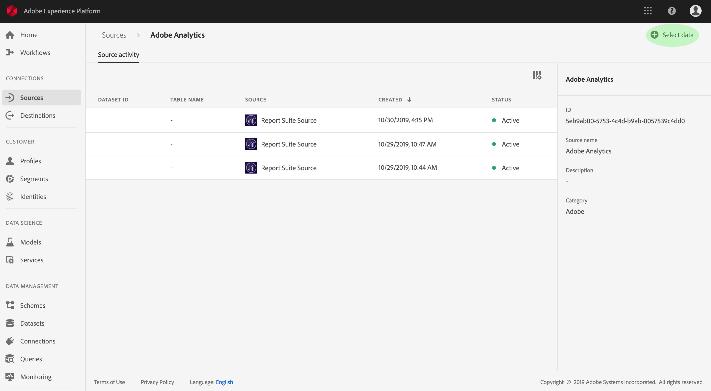
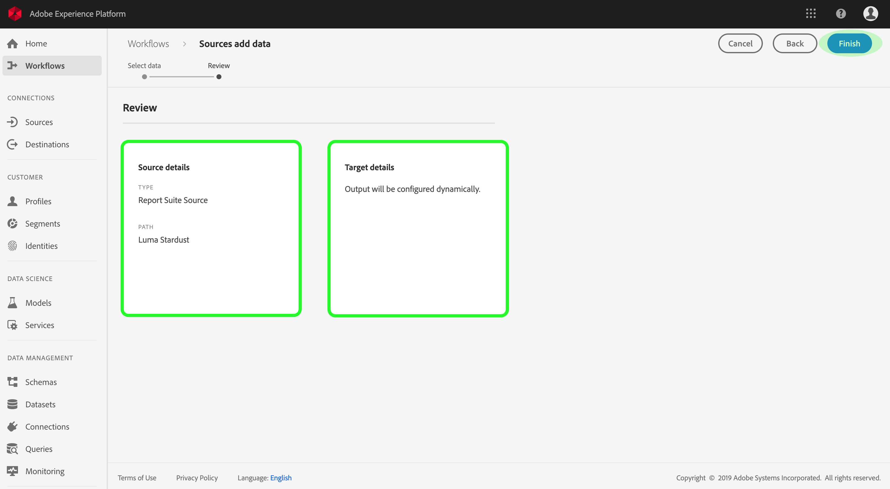

# Create an Adobe Analytics source connector in the UI

This tutorial provides steps for creating an Adobe Analytics source connector in the UI to bring consumer data into Adobe Experience Platform.

## Create a source connection with Adobe Analytics

Log in to <a href="https://platform.adobe.com" target="_blank">Adobe Experience Platform</a> and then select **Sources** from the left navigation bar to access the sources workspace. The *Catalog* screen displays available sources to create in-bound connections with, and each source shows the number of existing connections associated to them. Select the option for **Adobe Analytics** and then click **View source** to see all established in-bound connections to it.

The *Source activity* screen lists all previously established connections to Adobe Analytics, you can create a new connection by clicking **Select data**. 

>   **Note:** Multiple in-bound connections to a source can be made for bringing in different data. 

From the list of available report suites, select the one you want to bring into Platform and click **Next**.

>   **Note**: Only one report suite can be selected per Analytics source connection.

The *Review* step appears, allowing you to review your new Analytics in-bound connection before it is created. Details of the connection are grouped by categories, including:

*   *Source details*: Shows the type of the source connection and the selected report suite.
*   *Target details*: When creating other source connectors, this container shows which dataset the source data is ingesting into, including the schema the dataset adheres to. Analytics data is automatically mapped and ingested into Real-time Customer Profiles.

## Next steps

Once the connection is created, a target schema and dataset is automatically created to contain the incoming data. Furthermore, data back-filling occurs and ingests up to 13 months of historical data. When the initial ingestion completes, Analytics data and be used by downstream Platform services such as Real-time Customer Profile and Segmentation Service. See the following documents for more details:

*   [Real-time Customer Profile overview](../../technical_overview/unified_profile_architectural_overview/unified_profile_architectural_overview.md)
*   [Segmentation Service overview](../../../../../end-user/markdown/segmentation_overview/segmentation.md)
