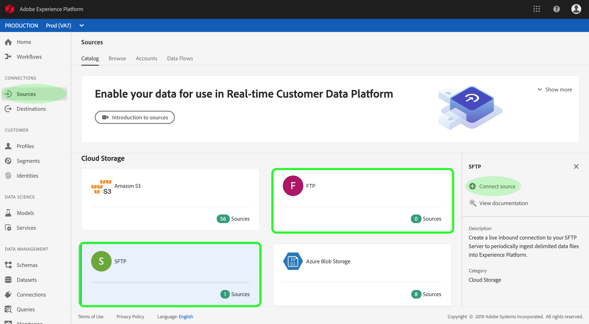
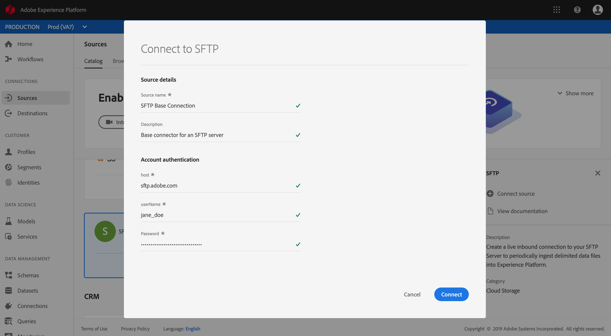
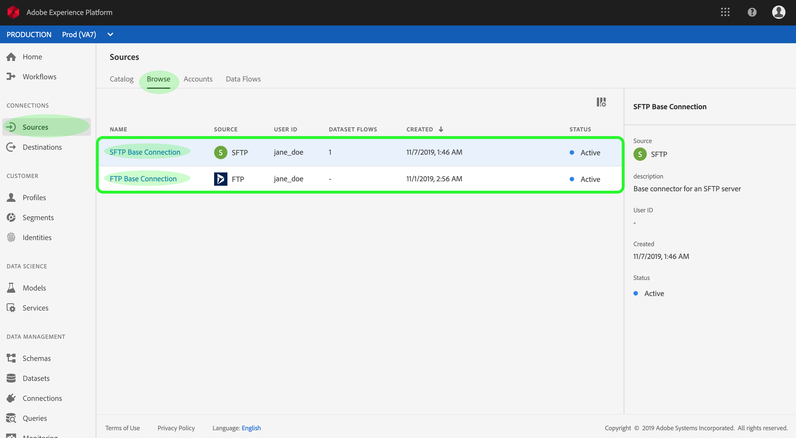
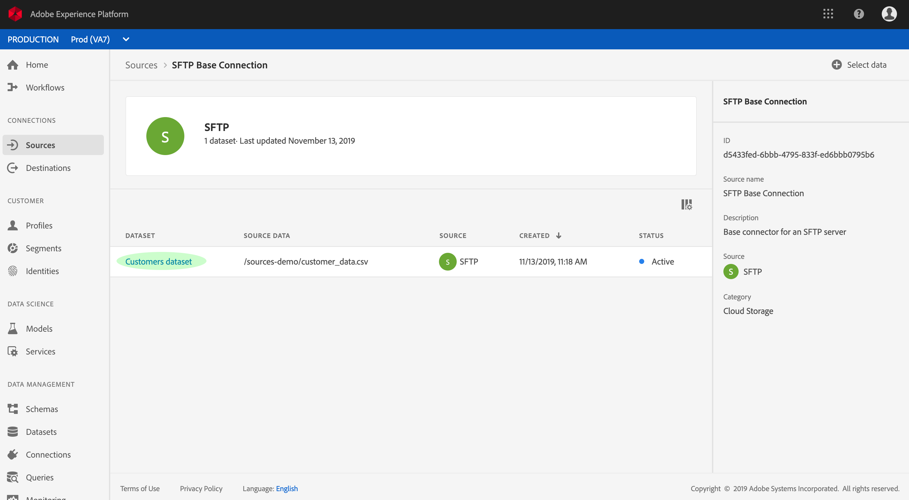

# Create an FTP or SFTP source connector in the UI

Source connectors in Adobe Experience Platform provides the ability to ingest externally sourced data on a scheduled basis. This tutorial provide steps for creating a FTP or SFTP source connector using the Platform user interface, and is broken into the following sections:

-   [Connect to your server](#connect-to-your-server)
-   [Configure a dataflow](#configure-a-dataflow)
    -   [Select data](#select-data)
    -   [Map data fields to an XDM schema](#map-data-fields-to-an-xdm-schema)
    -   [Schedule ingestion runs](#schedule-ingestion-runs)
    -   [Review dataflow](#review-your-dataflow)
-   [Monitor data ingestion](#monitor-data-ingestion)

## Getting started

This tutorial requires a working understanding of the following components of Adobe Experience Platform:

-   [Experience Data Model (XDM) System](../../technical_overview/schema_registry/xdm_system/xdm_system_in_experience_platform.md): The standardized framework by which Experience Platform organizes customer experience data.
    -   [Basics of schema composition](../../technical_overview/schema_registry/schema_composition/schema_composition.md): Learn about the basic building blocks of XDM schemas, including key principles and best practices in schema composition.
    -   [Schema Editor tutorial](../../tutorials/schema_editor_tutorial/schema_editor_tutorial.md): Learn how to create custom schemas using the Schema Editor UI.
-   [Real-time Customer Profile](../../technical_overview/unified_profile_architectural_overview/unified_profile_architectural_overview.md): Provides a unified, real-time consumer profile based on aggregated data from multiple sources.

### Supported file formats

Experience Platform supports the following file formats to be ingested from external sources:

*   Delimiter-separated values (DSV): Support for DSV formatted data files are currently limited to Comma-separated values (CSV). The value of field headers within DSV formatted files must only consist of alphanumeric characters and underscores. Support for general DSV is to be provided in the future.
*   JavaScript Object Notation (JSON): JSON formatted data files must be XDM compliant.
*   Apache Parquet: Parquet formatted data files must be XDM compliant.

### Gather required credentials

In order to access your FTP or SFTP server on Platform, you must provide the server's **host name**, a **user name**, and a **password**. 

## Connect to your server

With your server's credentials ready, you can follow the steps below to create a new inbound base connection to link your FTP or SFTP server to Platform.

If you already have a FTP or SFTP base connection, you may skip this section and continue to [configure a dataflow](#configure-a-dataflow).

Log in to <a href="https://platform.adobe.com" target="_blank">Adobe Experience Platform</a> and then select **Sources** from the left navigation bar to access the sources workspace. The *Catalog* screen displays a variety of sources for which you can create inbound base connections with, and each source shows the number of existing base connections associated to them.

Under the *Cloud Storage* category, select either **FTP** or **SFTP** to expose an information bar on the right-side of your screen. The information bar provides a brief description for the selected source as well as options to view its documentation or to connect with the source. To create a new inbound base connection, click **Connect source**. 

On the input form, provide the base connection with a name, an optional description, and your FTP or SFTP credentials. Lastly, click **Connect** and then allow some time for the new base connection to establish.

Once a base connection with your FTP or SFTP server is established, you can continue on to the next section and configure a dataflow to bring data into Platform.

## Configure a dataflow

A dataflow is a scheduled task for the purpose of retrieving and ingesting data from a source to a Platform dataset. Follow the steps below to configure a new dataflow using your FTP or SFTP base connector.

Within Experience Platform sources workspace, click the *Browse* tab to list your existing base connections. Find your FTP or SFTP connection and click its name to access the *Source activity* screen.

The *Source activity* screen lists all active and inactive data flows. The information column to the right-side of the UI provides useful information regarding the selected base connection, such as the connecter ID. Click **Select data** to configure a new data flow using the base connector you are viewing.

### Select data

The *Select data* step appears, and it provides an interactive interface for you to explore your FTP or SFTP server's file hierarchy.
*   The left-half of the interface is a directory browser, it displays files and directories found in your FTP or SFTP server. Click on a listing to display its contents.
*   The right-half of the interface lets you preview the contents of a compatible data file. You can click on a file listing from the directory browser to view up to 100 rows of data.

Find and select the data file you want to ingest and then click **Next**.

>   **Note:** Supported file formats include CSV, JSON, and Parquet. JSON and Parquet files must be XDM compliant.

### Map data fields to an XDM schema

The Mapping step appears, and it provides an interactive interface to map the source data to a Platform dataset. Source files formatted in JSON or Parquet must be XDM compliant and do not require you to manually configure the mapping. CSV files on the other hand require you to explicitly configure the mapping, but allow you to pick which source data fields to map.

Choose a dataset for where inbound data is ingested to. You can either use an existing dataset or create a new one.

*   To ingest data into an existing dataset, click the dataset icon and a window appears. Find the dataset you you wish to use, select it, then click **Continue**.

    
    

*   To ingest data into a new dataset, you must provide a dataset name, an optional description, and select an XDM schema. Click the schema icon and a window appears. Find the schema you wish to apply to the new dataset and then click **Done**.

    
    

Based on your needs, you can choose to map fields directly, or use mapper functions to transform source data to derive computed or calculated values. For more information on data mapping and mapper functions, refer to the tutorial on [mapping CSV data to XDM schema](../../tutorials/map-csv-to-xdm/map-csv-to-xdm.md). Once your source data is mapped, click **Next**.

### Schedule ingestion runs

The *Scheduling* step appears, allowing you to configure an ingestion schedule to automatically ingest the selected source data using the configured mappings. Configurable fields for scheduling include:

*   Frequency: Selectable frequencies include Minute, Hour, Day, and Week.
*   Interval: An integer that sets the interval for the selected frequency.
*   Start time: A UTC timestamp for which the very first ingestion will occur.
*   End time: A UTC timestamp for which the ingestion schedule ends.
*   Backfill: Upon creating a dataflow, the selected source file is copied into Platform regardless of the configured *Start time*. If *Backfill* is enabled, the initial copy of the source file is ingested together with the version that exists in your cloud storage during the first scheduled ingestion.

Dataflows are designed to automatically ingest data on a scheduled basis. If you wish to only ingest once through this workflow, you can do so by configuring the **Frequency** to **Day** and applying a very large number for the **Interval**, such as **10000** or similar.

Provide values for the schedule and click **Next**.

### Review your dataflow 

The *Review* step appears, allowing you to review your new dataflow before it is created. Details are grouped relevant to their categories, including:

*   *Source details*: Shows the type of the source, relevant path of the chosen source file, and the amount of columns within that source file.
*   *Target details*: Shows which dataset for which source data is ingesting into, including the schema that the dataset adheres to.
*   *Schedule details*: Shows the ingestion schedule's active period, frequency, and interval.

Once you have reviewed your dataflow, click **Finish** and allow some time for the dataflow to be created.

## Monitor data ingestion

You can monitor data that is being ingested through your FTP or SFTP dataflow. Follow the steps below to access a dataflow's dataset monitor.

Within Experience Platform sources workspace, click the *Browse* tab to list your base connections. Find the FTP or SFTP connection that contains the dataflow you wish to monitor and click its name to access its *Source activity* screen.

Each dataflow is represented by the dataset for where source data is ingested into. Click the name of a dataset to access its *Dataset activity* screen.

From here, you can see the rate of messages being consumed in the form of a graph as well as a list of successful and failed batches. You can view more details of a batch by clicking its **Batch ID**.

For more information on monitoring datasets and ingestion, refer to [monitoring streaming data flows](https://www.adobe.io/apis/experienceplatform/home/data-ingestion/data-ingestion-services.html#!api-specification/markdown/narrative/technical_overview/streaming_ingest/e2e-monitor-streaming-data-flows.md). 

## Next steps

By following this tutorial, you have successfully created an FTP or SFTP base connection, created a dataflow to bring in data from an external server, and gained insight on monitoring datasets. Incoming data can now be used by downstream Platform services such as Real-time Customer Profile and Data Science Workspace. See the following documents for more details:

*   [Real-time Customer Profile overview](../../technical_overview/unified_profile_architectural_overview/unified_profile_architectural_overview.md)
*   [Data Science Workspace overview](../../technical_overview/data_science_workspace_overview/dsw_overview.md)