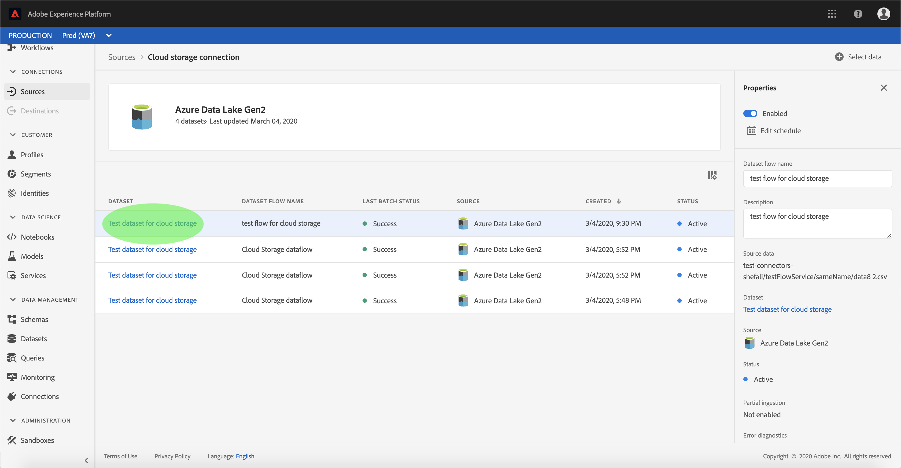
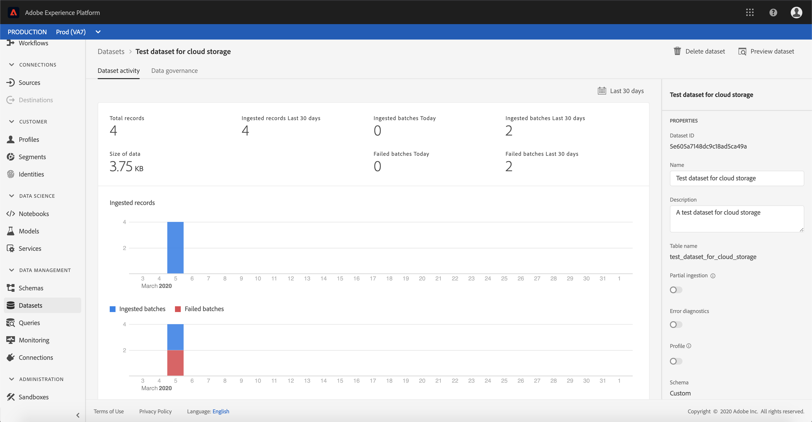
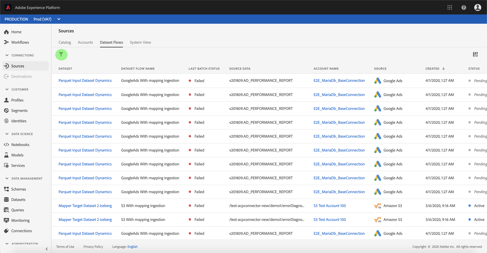
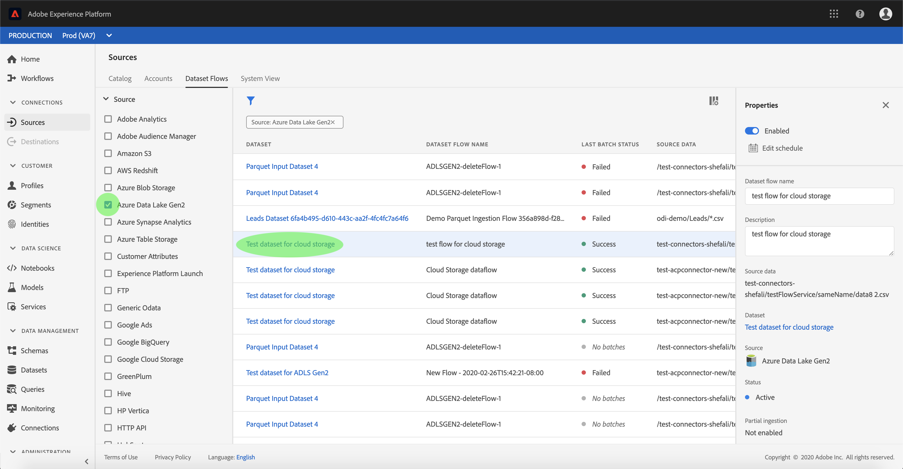

# Monitor accounts and dataset flows

Source connectors in Adobe Experience Platform provide the ability to ingest externally sourced data on a scheduled basis. This tutorial provides steps for viewing existing accounts and dataset flows from the *Sources* workspace.

The following steps are covered:

-  [Monitor accounts](#monitor-accounts)
-  [Monitor dataset flows](#monitor-dataset-flows)

## Getting started

This tutorial requires a working understanding of the following components of Adobe Experience Platform:

- [Experience Data Model (XDM) System](https://docs.adobe.com/content/help/en/experience-platform/xdm/home.html): The standardized framework by which Experience Platform organizes customer experience data.
  - [Basics of schema composition](https://docs.adobe.com/content/help/en/experience-platform/xdm/schema/composition.html): Learn about the basic building blocks of XDM schemas, including key principles and best practices in schema composition.
  - [Schema Editor tutorial](https://docs.adobe.com/content/help/en/experience-platform/xdm/tutorials/create-schema-ui.html): Learn how to create custom schemas using the Schema Editor UI.
- [Real-time Customer Profile](https://docs.adobe.com/content/help/en/experience-platform/rtcdp/overview.html): Provides a unified, real-time consumer profile based on aggregated data from multiple sources.

## Monitor accounts

Log in to <a href="https://platform.adobe.com" target="_blank">Adobe Experience Platform</a> and then select **Sources** from the left navigation bar to access the *Sources* workspace. The *Catalog* screen displays a variety of sources for which you can create accounts dataset flows with. Each source shows the number of existing accounts and dataset flows associated to them.

Select *Accounts* from the top header to view existing accounts.

The *Accounts* pages appears. On this page is a list of viewable accounts, including information about their source, username, number of dataset flows, and date of creation.

Select the icon on the top left to launch the sort window.

The sorting panel allows you to access accounts from a specific source. Select the source you wish to work with and select the account from the list on the right.

From the *Accounts* page, you can view a list of existing dataset flows associated with the account you accessed. Select the dataset flow you wish to view.

 The *Dataset flow activity* screen appears. This page displays the rate of messages being consumed in the form of a graph.

 

## Monitor dataset flows

Dataset flows can be accessed directly from the *Catalog* page without viewing *Accounts*. Select *Dataset flows* from the top header to view a list of existing dataset flows.

Similar to accounts, you can sort the list of dataset flows using the sort icon on the top left. Select the source you wish to view and select the dataset flow from the list on the right.

The *Dataset flow activity* screen appears. This page displays the rate of messages being consumed in the form of a graph.

For more information on monitoring datasets and ingestion, refer to the tutorial on [monitoring streaming dataflows](https://docs.adobe.com/content/help/en/experience-platform/ingestion/quality/monitor-data-flows.html).

## Next steps

By following this tutorial, you have successfully accessed existing accounts and dataset flows from the *Sources* workspace. Incoming data can now be used by downstream Platform services such as Real-time Customer Profile and Data Science Workspace. See the following documents for more details:

- [Real-time Customer Profile overview](https://docs.adobe.com/content/help/en/experience-platform/rtcdp/overview.html)
- [Data Science Workspace overview](https://docs.adobe.com/content/help/en/experience-platform/data-science-workspace/home.html)