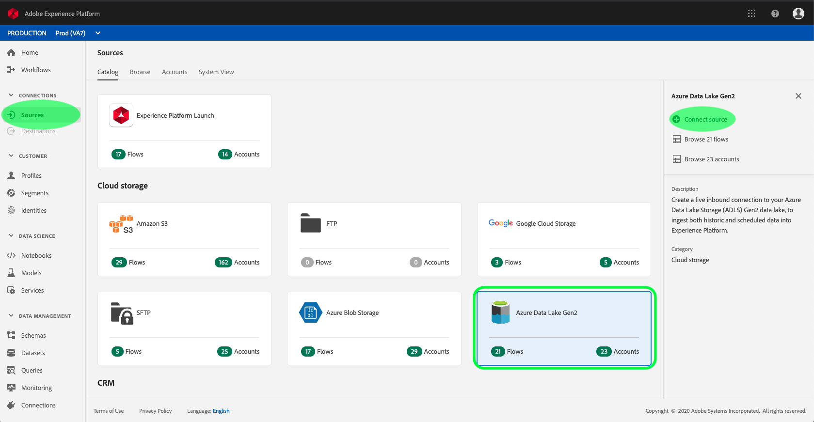
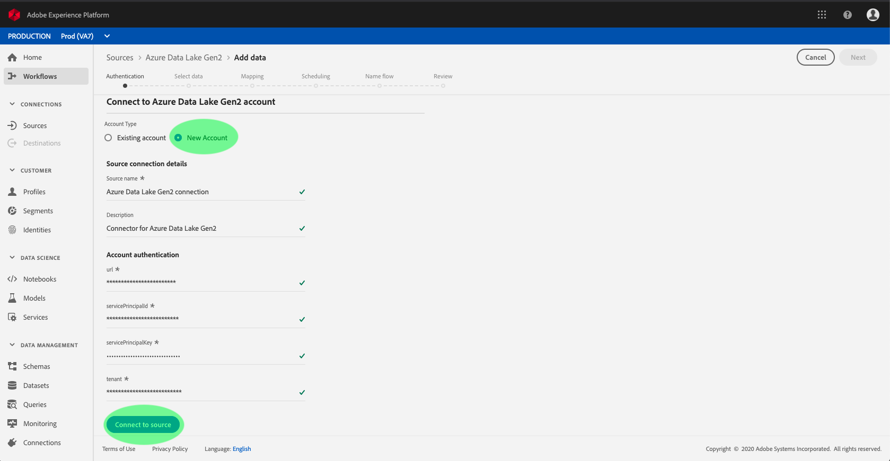
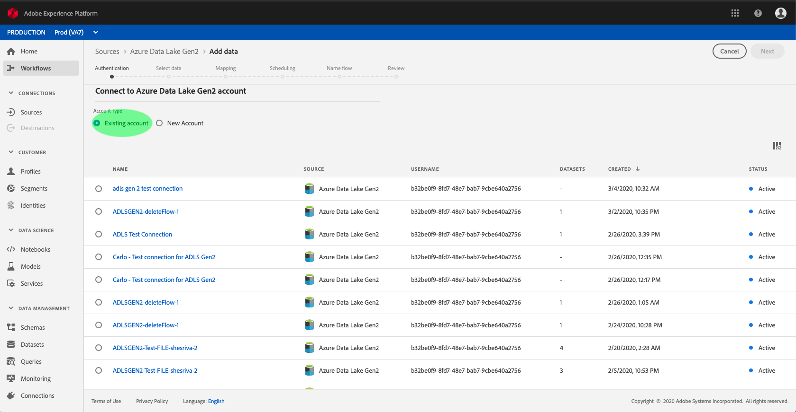

# Authenticate an Azure Data Lake Storage Gen2 source connector in the UI

Source connectors in Adobe Experience Platform provide the ability to ingest externally sourced data on a scheduled basis. This tutorial provides steps for authenticating an Azure Data Lake Storage Gen2 (hereinafter referred to as "ADLS Gen2") source connector using the Platform user interface.

The following steps are covered:

*   [Connect your ADLS Gen2 account](#connect-your-adls-gen2-account)
    *   [New account](#new-account)
    *   [Existing account](#existing-account)

## Getting started

This tutorial requires a working understanding of the following components of Adobe Experience Platform:

-   [Experience Data Model (XDM) System](./../../../../technical_overview/schema_registry/xdm_system/xdm_system_in_experience_platform.md): The standardized framework by which Experience Platform organizes customer experience data.
    -   [Basics of schema composition](./../../../../technical_overview/schema_registry/schema_composition/schema_composition.md): Learn about the basic building blocks of XDM schemas, including key principles and best practices in schema composition.
    -   [Schema Editor tutorial](./../../../../tutorials/schema_editor_tutorial/schema_editor_tutorial.md): Learn how to create custom schemas using the Schema Editor UI.
-   [Real-time Customer Profile](./../../../../technical_overview/unified_profile_architectural_overview/unified_profile_architectural_overview.md): Provides a unified, real-time consumer profile based on aggregated data from multiple sources.

If you already have an ADLS Gen2 base connection, you may skip the remainder of this document and proceed to the tutorial on [configuring a dataflow](./configure-cloud-storage-dataflow-tutorial.md).

### Gather required credentials

In order to authenticate your ADLS Gen2 source connector, you must provide values for the following connection properties:

| Credential | Description |
| ---------- | ----------- |
| `url` | The endpoint for ADLS Gen2. |
| `servicePrincipalId` | The application's client ID. |
| `servicePrincipalKey` | The application's key. |
| `tenant` | The tenant information that contains your application. |

For more information about these values, refer to [this ADLS Gen2 document](https://docs.microsoft.com/en-us/azure/data-factory/connector-azure-data-lake-storage).

## Connect your ADLS Gen2 account

Once you have gathered your required credentials, you can follow the steps below to create a new inbound base connection to link your ADLS Gen2 account to Platform.

Log in to <a href="https://platform.adobe.com" target="_blank">Adobe Experience Platform</a> and then select **Sources** from the left navigation bar to access the *Sources* workspace. The *Catalog* tab displays a variety of sources for which can be used to create inbound base connections. Each source shows the number of existing base connections associated to them.

Under the *Cloud Storage* category, select **Azure Data Lake Gen2** to expose an information bar on the right-hand side of your screen. The information bar provides a brief description for the selected source as well as options to connect with the source view its documentation. To create a new inbound base connection, click **Connect source**.

The *Connect to Azure Data Lake Gen2* dialog appears. On this page, you can either use new credentials or existing credentials. 

### New account

If you are using new credentials, select **New Account**. On the input form that appears, provide the base connection with a name, an optional description, and your ADLS Gen2 credentials. When finished, select **Connect** and then allow some time for the new base connection to establish.

### Existing account

To connect an existing account, select the ADLS Gen2 account you want to connect with, then select **Next** to proceed.

## Next steps

By following this tutorial, you have established a base connection to your ADLS Gen2 account. You can now continue on to the next tutorial and [configure a dataflow to bring data from your cloud storage into Platform](./configure-cloud-storage-dataflow-tutorial.md).