# Create a Microsoft Dynamics or Salesforce source connector in the UI

Source connectors in Adobe Experience Platform provide the ability to ingest externally sourced CRM data on a scheduled basis. This tutorial provides steps for creating a Microsoft Dynamics (hereinafter referred to as "Dynamics") or Salesforce source connector using the Platform user interface, and is broken into the following sections:

-   [Connect your Dynamics or Salesforce account](#connect-your-dynamics-or-salesforce-account)
-   [Configure a dataflow](#configure-a-dataflow)
    -   [Select data](#select-data)
    -   [Map data fields to an XDM schema](#map-data-fields-to-an-xdm-schema)
    -   [Schedule ingestion runs](#schedule-ingestion-runs)
    -   [Review dataflow](#review-your-dataflow)
-   [Monitor data ingestion](#monitor-data-ingestion)

In addition, the appendix to this tutorial provides additional information for working with source connectors.

-   [Disable a dataflow](#disable-a-dataflow)
-   [Activate inbound data for Profile hydration](#activate-inbound-data-for-profile-hydration)

## Getting started

This tutorial requires a working understanding of the following components of Adobe Experience Platform:

-   [Experience Data Model (XDM) System](./../../../../technical_overview/schema_registry/xdm_system/xdm_system_in_experience_platform.md): The standardized framework by which Experience Platform organizes customer experience data.
    -   [Basics of schema composition](./../../../../technical_overview/schema_registry/schema_composition/schema_composition.md): Learn about the basic building blocks of XDM schemas, including key principles and best practices in schema composition.
    -   [Schema Editor tutorial](./../../../../tutorials/schema_editor_tutorial/schema_editor_tutorial.md): Learn how to create custom schemas using the Schema Editor UI.
-   [Real-time Customer Profile](./../../../../technical_overview/unified_profile_architectural_overview/unified_profile_architectural_overview.md): Provides a unified, real-time consumer profile based on aggregated data from multiple sources.

### Gather required credentials

In order to access your Dynamics account on Platform, you must provide a **Service URI**, **username**, and **password**.

Similarly, accessing your Salesforce account on Platform requires you to provide an **environment URL**, **username**, **password**, and **security token**.

## Connect your Dynamics or Salesforce account

With your CRM system's credentials ready, you can follow the steps below to create a new inbound base connection to link your Dynamics or Salesforce account to Platform.

If you already have a Dynamics or Salesforce base connection, you may skip this section and [configure a dataflow](#configure-a-dataflow).

Log in to <a href="https://platform.adobe.com" target="_blank">Adobe Experience Platform</a> and then select **Sources** from the left navigation bar to access the sources workspace. The *Catalog* screen displays a variety of sources for which you can create inbound base connections with, and each source shows the number of existing base connections associated to them.

Under the *CRM* category, select either **Microsoft Dynamics** or **Salesforce** to expose an information bar on the right-side of your screen. The information bar provides a brief description for the selected source as well as options to view its documentation or to connect with the source. To create a new inbound base connection, click **Connect source**. 

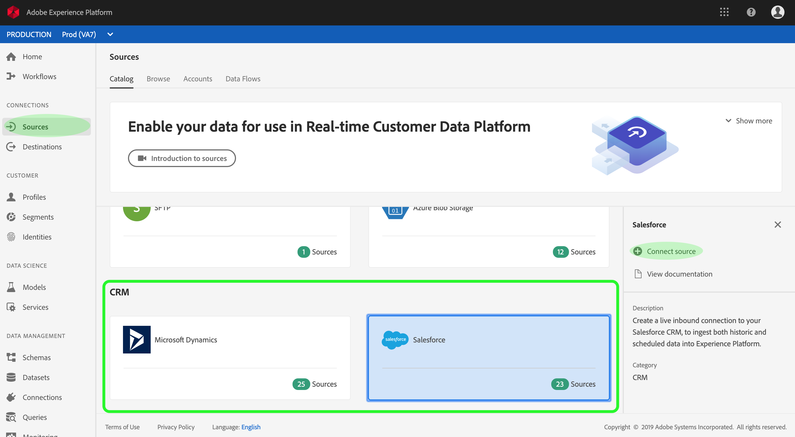

On the input form, provide the base connection with a name, an optional description, and your Dynamics or Salesforce credentials. Lastly, click **Connect** and then allow some time for the new base connection to establish.

Once a base connection with your CRM system is established, you can continue on to the next section and configure a dataflow to bring CRM data into Platform.

## Configure a dataflow

A dataflow is a scheduled task for the purpose of retrieving and ingesting data from a source to a Platform dataset. Follow the steps below to configure a new dataflow using your Dynamics or Salesforce base connector.

Within Experience Platform sources workspace, click the **Browse** tab to list your existing base connections. Find your Dynamics or Salesforce connection and click its name to access the *Source activity* screen.

The *Source activity* screen lists all active and inactive data flows. The information column to the right-side of the UI provides useful information regarding the selected base connection, such as the connecter ID. Click **Select data** to configure a new data flow using the base connector you are viewing.

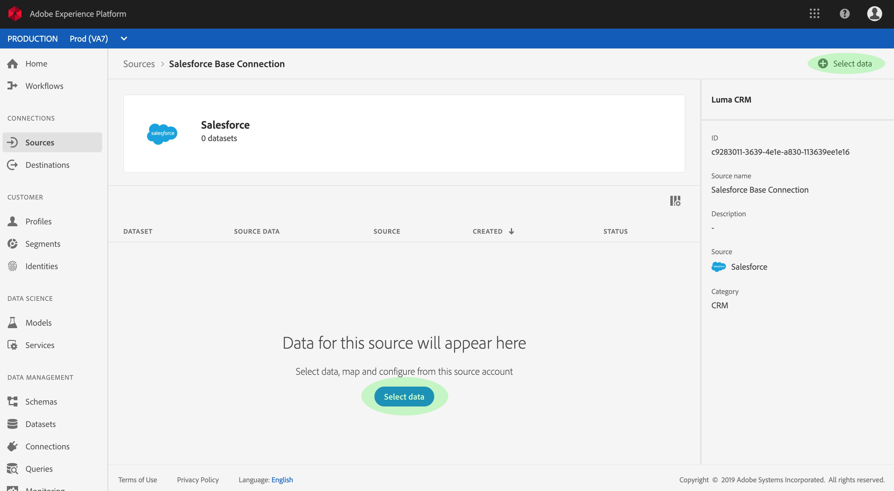

### Select data

The *Select data* step appears, providing you with an interactive interface to explore your Dynamics or Salesforce report suites.
*   The left half of the interface is a table browser, displaying your CRM system's report suites.
*   The right half of the interface lets you preview up to 100 rows of data from a selected report suite.

Find and select the report suite you want to ingest and then click **Next**.

### Map data fields to an XDM schema

The *Mapping* step appears, and it provides an interactive interface to map the source data to a Platform dataset.

Choose a dataset for where inbound data is ingested to. You can either use an existing dataset or create a new one.

*   To ingest data into an existing dataset, click the dataset icon and a window appears. Find the dataset you you wish to use, select it, then click **Continue**.

    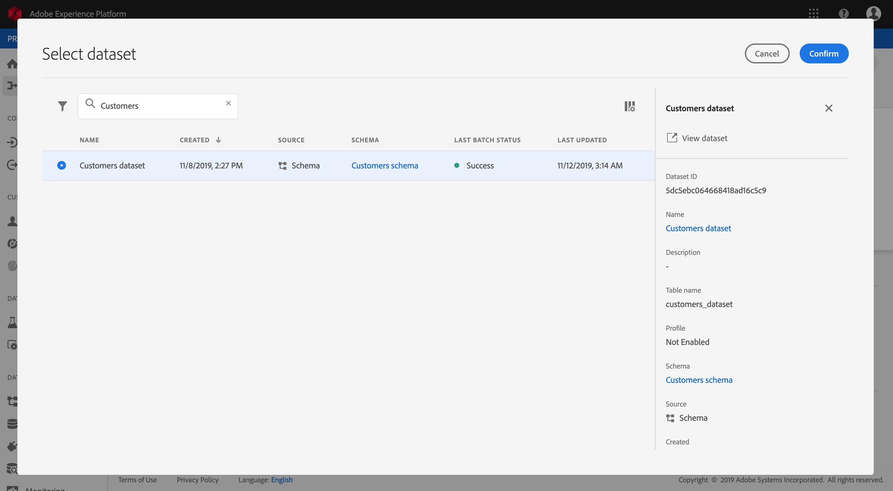

    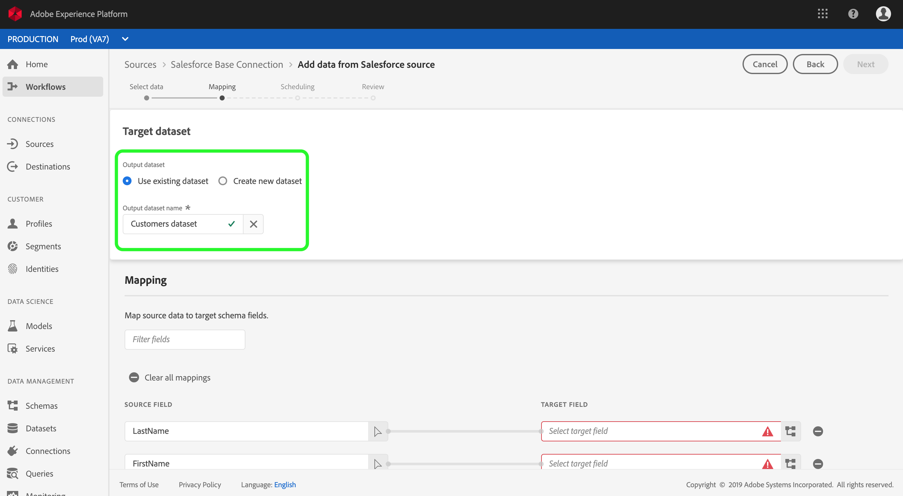

*   To ingest data into a new dataset, you must provide a dataset name, an optional description, and select an XDM schema. Click the schema icon and a window appears. Find the schema you wish to apply to the new dataset and then click **Done**.

    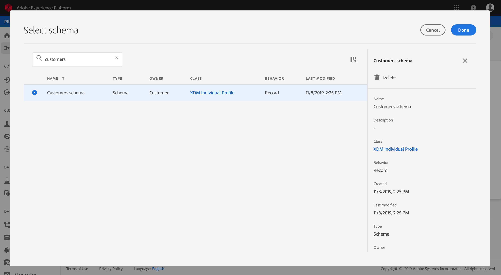
    
    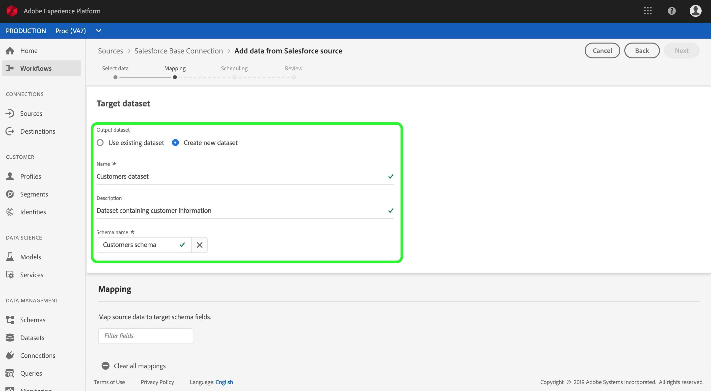

Based on your needs, you can choose to map fields directly, or use mapper functions to transform source data to derive computed or calculated values. For more information on data mapping and mapper functions, refer to the tutorial on [mapping CSV data to XDM schema](./../../../../tutorials/map-csv-to-xdm/map-csv-to-xdm.md). Once your source data is mapped, click **Next**.

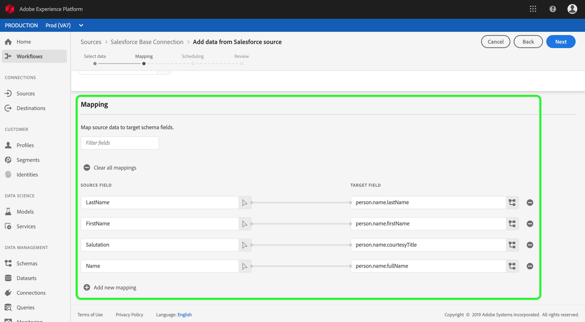

Select an appropriate **Delta column**. A delta column is a data field within the chosen report suite consisting of timestamps. This information is used by Platform to differentiate between new and existing data so that only new data is considered for each scheduled ingestion run.

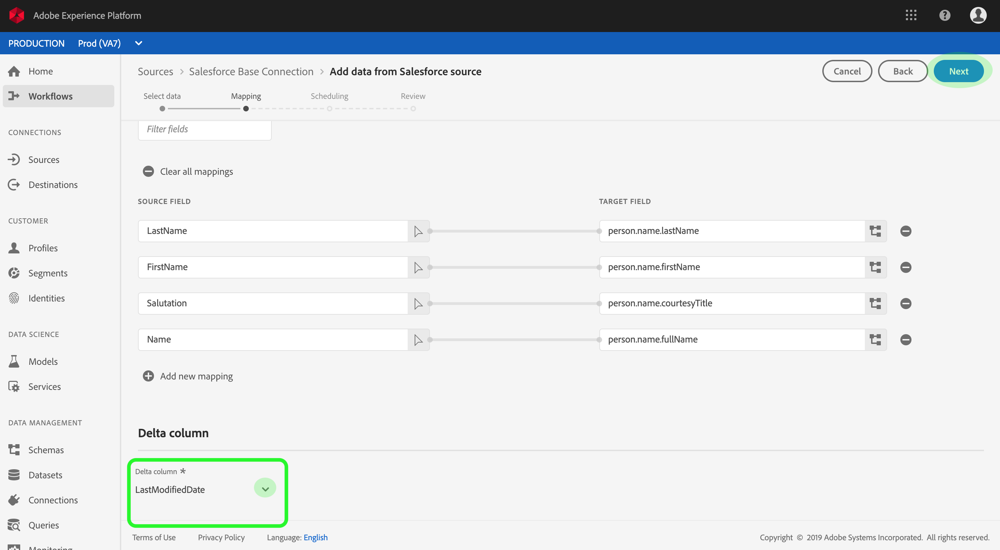

Once your source data is mapped, click **Next**.

### Schedule ingestion runs

The *Scheduling* step appears, allowing you to configure an ingestion schedule to automatically ingest the selected source data using the configured mappings. Configurable fields for scheduling include:

*   Frequency: Selectable frequencies include Minute, Hour, Day, and Week.
*   Interval: An integer that sets the interval for the selected frequency.
*   Start time: A UTC timestamp for which the very first ingestion will occur.
*   End time: A UTC timestamp for which the ingestion schedule ends.
*   Backfill: Upon creating a dataflow, the selected source file is copied into Platform regardless of the configured *Start time*. If *Backfill* is enabled, the initial copy of the source file is ingested together with the version that exists in your CRM system during the first scheduled ingestion.

Dataflows are designed to automatically ingest data on a scheduled basis. If you wish to only ingest once through this workflow, you can do so by configuring the **Frequency** to **Day** and applying a very large number for the **Interval**, such as **10000** or similar.

Provide values for the schedule and click **Next**.

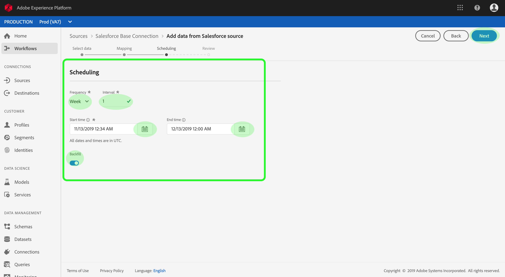

### Review your dataflow

The *Review* step appears, allowing you to review your new dataflow before it is created. Details are grouped relevant to their categories, including:

*   *Source details*: Shows the type of the source, the chosen report suite, and the number of columns within it.
*   *Target details*: Shows which dataset for which source data is ingesting into, including the schema the dataset adheres to.
*   *Schedule details*: Shows the ingestion schedule's active period, frequency, and interval.

Once you have reviewed your dataflow, click **Finish** and allow some time for the dataflow to be created.

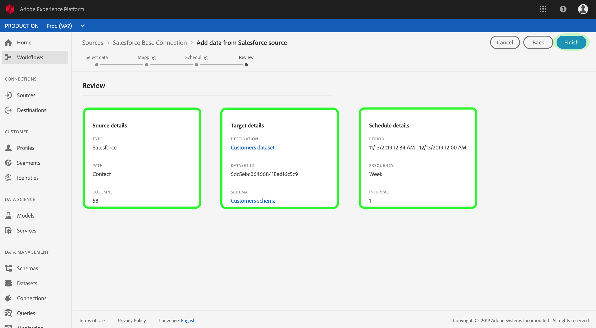

## Monitor data ingestion

You can monitor data that is being ingested through your Dynamics or Salesforce dataflow. Follow the steps below to access a dataflow's dataset monitor.

Within Experience Platform sources workspace, click the **Browse** tab to list your base connections. In the displayed list, find the connection that contains the dataflow you wish to monitor and click its name to access its *Source activity* screen.

Each dataflow is represented by the dataset for which source data is ingested into. Click on a dataset ID to access its *Dataset activity* screen.

From here, you can see the rate of messages being consumed in the form of a graph, as well as a list of successful and failed batches. 

You can view more details about a batch by clicking a **Batch ID**, or by clicking **Monitoring** within the left-navigation to see the status of each batch. If a batch is ingested into a Profile-enabled dataset, the number of ingested profiles and identities are displayed.

For more information on monitoring datasets and ingestion, refer to the tutorial on [monitoring streaming data flows](./../../../../technical_overview/streaming_ingest/monitor-data-flows.md).

## Next steps

By following this tutorial, you have successfully created a Dynamics or Salesforce base connection, created a dataflow to bring in CRM data from a report suite, and gained insight on monitoring datasets. Incoming data can now be used by downstream Platform services such as Real-time Customer Profile and Data Science Workspace. See the following documents for more details:

*   [Real-time Customer Profile overview](./../../../../technical_overview/unified_profile_architectural_overview/unified_profile_architectural_overview.md)
*   [Data Science Workspace overview](./../../../../technical_overview/data_science_workspace_overview/dsw_overview.md)

## Appendix

The following section provides additional information for working with source connectors.

### Disable a dataflow

When a dataflow is created, it immediately becomes active and ingests data according to the schedule it was given. You can disable an active dataflow at any time by following the instructions below.

Within the Sources workspace, click the **Browse** tab. Next, click the name of the base connection that the active dataflow you wish to disable belongs to.

Click the listing of the active dataflow and the *Properties* column appears, containing an **Enabled** toggle button. Click the toggle to disable the dataflow. The same toggle can be used to re-enable a dataflow after it has been disabled.

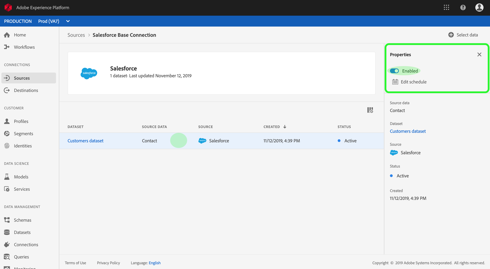

### Activate inbound data for Profile hydration

This section provides steps for enabling a schema and dataset for Real-time Customer Profile.

Inbound CRM data from Dynamics or Salesforce can be used towards enriching and hydrating your Real-time Customer Profile data.

In order to enrich customer profiles, the target dataset's source schema is compatible for use in Real-time Customer Profile. A compatible schema satisfies the following requirements:

*   The schema has at least one attribute specified as an identity property.
*   The schema has an identity property defined as the primary identity.
*   A mapping within the dataflow exists wherein the primary identity is a target attribute.

Within the Sources workspace, click the **Browse** tab to list your base connections. In the displayed list, find the connection that contains the dataflow you wish to hydrate profiles with. Click the connection's name to access its details.

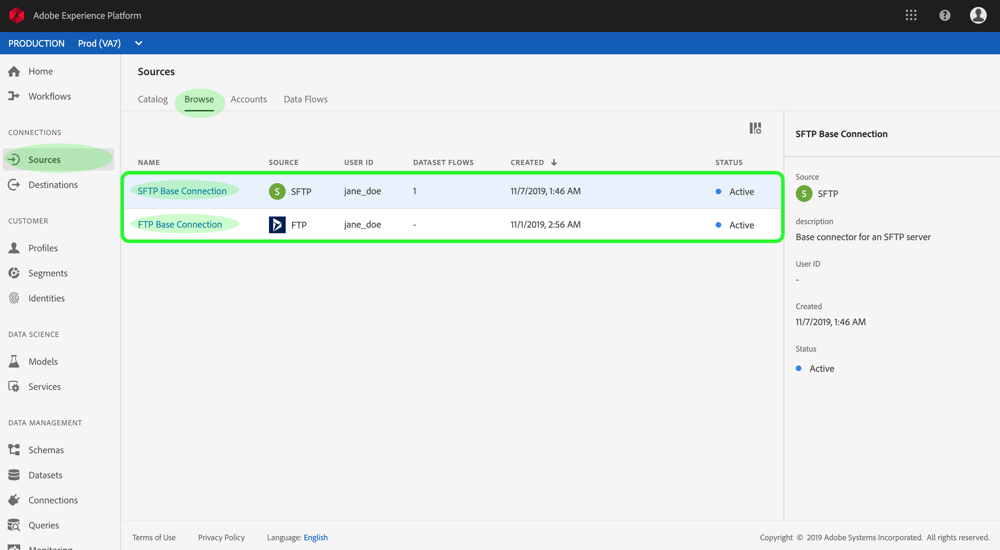

The connection's *Source activity* screen appears, displaying the datasets that the connection is ingesting source data into.

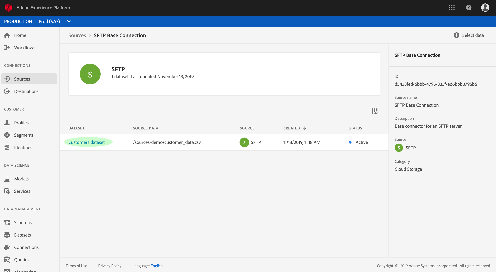

Within the *properties* column to the right of your screen, details of the dataset are displayed, including a **Profile** switch and the schema the dataset adheres to. Click the name of the schema to view its composition.

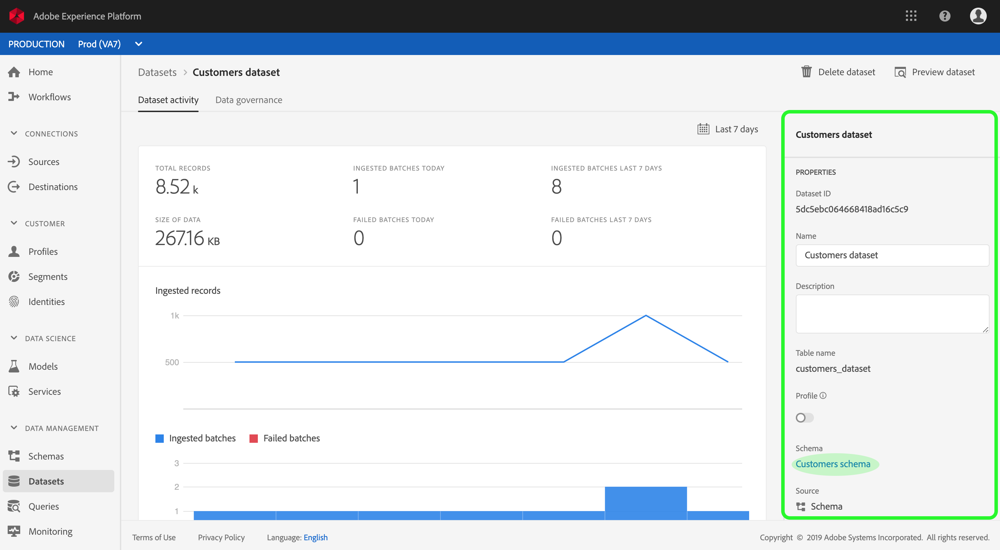

The *Schema Editor* appears, showing the structure of the schema in the center canvas. Within the canvas, select the field to be set as the primary identity. Under the *Field properties* tab that appears, select the **Identity** checkbox, then **Primary identity**. Finally, select an appropriate **Identity namespace**, then click **Apply** to save your changes.

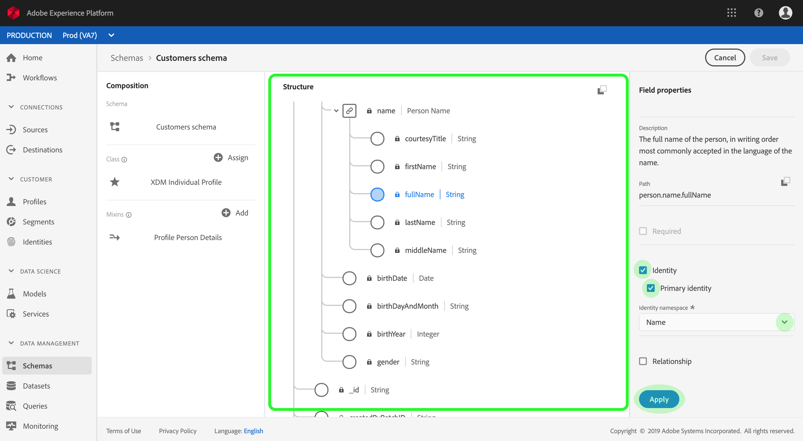

Click the top-level object of the schema's structure and the *Schema properties* column appears. Enable the schema for Profile by toggling the **Profile** switch. Click **Save** to finalize your changes.

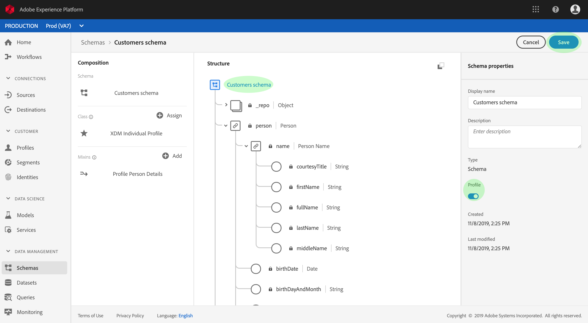

Now that the schema is enabled for Profile, return to the Dataset activity screen and enable the dataset for Profile by clicking the **Profile** toggle within the *Properties* column.

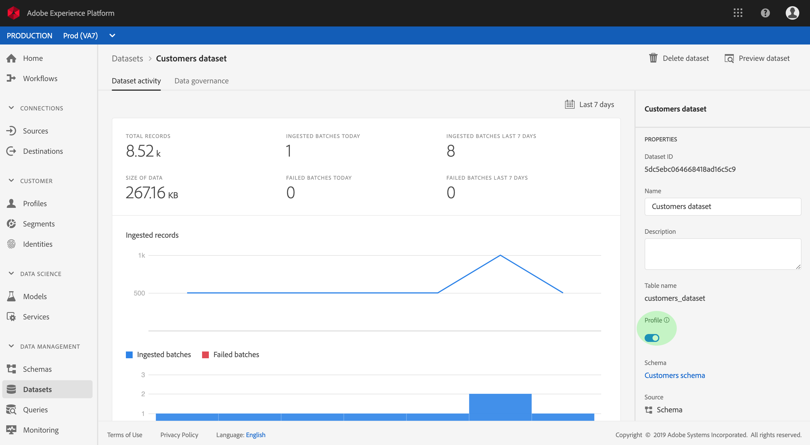

With both the schema and dataset enabled for Profile, data ingested into that dataset will now also hydrate customer profiles.

>   **Note:** Existing data within a recently enabled dataset is not consumed by Profile.