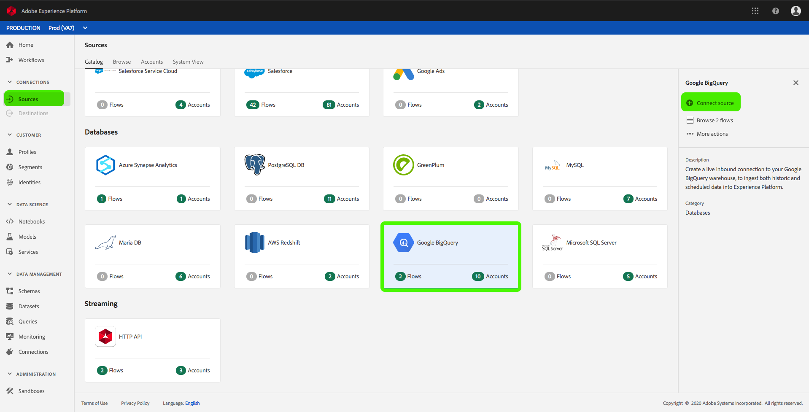
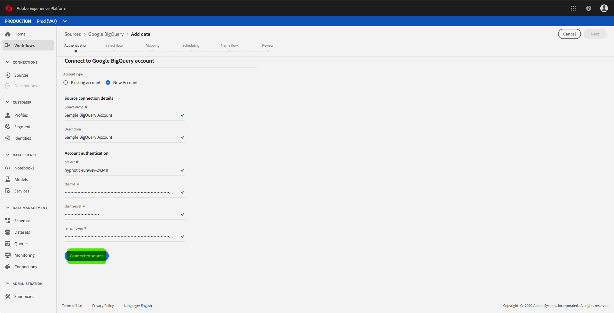
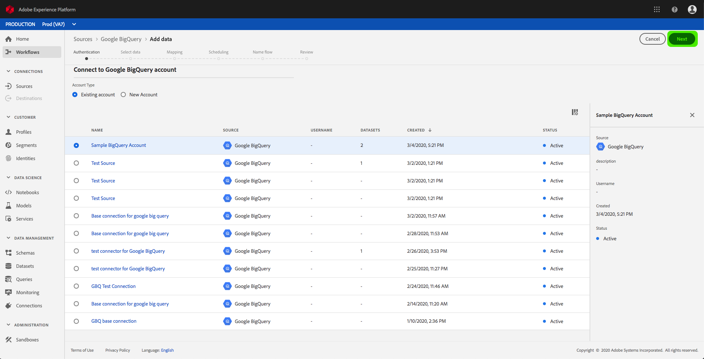

# Create a Google Big Query source connector in the UI

Source connectors in Adobe Experience Platform provide the ability to ingest externally sourced data on a scheduled basis. This tutorial provides steps for creating a Google Big Query (hereinafter referred to as "GBQ") source connector using the Platform user interface.

## Getting started

This tutorial requires a working understanding of the following components of Adobe Experience Platform:

-   [Experience Data Model (XDM) System](./../../../../technical_overview/schema_registry/xdm_system/xdm_system_in_experience_platform.md): The standardized framework by which Experience Platform organizes customer experience data.
    -   [Basics of schema composition](./../../../../technical_overview/schema_registry/schema_composition/schema_composition.md): Learn about the basic building blocks of XDM schemas, including key principles and best practices in schema composition.
    -   [Schema Editor tutorial](./../../../../tutorials/schema_editor_tutorial/schema_editor_tutorial.md): Learn how to create custom schemas using the Schema Editor UI.
-   [Real-time Customer Profile](./../../../../technical_overview/unified_profile_architectural_overview/unified_profile_architectural_overview.md): Provides a unified, real-time consumer profile based on aggregated data from multiple sources.

If you already have a GBQ base connection, you may skip the remainder of this document and proceed to the tutorial on [configuring a dataflow](./configure-dataflow.md).

### Gather required credentials

In order to access your GBQ account on Platform, you must provide the following values:

| Credential | Description |
| ---------- | ----------- |
| `project` | The project ID of the default BigQuery project to query against. |
| `clientID` | The ID value used to generate the refresh token. |
| `clientSecret` | The secret value used to generate the refresh token. |
| `refreshToken` | The refresh token obtained from Google used to authorize access to BigQuery. |

For more information about these values, refer to [this BigQuery document](https://cloud.google.com/storage/docs/json_api/v1/how-tos/authorizing).

## Connect your GBQ account

Once you have gathered your required credentials, you can follow the steps below to create a new inbound base connection to link your GBQ account to Platform.

Log in to <a href="https://platform.adobe.com" target="_blank">Adobe Experience Platform</a> and then select **Sources** from the left navigation bar to access the *Sources* workspace. The *Catalog* screen displays a variety of sources for which you can create inbound base connections with, and each source shows the number of existing base connections associated to them.

Under the *Databases* category, select **Google Big Query** to expose an information bar on the right-hand side of your screen. The information bar provides a brief description for the selected source as well as options to connect with the source or view its documentation. To create a new inbound base connection, select **Connect source**. 

The *Connect to Google Big Query* page appears. On this page, you can either use new credentials or existing credentials.

### New account

If you are using new credentials, select **New account**. On the input form that appears, provide the base connection with a name, an optional description, and your GBQ credentials. When finished, select **Connect** and then allow some time for the new base connection to establish.

### Existing account

To connect an existing account, select the GBQ account you want to connect with, then select **Next** to proceed.

## Next steps

By following this tutorial, you have established a base connection to your GBQ account. You can now continue on to the next tutorial and [configure a dataflow to bring data into Platform](./configure-dataflow.md).