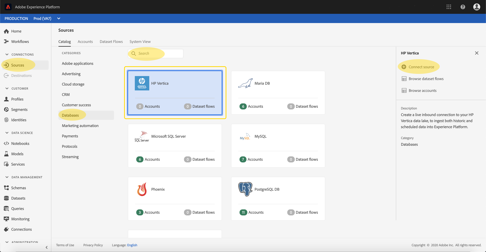
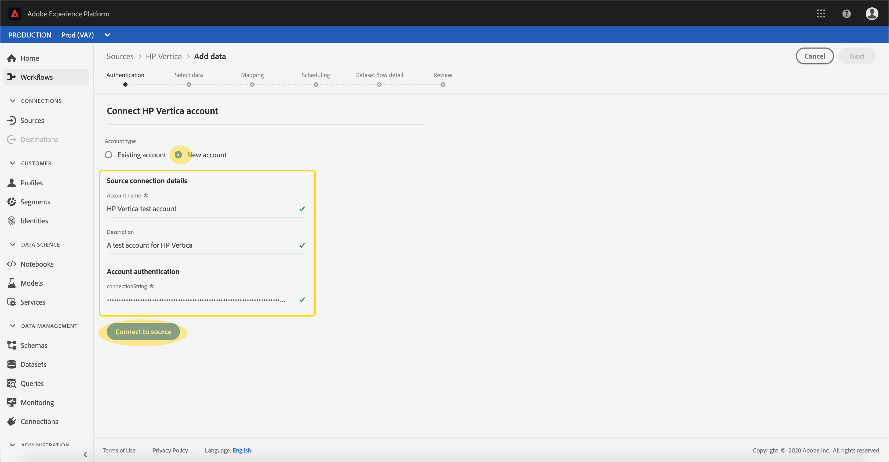
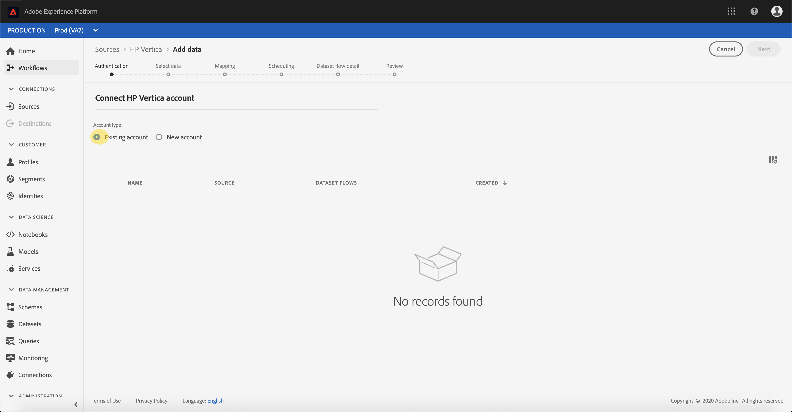

# Create a HP Vertica source connector in the UI

Source connectors in Adobe Experience Platform provide the ability to ingest externally sourced data on a scheduled basis. This tutorial provides steps for creating a HP Vertica (hereinafter referred to as "Vertica") source connector using the Platform user interface.

## Getting started

This tutorial requires a working understanding of the following components of Adobe Experience Platform:

-   [Experience Data Model (XDM) System](https://docs.adobe.com/content/help/en/experience-platform/xdm/home.html): The standardized framework by which Experience Platform organizes customer experience data.
    -   [Basics of schema composition](https://docs.adobe.com/content/help/en/experience-platform/xdm/schema/composition.html): Learn about the basic building blocks of XDM schemas, including key principles and best practices in schema composition.
    -   [Schema Editor tutorial](https://docs.adobe.com/content/help/en/experience-platform/xdm/tutorials/create-schema-ui.html): Learn how to create custom schemas using the Schema Editor UI.
-   [Real-time Customer Profile](https://docs.adobe.com/content/help/en/experience-platform/profile/home.html): Provides a unified, real-time consumer profile based on aggregated data from multiple sources.

If you already have a valid Vertica connection, you may skip the remainder of this document and proceed to the tutorial on [configuring a dataflow](./configure-dataflow.md)

### Gather required credentials

In order to access your Vertica account on Platform, you must provide the following values:

| Credential | Description |
| ---------- | ----------- |
| `connectionString` | A connection string to connect to your HP Vertica instance. |

For more information about getting started refer to [this HP Vertica document](https://www.vertica.com/docs/9.2.x/HTML/Content/Authoring/ConnectingToVertica/ClientJDBC/CreatingAndConfiguringAConnection.htm).

## Connect your HP Vertica account

Once you have gathered your required credentials, you can follow the steps below to create a new Vertica account to connect to Platform.

Log in to <a href="https://platform.adobe.com" target="_blank">Adobe Experience Platform</a> and then select **Sources** from the left navigation bar to access the *Sources* workspace. The *Catalog* screen displays a variety of sources for which you can create inbound account, and each source shows the number of existing accounts and dverticaet flows associated to them.

You can select the appropriate category from the catalog on the left-hand side of your screen. Alternatively, you can find the specific source you wish to work with using the search option.

Under the *Customer Success* category, select **HP Vertica** to expose an information bar on the right-hand side of your screen. The information bar provides a brief description for the selected source as well as options to connect with the source or view its documentation. To create a new inbound connection, select **Connect source**.

The *Connect to HP Vertica* page appears. On this page, you can either use new credentials or existing credentials.

### New account

If you are using new credentials, select **New account**. On the input form that appears, provide the connection with a name, an optional description, and your Vertica credentials. When finished, select **Connect** and then allow some time for the new account to establish.

### Existing account

To connect an existing account, select the Vertica account you want to connect with, then select **Next** to proceed.

## Next steps

By following this tutorial, you have established a connection to your Vertica account. You can now continue on to the next tutorial and [configure a dataflow to bring data into Platform](./configure-dataflow.md).