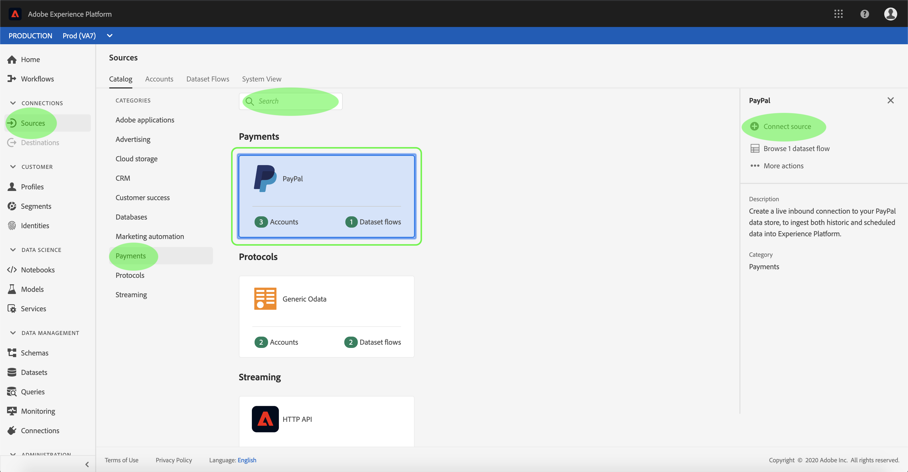
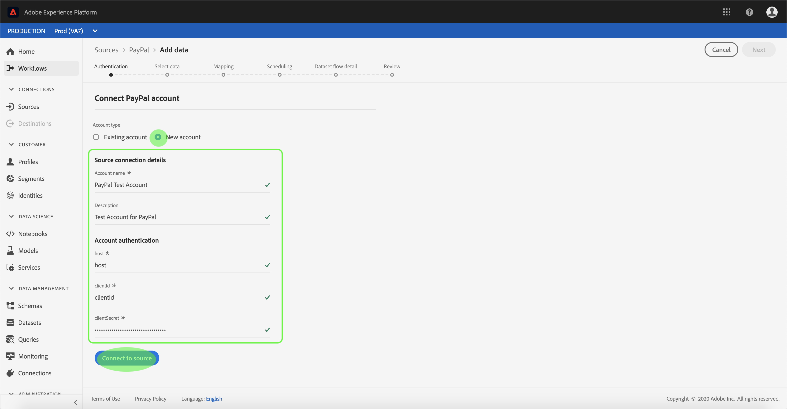
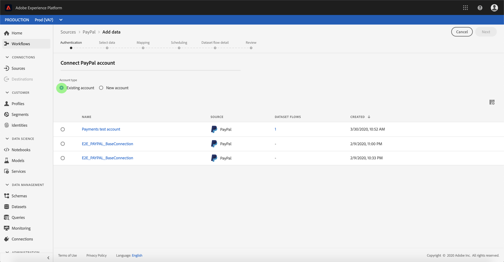

# Create a PayPal source connector in the UI

Source connectors in Adobe Experience Platform provide the ability to ingest externally sourced data on a scheduled basis. This tutorial provides steps for creating a PayPal source connector using the Platform user interface.

## Getting started

This tutorial requires a working understanding of the following components of Adobe Experience Platform:

- [Experience Data Model (XDM) System](https://docs.adobe.com/content/help/en/experience-platform/xdm/home.html): The standardized framework by which Experience Platform organizes customer experience data.
  - [Basics of schema composition](https://docs.adobe.com/content/help/en/experience-platform/xdm/schema/composition.html): Learn about the basic building blocks of XDM schemas, including key principles and best practices in schema composition.
  - [Schema Editor tutorial](https://docs.adobe.com/content/help/en/experience-platform/xdm/tutorials/create-schema-ui.html): Learn how to create custom schemas using the Schema Editor UI.
- [Real-time Customer Profile](https://docs.adobe.com/content/help/en/experience-platform/rtcdp/overview.html): Provides a unified, real-time consumer profile based on aggregated data from multiple sources.

If you already have a PayPal account, you may skip the remainder of this document and proceed to the tutorial on [configuring a dataflow](./configure-payments-dataflow-tutorial.md)

### Gather required credentials

In order to access your PayPal account in Platform, you must provide the following values:

| Credential | Description |
| ---------- | ----------- |
| `host` | The URL of the PayPal instance. |
| `clientID` | The client ID associated with your PayPal application. |
| `clientSecret` | The client secret associated with your PayPal application. |

For more information about getting started, refer to this [PayPal document](https://developer.paypal.com/docs/api/overview/#get-credentials)

## Connect your PayPal account

Once you have gathered your required credentials, you can follow the steps below to create a new PayPal account to connect to Platform.

Log in to <a href="https://platform.adobe.com" target="_blank">Adobe Experience Platform</a> and then select **Sources** from the left navigation bar to access the *Sources* workspace. The *Catalog* screen displays a variety of sources for which you can create inbound account. Each source shows the number of existing accounts and dataset flows associated to them.

You can select the appropriate category from the catalog on the left-hand side of your screen. Alternatively, you can find the specific source you wish to work with using the search option.

Under the *Payments* category, select **PayPal** to expose an information bar on the right-hand side of your screen. The information bar provides a brief description for the selected source as well as options to connect with the source or view its documentation. To create a new inbound connection, select **Connect source**.

The *Connect to PayPal* page appears. On this page, you can either use new credentials or existing credentials.

### New account

If you are using new credentials, select **New account**. On the input form that appears, provide the connection with a name, an optional description, and your PayPal credentials. When finished, select **Connect** and then allow some time for the new account to establish.

### Existing account

To connect an existing account, select the  PayPal account you want to connect with, then select **Next** to proceed.

## Next steps

By following this tutorial, you have established a connection to your PayPal account. You can now continue on to the next tutorial and [configure a dataset flow to bring payments data into Platform](./configure-payments-dataflow-tutorial.md).