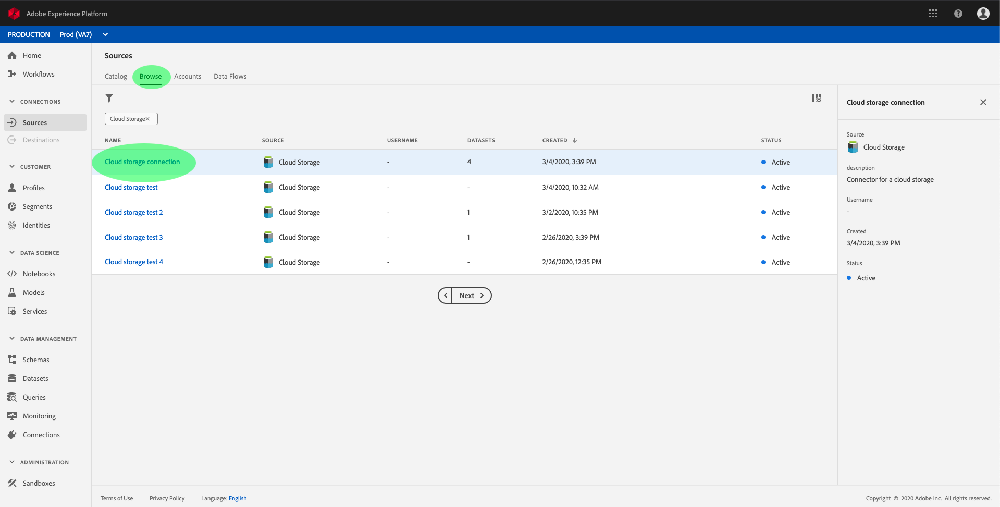
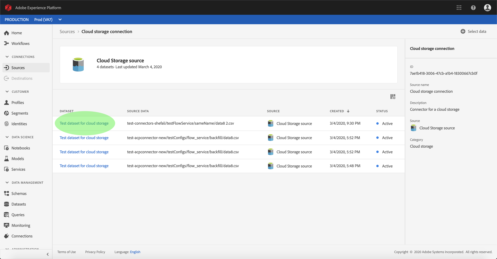
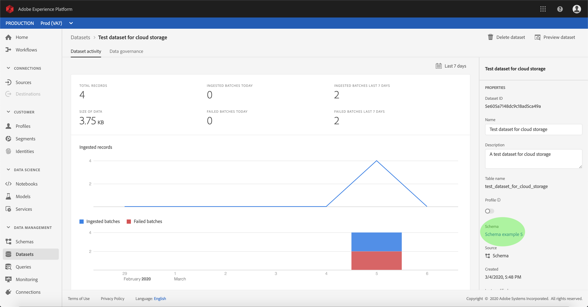
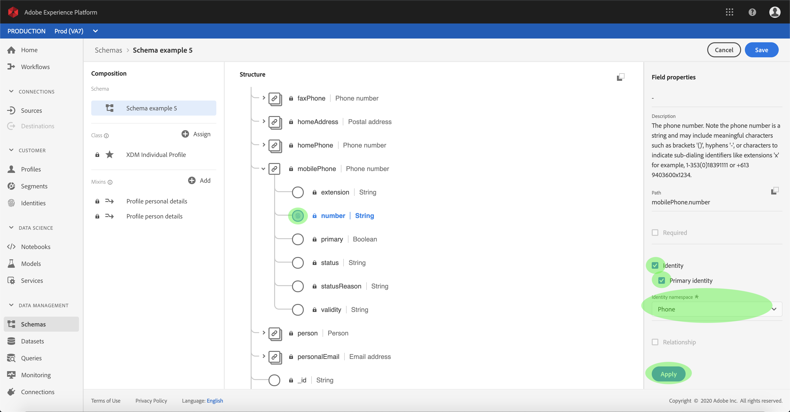
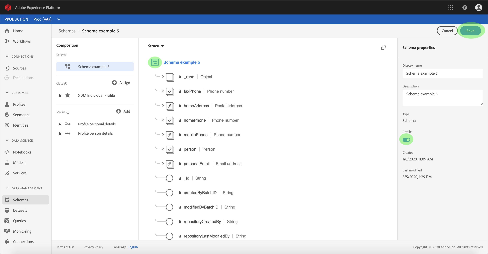
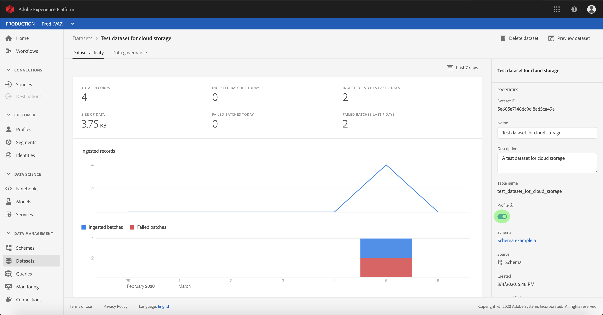

# Activate inbound data for Profile population

Inbound data from your source connector can be used towards enriching and populating your Real-time Customer Profile data.

## Getting started

This tutorial requires a working understanding of the following components of Adobe Experience Platform:

-   [Experience Data Model (XDM) System](./../../../technical_overview/schema_registry/xdm_system/xdm_system_in_experience_platform.md): The standardized framework by which Experience Platform organizes customer experience data.
    -   [Basics of schema composition](./../../../technical_overview/schema_registry/schema_composition/schema_composition.md): Learn about the basic building blocks of XDM schemas, including key principles and best practices in schema composition.
    -   [Schema Editor tutorial](./../../../tutorials/schema_editor_tutorial/schema_editor_tutorial.md): Learn how to create custom schemas using the Schema Editor UI.
-   [Real-time Customer Profile](./../../../technical_overview/unified_profile_architectural_overview/unified_profile_architectural_overview.md): Provides a unified, real-time consumer profile based on aggregated data from multiple sources.

Additionally, this tutorial requires that you have already created and configured a database connector. More information can be found in the tutorial on [creating a source in the UI](./sources-ui-tutorial.md).

## Populate your Real-time Customer Profile data

In order to enrich customer profiles, the target dataset's source schema must be compatible for use in Real-time Customer Profile. A compatible schema satisfies the following requirements:

- The schema has at least one attribute specified as an identity property.
- The schema has an identity property defined as the primary identity.
- A mapping within the dataflow exists wherein the primary identity is a target attribute.

Within the Sources workspace, click the **Browse** tab to list your base connections. In the displayed list, find the connection that contains the dataflow you wish to populate profiles with. Click the connection's name to access its details.

The connection's *Source activity* screen appears, displaying the datasets that the connection is ingesting source data into. Click the name of the dataset you wish to enable for Profile.

The *Dataset activity* screen appears. The *Properties* column on the right-hand side of the screen displays the details of the dataset, and includes a **Profile** switch and a link to the schema the dataset adheres to. Click the name of the schema to view its composition.

The *Schema Editor* appears, showing the structure of the schema in the center canvas. Within the canvas, select the field to be set as the primary identity. Under the *Field properties* tab that appears, select the **Identity** checkbox, then **Primary identity**. Finally, select an appropriate **Identity namespace**, then click **Apply**.

Click the top-level object of the schema's structure and the *Schema properties* column appears. Enable the schema for Profile by toggling the **Profile** switch. Click **Save** to finalize your changes.

Now that the schema is enabled for Profile, return to the *Dataset activity* screen and enable the dataset for Profile by clicking the **Profile** toggle within the *Properties* column.

With both the schema and dataset enabled for Profile, data ingested into that dataset will now also populate customer profiles.

> **Note:** Existing data within a recently enabled dataset is not consumed by Profile

## Next steps

By following this tutorial, you have successfully activated inbound data for Profile population. For more information, see the [Real-time Customer Profile overview](./../../../../technical_overview/unified_profile_architectural_overview/unified_profile_architectural_overview.md)