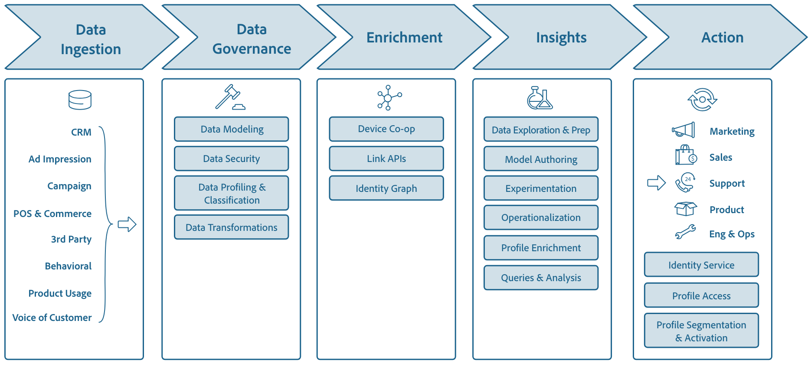
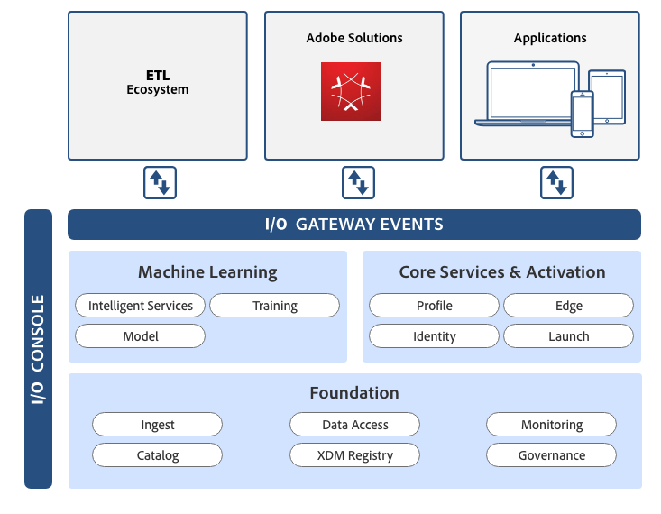

# Adobe Experience Platform 


Adobe Experience Platform is the most powerful, flexible, and open system on the market for building and managing complete solutions that drive customer experience. Experience Platform enables organizations to centralize and standardize customer data and content from any system and apply data science and machine learning to dramatically improve the design and delivery of rich, personalized experiences. 

Built on open APIs, Experience Platform exposes the full functionality of the system to developers, supporting the easy integration of enterprise solutions using familiar tools. Experience Platform also supports partners to build and integrate their own products and technologies as needed. 

This power and flexibility makes Experience Platform unique in the market. It gives partners, customers, and a community of developers a foundation on which to build innovations that drive The Experience Business: exceeding customer expectations by delivering a continually improving, fully-personalized experience drawn from a 360-degree view of the customer and their individual preferences. 

Adobe Experience Platform delivers an open system complete with data foundation, machine learning, and value-added services that help you control, customize, and integrate your data. Together with Platform, you can create experiences that surprise and delight your customers, cement brand loyalty, and drive business value. 



## API-first Development

Experience Platform has been designed and built using core principles of API-first development:

1.	The API is the primary interface into Experience Platform.
2.	All Platform functions, including administrative functions, are available via API.
3.	Platform services, Adobe solutions, and 3rd party integrations use the same API.

Guided by these principles, Adobe Experience Platform services and solutions are designed by first looking at the API and ensuring the functionality exists to support developers through low-level CRUD operations. Only once the API is built can the user interface (UI) be constructed by making REST calls to the API. By starting with the API, Experience Platform allows not only Adobe developers but _any_ developer to have the same access to the core logic of Platform services and solutions by means of the same API calls. This principle is not limited to REST-based APIs. It also applies to other interfaces into Experience Platform like message-based, event-driven interfaces that allow developers to build responsive, reactive applications.

By taking an API-first approach, Experience Platform opens up integration opportunities such as:

* Partners wanting to build their own data ingestion and egress capabilities, including 24-hour automated processes, using Catalog and Data Access services for full integration capabilities with the data store in Experience Platform.
* Developers wanting to build custom UIs to support specific task-driven use cases.

The openness and breadth offered by Experience Platform APIs makes it easy to construct a solution that integrates with Platform and offers almost any functionality you can imagine.

## Experience Platform Components

Experience Platform consists of multiple components. This multilayer model provides a complete infrastructure on which to build your own custom solutions. These component layers are: 

* Data Foundation
* Machine Learning
* Audience Activation




### Data Foundation

Data Foundation gives developers the power to manage standard schemas, ingest data, interact with datasets, apply Data Usage Labeling & Enforcement (DULE) metadata, and access data. To best utilize these capabilities, customer data must be imported into Experience Platform in a standardized format that allows for the consistent interpretation of data and application of analysis. For this, Adobe introduced Experience Data Model (XDM), the new standard for representing experience data that enables it to be immediately understood and actioned across Experience Platform. 

Using XDM, you can create a Customer Data Model representing all of your customer data no matter which data sources you use. You can take advantage of a number of third-party Extract-Transform-Load (ETL) solutions to import data into Experience Data Lake. Data stored in the Data Lake can come from Adobe solutions like Analytics, Target, or Audience Manager, third-party connectors such as Microsoft Dynamics, Salesforce, S3 and others, or be ingested through available APIs.

### Machine Learning

Machine Learning offers predefined models you can leverage in your own solutions, as well as the capability to develop custom machine learning models for your specific needs. Transforming your data into predefined schemas for machine learning lets you extract valuable insights from customer behavior, helping you to better understand intentions and predict future interactions. In combination with other attributes in the customer profile, this helps to create a 360-degree view of each one of your customers.

### Audience Activation

Audience Activation includes Real-time Customer Profile, Identity, and Edge Services. These services work together to enable you to build and activate audiences based on customer profiles containing individual attributes and behaviors.

* **Real-time Customer Profile Service** serves as a central data store for customer attributes and interactions. By deciphering customer behavior across multiple interactions, Adobe solutions and other integrations are able to leverage the complete picture of a customer. This can be used to identify interests and preferences, predict behavior, and deliver personalized experiences.

* **Identity Service** stitches together the identity of the consumer. It examines unauthenticated and authenticated interactions with your brand to build an identity graph that connects with the 360-degree customer profile to represent behavior and interests.

* **Edge Services** enable you to access customer data to instantaneously perform computations and decisioning to deliver enhanced individualized experiences to customers, in real-time, as they interact with your brand.

These services work together to bring insights and audiences to life. You can segment your audiences, inspect individual profiles, make profiles available inside of Adobe solutions or consume them from a third-party application through the open APIs.

## Experience Platform Services

The components outlined above are composed of a collection of services accessible to you via RESTful APIs. These APIs are the primary way to integrate with Experience Platform. Some of the key services in Experience Platform include:

Service Name	| Description
------------ | --------
Catalog |	Manages the metadata for you datasets and files in Platform, including data lineage and policies associated with data.
Data Ingestion	| APIs and connectors to bring data into platform, either in batch or streaming fashion.
Data Access |	Provides access to the content of registered datasets for data export.
Decisioning | Create optimized and personalized experiences in applications to programmatically select the next best action from a set of available choices.
Governance	| Manages Data Usage Labelling and Enforcement (DULE) metadata for registered datasets and enforces the usage labels as data travels through Experience Platform.
Unified Identity	| Every customer can be identified in a number of different ways, ranging from unknown identities like a cookie, to an authenticated identity like a ECID. The Identity service provides identity stitching and identity resolution by bringing interactions together.
Real-time Customer Profile | Creates a single 360-degree view of the consumer. The profile is populated with information provided in Experience Platform datasets and can be consumed by any service, either using point lookups or segmentation queries.
Experience Data Model (XDM) Registry	| Manages the library of available XDM standard schemas as well as customer-defined schemas and extensions. 
 
Additional information on each of these services can be found by visiting [Platform Services on Adobe I/O](https://www.adobe.io/apis/cloudplatform/dataservices/services.html).

## Example Use Case: Interactive Voice Response System

To highlight a potential use case, consider the world of Interactive Voice Response (IVR) systems and call center management software. 

Experience Platform APIs can be used to ingest historical information of the customer’s call center activity into the Experience Data Lake. If the data is ingested into the ExperienceEvent Schema (an XDM schema that expresses customer interactions), these interactions can be ingested directly into Real-time Customer Profile. In this case, a `callerId` can be used as the unique customer identifier. Identity service will take care of identity resolution and assist Real-time Customer Profile in stitching together data points from recent interactions with the Call Center to flesh out the individual customer’s profile.

The next time the customer calls into the call center, the IVR will be able to personalize the message and deliver an offer tailored to the caller thanks to API integration with Real-time Customer Profile.

When the customer calls, the IVR is able to make an API request to Real-time Customer Profile for a point-lookup: consulting either the profile attributes that apply to call-center interactions or the full customer profile. By using identity resolution to combine data from multiple sources and the individual attributes stored in Real-time Customer Profile, the IVR can deliver a tailored customer experience unique to each individual.

With Experience Platform, every interaction with your call center becomes an opportunity to engage customers, deliver a personalized brand experience, and gain insights toward providing additional targeted experiences in the future.

## Development Process

Adobe Experience Platform is built with the developer in mind. The API-first design of Experience Platform encourages developers to integrate, extend, and create apps and experiences within Platform to perform just about any function you can imagine.

### Adobe I/O Services

Adobe I/O provides a number of services to support developers with everything from documentation and tools, to the quick deployment of custom code. Adobe I/O Services include:

Service | Description
-----------------| ---------------
www.adobe.io	|Adobe I/O is a single source for developer-focused product documentation, up-to-date information about Experience Platform and access to IO Console.
I/O Gateway	|All Experience Platform APIs are exposed through the I/O Gateway, located on platform.adobe.io. The gateway governs the access to the APIs.
I/O Console |I/O Console gives you access to APIs, SDKs and developer tools to integrate, extend, and build upon Adobe products. This is the central place to register and manage API keys, connect applications to Platform Services, and inspect log entries and debug messages.
I/O Events	|With I/O Events, you can code event-driven experiences, applications, and custom workflows that leverage and combine Adobe Experience Cloud, Creative Cloud, and Document Cloud.
I/O Runtime |I/O Runtime is a serverless platform that allows you to quickly deploy custom code to respond to events and execute functions right in the cloud, all with no server setup required.

Applications that access APIs for Experience Platform are called integrations. To create an integration, you can use any developer tool or language you like to build your application; to interact with Adobe, however, you have to register your application as an integration through [Adobe I/O Console](https://console.adobe.io). 

Once you register your integration via I/O Console, the Identity Management Service (IMS) issues you an API key (a client ID) that determines the kind of access and permissions you have for Adobe APIs. To access APIs, the integration will authenticate itself using a JSON Web Token (JWT); your integration will also need to get an Access Token from IMS to pass as a header in any API requests. 

You can also choose to integrate with Adobe solutions by means of events. Adobe Events are notifications published by Adobe solutions whenever certain activities occur in the solution, such as a user uploading an image to Creative Cloud Assets. 

Using I/O Console, you can define what type of events you want to subscribe to and the webhooks that Adobe I/O Events should call when that event happens. Respond to events when you want, how you want, to deliver effective, personalized experiences for your users.

### Making API Calls

Once your integration has been registered with Adobe I/O Console, you are ready to begin making API requests. Using HTTP, you can make requests to various API endpoints and return the queried data (typically in JSON format) in the response body.

The following sample requests and responses outline some of the functionality provided by the API. 

For a complete list of available operations and endpoints, consult the Experience Platform [RESTful API](https://www.adobe.io/apis/cloudplatform/dataservices/api-reference.html) documentation.

#### GET - View a File

Using the Data Access API, you are able to access and download dataset files, retrieve header information regarding files, and more. For this example, the unique file ID is known and will be used to view specific details of the file, including its name, size in bytes, and a link to download it.

#### API Format

```
GET /files/{datasetFileId}
```

#### Request

```
curl -X GET \
  https://platform.adobe.io/data/foundation/export/files/f25a0dd3-rh6h-4ebe-b094 \
  -H 'Authorization: Bearer {ACCESS_TOKEN}' \
  -H 'x-api-key: {API_KEY}' \
  -H 'x-gw-ims-org-id: {IMS_ORG}' \
```

#### Response

The response will point to either a single file or a directory of files. In this case, the response points to a single file where "name" is the name of the file and "href" shows the URl to download the file.

```json
{
  "data": [
    {
      "name": "sample.parquet",
      "length": "249058",
      "_links": {
        "self": {
          "href": "https://platform.adobe.io/data/foundation/export/files/f25a0dd3-rh6h-4ebe-b094?path=sample.parquet"
	      }
      }
    }
  ],
  "_page": {
    "limit": 100,
    "count": 1
  }
}
```

### GET - View a List of Datasets

It is possible to view a list of Catalog objects through a single API call (e.g. `GET /dataSets`), but it is best practice to use filters when doing so because the response can be quite large. 

For example, in cases where _full_ dataset information is being requested the response payload can reach past 3GB in size, which places a heavy load on the API and can slow overall performance.

#### API Format

```
GET /dataSets?{filter}={value}&{filter2}={value}
```

#### Request

The sample request below includes two query parameters to filter the response. When using multiple filters, you must separate them with an ampersand (`&`). Platform assumes an AND relationship when multiple query parameters are used. 

```
curl -X GET \
  'https://platform.adobe.io/data/foundation/catalog/dataSets?limit=5&properties=name,description,files' \
  -H 'Authorization: Bearer {ACCESS_TOKEN}' \
  -H 'x-api-key: {API_KEY}' \
  -H 'x-gw-ims-org-id: {IMS_ORG}'
```

#### Response

The response body consists of a JSON object with individual objects for each returned dataset. The response is limited to the five most recent datasets (`limit=5`) and the requested properties (name, description, and files) are the only properties that will be displayed. If a dataset does not contain all of the requested properties, it will return any of the requested properties that it does include, as shown in "Sample Dataset 3" and "Sample Dataset 4" below.

```json
{
    "5ba9452f7de80400007fc52a": {
        "name": "Sample Dataset 1",
        "description": "Description of dataset.",
        "files": "@/dataSets/5ba9452f7de80400007fc52a/views/5ba9452f7de80400007fc52b/files"
    },
    "5bb276b03a14440000971552": {
        "name": "Sample Dataset 2",
        "description": "Description of dataset.",
        "files": "@/dataSets/5bb276b03a14440000971552/views/5bb276b01250b012f9acc75b/files"
    },
    "5bceaa4c26c115000039b24b": {
        "name": "Sample Dataset 3"
    },
    "5bda3a4228babc0000126377": {
        "name": "Sample Dataset 4",
        "files": "@/dataSets/5bda3a4228babc0000126377/views/5bda3a4228babc0000126378/files"
    },
    "5bde21511dd27b0000d24e95": {
        "name": "Sample Dataset 5",
        "description": "Description of dataset.",
        "files": "@/dataSets/5bde21511dd27b0000d24e95/views/5bde21511dd27b0000d24e96/files"
    }
}
```

## Conclusion

Adobe Experience Platform is the most powerful, flexible, and open system on the market for building and managing solutions that drive customer experience. 

Built on RESTful APIs, Experience Platform exposes the full functionality of the system to developers, supporting the easy integration of enterprise solutions and the building of custom solutions to meet your unique needs.

With Adobe Experience Platform, you can control, customize, and integrate your data to deliver experiences that surprise and delight your customers, cement brand loyalty, and drive results. 
