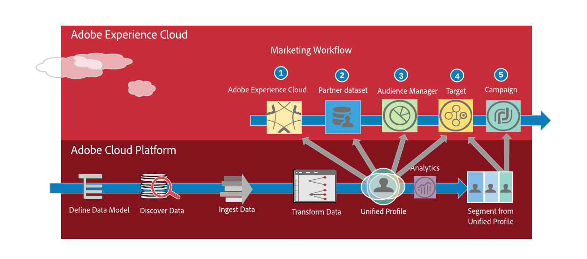
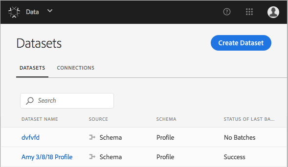
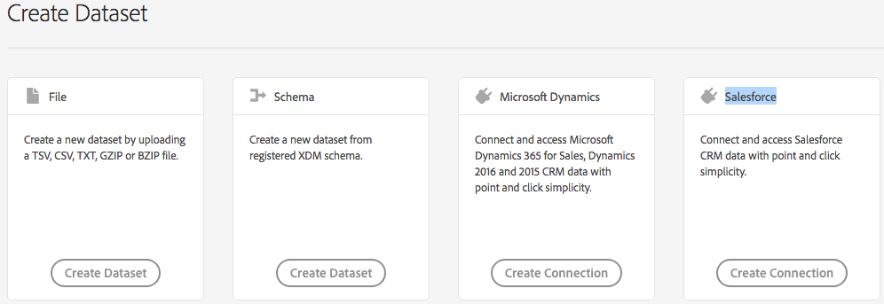
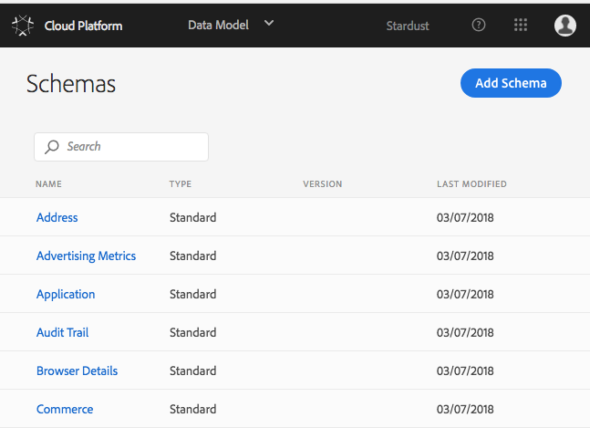
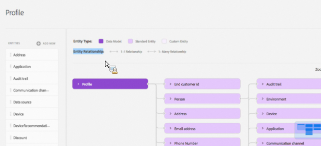

# Use Case: Building a Segmentation Workflow

The following is a description of ACP usage following Data > Schema > Profile > Segmentation example flow.

**Step 1: Select or create a dataset**
Initially, you need to identify the datasets to bring in to the platform. You can create a new dataset from the ACP user interface or select an existing one.

View the list of datasets and identify each dataset's source, associated schema, and batch ingestion status. Then select one or more.
Click the Create Dataset button to create datasets for files, standard XDM schemas, and connectors for CRM or other streaming data sources.

**Step 2:  Select the appropriate XDM schema for your datasets**

After creating a dataset or connection, you can identify the appropriate XDM schemas to map your data. In most cases you will want to use the standard schemas included with the platform. If your datasets are unique, you can create a custom schema and save it to the platform for future use.

For complete informaton, go to https://github.com/adobe/xdm/tree/master/docs/reference. Schemas are organized into categories in this Git repo.

- **View all standard XDM schemas and your custom schemas from the ACP user interface.** Select Data Model from the toolbar to open a list of schemas. All standard schemas are listed above with your custom schemas below.

- **Add a custom schema.** Select Add Schema to create a custom XDM schema.

**Step 3: Match your data to XDM schemas** 

After planning your data mapping to XDM schemas, select the 

 

