# Adobe Cloud Platform: Using Standard Schemas

## Overview

In order to gain insights from data, similar data must be consistently defined in the same way, removing the need for translation and improving the interoperability of data across systems.

To gain consistency in definitions, Adobe Cloud Platform (ACP) uses standard schemas across its many services. This document provides an overview of how those standard schemas are being used.

After reading this document you will be able to answer the following questions:

- How are schemas used by different ACP components?
- What is the Schema Library?
- What is the Schema Registry?
- What is the Data Model Workspace, and how can I use it to view, extend and create standard schemas?

## ACP Components and Use of Schema

Adobe Cloud Platform is schema agnostic, meaning that any schema that conforms to the standard can be used across the platform. Examples of standard schemas include those defined by Adobe as part of Experience Data Model (XDM), as well as Common Data Model (CDM) schemas published by Microsoft. Standard schemas are also supplied by other platform partners and you can create your own my mixing and matching available schemas or defining schemas from scratch.

Standard schemas are available for use by all platform services, such as Data Catalog, Unified Profile Service, and Unified Segmentation, each of which is outlined below.

### Experience Data Lake & Data Catalog

Adobe Cloud Platform contains a central Data Catalog of assets and their related schemas. The data lake is highly granular, storing all of your data managed by the platform, regardless of origin or file format.

To ingest data into Adobe Cloud Platform, a dataset is created which references a target schema, providing constraints to how the data should look. If the dataset is created without a target schema, ACP will derive an observed schema through the inspection of fields and field types.

The datasets are then tracked in the data catalog and stored alongside their target and observed schemas. The catalog provides the ability for you to discover datasets, as well as understand the formats and storage locations of the datasets, dependencies, lineage, etc.

### Unified Profile Service

Unified Profile Service (UPS) in Adobe Cloud Platform provides a unified, 360° customer profile of your entire user base. It contains data that is aggregated across all systems, as well as actionable timestamped accounts of events involving the subject in any of your systems that have been ingested into the platform.

UPS consumes schema formatted data, preferably in the form of Profile and ExperienceEvent, and responds to queries that can span record (profile) and event (time series) data. The Profile Service maintains a single record of each profile, merging data together to form a "single source of truth" for each subject.

#### Difference between data in XDL and UPS

Experience Data Lake (XDL) and Unified Profile Service (UPS) are both examples of datastores, but each has its own objective.

XDL is very granular and contains all information that has ever been collected. This includes data that you may not have a use for today, but that you may discover value for using in the future.

UPS provides an aggregation of subject data, merging it together to create a single view of each customer in your user base. This information is therefore not as granular, and may lose fidelity over time as it is updated and merged together.

### Unified Segmentation

Unified Segmentation uses fields from the Profile standard schema (such as "age", "region", "gender") to query profiles and create an audience based on the segment definition. 

These audiences, or subsets, of customers are based on shared characteristics and can be targeted with different messaging, offers, or solutions. Segment definitions can be stored and queried using the Unified Profile Service in order to generate audiences.

## Schema Library

The Schema Library contains all of the standard schemas that are available within platform. This includes schemas curated by Adobe (Experience Data Model), as well as those provided by platform partners and defined by your own organization.

### Key Experience Data Model (XDM) Schemas

Principal schemas for Adobe Cloud Platform can be grouped into two different behavior types: Time Series and Record.

Time Series data provides a snapshot of the system at the time an action was taken either directly or indirectly by a subject. ExperienceEvent is one example of a Time Series schema, but you can also define your own within platform. We recommend using ExperienceEvent, as it is the platform preferred schema to express Time Series data.

Record data provides information about attributes of the subject. This could be an organization or individual, and represents the state. The Profile schema is an example of a Record schema, but not the only one. It is the platform preferred schema for consumer record data.

Record schemas and Time Series schemas can contain one or more identity fields. Identity fields contain the identity representation of the subject, such as a CRM identifier, Experience Cloud ID (ECID), browser cookie, AdvertisingId, or other IDs in different domains.

The ExperienceEvent and Profile schemas are outlined in more detail below.

#### ExperienceEvent

The ExperienceEvent Standard Schema is used to capture the state when a set of events occurred, including the point in time and identities of the subject. Experience Events are fact records of what occurred, thus they are immutable and represent what happened without aggregation or interpretation. They are critical for time-domain analytics as they allow for observation and analysis of changes that occur in a given window of time and allow for comparison with other windows of time to track trends.

Experience Events can be either either explicit or implicit. Explicit events are directly observable human actions taking place during a point in a journey. Implicit events are events that are being raised without a direct human action, but still relate to a person. Examples of implicit events are the scheduled sending of email newsletters, battery voltage reaching a certain threshold, or a credit card settling.

While not all events are easily categorized across all data sources, it is extremely valuable to harmonize similar events into similar types where possible for processing. 

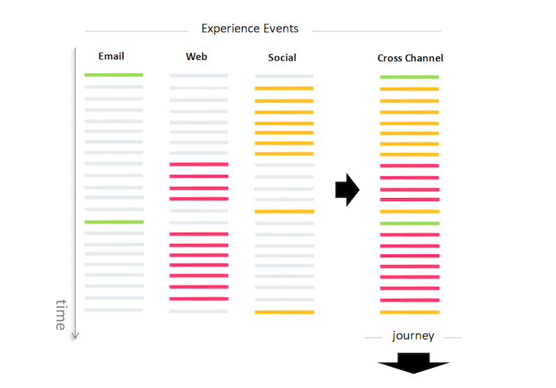

#### Profile

The Profile schema is a single representation of the attributes of both identified and partially-identified subjects. Profiles that are highly identified may be used for personal communications or highly targeted engagements, and can contain detailed personal information such as name, gender, date of birth, location, and contact information like phone number and email address. 

Less-identified profiles may consist of only anonymous behavioral signals, such as browser cookies. In that case, the sparse profile data is used to build an information base into which the interests and preferences of the anonymous profile are collated and stored (by the Unified Profile Service). These identifiers may become more detailed over time as the subject signs up for notifications, subscriptions, purchases, etc. This increase in profile attributes may eventually result in an identified subject which allows for a higher degree of targeted engagement. 

## Schema Registry

The Schema Registry is used to access the Schema Library, providing a User Interface (the Data Model workspace, outlined below) and a RESTful API from which all available schemas are discoverable.

Using API calls and/or the Data Model workspace, you are able to view, manage, and extend all schemas made available to you by Adobe, platform partners, and vendors whose applications you use. The Schema Registry also allows you to use API calls in order to view and create custom schemas.

For more information on using the Schema Registry, see the [Adobe Cloud Platform: Schema Registry Development Guide](../acp_schema_registry/acp_schema_registry.md).

## Data Model Workspace

The Data Model workspace provides a visualization of the Schema Library allowing you to view all of the schemas available on the platform, as well as perform Schema Registry actions such as extending an existing schema and creating a new one. 

Once you log in to Adobe Cloud Platform, click on Data Model in the top navigation and you will be taken to the Data Model workspace. You will then see a list of schemas, aka the Schema Library, where you can view, manage, and extend all available schemas as required.

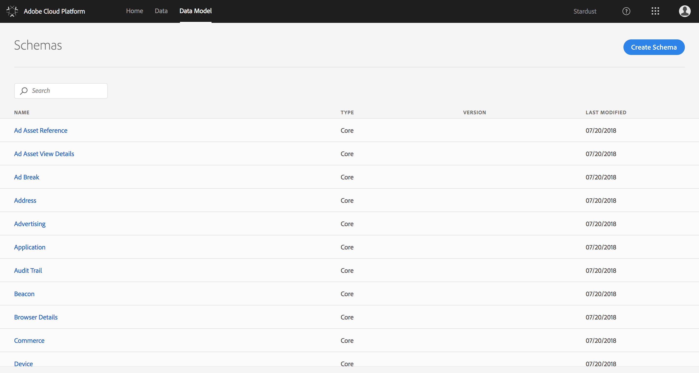

### Viewing a Schema

Viewing a schema from within the Schema Library is as simple as clicking on the schema name in the Data Model workspace. Once clicked, the schema will be displayed in the workspace on the right, including all of the fields and field types.

A Field containing a reference to another schema (for example, "person") will display a Type consisting of the name of the schema on which it is based ("Person"). In the example below, the fields homeAddress and workAddress both have a field type of Address because they are both referencing the standard schema, Address.

Mousing over a schema will display a blue line showing the relationship between that schema and others it references. For example, the Person reference schema has a field called "name" with a type "Person Name"; the blue line from Profile to Person, and from Person to Person Name, highlight the references being made between them.

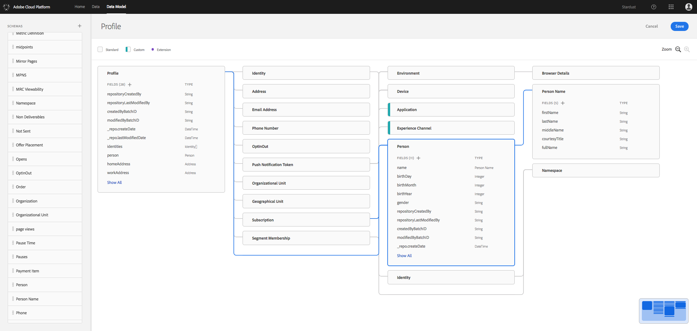

### Creating a Schema

From the Data Model Workspace, clicking the Create Schema button will allow you to begin creating your own schema from scratch.

After giving the new schema a name, you will see it in the workspace with a colored strip on the side indicating it is a Custom schema. The list of fields will be blank, but you can use the plus sign (+) to add new fields and references.

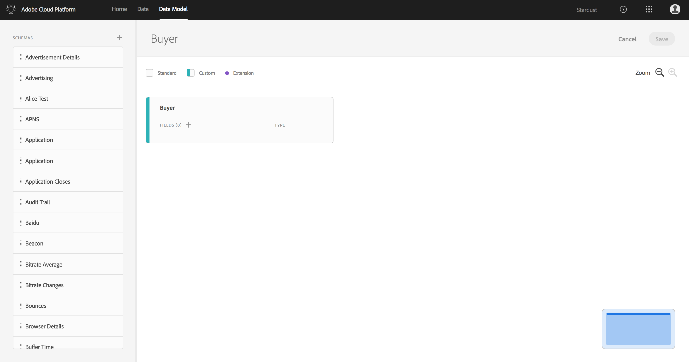

### Adding a Field

In the [Schema Design Principles and Best Practices](../xdm_schema_design_principles/schema_principles.md) example, we created a custom Buyer schema with several fields.

To add a field to the Buyer schema, click the plus sign (+) next to FIELDS to open the Add Field dialog.

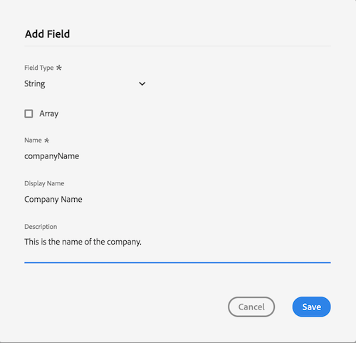

The Buyer schema will now have a field named "companyName" with type "string".

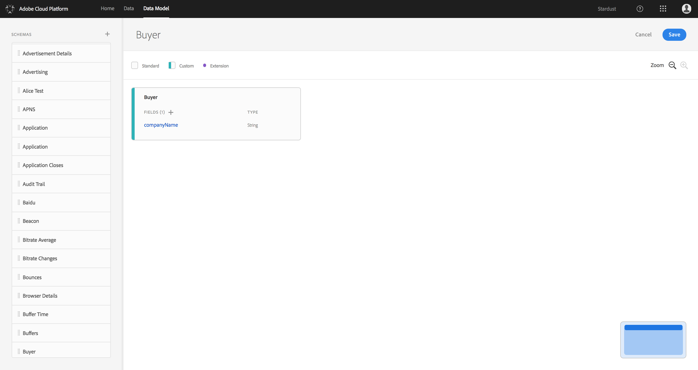

### Adding a Reference to a Reference Schema

The [Schema Design Principles and Best Practices](../xdm_schema_design_principles/schema_principles.md) example also included our Buyer schema referencing Person and several other reference schemas. 

To use reference schemas in the Data Model workspace, click the plus sign next to fields to open the Add Field dialog again. Using the Field Type dropdown, select "Schema" and search the Schema dropdown by typing "person" to select the Person standard schema. 

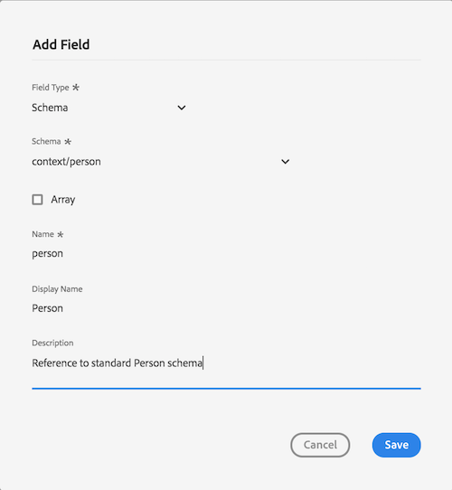

Once added, you will see a new field under Buyer named "person" with a type "Person" (Remember, if the Field references a schema, its Type is the name of the reference schema). The Person schema is now displayed in the workspace, along with a reference to Person Name, as the Person Name schema is referenced within Person.

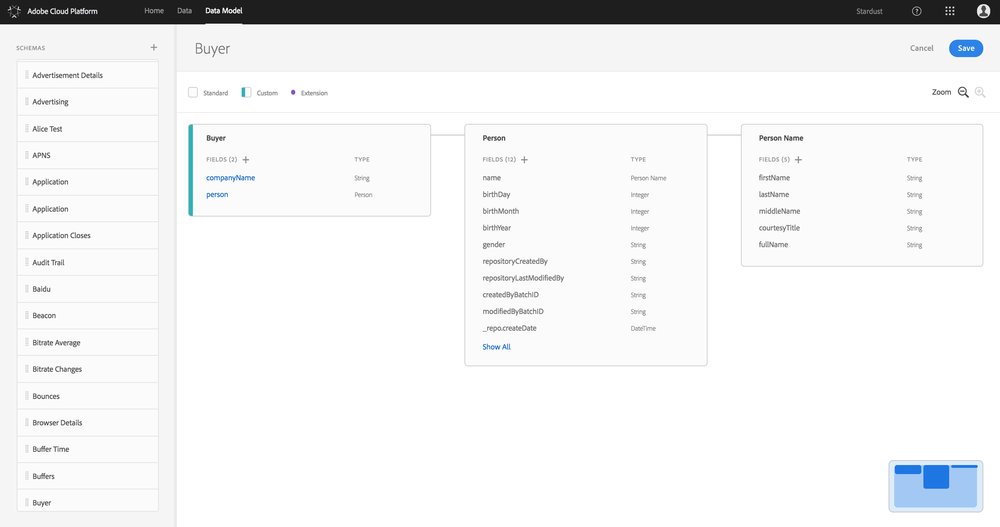

Using the same steps as above, you can now add references to the Phone Number, Email Address, and Address reference schemas. 

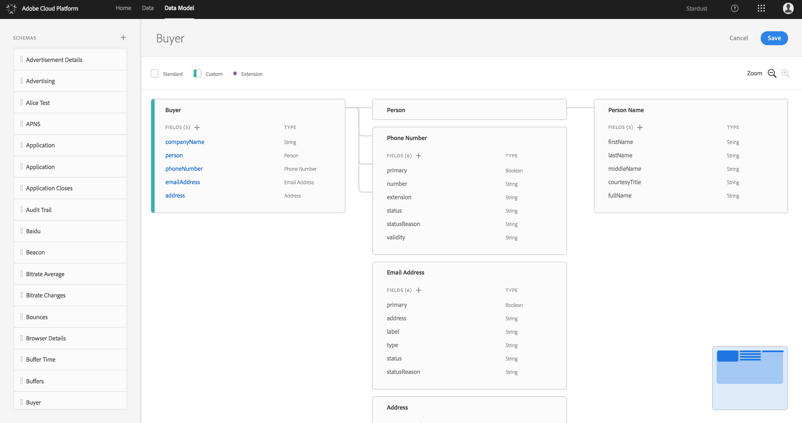

**Note:** The Person schema has been minimized (you can minimize a schema by clicking on the schema name) in order to show the other reference schemas.

### Extensibility

A wide assortment of standard schemas are available to you within platform, but there will be times when you need to express non-standard data unique to your organization. In order to accommodate this need, library schemas are extensible, meaning that you can add custom fields for personalized data.

These extended fields are injected into the base schema, allowing any application that can consume the original schema to be able to understand the new, extended schema.

#### When to Create a New Schema vs When to Extend an Existing Library Schema

Occasionally you may find that it is better to define a new schema from scratch, rather than extending an existing schema. Below is a table outlining basic guidelines for when to extend an existing library schema vs when to create a new  schema. 

|Extend Library Schema|Create Custom Schema|
|---------------------|--------------------|
|Add a field for a specific use case| Define a concept to be reused across multiple schemas|
|Existing schema maintains its meaning after extension| Extension changes the meaning of the schema or negates current usage of the schema|
|Add a few new fields to define custom data | Extend a majority of fields in existing schema|
|Continue to use majority of existing schema fields| Use only part of existing schema and the fields you are using have less value in overall definition|

### Extending a Schema

The [Schema Design Principles](../xdm_schema_design_principles/schema_principles.md) example also involved extending the Person schema to include a custom "Interests" field. 

To do this, simply click the plus sign under Person to add a new field. Since the Interests field contains a list of possible options, also known as an array of strings, you will need to select the Field Type "String" and check the box next to Array.

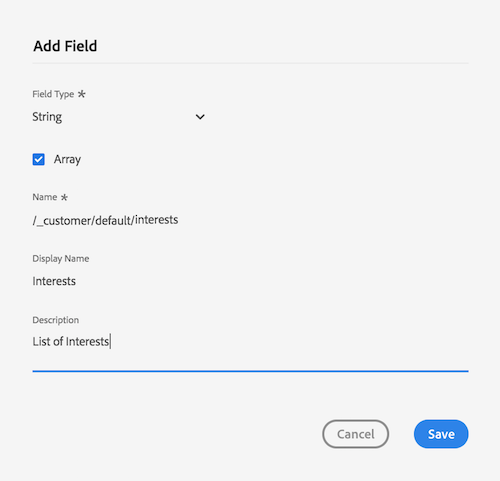

You will now see the Interests field under Person with a type of "String[]", indicating an array of strings. There is also a dot next to the field name, denoting that it is an extension.

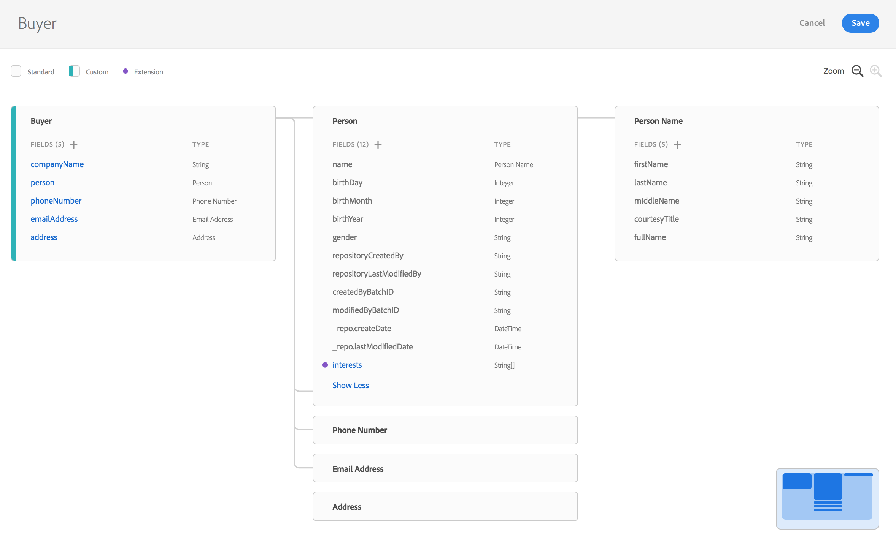

Once you click the Save button to save your custom Buyer schema, you will be able to use it within Adobe Cloud Platform as you would any other schema.

You have now successfully extended an existing schema and defined a new schema to represent your specific use case. From here, you can use schemas to define datasets and datastreams using Data Catalog, and start loading data into these schemas.

