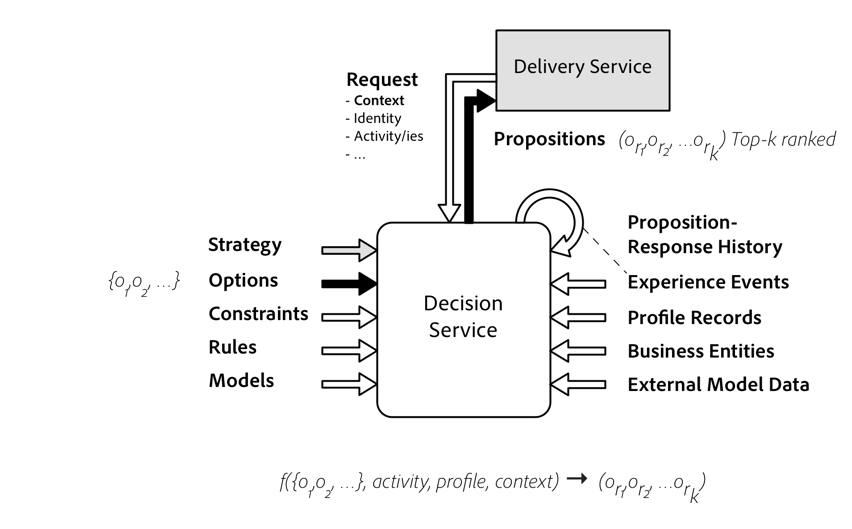
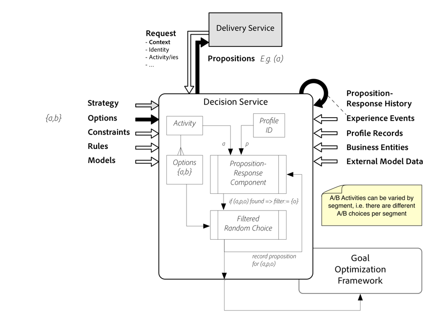

# Adobe Experience Decisioning
Experience Decisioning is the capability to create personalized, optimized, and orchestrated experiences in applications running on the Experience Platform. Experience Decisioning allows a marketer to select the next-best-action from a set of available choices, including 

* Intelligent product recommendations for up-sell opportunities
* Delivering content during the web experience 
* Filtering conversation scripts for the Next Best Conversation use case 
* Employing Offers or Actions to take, also referred to as NBXs (Next Best Xs).

With Experience Decisioning, applications and services can reuse business logic and share a catalog of decision options across channels. The end-to-end customer experience is no longer disjointed treatments served by independent applications or business functions, but rather orchestrated responses across the Adobe Experience Platform using its inherently coordinated data integration and workflow features.

Instead of managing decision options and the strategies for selecting them deep inside of an application, those options and strategies can now be leveraged regardless of when, how, and on which channel a user interacts with a business or organization. 

## Multi-channel Marketing

All experiences need to be considered together. Every phase of the long lifecycle for an end user needs to be factored in. Every channel needs to participate to contribute to the next-best-option in the end user’s journey and to deliver an intelligent, integrated experience in context with customer expectations. This is the domain of Experience Decisioning and Experience Optimization.

Previously, customers started to personalize and optimize their user’s experiences within a single channel across a small set of experience touchpoints, such as: Collecting data from the home page of a business’s web site, triggering the checkout workflow event from a commerce application, or the welcome experience after signing up for a new service. Those optimizations are focused on a single and typically short phase of the user’s journey. 

However, those efforts can be counterproductive when end users demand that the business or organization has a holistic understanding of her current needs and adapts to all experiences the user had, good or bad.  

For example, when the user just got off the phone with a representative to complain about an experience she had the right option likely is to simply pause an – otherwise sophisticated and appropriate – marketing campaign on the home page. Out-of-touch treatments of end users are no longer acceptable.   

Other terms used by products and services aiming to serve similar use cases:
* RTIM - Real-Time Interaction Management
* Journey Management
* Omni-channel marketing and personalization
* Real-time Decisioning 

## Offer Decisioning as a special kind of decisioning 
A special case of Experience Decisioning is Offer Decisioning (Next Best Offer selection). In the Offer Management domain, the decision options are characterized by the content attached to the option. In that domain, there is typically a large set of options to decide upon, created by different departments of the organization or by partners. These options are added and removed constantly.  

Those offers (options) are placed into larger experiences by an application that is delivering the end-user experience. The application relies on Offer Decisioning to consider the many interactions an end-user had, including with other channels and applications.  For instance, an email management application should be able to rely on Offer Decisioning to select the next best offer in a weekly newsletter based on the browsing history on the website.  

Offers have other interesting properties. Frequently, there is a clearly defined date and time when the offer meant to valid and by when the offer needs to be invalidated. 

Furthermore, offers frequently have an association with actual goods or services delivered and there is a cost calculation involved. An organization needs to be able to limit the resources that are being offered. The opposite side of the cost is the predicted value of an accepted offer to the organization. Cost, likelihood of acceptance and predicted value is used to rank the offers.. 

Lastly, offers decisions are decisions whose attraction deteriorates with the frequency they are proposed. 

Offer decisioning has significant similarities with ad tech services but the options are delivered via owned channels. 

Offer Decisioning allows an organization to formalize and centrally manage the rules and predictions used for engaging end users with product and service offers. The decision can happen in real-time when the user interacts via an inbound channel or in batch by preparing an individual message delivered through an outbound channel. It takes DMP and CDP systems further by allowing an organization to act directly on the records collected in those platforms (Direct Activation).

## What is a Decision Strategy? 
Decisions can be made in many ways. One approach is to eliminate options successively until either only one is left or a winner is randomly picked from the reduced set. A variant of this approach is to rank the remaining options using a function. For the Offer Decisioning use case, that function would calculate the cost, the value of the offer to the business and the likelihood that the offer is accepted by the end user. The resulting score would be used to rank the offers.  

Generalizing this approach to other use cases, the outcome of each option is predicted using data collected from prior interactions with similar customers who were proposed similar options. The options with the highest predicted outcome value is selected.

There are a seemingly infinite number of ways to come up with the “best” option. Each of those arrangements of steps can be called a Decision Strategy. The decision strategy is tuned for the use case it is serving. Each strategy has one or more steps which can be connected in a linear or parallel fashion. The steps or components from an arsenal of available components are most applicable for a given use case, determining the decision strategy for that use case.  

In a following section, the Decision Strategy for the Offer Management use case will be explained in detail. To describe any strategy, it is beneficial to first introduce some terminology. 

### Option = Choice = Alternative but doesn't equal Proposition
Decisions in our domain are made by identifying the best option from a set of available options. Choices is simply another term for Options and so is Alternatives.

The selection happens by applying a set of rules and calculations to the option's properties while simultaneously taking values of context parameters as their inputs. The number of options can be large (in the magnitude of 1000 to 10000) and options can be added or removed from the set at any given time without changing the decision strategy.

What differentiates an Option from a Proposition, however, is that the latter is a concrete selection that was made in response to an actual decision Request. Therefore, a proposition has an identifier, a reference to the selected Option(s) and can record as much of the context data that was used in making the decision. Having an identifier gives a proposition the quality of an entity and propositions can be referenced from other entities. Adding the timestamp when the decision was made, i.e. when the proposition was created combined with the immutability of the proposition results in a Decision Event. A Decision Event is a recorded occurrence of the action of executing the decision strategy that happened in the past.

### Finite set of Options 
In the Experience Decisioning domain, the options to be selected exist a priori, i.e. making a decision request does not create new options on the fly. We say the domain of options is finite at the time the decisions are made. This might seem like a limitation, but a finite domain of options gives rise to the possibility of using supervised machine learning algorithms and similar techniques to decide which of the options is “the best one”. Those techniques would not be able to produce the best option amongst a set of possibly infinite alternatives. 

### Strategy: An Algorithm to select the best (optimal) Option 
With a finite set of alternatives to choose from each decision strategy is essentially a algorithm or a function that takes n Options as input and produces an ordered list of Options whereby the first Option in the list is considered the best one according to an optimization criteria, the second option in the result list is then considered the second best option and so forth. 

In Experience Decisioning, the algorithm or function to produce the list of best Options is not fixed. Rather, the sequence of components in which they are invoked and how one component’s output is used as the input for another component is changeable. Each component is an actor and the algorithm is not modeled as a series of instructions happening in a specific order (control flow). A decision strategy emphasizes the movement of data and models programs as a series of connections. Explicitly defined inputs and outputs connect components, which run as soon as all its inputs become valid (data flow paradigm). 

This is best illustrated by an example. The use case shall be an A/B decision. The use case is a bit more complex in the real world but it only needs an illustration for a very simple decisioning strategy. 

The strategy for this decision can be defined as follows:

* Define the KPIs: Start with a Business Objective, then drive concrete measurable business goals. Next decide which KPIs are measurable and serve as proxy measures for the goal. For instance, if the goal is to increase the time or frequency a user engages with tutorial content then the KPI Experience Event with type "open" is one of the direct proxies for the goal. The goal planning is necessary but not part of assembling the decision activity. However, defining an Experience Event that uses the propositions from the decision is part of any decision strategy design.

* Determine two or more options {a, b} that the decision activity will pick from and assign them to the activity
  
* Skip defining any additional eligibility constraints for profiles
* Define one rule at the Activity level. If profile exists in proposition-response history, then select the same proposition else randomly select from the set {a, b}. Use Proposition Response History as an entity for the activity rule.
* No models are used to select the options because they are not ranked against each other in this simplified decision strategy.
* Each proposition is automatically recorded when the proposition-response component is used.
* Experience Events collected for measuring KPIs do not affect the decision right away but will be used when analyzing the outcomes of the experiment.

After the decision activity ran its course, query against the collected experience events will determine if a or b as the optimal choice. This will depend on percentage the goal's experience event was observed. Further segmentation of the profile attributes or other experience events will provide more insight about the strengths of correlations that are discovered by this activity

### Activities 
Let's formalize the concept of a Decision Activity a little more.
Activities control the algorithm, parameters, and the overall strategy, including the constraints applied to the options and ranking function.

Does not define the audience eligibility rules but defines the extend of the options to be considered. 

Activities can specify the place into which the experience is delivered. This reduces the number of options that can be considered in that place to those that have content meeting the placement constraint. This is evaluated in the early stages of the decision strategy; it is one of the constraint satisfaction components that   

### Context data and the special context Profile 
Experience context: web page context, campaign email context, call center interaction context.

Experience context has business entities such as the product placed into the shopping card, prior or current experience events such as the user just placed something in the cart and profile data, the user is female and lives in Florida.
  

### Option -> Proposition -> Outcome 
two stage of optimization and why the first stage (proposition) always has a predictive element for the second stage (outcome). The outcomes may not be achieved in one step, with the next experience event so it is important to reference the propositions through a series of experience events so that the context of the proposition is not lost.

### Proposition-Response History or the provenance 
No matter what decision strategy is used the propositions can be recorded in a uniform way. If a customer wants to plug in their own decisioning engine, the Proposition-Response history can still be used to record the proposed options and then the experience events that follow from those propositions.

This approach can also be used to inform a different decision strategy because the proposition response history becomes an entity that is available to all. For instance, Segmentation can be performed based on this entity, models could be trained that predict the acceptance of a proposition or customer insights can be gained through analytics.

Vice versa, a customer can access the proposition response history for their own actions and applications. It is described as an XDM Entity with a schema that is extensible by the customer.

The Proposition-Response history is intertwined with the end-user journey at every stage. If the journey is a time-series of experience events, then a decision event can proceed any given experience event and the proposition can carry though a sequence of follow-on events until a particular event is observed. 

The proposition becomes part of the conversation that is unfolding between the organization and the end user. At any given point of the time-series of experience events a different Next Best Action may be proposed and that new proposition is attached to follow-on events. That proposition of a new Next Best Action does not need to cancel out the prior proposition. Instead conversions (as series of follow-on events) may run in parallel. 

### Anatomy of a decision strategy
Set oriented, multiple steps, two basic types of steps: constraining and ranking.

### Steps equals Components 
Steps are a class of components. They make up the active, algorithmic part of the decision strategy.

Predicate expression-based steps: Rule sets, Constraining with Boolean expressions, Ranking with numeric expressions -> calculate a score.

Prediction-based steps: ML models, Constraining with scoring and thresholds, Ranking with ranking algorithms, 
  

## Decisioning strategy used for Offer Management use case
* Offer domain: Content centric, i.e. the options called Offers have content representations attached 

* Multi-channel. Placement constraint, need to remove offers that cannot provide content suitable for the placement  

* Large number of options in central repository. Topical selection needed, can be evaluated at activation time

* Constraints based: Calendar, Eligibility, Cost or Resource availability (global), Fatigue (an offer proposition does not get better over time even if it is still ranked highest)
* Ranking options

* Per Activity Strategy is set based, not item based -> avoid sequential loops on items within activity, attempt to process options at the same time until they are disqualified, scalability (other decision strategies may prefer different approach).
* Event processing per activity is attempted parallel, can evaluate eligibility for single profile at once, independent of activity.
* Narrow options (offers) until constraints are evaluated then rank, then optimize the across multiple activities (de-duplication & avoidance of fallbacks) while evaluating capping constraints at the same time

###  Other use cases and their potential decisioning strategies
