# Data Usage Labeling and Enforcement (DULE) User Guide

## Overview

Adobe Experience Platform brings data from multiple enterprise systems together to better allow marketers to identify, understand, and engage customers. Experience Platform includes end-to-end data governance infrastructure to ensure the proper use of data within Platform and when being shared between systems.

Reading this guide will help you answer the following questions:

* What is Data Governance?
* What is Data Usage Labeling and Enforcement (DULE)?
* What are Data Labels, and how are they applied, modified, and deleted?

## Data Governance

Data governance is a series of strategies and technologies used to manage customer data and ensure compliance with regulations, restrictions, and policies applicable to data use. It plays a key role within Experience Platform at various levels, including cataloging, data lineage, data usage labeling, data access policies, and access control on data for marketing actions.

Getting started with data governance requires a strong understanding of the regulations, contractual obligations, and corporate policies that apply to your customer data. From there, data can be classified by applying the appropriate data usage labels, and its use can be controlled through the definition of data usage policies. 

### Data Governance Roles

Data governance is neither automatic, nor does it occur in a vacuum. What began as a role for one individual, typically recognized as a _**data steward**_, has grown considerably as the data governance ecosystem has expanded. Today, data governance requires continual management and monitoring in order to be successful, and relies on data stewards having tools with which data can be properly labeled, usage policies can be created, and compliance with those policies can be enforced.

While data governance should be the responsibility of every individual in the organization, here are some of the essential roles within the data governance cycle:

#### Data Steward

Data stewards are the heart of data governance.  This role is responsible for interpreting regulations, contractual restrictions, and policies, and applying them directly to the data. Informed by their understanding of these regulations, restrictions, and policies, the role of a data steward includes:
* Reviewing data, datasets, and data samples to apply and manage metadata DULE labeling.
* Creating data policies and applying them to a data connection, dataset, or field.
* Communicating data policies to the organization.

#### Marketer

Marketers are the end point of data governance. They request data from the data governance infrastructure created by data stewards, scientists, and engineers.  Marketers encompass a number of different specialties under the marketing umbrella, including the following:
* Marketing Analysts request data to enable understanding of customers, both as individuals and in groups (also known as segments).
* Marketing Specialists and Experience Designers use data to design new customer experiences. 

## Data Usage Labeling and Enforcement (DULE)

The Data Usage Labeling and Enforcement (DULE) framework simplifies and streamlines the process of categorizing data and creating data usage policies. Once data labels have been applied and data usage policies are in place, marketing actions requiring data can immediately be evaluated to ensure the correct use of data.

There are three key elements to the DULE framework: Labels, Policies, and Enforcement.

1. **Labels:** Classify data that reflects privacy-related considerations and contractual conditions to be compliant with regulations and organization policies.
2. **Policies:** Describe how and by whom data can be accessed, and what kinds of marketing actions are allowed or not allowed on specific data.
3. **Enforcement:** Uses the policy framework to advise and enforce policies across different data access patterns. 

### Data Usage Labels

Adobe Experience Platform includes infrastructure for data governance with DULE labeling at its core.  DULE features enable data stewards to apply data usage labels to connections, datasets, and fields to categorize them according to the type of data usage policies applied.

Applying labels allows you to categorize data to ensure compliance with regulations and corporate policies. The DULE framework includes predefined data usage labels that can be used to categorize data in four ways:

* **Contractual Data Labels:** Label and categorize data that has contractual obligations or is related to customer data governance policies. 
* **Identity Data Labels:** Label and categorize data that can identify or contact a specific person.
* **Sensitive Data Labels:** Label and categorize data related to sensitive data such as geographic data.
* **GDPR Data Labels:** Label and categorize data that may contain personal identifiers for use in GDPR access and or delete requests.

### When to Apply Data Labels

Data usage labels can be applied at three levels, and are inherited down from connections to datasets and fields, and from datasets to fields. This means that data usage labels applied at the connection level are propagated to all datasets and fields in the connection, while labels applied to datasets are propagated to all fields in the dataset. Labels can also be applied directly to individual fields (column headers) in a dataset, without propagation.

Labels can be applied at any time, providing flexibility in how you choose to govern data. Best practice encourages labeling data as soon as it is ingested into Experience Platform, or as soon as data becomes available in Platform.

### Supported Data Usage Labels

Experience Platform currently supports the following data usage labels:

**Contractual Data:** "C" labels categorize data that has contractual obligations or is related to a data governance policy.

|Label|Definition|
|---|---|
|**C1**|Data can only be exported from Adobe Experience Cloud in an aggregated form without including individual or device identifiers.  _Example: data that originated from social media, such as Facebook or Twitter._  |
|**C2**|Data cannot be exported to a 3rd party. _Example: data that originated from social media and a 3rd party data provider._|
|**C3**|Data cannot be used in conjunction with directly identifiable information. _Example: data sourced from ad networks, ad servers, and 3rd party data providers._ |
|**C4**|Data cannot be used for any targeting, including your organization's own sites and apps. The C4 label is specific to your organization's privacy policy and aligns with ICO cookie categories, such as performance, functionality, and advertising cookies. |
|**C5**|Data cannot be used for targeting on your organization's own sites and apps. The C5 label is specific to your organization's privacy policy and is a subset of the C4 label. It limits targeting on your organization's sites and apps only. Cross-site targeting would be permitted.|
|**C6**|Data cannot be used for cross-site targeting. The C6 label is specific to your organization's privacy policy and is a subset of the C4 label. Despite limiting cross-site targeting, your organization's site and app targeting would be permitted.  The C6 label is roughly similar to ICO advertising cookies.|
|**C7**|Data cannot be used for performance and optimization of your organization's own website. The C7 label is specific to your organization's privacy policy and is roughly similar to ICO performance and functionality cookies.|
|**C8**|Data cannot be used in Data Science workflows.|

**Identity Data:** “I” labels are used to categorize data that can identify or contact a specific person.

|Label|Definition|
|---|---|
|**I1**| _Directly Identifiable Data:_ Data that can identify or contact a specific person, rather than a device.|
|**I2**|_Indirectly Identifiable Data:_ Data that can be used in combination with any other data to identify or contact a specific person.|

**Sensitive Data:** “S” labels are used to categorize sensitive data such as geographic data.

|Label|Definition|
|---|---|
|**S1**|_Geo-Location Data:_ Data specifying latitude and longitude that can be used to determine the precise location of a device.|
|**S2**|_Geofence Data:_ Data that can be used to determine a broadly defined geofence area.|

## Working with Data Usage Labels in Adobe Experience Platform

The examples below will walk you through the steps necessary to add and edit labels at the Connection, Dataset, and Field level using the Data workspace in Adobe Experience Platform. Each example requires you to have an Adobe ID and access to Adobe Experience Platform.

### Adding Data Usage Labels at the Connection Level
Creating a connection requires login access to the connector. In this example, a connection will be made to Microsoft Dynamics.

1. In Adobe Experience Platform, select the Data workspace from the top navigation.
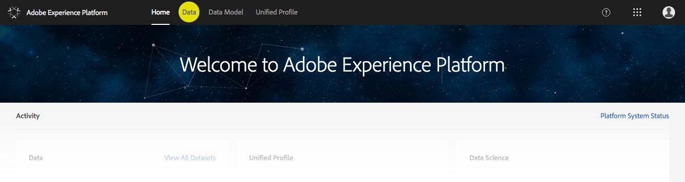
1. From the Data workspace, select the Connections tab. If connections have been made, they will be listed here with Connection Name, Source, and Status.
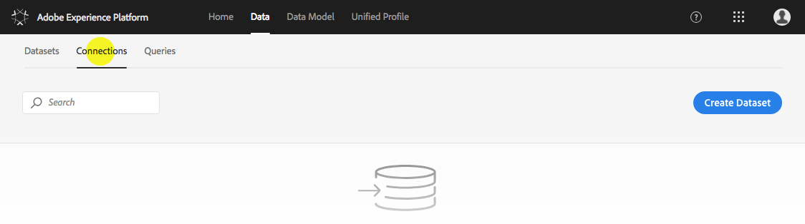
1. To create a new connection, click on the “Create Dataset” button.
1. On the Select Data Source screen, under Adobe Connectors, click the "Create Connection" button for Microsoft Dynamics.
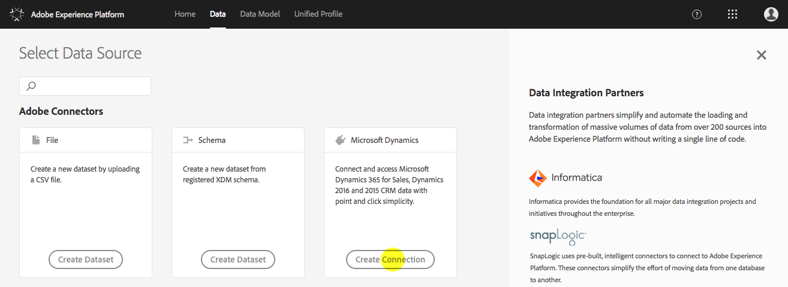
1. Use your Microsoft Dynamics credentials to connect.
1. On the Create Connection screen, under "Configure: Microsoft Dynamics", give the connection a Name (required) and Description (optional), then click the "Add Labels" button to begin adding labels.
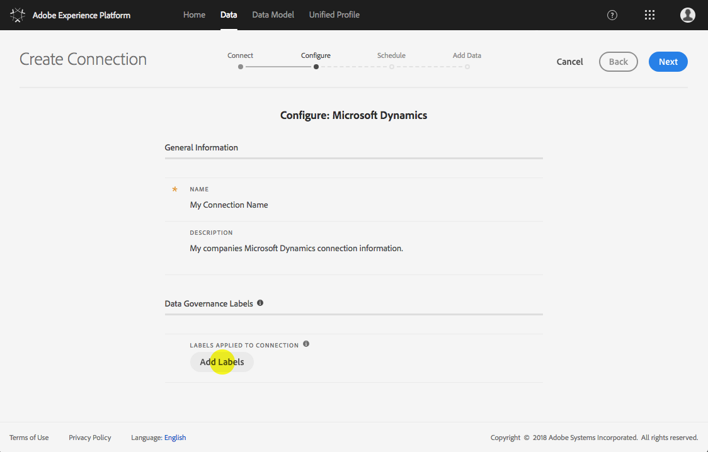
1. In the “Edit Data Labels” dialog, expand each type of label to see all available options. Select the checkbox next to each label that you would like to add. The “Applied Labels” section at the top of the dialog will show any labels that are currently applied, and will update when you save your changes. Once you have finished selecting labels, click the "Save Changes" button. 
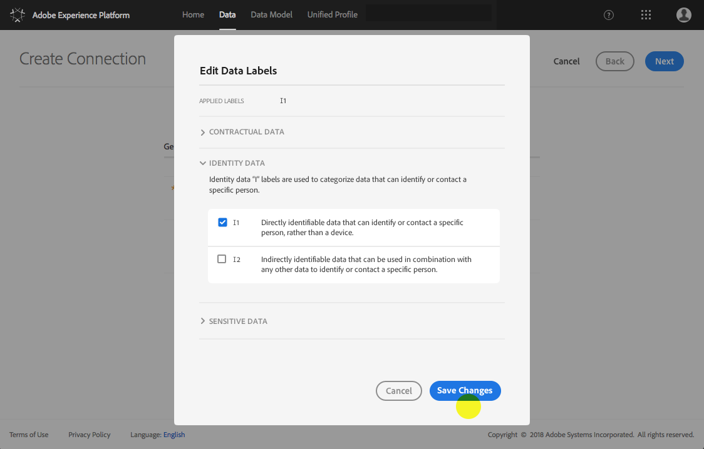
1. The connection labels you selected will now appear on the Data Governance tab within the connection details.
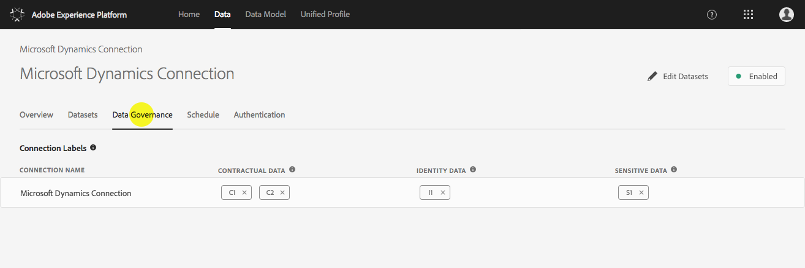

### Editing Data Usage Labels via Connection Details
1. Select the Connections tab in the Data workspace.
1. From the list of connections, click on the name of the connection that you wish to edit.
1. On the connection details page, select the Data Governance tab. All connection labels that have been applied to this connection are visible in the Connection Labels section, beside the connection name.

1. To remove a label, click on the "x" next to the individual label.
1. To add new labels, hover over the connection row and a pencil "edit" icon will appear.
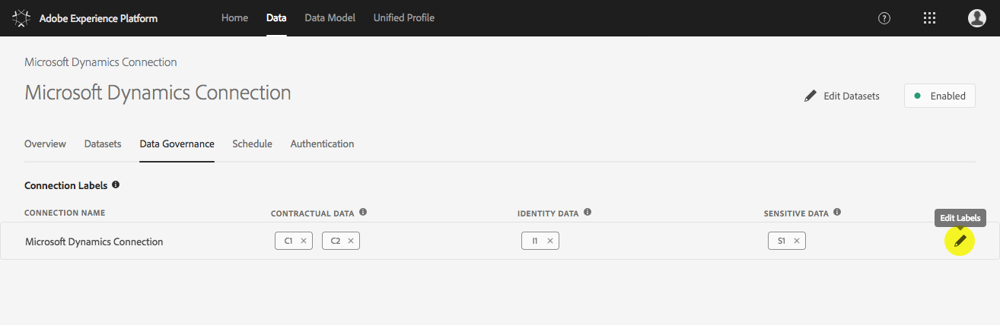
1. Click on the pencil icon to open the "Edit Data Labels" dialog (the same dialog you saw when creating the connection).  
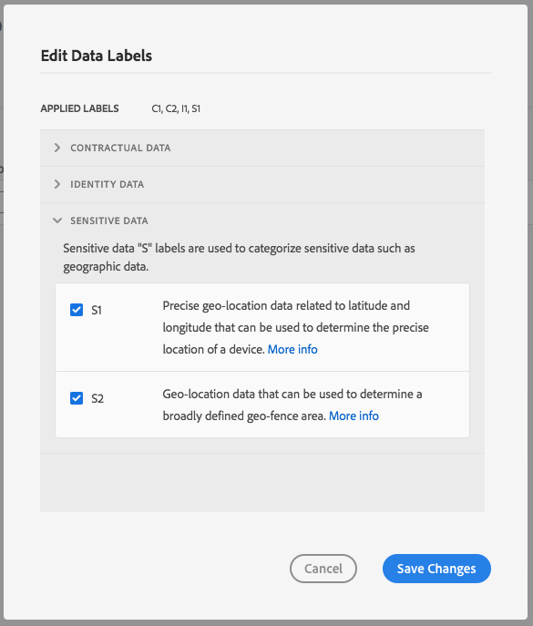
1. Select data labels by checking the checkbox next to each label you wish to use. 
1. Once you have finished selecting data usage labels, click the "Save Changes" button. 
1. You will now see all selected connection labels on the Data Governance tab within the connection details.

### Adding Data Usage Labels at the Dataset Level During Data Ingestion
1. In Adobe Experience Platform, select the Data workspace from the top navigation.
1. From within the Data workspace, select the Dataset tab. If datasets have been created, they will be listed here with Dataset Name, Source, Schema, and Status of Last Batch.
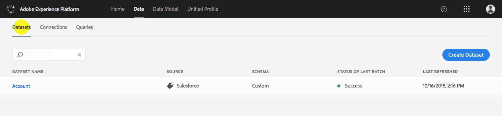
1. To create a new dataset using a file, click on the "Create Dataset" button.
1. On the Select Data Source screen, under Adobe Connectors, click the "Create Dataset" button for File.
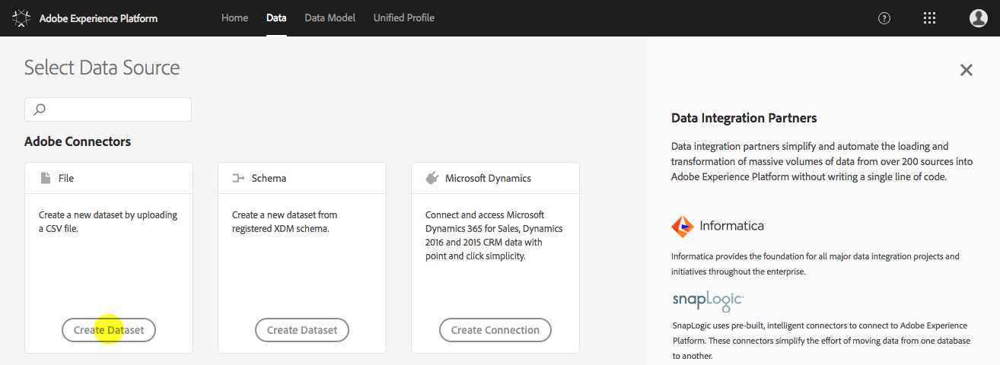
1. Add a Name for the dataset (required) and a Description (optional), then click the "Next" button.
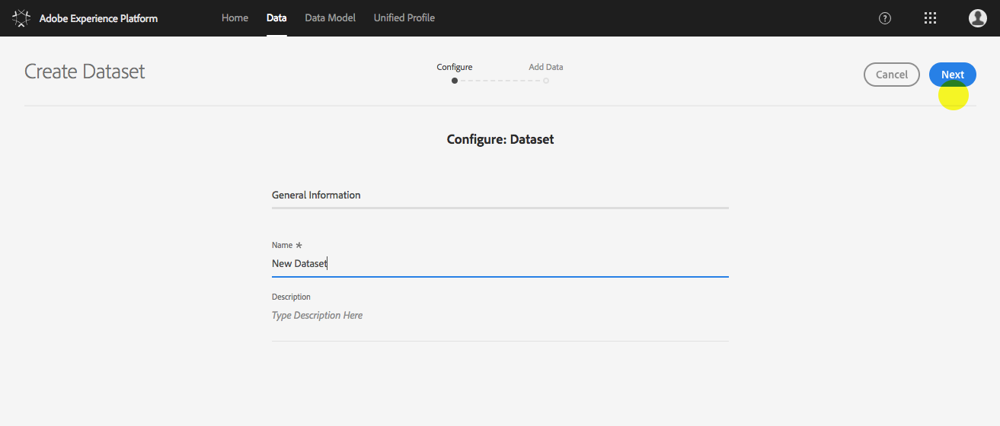
1. You can then drag and drop or browse your computer to find the file you wish to use for your dataset. Adobe Experience Platform accepts CSV files up to 10 GB in size.
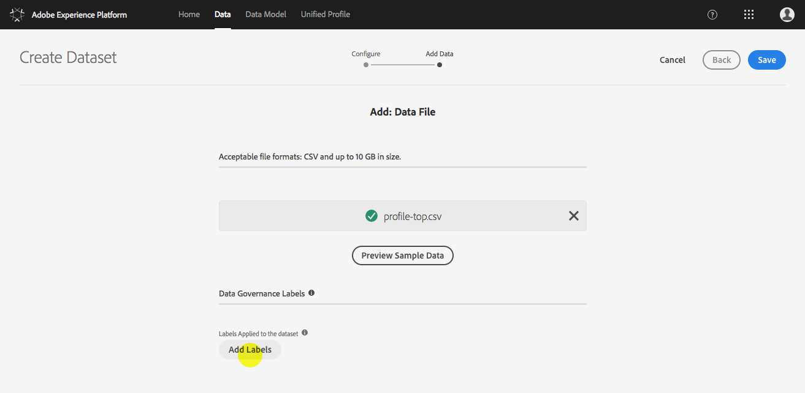
1. Once the data file has been successfully added, the option to add Data Governance Labels will appear. Select "Add Labels" to open the "Edit Data Labels" dialog.
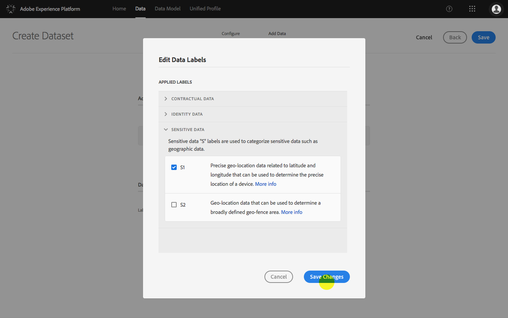
1. Select data labels by checking the checkbox beside each label you wish to use.
1. Once you have finished selecting data usage labels, click the "Save Changes" button. The selected label(s) will appear under "Data Governance Labels" in the Create Dataset screen.
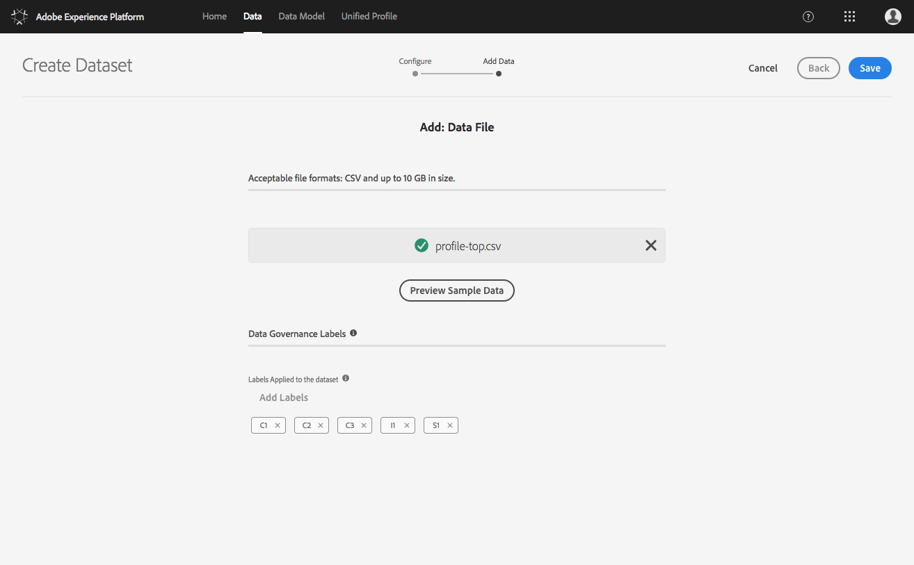
1. Click the "Save" button to save your dataset.

### Editing Data Usage Labels via Dataset Details
1. Select the Datasets tab in the Data workspace.
1. From the list of datasets, click on the name of the dataset you wish to edit.
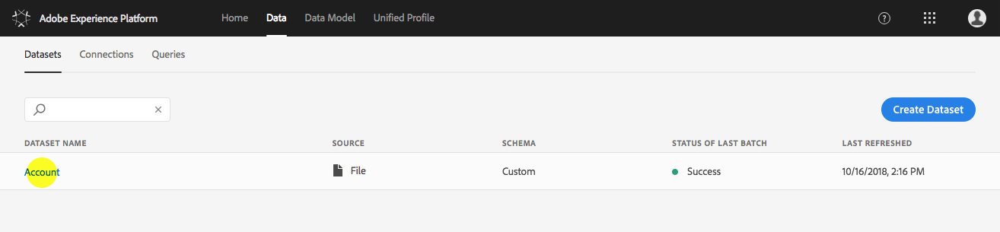
1. On the dataset details page, select the Data Governance tab. 
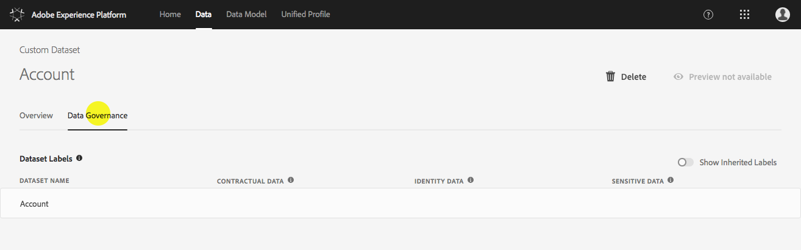
1. In the Dataset Labels section, you will see the Dataset Name as well as any existing data labels. To remove a label, click on the "x" next to the individual label.  
1. To remove multiple labels at once, or add new labels to the dataset, hover over the dataset name and a pencil "edit" icon will appear. 
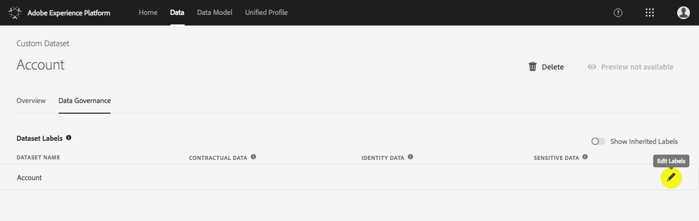
1. Click on the pencil icon to open the "Edit Data Labels" dialog.
1. Select data labels by checking the checkbox next to each label you wish to use. 
1. Once you have finished selecting data usage labels, click the "Save Changes" button. 
1. You should now see all selected dataset labels next to the name of the dataset, within the Dataset Labels section of the Data Governance tab.

**Show Inherited Labels** 

The "Show Inherited Labels" toggle is off by default. If you toggle it on, you will see any inherited labels from the connection-level down to the dataset and fields. These inherited labels will not have an "x" next to them for easy removal, and will be "greyed out" in the Edit Data Labels dialog.

This is because **inherited fields are read only**, meaning they cannot be removed at the dataset or field-level. Labels applied at the connection-level can only be removed by following the [_Editing Data Usage Labels via Connection Details_](#Editing-Data-Usage-Labels-via-Connection-Details) steps outlined above. 

### Adding Data Usage Labels at the Field Level via Dataset Details 

Continuing the workflow above for [_Editing Data Usage Labels via Dataset Details_](#editing-data-usage-labels-via-dataset-details), if the dataset contains data (meaning there is at least one column and one row) you will see a section in the dataset details called Field Labels.  Each column in a dataset is represented by a row in the Field Labels section.  

1. Hover over the field row you wish to edit and a pencil "edit" icon will appear. Alternatively, click the checkbox beside the field name and an "Edit Data Labels" button will appear. To add and edit labels for multiple fields at once, select the "Fields in Dataset" checkbox to select all fields and the "Edit Data Labels" button will appear.
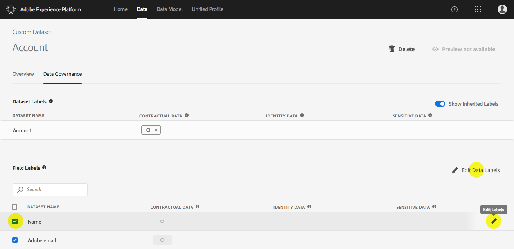
1. Click on the pencil icon (or the "Edit Data Labels" button) to open the "Edit Data Labels" dialog. You will see a list of Selected Fields and Applied Labels at the top of the dialog.
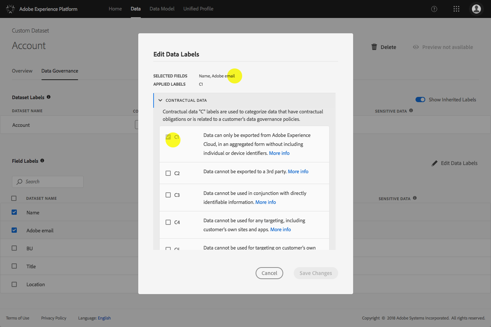
1. Select data labels by checking the checkbox next to each label you wish to use. As noted above, inherited labels are read only, and will be greyed out in the dialog, meaning you will not be able to edit them.
1. Once you have finished selecting data usage labels, click the "Save Changes" button. 
1. You will now see the selected field labels for each Field in the row next to the Field Name. You can repeat these steps to continue adding field-level labels to additional fields.
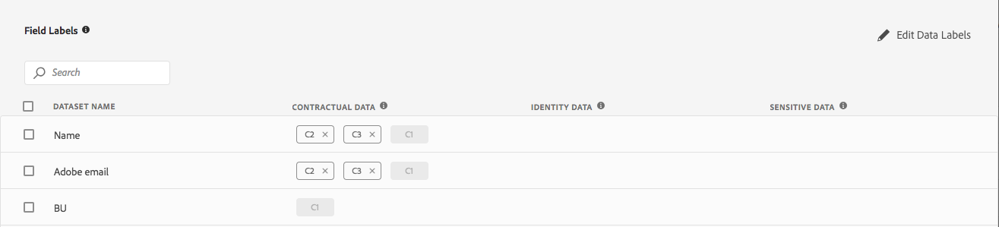

**Note:** It is important to remember that inheritance moves from the top-level down only (Connection → Dataset → Fields), meaning that labels applied at the field-level will not be propagated to other fields or upwards to the dataset or connection.

## Future Releases

Adobe Experience Platform currently supports DULE labeling at three levels: connection, dataset, and field; with full support for inheritance between levels.

Subsequent releases will provide the following features:

- Policy Creation and Management: Create policies with marketing actions and labels.
- Custom Data Usage Labels: Create new labels and definitions based on your organization’s needs.
- Policy Enforcement: Use the policy framework to advise and enforce policies across different data access patterns.
- Auditing: Monitor data access activities and identify and report on compliance issues.

## Appendix: DULE Terminology

|Term|Definition |
|---|---|
|Connection Labels|Connection labels are data governance labels that are applied when setting up or editing a connection. Data governance labels added to a connection are inherited down or applied to all datasets and fields ingested through the connection.| 
|Contractual Data Labels|Contractual data ("C") labels are a type of data governance label used to categorize data that has contractual obligations or is related to an organization's data governance policies.|
|Data Governance|Data governance encompasses the strategies and technologies used to ensure data is in compliance with regulations and organization policies with respect to data usage.|
|Data Steward|The data steward is the person responsible for the management, oversight, and enforcement of an organization's data assets. A data steward also ensures data governance policies are safeguarded and maintained to be compliant with government regulations and organization policies.|
|Data Usage Labels|Data usage labels provide users the ability to classify data that reflects privacy-related considerations and contractual conditions to be compliant with regulations and organization policies. Data governance labels added at a connection-level are inherited down to all datasets and fields ingested through that connection.  Data governance labels can also be applied directly to datasets and fields.|
|Dataset Labels|Dataset labels are data governance labels that are either inherited from a connection or applied directly to a dataset. Labels applied to a dataset are inherited by all fields within the dataset. |
|DULE|DULE is an acronym for "Data Usage Labeling and Enforcement." A key part of data governance, DULE is a collection of features that allows for data usage labeling and applying data access policies for governance needs within an organization.|
|Field Labels|Field labels are data governance labels that are either inherited from a connection or a dataset, or applied directly to a field.  Data governance labels applied to a field are not inherited up to a dataset or connection.|
|Geofence| A geofence is a virtual geographic boundary, defined by GPS or RFID technology, that enables software to trigger a response when a mobile device enters or leaves a particular area.|
|Identity Data Labels|Identity data ("I") labels are data governance labels used to categorize data that can identify or contact a specific person. |
|Policy|A policy in the data governance framework is a rule that describes what kind of marketing actions are allowed or not allowed on specific data.|
|Sensitive Data Labels|Sensitive data ("S") labels are a type of data governance label used to categorize sensitive data, such as geographic data.|

