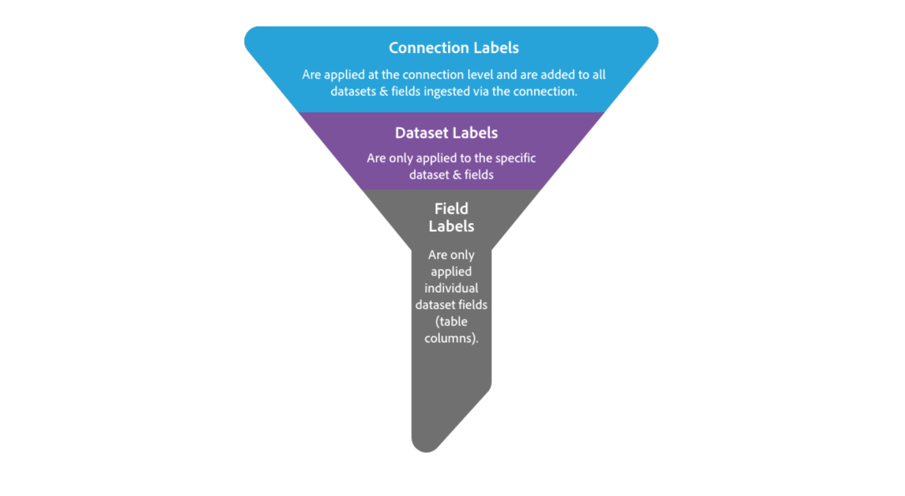

# Data Usage Labeling and Enforcement (DULE) user guide

Adobe Experience Platform allows companies to bring data from multiple enterprise systems together to better allow marketers to identify, understand, and engage customers. Experience Platform includes end-to-end data governance infrastructure to help companies ensure the proper use of data within Platform and when being shared between systems.

This guide provides an overview of the following concepts:

* [Data governance](#data-governance)
* [DULE framework](#dule-framework)
* [Data usage labels](#data-usage-labels) 
* [When and how to apply data usage labels](#when-and-how-to-apply-data-labels)
* [Data usage policies](#data-usage-policies)
* [How to create and work with data usage policies](#how-to-create-and-work-with-data-usage-policies)

At the end of this guide you will find a table outlining key [DULE terminology](#appendix-dule-terminology) with definitions that will assist you when working with data governance concepts.

## Data governance

Data governance is a series of strategies and technologies used to manage customer data and ensure compliance with regulations, restrictions, and policies applicable to data use. It plays a key role within Experience Platform at various levels, including cataloging, data lineage, data usage labeling, data access policies, and access control on data for marketing actions.

Getting started with data governance requires a strong understanding of the regulations, contractual obligations, and corporate policies that apply to your customer data. From there, data can be classified by applying the appropriate data usage labels, and its use can be controlled through the definition of data usage policies. 

### Data governance roles

Data governance is neither automatic, nor does it occur in a vacuum. What began as a role for one individual, typically recognized as a _**data steward**_, has grown considerably as the data governance ecosystem has expanded. Today, data governance requires continual management and monitoring in order to be successful and relies on data stewards having tools with which data can be properly labeled, usage policies can be created, and compliance with those policies can be enforced.

While data governance should be the responsibility of every individual in the organization, here are some of the essential roles within the data governance cycle:

#### Data steward

Data stewards are the heart of data governance. This role is responsible for interpreting regulations, contractual restrictions, and policies, and applying them directly to the data. Informed by their understanding of these regulations, restrictions, and policies, the role of a data steward includes:
* Reviewing data, datasets, and data samples to apply and manage metadata DULE labeling.
* Creating data policies and applying them to a data connection, dataset, or field.
* Communicating data policies to the organization.

#### Marketer

Marketers are the end point of data governance. They request data from the data governance infrastructure created by data stewards, scientists, and engineers. Marketers encompass a number of different specialties under the marketing umbrella, including the following:
* Marketing Analysts request data to enable understanding of customers, both as individuals and in groups (also known as segments).
* Marketing Specialists and Experience Designers use data to design new customer experiences. 

## DULE framework

The Data Usage Labeling and Enforcement (DULE) framework simplifies and streamlines the process of categorizing data and creating data usage policies. Once data labels have been applied and data usage policies are in place, marketing actions can be evaluated to ensure the correct use of data.

There are three key elements to the DULE framework: Labels, Policies, and Enforcement.

1. **Labels:** Classify data that reflects privacy-related considerations and contractual conditions to be compliant with regulations and organization policies.
2. **Policies:** Describe what kind(s) of marketing actions are allowed or not allowed to be taken on specific data.
3. **Enforcement:** Uses the policy framework to advise and enforce policies across different data access patterns. 

## Data usage labels

Experience Platform includes infrastructure that supports data governance with DULE labeling at the core of that infrastructure. DULE features enable data stewards to apply usage labels at the connection-, dataset-, and field-level to categorize the data according to the type of policies that apply.

The DULE framework includes predefined data usage labels that can be used to categorize data in four ways:

* **Contract "C" Data Labels:** Label and categorize data that has contractual obligations or is related to customer data governance policies. 
* **Identity "I" Data Labels:** Label and categorize data that can identify or contact a specific person.
* **Sensitive "S" Data Labels:** Label and categorize data related to sensitive data such as geographic data.
* **GDPR Data Labels:** Label and categorize data that may contain personal identifiers for use in GDPR access and/or delete requests.

See [Supported Data Usage Labels](dule_supported_labels.md) for a complete list of available labels, as well as definitions for each label type.

### When and how to apply data labels

Data usage labels can be applied at three levels. Those data labels are inherited down from connections to datasets and fields, and from datasets to fields. This means that data usage labels applied at the connection level are propagated to all datasets and fields in the connection, while labels applied to datasets are propagated to all fields in the dataset. Labels can also be applied directly to individual fields (column headers) in a dataset, without propagation.

Labels can be applied at any time, providing flexibility in how you choose to govern data. Best practice encourages labeling data as soon as it is ingested into Experience Platform, or as soon as data becomes available in Platform.

Step-by-step instructions for how to apply data usage labels to Connections, Datasets, and Fields using the UI are available in the [Working with Data Usage Labels](../../../api-specification/markdown/narrative/tutorials/dule/dule_working_with_labels.md) tutorial.

## Data usage policies

In order for data usage labels to effectively support data compliance, data usage policies must be implemented. Data usage policies are rules that describe the kinds of marketing actions that you are allowed to, or restricted from, performing on data within Experience Platform.

An example of a marketing action might be the desire to export a dataset to a third-party service. If there is a policy in place saying that specific types of data, such as Personally Identifiable Information (PII), cannot be exported and an "I" label (Identity data) has been applied to the dataset, you will receive a response from the Policy Service telling you that a data usage policy has been violated.

### How to create and work with data usage policies

Once data usage labels have been applied, data stewards can create policies via the DULE Policy Service API.

The Policy Service is a RESTful API that allows data stewards to manage and evaluate policies related to marketing actions being taken on data containing data usage labels.

Within the Policy Service API, all policies and marketing actions are referred to as either `core` or `custom` resources. `Core` resources are defined and maintained by Adobe, whereas `custom` resources are created and maintained by individual customers. The `custom` resources are therefore unique and visible solely to the organization that created them.

The [Working with Data Usage Policies](../../../api-specification/markdown/narrative/tutorials/dule/dule_working_with_policies.md) tutorial walks you through key operations you can perform using the Policy Service API. These include creating and updating policies, determining the status of a policy, and working with marketing actions to evaluate if a specific action violates a data usage policy.

## Future releases

Adobe Experience Platform currently supports DULE labeling at three levels (connection, dataset, and field) with full support for inheritance between levels. Platform also supports the creation and management of data usage policies and marketing actions via the DULE Policy Service API.

Subsequent releases will provide the following features:

* Custom Data Usage Labels: Create new labels and definitions based on your organization’s needs.
* Policy Enforcement: Use the policy framework to advise and enforce policies across different data access patterns.
* Auditing: Monitor data access activities and identify and report on compliance issues.

## Appendix: DULE terminology

|Term|Definition |
|---|---|
|**Connection Labels**|Connection labels are data governance labels that are applied when setting up or editing a connection. Data governance labels added to a connection are inherited down and will be applied to all datasets and fields ingested through the connection.| 
|**Contract Labels**|Contract "C" labels are used to categorize data that has contractual obligations or is related to your organization's data governance policies.|
|**Cross-site Data**|Cross-site data is the combination of data from several sites, including a combination of on-site data and off-site data or a combination of data from several off-site sources.|
|**Data Governance**|Data governance encompasses the strategies and technologies used to ensure data is in compliance with regulations and corporate policies with respect to data usage.|
|**Data Steward**|The data steward is the person responsible for the management, oversight, and enforcement of an organization's data assets. A data steward also ensures data governance policies are safeguarded and maintained to be compliant with government regulations and organization policies.|
|**Data Usage Labels**|Data usage labels provide users the ability to categorize data that reflects privacy-related considerations and contractual conditions to be compliant with regulations and corporate policies.|
|**Dataset Labels**|Dataset labels can inherit labels added via a connection. Edit connection to add, edit or remove dataset labels. Labels can be added to a dataset. Fields will inherit all dataset labels.|
|**DULE**|DULE is an acronym for "Data Usage Labeling and Enforcement." A key part of data governance, DULE is a collection of features that allows for data usage labeling and applying data access policies for governance needs within an organization.|
|**Field Labels**|Field labels are data governance labels that are either inherited from a connection or a dataset, or applied directly to a field.  Data governance labels applied to a field are not inherited up to a dataset or connection.|
|**Geofence**| A geofence is a virtual geographic boundary, defined by GPS or RFID technology, that enables software to trigger a response when a mobile device enters or leaves a particular area.|
|**Identity Labels**|Identity "I" labels are used to categorize data that can identify or contact a specific person.|
|**Interest-based Targeting**|Interest-based targeting, also known as personalization, occurs if the following three conditions are met: data collected on-site is, used to make inferences about a users’ interest, is used in another context, such as on another site or app (off-site) and is used to select which content or ads are served based on those inferences.|
|**Marketing Action**|A marketing action, in the context of the data governance framework, is an action that an Experience Platform data consumer takes, for which there is a need to check for violations of data usage policies|
|**Policy**|In the data governance framework, a policy is a rule that describes what kind of marketing actions are allowed or not allowed to be taken on specific data.|
|**Sensitive Labels**|Sensitive “S” labels are used to categorize data that you, and your organization, consider sensitive.|

