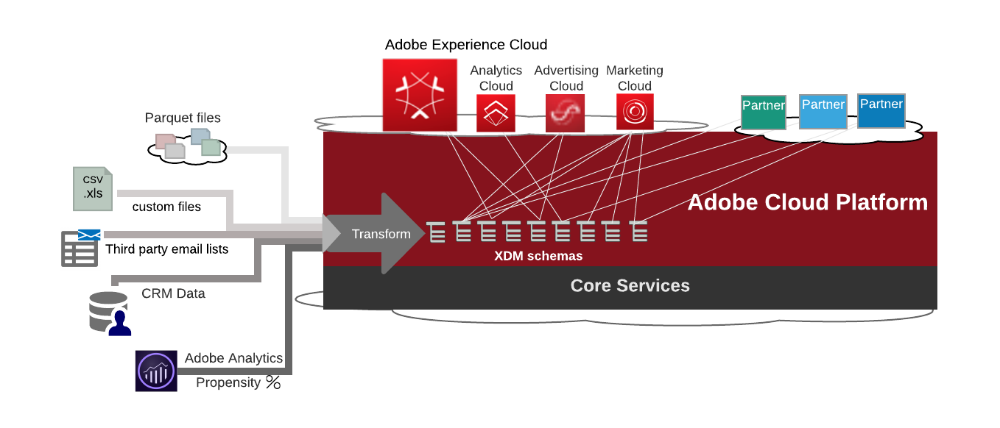
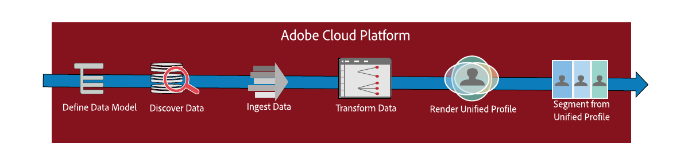
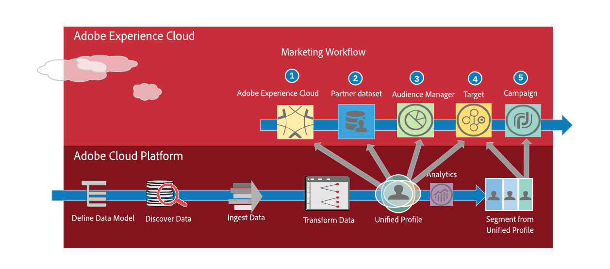
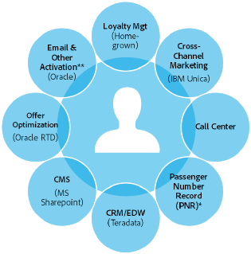
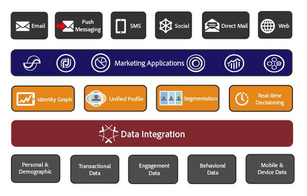
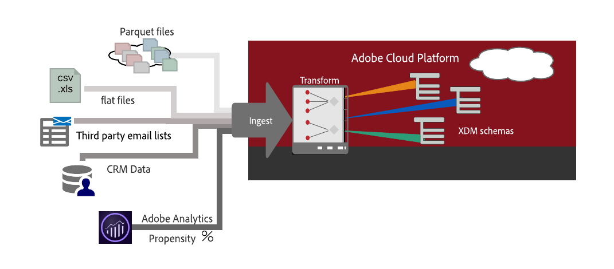
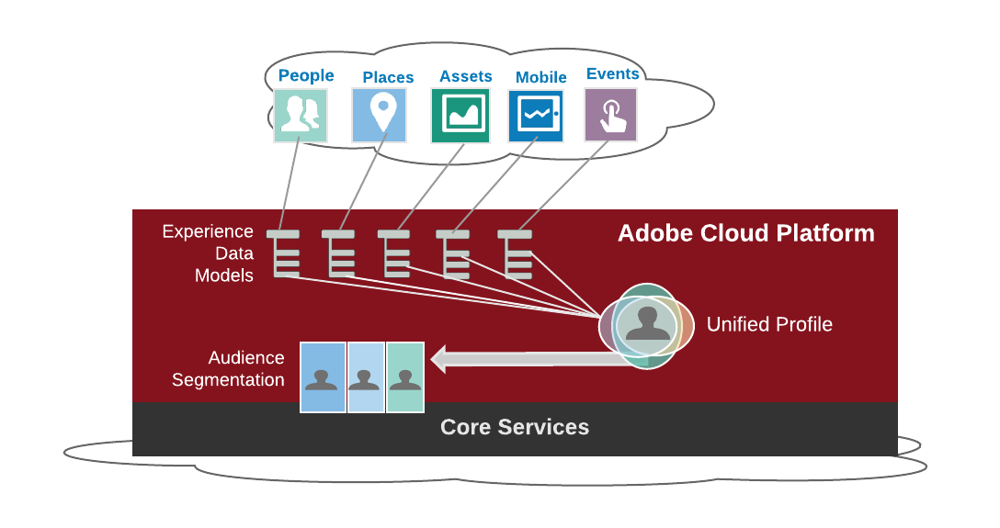
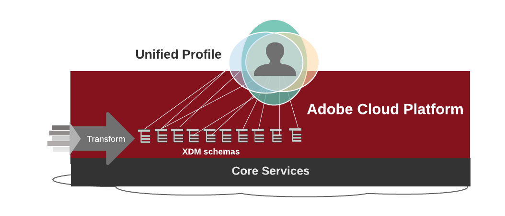

**Adobe Experience Platform**

Building Experiences
=============================

From its core cloud support services to its API-first [link] architecture, integrated components, and easy-to-use digital marketing workshop, Adobe Experience Platform is an infrastructure designed to be built upon. It lets you blend, govern, and enhance your data, and gain intelligence to meet your challenges and customer opportunities. 

Adobe Experience Platform provides core features to ingest diverse data, standardize and blend the data, enrich and cleanse the data, and then share the distilled and now easily-accessible data across Adobe and partner datasets and integrated workflows. 

 

Experience Platform unifies customer data from all types of marketing, sales, and service channels to enable customer data modeling, unified profiling, segmenting, and propensity analysis workflows to design and implement. Distilling and defining diverse data for intelligent insight drives the customer experience for email campaigns, social media call outs, geo-fencing, web analytics, and innovative real-time experiences for your customer.

Real-time Customer Profile ultimately gives context to a customer's profile and associated experiences across devices. With intelligent and comprehensive customer data serving as a trusted source, you can then confidently apply your insights and intelligence across the marketing workflows built on Adobe and partner services and products. 

With integrated and standardized customer data, you can efficiently track customer experiences across multiple channels, segment data in detail, employ real-time decisioning, and apply artificial intelligence everywhere. 

For a quick introduction to Adobe Experience Platform and its services and underlying components, scroll below to the overview section. For additional resources, skip to the hands-on tutorials and other implementation guides and videos to get started. 

## Getting Started

**For marketing teams and business analysts**, the Experience Platform furnishes easy-to-use user interfaces and integrated workflows syncing up campaigns, analytics, audience segmentation, targeting, and integrating solutions of Adobe Experience Cloud [link].

* Go to platform.adobe.com [link] to test drive Adobe Experience Cloud user interface. 
* See First-time Platform Setup to plan and scope your platform implementation.

**For data scientists and data engineers**, the Experience Platform relies on an open, API-first [link] approach supported by Adobe I/O [link] API Gateway and Events [check name], with partners and an open developer community to help build and expand the API infrastructure.

**For implementors and administrators**, here's your guide to set up roles and manage data ingestion.
 
 * Setting up your Account and Administration [link].

### Recipes
* First-time walkthrough [link]
* Segmenting with Real-time Customer Profile [link]

###Resources
* Technical Overview [link]
* Video [link]

## A Complete Customer View
A long-held goal of marketers is to bring together all customer information, experience, and behavior into a single, comprehensive view. The Adobe Experience Platform combines customer profiles, experiences, and behavior for specific learning and analysis to bring together digital, streaming, and off-line data channels, allowing you to derive specific insights and intelligence for your customers using demographics, engagement, behavior, transactional history, and other views.

The Adobe Experience Platform leverages all data to provide insights of the customer experience to drive actions and respond with comprehensive, personalized experiences. The goal is to bring together identifiable and anonymous information and stitch it all together to show the complete customer journey.

- A complete profile of customers to integrate all information across enterprise systems.
- The ability to derive insights using advanced artificial intelligence and machine learning, moving away from constraints of legacy systems.
- Effectively act on insights using analytics, targeting, and other actionable responses to customer needs.
- Provide a bridge between anonymous and authenticated data.

The Adobe Experience Platform allows a 360-degree view to see how customers are engaging with websites, brand, services, devices, and products at any point in time using a consumable format. This allows for all types of interaction.

## Unifying Everything

The Adobe Experience Platform unifies customer data from all types of marketing, sales, and service channels. It enables customer data modeling, unified profiling, segmenting, and analyzing, which in turn drives the customer experience for email campaigns, social media call outs, geo-fencing, and web analytics.

Adobe Experience Platform transforms your data into rich XDM schemas, allowing you to analyze activities and respond to customer insights faster with less cost. It creates a Real-time Customer Profile for each customer, leveraging data from fields across the XDM schemas to define the customer experience and provide unified customer profiles. A Real-time Customer Profile [link] allows you to segment and target to effectively provide a personalized experience for each customer.

## Ingesting and Blending Data
The Adobe Experience Platform unifies customer data from all types of marketing, sales, and service channels. 

Data integration starts with ingesting and streaming datasets from multiple channels: 

* CRM data with personal and demographic information. 
* POS from the and online transactional data. 
* Behavioral data from web. 
* Mobile and integrated device data,
* Streaming data.
*  Data structured in Experience Data Model (XDM) schemas. If you are not sharing XDM structured data, then you can structure it into a standard schema and run common services.

[link to component overview]

### Data Ingestion Connectors and APIs
The Experience Platform provides connectors to CRM and cloud storage data for streaming, uploading, and batch ingestion. 

* Microsoft Dynamics Connector [link]
* Salesforce Connector [link]
* Azure Blob [link]
* Amazon S3 [link]
* Batch files using the Batch Ingestion API [link]
* Streaming Ingestion [link]

[link to component overview]

## The Experience Data Model (XDM)
The Experience Data Model (XDM) provides standard and custom schemas to define data in the Adobe Experience Platform, allowing applications and services to interact seamlessly across data sources and customers. XDM schemas enable integrating data from all Adobe solutions and external sources and lets you re-use datasets for different needs.

XDM handles the large and diverse datasets ingested into the platform, and stores the data sources within and across the many standard XDM schemas. In most cases a standard schema exists for a dataset, but if needed you can build your own custom schema.

The schemas standardizes data for the platform not just for taxonomy but for business logic. For example, an organization may struggle to define and distribute a primary statistic or key performance indicator (KPI) in a standard way. Adding a specific XDM schema to store the unique KPI lets you standardize and distribute the performance indicator.

[link to component overview]

## Real-time Customer Profiles
Structuring your data with semantic content then lets you build a comprehensive profile with rich content, allowing you to segment audiences and respond based on XDM data. 

In the Adobe Experience Platform, you first define your required XDM schemas (standard and custom), and then populate the schemas by ingesting CSV or Parquet files, streaming solution data, and integrating with third-party platform connectors.

[link to component overview]

### Using Real-time Customer Profile example

For example, take the simple use case of Interactive Voice Response (IVR) systems and Call Center management software integrators. Suppliers use the Adobe Experience Platform APIs to ingest historical information of the customer's call center activity in the Experience Data Lake. If the data is ingested in the XDM ExperienceEvent schema, a schema that expresses customer interactions, then these interactions can be ingested into the Unified Profile Service. 

In this example, the *callerId* is used as the customer's identifier. The Indentity Service will take care of identity resolution and assist the Unified Profile Service to add any data points from recent interactions with the Call Center to the customer's profile.

A customer call to the Call Center will first be answered by the IVR. To personalize the message and deliver an offer tailored to the caller, the IVR system contacts the Unified Profile service for a point lookup. The Unified Profile returns the profile attributes that apply just to the call-center interactions, which triggers a personalized response.

### Profile and Identity 
The Adobe Experience Platform includes both Identity Services (IDS) and a comprehensive Unified Profile service. Identity services captures all relevant public identities and associations for a person, and the profile combines attributes of that person, including the identity relationships, to build a Unified Profile.

For example, the Identity Services know that dude@letsroll.com also has an email account at letsgoroll@yahoo.com. The Identity Services will connect the two. When dude@letsroll.com is accessed, the profile services will call the identity services to find out that letsgoroll@yahoo.com is the same person. Then the profile services will merge the two profile fragments and return a Unified Profile.

[link to component overview]

## DULE for GDPR
Data Usage Labeling and Enforcement (DULE) from Adobe lets you to label and manage your data as needed, including compliance with General Data Protection Regulation (GDPR) established in the EU. Data governance encompasses the strategies and technologies used to apply policies and to control access to data, to track changes to datasets, and to ensure data usage is in compliance with regulations, contract terms, and corporate policies.

DULE lets you use DULE to label data based on their governance and compliance needs, and to
set data usage policies for enforcement. 

[link to component overview]

## AI Studio
The emergence of machine learning allows you to derive insights and intelligence from website analytics, off-line consumer and point-of-sale data, CMS data, email responses, back-end systems, and across all cross-channel marketing data. Using machine learning, you can enact policies for real-time decisioning.

[link to component overview]

## ETL Connectors for Partners

ETL integration between Adobe and its partner using the [Adobe Exchange
program](https://partners.adobe.com/exchangeprogram/experiencecloud.html) provides features and employs Adobe Experience Platform components to build a user interface and perform direct ETL ingestion.

[link to component overview]

