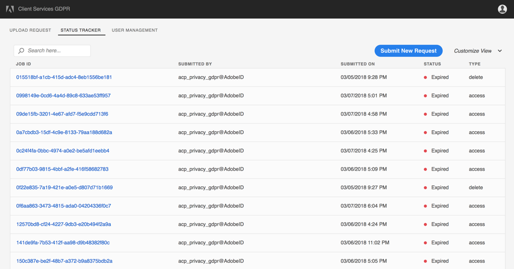

# Interacting with Adobe Experience Platform GDPR Service through the UI

> **NOTE:**  Customers are advised to create fake data for beta testing purposes and to delete that fake data as part of testing.  Use of the GDPR API/UI beta technology with production data is discouraged and at your own risk, as errors or unexpected behavior may occur, including the accidental deletion of production data

## Adobe Experience Platform GDPR Service access

Platform GDPR Service currently supports two types of interactions: direct API, as we explored previously, and a Web UI, which helps simplify the authentication and interaction.

This lab will explore the UI portion of Platform GDPR Service, and help you understand how to best leverage both of these access options in your environment.

## Logging in

Authentication with an Adobe ID is required, and the context of that user will determine what organization the GDPR requests are being made for. The user must have System Administrator privilege within the organization in order to see the link to the Administration tools in the Experience Cloud UI.

Once authenticated, you should see the Experience Cloud shell where you can navigate to other solutions. If you click the product selector in the UI, you should see a link to the administrative tools.

Once in the Administration tools, you will see an option to launch the GDPR UI.

## The User Interface

Currently, the user interface consists of three main screens, the job submission screen, status tracker, and job details page. We will cover each in depth here.

### Job Submission Screen

This simple UI is for uploading JSON requests to the central service. You can either drag and drop a file (well-formatted JSON) or click in the box to bring up a file browser window.

#### Details

- The UI prompts for a **Ticket ID** to be specified, which is primarily for integration into the ticketing systems used by our customers. Populate this field with a ticket ID if you have an internal ticketing system or other tracking code. This field allows you to link the GDPR request, specifically the job ID returned in the API to that specific identifier. Keep in mind that every user in the JSON file will be tagged with this ticket ID.

- **Email to notify** field allows you to submit one or multiple email addresses for notification. By default, the person submitting the request is always included. However, you may change that as needed, and add multiple email addresses. To add additional email addresses – press &lt;TAB&gt; or &lt;ENTER&gt; after each entry to complete each email in the list. The addresses included in this list will receive a copy of any email notifications, which are sent when the job completes, finishes with errors, or times out.

- After gathering the GDPR data from the data subjects and identifying the company contexts and user IDs with associated namespaces, you should have a valid JSON file to drag and drop into the UI. Initially the client-side validation will check the file for well-formed JSON as well as the required fields needed to make a successful request. Please see [Adobe Experience Platform GDPR Service Overview](https://www.adobe.io/apis/cloudplatform/gdpr/docs/alldocs.html#!api-specification/markdown/narrative/gdpr/use-cases/gdpr-api-overview.md) for examples of well-formed GDPR JSON files.

- If the file is accepted and passes client-side validation, you should see the file listed in the UI just below the drag-and-drop window. You may drag additional JSON files into the UI as well if you have more, and each one should be listed if it passes validation. At this point, you may submit the request with the valid JSON where the server-side validation will occur, including permissions for the organization, namespace validation on the user IDs, and more. If successful, a dialog will prompt you to navigate to the Status Tracker.

### Status Tracker

After submitting the file successfully, you may choose to be taken to the Status Tracker screen, where you will be able to view all your submitted jobs. Here, you can see a default view of information related to jobs that have been submitted for your organization.

#### Details

- On the far right, you have the ability to customize your view by selecting columns to show or hide. Any data being shown in the table is searchable using the client-side filtering widget at the top of the table, as detailed below. Some of the columns include:
  - Status: the overall status of the job, compiled from the individual solution statuses that have reported back to the service – either complete, expired, processing, error, or submitted.
  - Type: the type of the request, either an **access** or **delete** request
  - User key: the key associated with the job ID created from your JSON data in the request
  - And more…

- The UI provides the ability to filter on any of the fields by simply typing in the search field. The search is executed against all visible columns, so go ahead and test it out. Experiment with showing and hiding fields and combine it with searching.

- Easily switch back to submit new requests by clicking on the _Submit New Request_ button to the right, or by selecting the tab _Upload Request_ in the top left.

- Each unique job ID is a link to a more detailed description of the job itself, containing updated status values and responses from each Experience Cloud product orchestrated by Platform GDPR Service. If you click on this, it takes you to the third UI screen, the Job Details Page.

### Job Details Page

As mentioned above, navigating from the Status Tracker by clicking on a job ID generates a popup dialog with details about an individual job.

#### Details

- This dialog contains status information about each Experience Cloud solution and its current state in relation to the overall job. As every GDPR job is asynchronous, you can see the latest communication date and time from each solution as well, as some will require more time than others to process the request.

- If a solution has provided any additional data, it will be viewable in this dialog. You can expand the view by clicking on individual product rows and seeing what has been received.

- You also have the ability to download the complete job data as viewed in this dialog as a .CSV file. Click on the download button and feel free to open the file to examine its contents.
