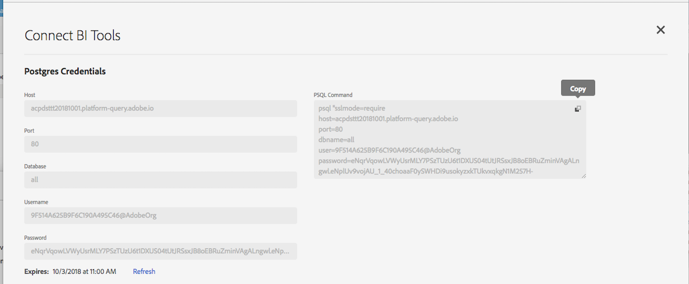
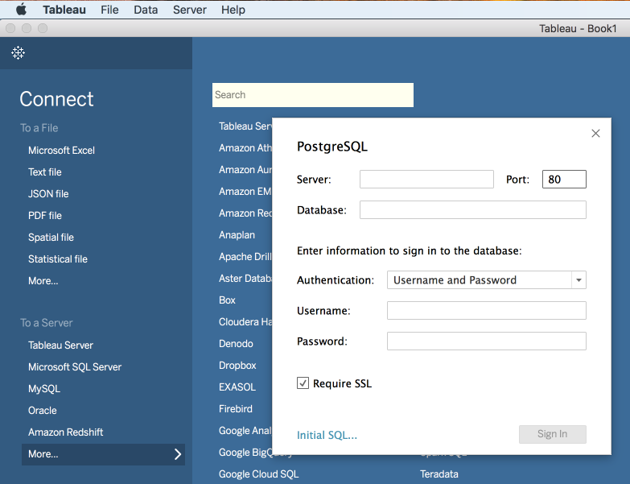

# Query Service UI and Connecting Clients

## Overview

This exercise will explain how to connect to Query Service from a variety of desktop client applications. Query Service uses the Postgres protocol, so the instructions below will tell you how to use Postgres tools and drivers to connect and write queries.

## Topics

1. Using the Platform UI for Query Service
2. Connect PSQL and verify 
3. Connect Tableau and verify
4. Bonus - connect Power BI (PC)
5. Bonus - connect Postico (Mac)

## 1. Using the Platform UI for Query Service

Using Chrome (download now if you don't have it already) connect to this web site: https://platform.adobe.com

Browse to the "**Data**" tab:


Then click the "**Queries**" tab:


Click the first query in the query list under "**Name**":


View the query, close the query window, then click the "Connect BI Tools". View the available connection parameters but don't copy any of them yet.


## 2. Connect PSQL and verify
PSQL is a command-line interface that comes when you isntall Postgres on your machine. You can install it by following these instructions. 

### 2a. Installing

#### On a Mac

> Open a terminal window and issue these three commands:
  
>
```
/usr/bin/ruby -e "$(curl -fsSL https://raw.githubusercontent.com/Homebrew/install/master/install)"
```
  
>
```
brew install postgres
```
>
```
which psql
```
  
> You should see the following if it worked correctly:
  
>
```
/usr/local/bin/psql
```
>

#### On a PC

> Download and install Postgres from this [location](https://www.postgresql.org/download/windows/)

> After installation you will need to edit your path variable:
> 
> 

> You need to add the two lines shown that include "Postgres". Save your updates, then open a Command prompt and type this:
> 
>
```
psql -V
```
  
>You should see something like this:
>  
```
psql (PostgreSQL) 9.5.14
```
  
  
  
### 2b. Connecting

Return to the Platform UI on the "Connect BI Tools" page. Click "copy" for "PSQL Command"



> **Note**: If you are on a PC you will need to remove the line breaks in the command string using the Notepad editor or similar.


Paste the command string into a terminal/command window and press return. You should see a result like this:
  
```
psql (10.5, server 0.1.0)
SSL connection (protocol: TLSv1.2, cipher: ECDHE-RSA-AES256-GCM-SHA384, bits: 256, compression: off)
Type "help" for help.
all=> 
```

If you don't see at least version 10.5 then you need to download that version or newer.


## 3. Connect Tableau and verify

You can get a 14 day trial of "Tableau Desktop" [here](https://www.tableau.com/products/desktop/download)

The version `2018.1.2 (20181.18.0615.1128 64 bit)` has been successful in connecting to Query Service.

Then run Tableau and on the opening screen, click to open a Postgres connection.


You will individually copy 
> ```Host, Port, Database, Username, Password``` 

from the Platform UI's "**Connect BI Tools**" page into the corresponding Tableau fields. Confirm that you have checked the "**SSL Required**" box before trying to connect.




## 4. Bonus - connect Power BI (PC)

As a backup client, PC users can also install Power BI from [here](https://powerbi.microsoft.com/en-us/desktop/)

## 5. Bonus - connect Postico (Mac)

As a backup client, Mac users can also install Postico from [here](https://eggerapps.at/postico/)