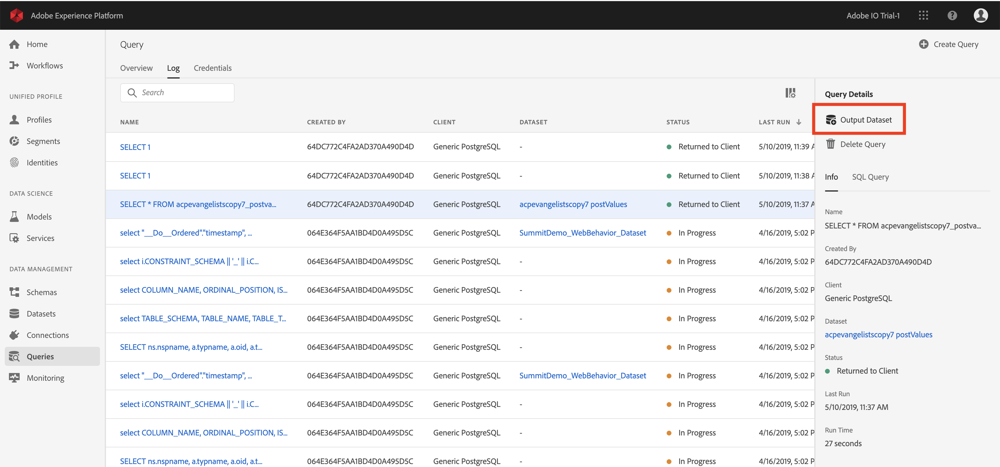
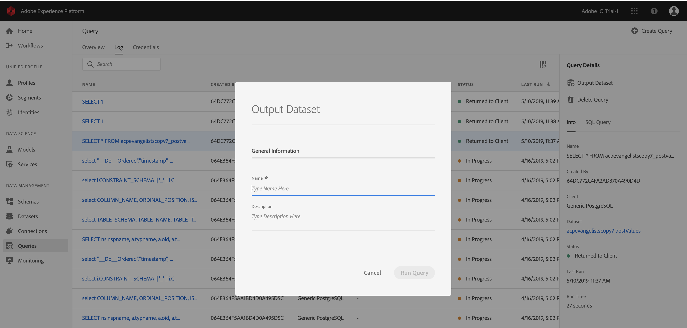

# Generating datasets from query results
The true power of Query Service is revealed when queries are used to generate datasets in Data Lake to be used as input into more queries or in other services like Data Science Workspace, Profile Service, or Analysis Workspace. 

The Alpha Query Service allows the creation of datasets from the UI. Follow these steps:

1. Write your query using a connected client and validate the output.
2. Log into the Platform UI and go to Queries.
3. Find your Query in the list and hover over the row.
4. Click on the "Create Dataset" button

5. Enter a dataset name, prepended with your LDAP ID (does not have to be unique or SQL-safe, the system generates a "table name" based on the name given here).
6. Enter a dataset description and click OK.

7. Watch the query complete and then go to the dataset list page to see the dataset you just created. 

After a dataset is created, it can be accessed like any other dataset in the Data Lake and used for a variety of use cases. Be advised: in a live implementation you will need to apply Data Governance labels after the dataset is created. 

### A note on CTAS functionality
Creating a dataset from a query leverages a capability of SQL known as ```create table as SELECT```. In the Alpha, this functionality is only available through the UI. It is also limited to generating a new dataset each time the button is pushed. Our Beta version will allow for CTAS to be invoked from a connected client and it will allow the option for appending the output of a query to an existing dataset with matching schema. 
