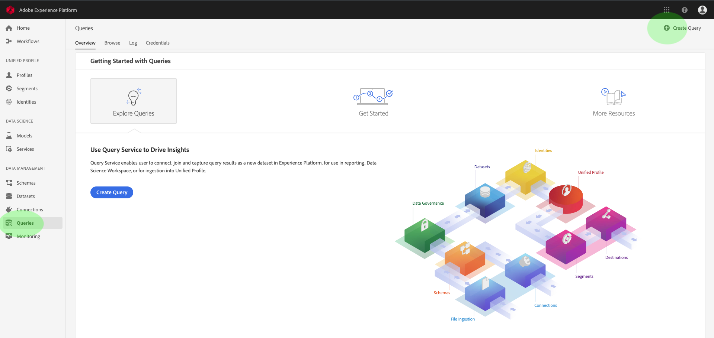
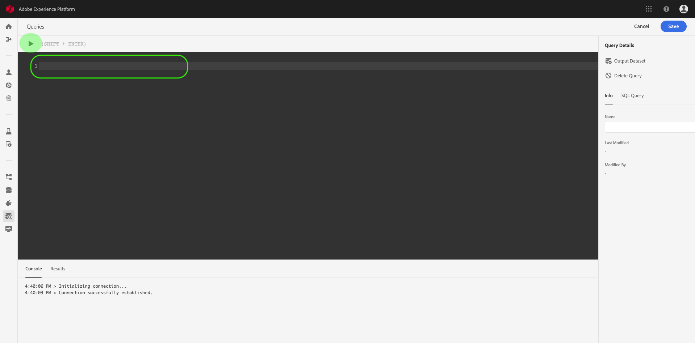
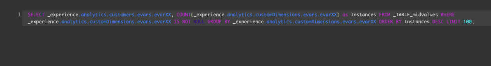
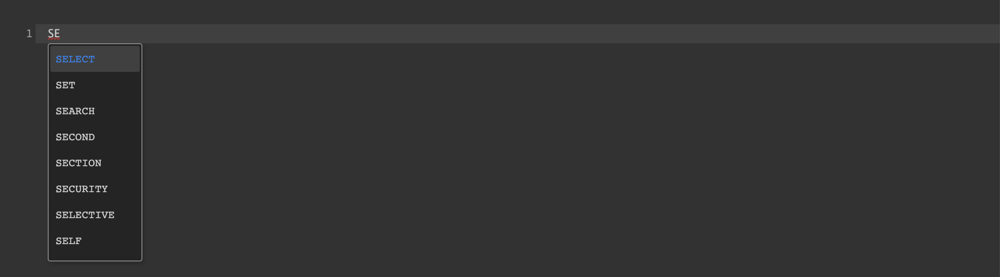
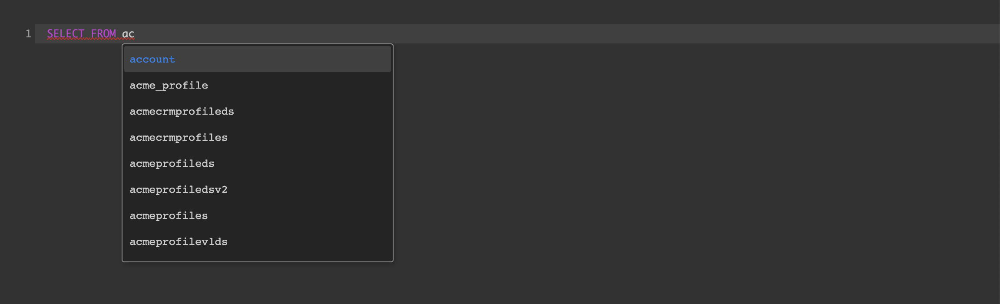
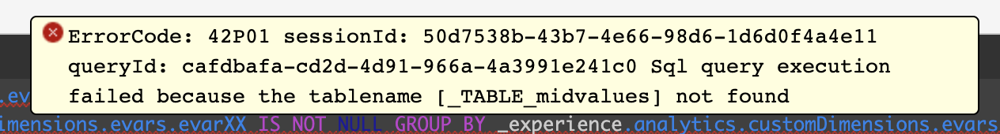
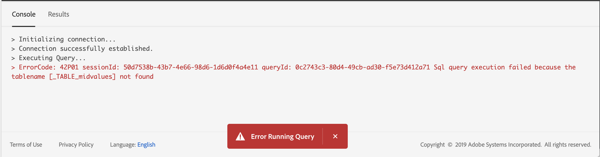

# Query Editor

Adobe Experience Platform Query Service includes a browser-based Query Editor, which makes writing, validating, and running queries easier. Query Editor is a good way to develop queries for analysis and data exploration purposes. 

## Using Query Editor

Query Service gives you the ability to run interactive queries for development purposes, and the ability to run queries non-interactively to populate datasets in Experience Platform. Query Editor is an interactive tool for developing queries. 

### Accessing Query Editor

To start writing queries, click on **Create Query** in the top right of the screen. This link is available from any of the pages in the Query Service workspace. 

  
  
### Writing Queries

Query Editor is organized to make writing queries as easy as possible. Key parts of the Editor are highlighted below. It is recommended that you develop your queries with limits on the rows returned to minimize query development time. Then, after you have validated your query output, remove the limits and run the query with `Create Table tablename as SELECT` to generate a dataset with the output. 

 

#### Key Features of the Query Editor

* **Automatic syntax highlighting:** Makes reading and organizing SQL easy.

* **SQL key word auto-complete:** Start typing your query and Query Editor provides suggestions for the SQL you are typing. Simply arrow down to your desired term and press **Enter**.

* **Table and field auto-complete:** Start typing the table name you want to select from, and then arrow down to the one you are looking for and press **Enter**. After you have a table in the query, autocomplete will work for fields in that table. 

### Error Detection

Query Editor validates your query as you write it. It provides generic SQL validation, as well as specific execution validation. This happens automatically. If your query has a red underline, as in the image below, then it has an error.

You can view an informative error message by hovering over the SQL code. This should help you troubleshoot your code.

### Console

The console gives you information on the status and operation of Query Service. It tells you if the connection to Query Service is operational, if it is running a query, and if there are any errors in executing a query. 

> **Note:** The console only shows errors that resulted from executing a query. It does not show query validation errors before a query is executed.)

### Query Results

After a query has completed, the results are displayed in the Results tab, which can be found next to Console. This view shows the tabular output of your query, up to 50,000 rows. This view is intended to allow you to validate your query. If you want to generate a dataset out of your query, remove limits and run the query with `Create Table tablename as SELECT` to generate a dataset with the output.

## How Query Editor Works

Query Editor provides flexible execution of queries. To use it effectively, it is helpful to understand how it works. 

### Connecting to Query Service

Query Editor takes a few seconds to initialize and connect to Query Service when it is opened. Console tells you when it is connected, as shown below. If you paste in a query and attempt to run it before it has connected, it will delay execution until the connection is complete. 

### Executing Queries

Queries executed from the Query Editor run interactively. This means that if you close the browser or navigate away, the query is canceled. This is also true for `CREATE TABLE as SELECT` queries. You need to leave your browser window open until the query completes successfully. 

## How to Find Prior Query Executions

All queries executed from the Query Editor are captured in the Log table. You can use the search functionality in the Log to find queries ([see instructions here](qs-ui.md)). 

> **Note:** Queries that are not executed are not saved by the Log, so if you want Query Service to remember your query, be sure to run it in the Query Editor. 
