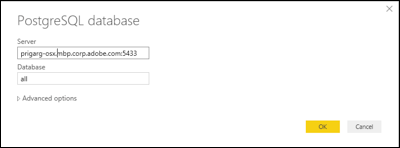
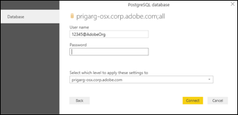

# Power BI

To configure access to Power BI, configure the following settings:

*   **Server:** IP/hostname of the computer and port on which Query service is deployed , separated by a colon (:).
*   **Database:** The dataset ID.

*   **Username:** Your IMS Organization ID.
*   **Password:** Your user token or service token.