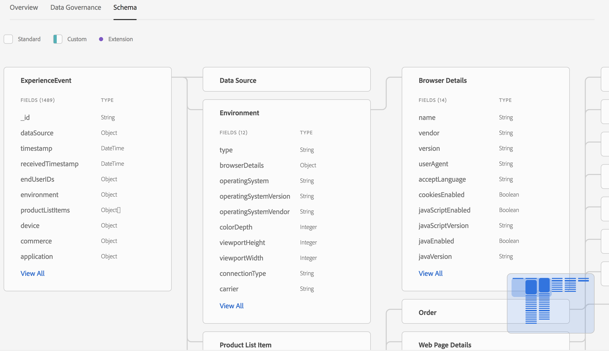
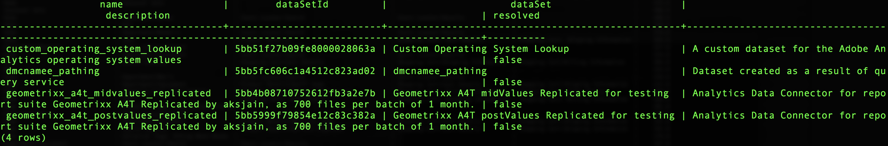
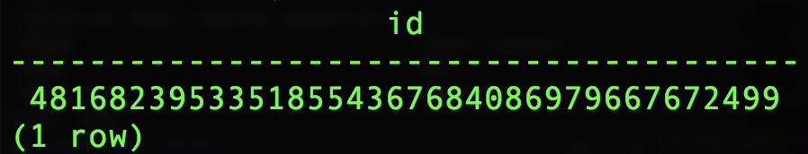

# Datasets vs tables and schema

1. Review the Dataset list in the UI - https://platform.adobe.com/datasets. 

    Observe the dataset names. Note that they have spaces and might otherwise not be SQL safe. 

	

2. Review the Dataset schema in the UI by clicking on a dataset and clicking on the Schema tab. 

    Note the hierarchical nature of the schema. 

	

3. Jump into psql - https://platform.adobe.com/datasets/queries/connect.

	
	
4. View available tables with PostgreSQL `\d` vs `SHOW TABLES;`.
	* `\d` displays the standard PostgreSQL view
	
	* `SHOW TABLES;` is a custom command that gives a more detailed view and presents the table as well as the dataset.
	

5. View table root schema details with PostgreSQL `\d table_name`.
	* The schema presented is just the root fields, most of which are complex, referred to as structured types in the Dataset schema UI
	
6. Working with dot notation and objects, run this SQL statement, and substitute your analytics table name for `your_analytics_table`:

  ```sql
  SELECT endUserIds._experience.mcid
  FROM your_analytics_table
  WHERE endUserIds._experience.mcid IS NOT NULL
  LIMIT 1;
  ```

Notice that the result produces a flattened object, rather than returning a single value. The `endUserIds._experience.mcid` object contains these four parameters:

* `id`
* `namespace`
* `xid`
* `primary`

When the column is only declared down to the object, it returns the entire object as a string. The XDM schema is more complex than what you might have had experience with before because multiple solutions, channels, and use-cases need to be accounted for.  To view only the ID value, use:
```sql
SELECT endUserIds._experience.mcid.id
FROM your_analytics_table
WHERE endUserIds._experience.mcid IS NOT NULL
LIMIT 1;
```


Here are a few more example to consider:

```
_experience.analytics.event1to100 (object)
_experience.analytics.event1to100.event1 (object)
_experience.analytics.event1to100.event1._type (parameter)
_experience.analytics.event1to100.event1.id (parameter)
_experience.analytics.event1to100.event1.value (parameter)
_experience.analytics.event1to100.event1.unit (parameter)
_experience.analytics.customDimensions.evars (object)
_experience.analytics.customDimensions.evars.evar1 (parameter)
```