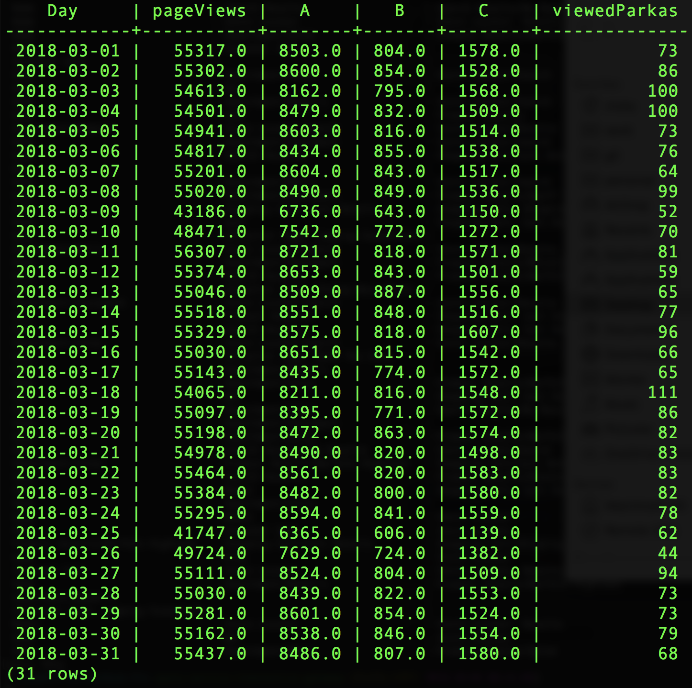

# ExperienceEvent queries

1. Create a trended report of events by day over a specific date range.

    The timestamp column found in the ExperienceEvent dataset is in UTC. Use the function `from_utc_timestamp()` to transform the value to another timezone. This example tranforms it into EDT and then uses the `date_format()` to isolate the day from the timestamp. The date range is declared in the `WHERE` clause using separate `_ACP_YEAR`, `_ACP_MONTH`, and `_ACP_DAY` columns. (In the near future, date ranges will use a single date column and you will be able to use standard SQL data range comparisons.)
    
  ```sql
  SELECT 
    date_format( from_utc_timestamp(timestamp, 'EDT') , 'yyyy-MM-dd') as Day,
   SUM(web.webPageDetails.pageviews.value) as pageViews,
   SUM(_experience.analytics.event1to100.event1.value) as A,
   SUM(_experience.analytics.event1to100.event2.value) as B,
   SUM(_experience.analytics.event1to100.event3.value) as C,
   SUM(
     CASE 
        WHEN _experience.analytics.customDimensions.evars.evar1 = 'parkas' 
        THEN 1 
        ELSE 0 
      END) as viewedParkas
  FROM your_analytics_table 
  WHERE _ACP_YEAR = 2018 AND _ACP_MONTH = 3 
  GROUP BY Day 
  ORDER BY Day ASC, pageViews DESC;
  ```
  
2. Find a list of visitors organized by their number of page views.
  ```sql
  SELECT 
    endUserIds._experience.aaid.id, 
    SUM(web.webPageDetails.pageviews.value) as pageViews 
  FROM your_analytics_table
  GROUP BY endUserIds._experience.aaid.id 
  ORDER BY pageViews DESC
  LIMIT 10;
  ```
  
3. Replay a visitor's sessions.
  ```sql
  SELECT 
    timestamp, 
    web.webReferrer.type as referrerType, 
    web.webReferrer.URL as referrer, 
    web.webPageDetails.name as pageName, 
    _experience.analytics.event1to100.event1.value as A, 
    _experience.analytics.event1to100.event2.value as B, 
    _experience.analytics.event1to100.event3.value as C, 
    web.webPageDetails.pageviews.value as pageViews
  FROM your_analytics_table 
  WHERE endUserIds._experience.aaid.id = '457C3510571E5930-69AA721C4CBF9339' 
  ORDER BY timestamp 
  LIMIT 100;
  ```
  
4. View the visitor rollup.
  ```sql
  SELECT 
    endUserIds._experience.aaid.id, 
    SUM(web.webPageDetails.pageviews.value) as pageViews, 
    SUM(_experience.analytics.event1to100.event1.value) as A, 
    SUM(_experience.analytics.event1to100.event2.value) as B, 
    SUM(_experience.analytics.event1to100.event3.value) as C,
    SUM(
     CASE 
        WHEN _experience.analytics.customDimensions.evars.evar1 = 'parkas' 
        THEN 1 
        ELSE 0 
      END) as viewedParkas
  FROM your_analytics_table 
  WHERE endUserIds._experience.aaid.id = '457C3510571E5930-69AA721C4CBF9339' 
  GROUP BY endUserIds._experience.aaid.id
  ORDER BY pageViews DESC;
  ```
  
