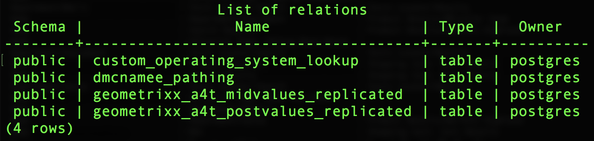
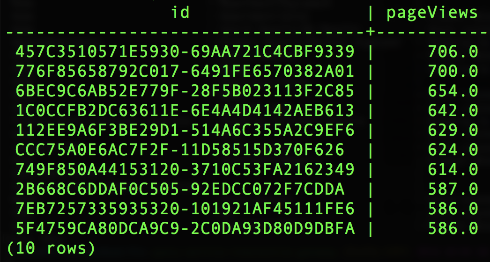
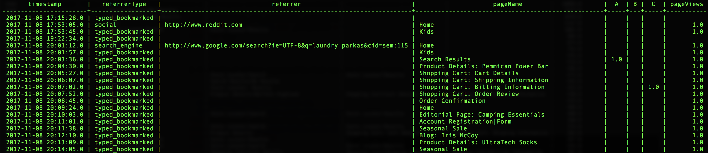

# Running Queries
Experience Query Service gives you the power to run SQL queries against datasets in Experience Data Lake. There are a few things to be aware of as you use SQL to interact with datasets in a data lake. The Query Service manages certain things, like creating SQL-safe table names for each dataset in the data lake. There are also considerations around working with the hierarchical data in the data lake: discovering schema, selecting just the right field in the hierarchical model are two important concepts. 

Follow the exercises below to get a good idea for how the Query Service works. 

## Datasets vs Tables and Schema

1. Review the Dataset list in the UI - https://platform.adobe.com/datasets. Observe the dataset names. Note that they have spaces and might otherwise not be SQL safe. 

	

2. Review the Dataset schema in the UI by clicking on a dataset and clicking on the Schema tab. Note the hierarchical nature of the schema. 

	

3. Jump into psql - https://platform.adobe.com/datasets/queries/connect

	
	
4. Seeing available tables with PostgreSQL `\d` vs `SHOW TABLES;`
	* `\d` gives you the standard PostgreSQL view
	
	* `SHOW TABLES;` is a custom command we have added that gives you a more detailed view and presents the table as well as the DataSet.
	
5. Seeing table root schema details with PostgreSQL `\d table_name`
	* The schema presented is just the root fields most of which are complex, structured types as you say in the DataSet schema UI
	
6. Working with dot notation and objects - Run this SQL statement, and substitute your analytics table name for `your_analytics_table`:

  ```sql
  SELECT endUserIds._experience.mcid
  FROM your_analytics_table
  WHERE endUserIds._experience.mcid IS NOT NULL
  LIMIT 1;
  ```

Notice anything about the result? It produced a flattened object rather than returning a single value. The endUserIds._experience.mcid object contains these four parameters `id, namespace, xid, primary`. And when the column is only delcared down to the object it will return the entire object as a string.  The XDM schema is more complex than what you may have had experience with before because we need to cover multiple solutions, channels, and use-cases.  If you just wanted the ID value you would use:
```sql
SELECT endUserIds._experience.mcid.id
FROM your_analytics_table
WHERE endUserIds._experience.mcid IS NOT NULL
LIMIT 1;
```

Here are a few more example the consider:
```
_experience.analytics.event1to100 (object)
_experience.analytics.event1to100.event1 (object)
_experience.analytics.event1to100.event1._type (parameter)
_experience.analytics.event1to100.event1.id (parameter)
_experience.analytics.event1to100.event1.value (parameter)
_experience.analytics.event1to100.event1.unit (parameter)
_experience.analytics.customDimensions.evars (object)
_experience.analytics.customDimensions.evars.evar1 (parameter)
```

## ExperienceEvent Queries

1. Create a trended report of events by day over a specific date range using:
The timestamp column found in the ExperienceEvent dataset is in UTC. You will use the function `from_utc_timestamp()` to transform the value to another timezone. In this example, we will tranform it into `EDT` and then use the `date_format()` to isolate the day from the timestamp. The date range will be declared in the WHERE clause using separate _ACP_YEAR, _ACP_MONTH and _ACP_DAY columns. (In the near future date ranges will use a single date column and you will be able to use standard SQL data range comparisons)
  ```sql
  SELECT 
    date_format( from_utc_timestamp(timestamp, 'EDT') , 'yyyy-MM-dd') as Day,
   SUM(web.webPageDetails.pageviews.value) as pageViews,
   SUM(_experience.analytics.event1to100.event1.value) as A,
   SUM(_experience.analytics.event1to100.event2.value) as B,
   SUM(_experience.analytics.event1to100.event3.value) as C,
   SUM(
     CASE 
        WHEN _experience.analytics.customDimensions.evars.evar1 = 'parkas' 
        THEN 1 
        ELSE 0 
      END) as viewedParkas
  FROM your_analytics_table 
  WHERE _ACP_YEAR = 2018 AND _ACP_MONTH = 3 
  GROUP BY Day 
  ORDER BY Day ASC, pageViews DESC;
  ```
  
2. Find a list of visitors organized by their number of page views:
  ```sql
  SELECT 
    endUserIds._experience.aaid.id, 
    SUM(web.webPageDetails.pageviews.value) as pageViews 
  FROM your_analytics_table
  GROUP BY endUserIds._experience.aaid.id 
  ORDER BY pageViews DESC
  LIMIT 10;
  ```
  
3. Replay a visitor's sessions:
  ```sql
  SELECT 
    timestamp, 
    web.webReferrer.type as referrerType, 
    web.webReferrer.URL as referrer, 
    web.webPageDetails.name as pageName, 
    _experience.analytics.event1to100.event1.value as A, 
    _experience.analytics.event1to100.event2.value as B, 
    _experience.analytics.event1to100.event3.value as C, 
    web.webPageDetails.pageviews.value as pageViews
  FROM your_analytics_table 
  WHERE endUserIds._experience.aaid.id = '457C3510571E5930-69AA721C4CBF9339' 
  ORDER BY timestamp 
  LIMIT 100;
  ```
  
4. Visitor rollup:
  ```sql
  SELECT 
    endUserIds._experience.aaid.id, 
    SUM(web.webPageDetails.pageviews.value) as pageViews, 
    SUM(_experience.analytics.event1to100.event1.value) as A, 
    SUM(_experience.analytics.event1to100.event2.value) as B, 
    SUM(_experience.analytics.event1to100.event3.value) as C,
    SUM(
     CASE 
        WHEN _experience.analytics.customDimensions.evars.evar1 = 'parkas' 
        THEN 1 
        ELSE 0 
      END) as viewedParkas
  FROM your_analytics_table 
  WHERE endUserIds._experience.aaid.id = '457C3510571E5930-69AA721C4CBF9339' 
  GROUP BY endUserIds._experience.aaid.id
  ORDER BY pageViews DESC;
  ```
  

## Joining DataSets

These allow you to include data from other datasets in your query. In this example, we will use a custom operating system dataset uploaded for this lab to map the operatingsystemID to the operatingsystem value.

Datasets:
* your_analytics_table
* custom_operating_system_lookup

Create a select statement for the top 50 operating systems by number of page views:
```sql
SELECT 
  b.operatingsystem AS OperatingSystem,
  SUM(a.web.webPageDetails.pageviews.value) AS PageViews
FROM your_analytics_table a 
     JOIN custom_operating_system_lookup b 
      ON a._experience.analytics.environment.operatingsystemID = b.operatingsystemid 
WHERE _ACP_YEAR=2018 
GROUP BY OperatingSystem 
ORDER BY PageViews DESC
LIMIT 50;
```


## Using Adobe Functions

One of our big differentiators is we understand experience data and what our customers need to be able to do with that data.
From this understanding we can build helper functions to make our customers' job easier.

### Sessionization

Sessionization - The SESS_TIMEOUT() reproduces the visit groupings found with Adobe Analytics. It performs a similar time based grouping, but customizable parameters.

Syntax:

`SESS_TIMEOUT(timestamp, timeout_in_seconds) OVER ([partition] [order] [frame])`

Returns:

Structure with fields `(timestamp_diff, num, is_new, depth)`

1. Explore the row level SESS_TIMEOUT() and output:
  ```sql
  SELECT analyticsVisitor,
         session.is_new,
         session.timestamp_diff,
         session.num,
         session.depth
  FROM (SELECT endUserIDs._experience.aaid.id as analyticsVisitor,
           SESS_TIMEOUT(timestamp, 60 * 30)
             OVER (PARTITION BY endUserIDs._experience.aaid.id
                   ORDER BY timestamp
                   ROWS BETWEEN UNBOUNDED PRECEDING AND CURRENT ROW)
             AS session
    FROM your_analytics_table
    WHERE _ACP_YEAR = 2018
  )
  LIMIT 100;
  ```
  
2. Create a new trended report with visitors, sessionsm, and page-views:
  ```sql
  SELECT 
    date_format( from_utc_timestamp(timestamp, 'EDT') , 'yyyy-MM-dd') as Day,
    COUNT(DISTINCT analyticsVisitor ) as Visitors,
    COUNT(DISTINCT analyticsVisitor || session.num ) as Sessions,
    SUM( PageViews ) as PageViews
  FROM 
    ( 
      SELECT 
      timestamp,
      endUserIDs._experience.aaid.id as analyticsVisitor,
      SESS_TIMEOUT(timestamp, 60 * 30) 
        OVER (PARTITION BY endUserIDs._experience.aaid.id 
              ORDER BY timestamp 
              ROWS BETWEEN UNBOUNDED PRECEDING AND CURRENT ROW) 
        AS session,
      web.webPageDetails.pageviews.value as PageViews
      FROM your_analytics_table
      WHERE _ACP_YEAR = 2018
    )
  GROUP BY Day 
  ORDER BY Day DESC 
  LIMIT 31;
  ```
  

### Attribution

Attribution - Attribution is how you allocate metrics or conversions like revenue, order, or signups to some marketing effort.
In Adobe Analytics attribution settings are configured per variables like an eVar and generated as data is ingested.
The Attribution ADFs found in the query service allow those allocations to defined and generated at query time.

For this lab we're going to focus on last-touch attribution, but we also have first-touch and we're going to be working on
other flavors with timeouts and event-based expiration.

Syntax:

`ATTRIBUTION_LAST_TOUCH(timestamp, [channel_name], column) OVER ([partition] [order] [frame])`

Returns:

struct with field `(value)`

1. Explore the row level attribution:
```sql
SELECT
  endUserIds._experience.aaid.id,
  _experience.analytics.customDimensions.evars.evar10 as MemberLevel,
  ATTRIBUTION_LAST_TOUCH(timestamp, 'eVar10', _experience.analytics.customDimensions.evars.evar10)
      OVER(PARTITION BY endUserIds._experience.aaid.id
           ORDER BY timestamp
           ROWS BETWEEN UNBOUNDED PRECEDING AND CURRENT ROW).value
      AS LastMemberLevel,
  commerce.purchases.value as Orders
FROM your_analytics_table 
WHERE _ACP_YEAR=2018 AND _ACP_MONTH=4
LIMIT 50;
```

2. Create a breakdown of orders by Last Member Level (eVar10):
```sql
SELECT
  LastMemberLevel,
  SUM(Orders) as MemberLevelOrders
FROM 
(SELECT
  ATTRIBUTION_LAST_TOUCH(timestamp, 'eVar10', _experience.analytics.customDimensions.evars.evar10)
      OVER(PARTITION BY endUserIds._experience.aaid.id
           ORDER BY timestamp
           ROWS BETWEEN UNBOUNDED PRECEDING AND CURRENT ROW).value
      AS LastMemberLevel,
  commerce.purchases.value as Orders
FROM your_analytics_table 
WHERE _ACP_YEAR=2018 AND _ACP_MONTH=4
)
GROUP BY LastMemberLevel 
ORDER BY MemberLevelOrders DESC
LIMIT 25;
```


### Pathing

Understanding how customers navigate is important. The `NEXT()` and `PREVIOUS()` ADFs make this possible.

Syntax: 

```
NEXT(key, [shift, [ignoreNulls]]) OVER ([partition] [order] [frame])
PREVIOUS(key, [shift, [ignoreNulls]]) OVER ([partition] [order] [frame])
```

Returns:

struct with field `(value)`

1. Select the current page and next page:
  ```sql
  SELECT 
    endUserIds._experience.aaid.id,
    timestamp,
    web.webPageDetails.name,
    NEXT(web.webPageDetails.name, 1, true)
        OVER(PARTITION BY endUserIds._experience.aaid.id
             ORDER BY timestamp
             ROWS BETWEEN CURRENT ROW AND UNBOUNDED FOLLOWING).value
        AS next_pagename
  FROM your_analytics_table
  WHERE _ACP_YEAR=2018 
  LIMIT 10;
  ```
  
2. Create a breakdown report for the top 5 page names on entry of the session:
  ```sql
  SELECT 
    PageName,
    PageName_2,
    PageName_3,
    PageName_4,
    PageName_5,
    SUM(PageViews) as PageViews
  FROM
    (SELECT
      PageName,
      NEXT(PageName, 1, true)
        OVER(PARTITION BY VisitorID, session.num
              ORDER BY timestamp
              ROWS BETWEEN CURRENT ROW AND UNBOUNDED FOLLOWING).value
        AS PageName_2,
      NEXT(PageName, 2, true)
        OVER(PARTITION BY VisitorID, session.num
              ORDER BY timestamp
              ROWS BETWEEN CURRENT ROW AND UNBOUNDED FOLLOWING).value
        AS PageName_3,
      NEXT(PageName, 3, true)
         OVER(PARTITION BY VisitorID, session.num
              ORDER BY timestamp
              ROWS BETWEEN CURRENT ROW AND UNBOUNDED FOLLOWING).value
        AS PageName_4,
      NEXT(PageName, 4, true)
         OVER(PARTITION BY VisitorID, session.num
              ORDER BY timestamp
              ROWS BETWEEN CURRENT ROW AND UNBOUNDED FOLLOWING).value
        AS PageName_5,
      PageViews,
      session.depth AS SessionPageDepth
    FROM
      (SELECT 
    	  endUserIds._experience.aaid.id as VisitorID,
   	  timestamp,
   	  web.webPageDetails.pageviews.value AS PageViews,
    	  web.webPageDetails.name AS PageName,
        SESS_TIMEOUT(timestamp, 60 * 30) 
          OVER (PARTITION BY endUserIDs._experience.aaid.id 
                ORDER BY timestamp 
                ROWS BETWEEN UNBOUNDED PRECEDING AND CURRENT ROW) 
        AS session
      FROM your_analytics_table
      WHERE _ACP_YEAR=2018)
    )
  WHERE SessionPageDepth=1
  GROUP BY PageName, PageName_2, PageName_3, PageName_4, PageName_5
  ORDER BY PageViews DESC
  LIMIT 100;
  ```
  