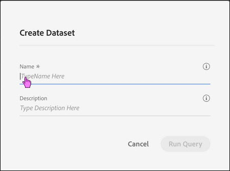

# Quick Actions

Hovering over the query also displays action icons. Use these actions to preview, rerun, copy, or delete the query. Previewing the query shows the result set from the last run of the query.

If you hover over a query that is currently running, you'll see actions that enable you to cancel or delete the query. Deleting the query deletes any in-process results.

## Run a Dataset Query

1.  Hover over the query run time and select Run Dataset Query.

2.  Enter a name and description, then click Run Query.
    
    
    

## Cancel Long-Running Queries

1.  Hover over the query name for a query that is still running.
    
    Information about the query appears.
    
2.  Click the Cancel icon.
    

## Delete Queries

1.  Hover over the query run time and click the Delete icon.
    
    A message appears, reminding you of the consequences of deleting the query.
    
2.  Click Delete.
    

## View Resulting Datasets and Distinguish Them from Other Ingested Datasets

For noninteractive queries, the results are captured as another dataset in the platform. The dataset is shown in the same list as ingested datasets.

## View Information About a Dataset

1.  Hover over the dataset in the Datasets column.
    
    Information about that dataset appears.
    