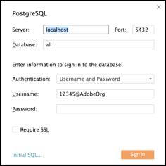

# Tableau

To configure access to the PostgreSQL connector that connects Query Service with Tableau, enter the following information:

*   **Server:** The IP/hostname of the computer where Query Service is deployed.
*   **Port:** The port on which the TCP connection is made for Query Service. (The default is 5432.)
*   **Database:** The dataset ID.
*   **Authentication:** The authentication method. Choose "username and password."
*   **Username:** The name of you IMS Organization.
*   **Password:** Your user token or service token.
*   **Require SSL:** Enable if SSL is required.