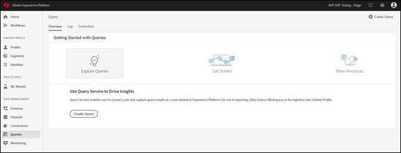
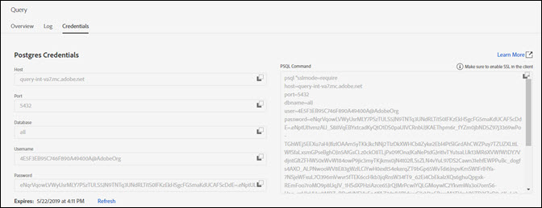
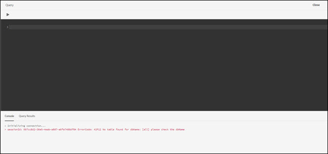

# Using the Platform UI for Query Service

## Overview

The overview provides a high-level starting point for working with Query Service. This page provides an overview of usage and summarizes any calls-to action.

### Explore queries

Click **Explore Queries**. 

From Explore Queries, you can create a query. Click **Create Query** to open the query editor.

Click **More Resources** for access to Query Service documentation and other learning resources.

## Log

The Log tab lists the queries that have been run. By default, the log lists the queries in reverse chronology.

| Column | Description |
|===|===|
| Name | The query name, consisting of the first several characters of the SQL query. Click on the name to open the query editor so you can edit that query. |
| Created By | The name of the person who created the query. |
| Client | The client used for the query. |
| Dataset | The input dataset used by the query. Click on the dataset to go to the input dataset details screen. |
|Status | The current status of the query. |
| Last Run | When the query was run last. You can sort the list in either ascending or descending order by clicking the arrow over this column. |
| Run Time | The amount of time it took to run the query. |

If you click on anything other that the SQL for the query, the Inspector opens in the right rail, where you can create an output dataset, delete the query without deleting data, and copy the SQL statement. Click the ouput dataset to edit it.

You can search on the field. Searches are case sensitive.

## Credentials

The Credentials tab displays your postgres credentials.

## Query editor

The query editor enables you to issue queries without using an external client. 

Click **Create Query** in the Overview or Log tab to open the query editor and create a new query.

Type your query in the editor. As you type, the editor autocompletes SQL reserved words, as well as tables and field names within tables. Click the Play button to run the the query. Use the space below the editor to view the query results and the query console. The query console shows what Query Service is currently doing, including indicating when a query has been returned. Click over to the results tab to view the query results. See the [query editor](qs-editor.md) guide for more information on using the query editor. 