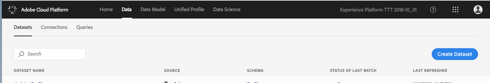
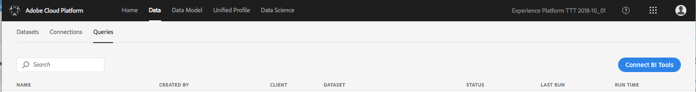
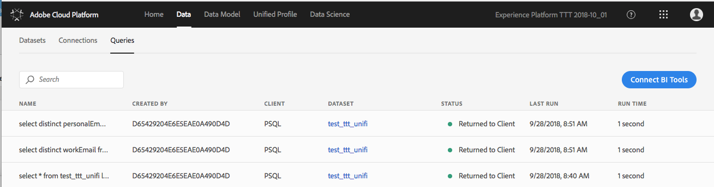

# Using the Platform UI for Query Service

(Content under development)

## View a query

To view a query from the Queries tab:

1. Using Google Chrome, connect to [https://platform.adobe.com](https://platform.adobe.com).

2. Browse to the **Data** tab:

    

3. Open the **Queries** tab:

    

4. In the query list, click the query you want to view from the **Name** column:

    