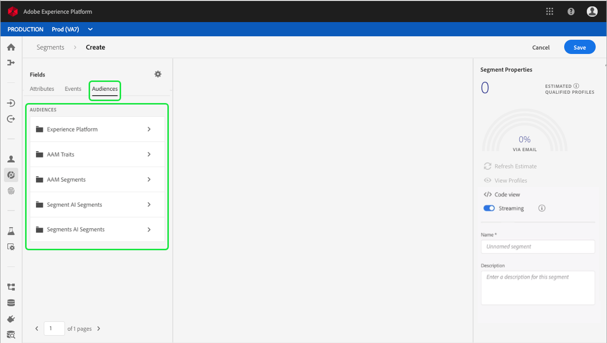
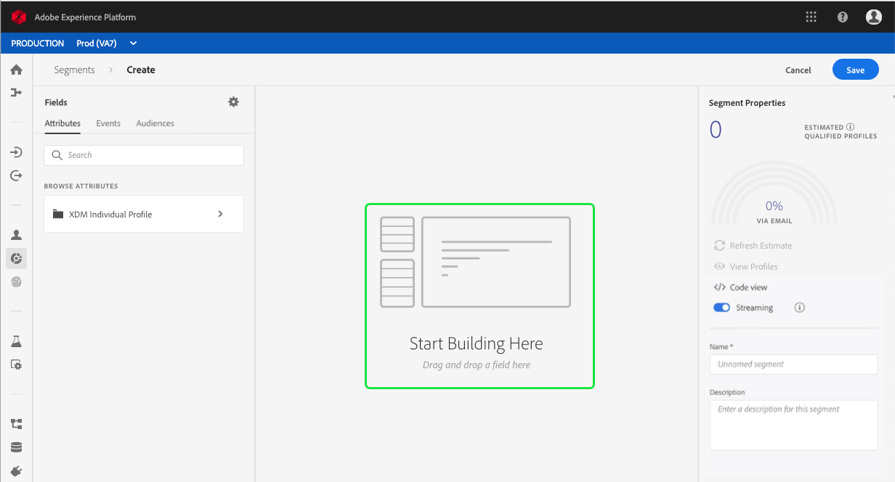
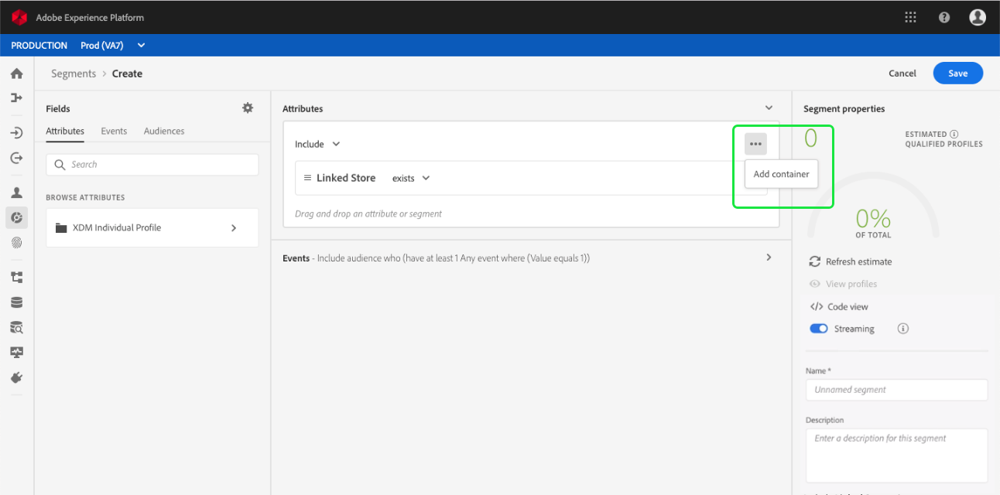

# Segment Builder user guide

Adobe Experience Platform Segmentation Service provides a RESTful API and user interface for creating segment definitions from your Real-time Customer Profile data. This document provides an overview for using Segment Builder, which is the UI implementation of Segmentation Service. 

This document covers the following topics related to using Segment Builder:

* [Accessing Segment Builder](#accessing-segment-builder): Access Segment Builder within Adobe Experience Platform.
* [Segment Builder workspace preview](#segment-builder-workspace-preview): Familiarize yourself with the Segment Builder layout.
* [Segment building blocks](#segment-building-blocks): Understand the basic components involved in segmentation.
* [Rule builder canvas](#rule-builder-canvas): Define rules that describe the behavior and characteristics of your target audience.
* [Segment properties](#segment-properties): Understand the resulting segment properties from the rules created on the rule builder canvas.
* [Containers](#containers): Control how segment rules are executed by using nested queries. 

## Accessing Segment Builder

To access Segment Builder within Adobe Experience Platform, click **Segments** in the left navigation, then click **Create Segment** in the top-right corner of the screen. 

## Segment Builder workspace preview 

Segment Builder provides a rich workspace that allows you to interact with Profile data elements. The workspace provides intuitive controls for building and editing segment rules, such as drag-and-drop tiles used to represent data properties. 

## Segment building blocks

Attributes and events represent the basic building blocks of a segment. In addition, the attributes and events contained in existing segments can be used as components for new segments. 

The left rail contains three tabs that provide access to these three building blocks: **Attributes, Events, and Segments**.

### The Attributes tab

The **Attributes** tab contains a hierarchial representation of Profile data elements:

   

Each Profile entity can be expanded to reveal attributes, where the attributes are tiles that can be dragged onto the rule builder canvas, which will be discussed in more detail later in this guide.

  

### The Events tab

The **Events** tab contains ExperienceEvent data elements. The sections of this tab reflect a schema that implements the XDM ExperienceEvent class:  
  
  

### The Segments tab 
<!---> Will need to update this once the UI changes so they are all merged to Audience.<--->

The **Segments** tab lists all previously created segments.

  

Any type of component can be searched for by typing its name in the search bar. The search results begin to populate as entire words are entered. For example, to build a rule based on the XDM field `ExperienceEvent.commerce.productViews`, start typing “product views” in the search field. After the word "product" has been typed search results begin to appear, listing the object hierarchy to which it belongs.

By default, only the populated schema fields from your data store are shown. To change your configuration settings and show all schema fields, click the gear icon in the left rail, then click **Show only populated fields**. 

> **Note:** Custom schema fields defined by your organization may take up to 24 hours to appear in the rule builder canvas and become available for use in building rules. More information on the rule builder canvas can be found in the next section.

### The Audiences tab

The **Audience** tab lists all segments imported from external sources, such as Adobe Audience Manager.

Within the Audiences tab, it will display all the available sources as a group of **folders**.

Within these folders, a list of the available audiences can be seen.

Additionally, you can see the full folder hierarchy by clicking the highlighted button.

Any type of Audience can be searched for by typing its name in the search bar. The search results begin to populate as entire words are entered. For example, to find an Audience named `Sample Audience 5`, start typing "Audience" in the search field. After typing in the word "Audience", results will begin to appear, as seen below.

## Rule builder canvas

A segment definition is a collection of rules used to describe key characteristics or behavior of a target audience. These rules are created using the *rule builder canvas*, located in the center of Segment Builder, as seen here:

To add a new rule to your segment definition, drag a tile from the left-hand rail and drop it onto the rule builder canvas. To finish building the rule, you will be presented with context-specific options according to data type: 
  * String data
  * Date data
  * Experience Events
  * Segments

### Adding segments

You can also drag a segment from the segments tab onto the rule builder canvas to reuse its component in the new segment definition. Doing this adds the segment's attributes and events to the *Attributes* and *Events* sections of the new segment, respectively. 

### Adding audiences

You can also drag an audience from the audience tab onto the rule builder canvas to reference its audience membership in the new segment definition. This will allow you to include or exclude audience membership as an attribute in the new segment rule.

>**Note:** Since only audience membership is referenced, the rules used to define the audience are **not** included or referenced, and therefore, cannot be modified.

## Segment properties 

When building a segment rule, the right-hand rail displays an estimate preview of the resulting segment properties, allowing you to adjust your segment definition as needed before building the segment itself.

As you build your segment definitions, you can view a paginated preview of the audience by selecting **View Profiles** in the right-rail:

### Saving your segment

The final step of segment definition is choosing a merge policy as well as a segment name and description from the right-hand rail.

Merge policies are rules used by Real-time Customer Profile to determine what data can be merged into a unified view under certain conditions. In order to access Profile data using APIs, each request must provide a merge policy ID. If a merge policy is not provided, the default Platform merge policy is used. If you would rather use a merge policy specific to your organization, you can create your own and mark it as your organization's default.

The segment name is used to identify a particular segment amongst the other segments belonging to your organization. Segment names should therefore be descriptive, concise, and unique.

## Containers

Segment rules are evaluated in the order they are listed. Containers allow control over the order of execution through the use of nested queries.

### Create a container

Once you've added at least one tile to the rule builder canvas, you can begin to add containers. To create a new container, navigate to your newly added tile then click the ellipses (...) on the top-right side, then click **Add container**. 

While the new container initially appears as the child of the first container, you can adjust the hierarchy by dragging and moving the containers while building or modifying the segment. 

The default behavior of a container is to include the retrieved profiles satisfying the criteria defined. Alternatively, a container can exclude profiles meeting the container's criteria. To change this setting, click the dropdown menu located in the top-left side of the container.

A child container can have its contents extracted and added inline to its parent container by using its "unwrap container" option, located in the dropdown menu in the top-right corner of the child container. The child container is deleted in this process.

## Next steps

Segment Builder provides a rich workflow allowing you to isolate marketable audiences by building segments from Real-time Customer Profile data. In summary:

* You can define your segments using a combination of attributes, ExperienceEvents, and existing segments as building blocks.  
* Use the rule builder canvas to combine your segment building blocks to create a segment definition.
* The Segment Properties section provides estimates of prospective audiences, allowing you to adjust your segment definitions as required before creating the segment.
* Three primary fields are required when building a new segment: merge policy, segment name, and segment description. 
* Use containers to control the order in which segment rules are executed.  

For steps on how to work with segments using the Real-time Customer Profile API, see the tutorial on [creating audience segments using APIs](../../../api-specification/markdown/narrative/tutorials/creating_a_segment_tutorial/creating_a_segment_tutorial.md).
