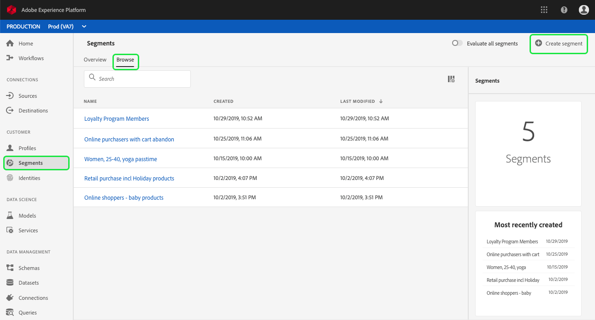
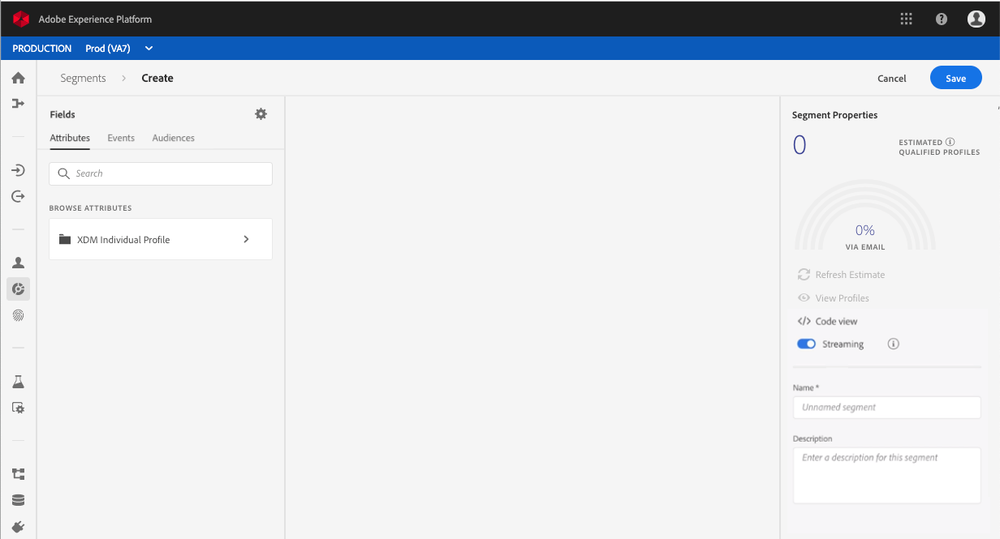
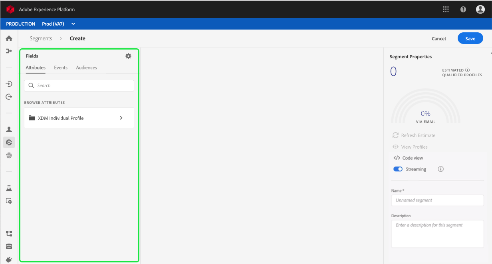
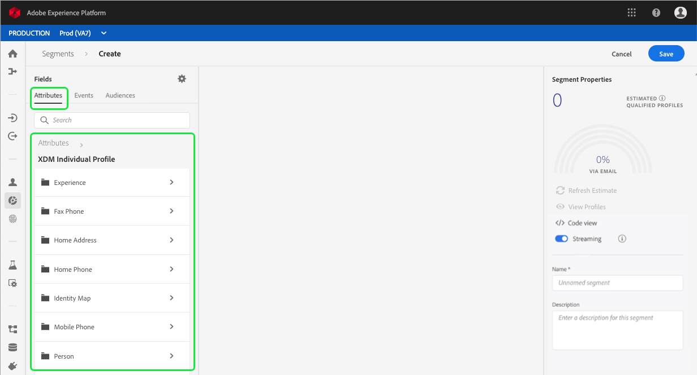
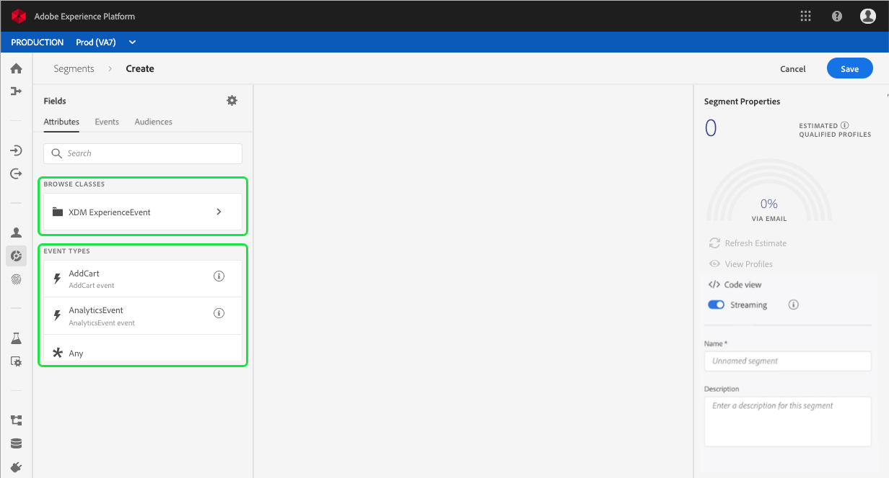
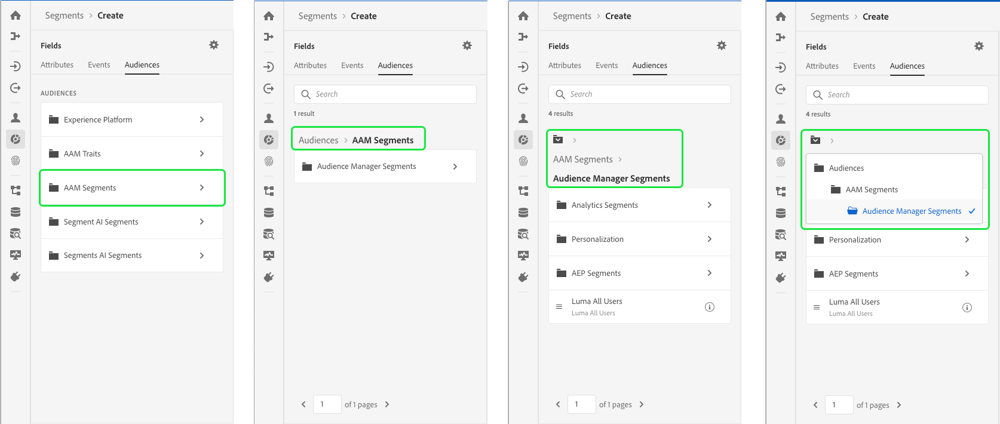
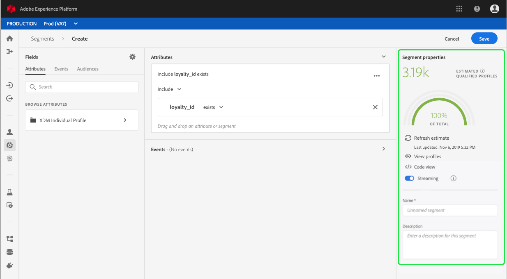
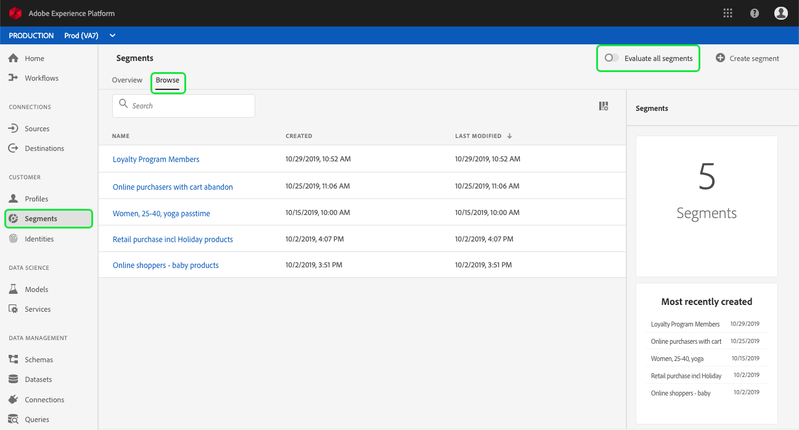
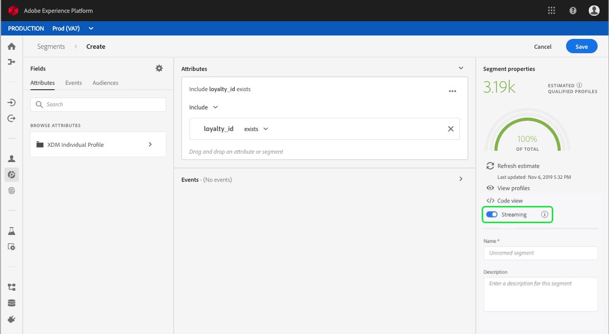

# Segment Builder user guide

Adobe Experience Platform Segmentation Service provides a RESTful API and user interface for creating segment definitions from Real-time Customer Profile data. In addition to providing an overview of Segment Builder, the UI implementation of Segmentation Service, this document also provides helpful information on the following topics:

* [Accessing segments](#accessing-segments): How to access segments within Adobe Experience Platform.
* [Segment Builder workspace](#segment-builder-workspace): Familiarize yourself with the layout of the Segment Builder workspace.
* [Segment building blocks](#segment-building-blocks): Understand the basic components involved in segmentation.
* [Rule builder canvas](#rule-builder-canvas): Define rules that describe the behavior and characteristics of your target audience.
* [Containers](#containers): Control how segment rules are executed by using nested queries. 
* [Segment properties](#segment-properties): Understand the resulting segment properties from the rules created on the rule builder canvas.
* [Enabling scheduled segmentation](#enable-scheduled-segmentation): Organizations can enable segments to evaluate on a recurring schedule. 
* [Enabling streaming segmentation](#enable-streaming-segmentation): Organizations can enable segments to evaluate as data is ingested.

## Getting started

Working with audience segments requires an understanding of the various Experience Platform services involved with segmentation. Before reading this user guide, please review the documentation for the following services:

* [Segmentation Service](segmentation.md): Segmentation Service allows you divide data stored in Experience Platform that relates to individuals (such as customers, prospects, users, or organizations) into smaller groups that share similar traits and will respond similarly to marketing strategies.
* [Real-time Customer Profile](../../technical_overview/unified_profile_architectural_overview/unified_profile_architectural_overview.md): Provides a unified, real-time consumer profile based on aggregated data from multiple sources.
* [Identity Service](../../technical_overview/identity_services_architectural_overview/identity_services_architectural_overview.md): Enables Real-time Customer Profile by bridging identities from disparate data sources being ingested into Platform.
* [Experience Data Model (XDM)](../../technical_overview/schema_registry/xdm_system/xdm_system_in_experience_platform.md): The standardized framework by which Platform organizes customer experience data.

## Accessing segments

To begin working with segments in Adobe Experience Platform, click **Segments** in the left navigation. To see all segments currently defined for your organization, click on the *Browse* tab. Clicking **Create segment** in the top-right corner opens the Segment Builder workspace, where you can begin defining a new segment.

## Segment Builder workspace 

Segment Builder provides a rich workspace that allows you to interact with Profile data elements. The workspace provides intuitive controls for building and editing segment rules, such as drag-and-drop tiles used to represent data properties. 

## Segment building blocks

The basic building blocks of segments are **Attributes** and **Events**. In addition, the attributes and events contained in existing segments can also be used as components for new segments. 

You can see these building blocks in the *Fields* section on the left side of the Segment Builder workspace. *Fields* contains a tab for each of the main building blocks: **Attributes**, **Events**, and **Segments**.

### Attributes

The **Attributes** tab allows you to browse Profile attributes beloning to the XDM Individual Profile class. Each folder can be expanded to reveal additional attributes, where each attribute is a tile that can be dragged onto the rule builder canvas in the center of the workspace. The rule builder canvas will be discussed in more detail later in this guide.

  

### Events

The **Events** tab allows you to segment your audience based on events or actions that took place using XDM ExperienceEvent data elements. You can also find Event Types on the **Events** tab, which are a collection of commonly used events to enable you to create your segments more quickly.

In addition to being able to browse for ExperienceEvent elements, you can also search for Event Types. Event Types use the same coding logic as ExperienceEvents, without requiring you to search through the XDM ExperienceEvent class looking for the correct event. For example, using the search bar to search "cart" returns the Event Types "AddCart" and "RemoveCart", which are two very commonly used cart actions when building segments. 

Any type of component can be searched for by typing its name in the search bar, which uses [Lucene's search syntax][lucene]. The search results begin to populate as entire words are entered. For example, to build a rule based on the XDM field `ExperienceEvent.commerce.productViews`, start typing “product views” in the search field. Once the word "product" has been typed, search results begin to appear. Each result includes the object hierarchy to which it belongs. 

> **Note:** Custom schema fields defined by your organization may take up to 24 hours to appear and become available for use in building rules. 

You can then easily drag-and-drop ExperienceEvents and Event Types into your segment.
  
  

By default, only the populated schema fields from your data store are shown. This includes Event Types. If the Event Types list is not visible, or you are only able to select "Any" as an Event Type, click the gear icon next to *Fields*, then deselect the **Show only populated fields** checkbox. Click the gear icon again to return to the *Fields* tab and you should now be able to view multiple Event Types and schema fields, regardless of whether they contain data or not.

### Segments 

The **Segments** tab lists all previously created segments available to your organization. Hovering over the "i" next to each segment shows an overview of the segment, including its ID, description, attributes, and events.

If you are looking for particular attributes or events within your existing segments, you can use the search bar which utilizes [Lucene's search syntax][lucene]. The search results begin to populate as entire words are entered. For example, typing "Region" will narrow the list of segments to only those where a Region attribute is used.

  

### Audiences

> **Note:** This is a new feature, coming soon to Adobe Experience Platform.

The **Audience** tab lists all segments imported from external sources, such as Adobe Audience Manager.

Within the Audiences tab, it will display all the available sources as a group of **folders**.

Within these folders, a list of the available audiences can be seen. Additionally, you can see the full folder hierarchy by clicking the highlighted button.

Audiences can also be searched for using the search bar, which utilizes [Lucene's search syntax][lucene]. The search results begin to populate as entire words are entered. For example, to find an Audience named `Sample Audience 5`, start typing "Audience" in the search bar. Once the word "Audience" has been typed in full, search results begin to appear.

## Rule builder canvas

A segment definition is a collection of rules used to describe key characteristics or behavior of a target audience. These rules are created using the *rule builder canvas*, located in the center of Segment Builder.

To add a new rule to your segment definition, drag a tile from the *Fields* tab and drop it onto the rule builder canvas. To finish building the rule, you will be presented with context-specific options according to the type of data being added: 
  * String data
  * Date data
  * ExperienceEvents
  * Event Types
  * Segments

### Adding segments

When dragging a segment from the *Segments* tab onto the rule builder canvas, you add the segment's attributes and events to the *Attributes* and *Events* sections of the new segment, respectively. This allows you to easily reuse the components of an existing segment in a new segment definition.

### Adding audiences

You can also drag an audience from the *Audience* tab onto the rule builder canvas to reference its audience membership in the new segment definition. This will allow you to include or exclude audience membership as an attribute in the new segment rule.

>**Note:** Since only audience membership is referenced, the rules used to define the audience are **not** included or referenced and therefore cannot be modified.

## Containers

Segment rules are evaluated in the order they are listed. Containers allow control over the order of execution through the use of nested queries.

Once you've added at least one tile to the rule builder canvas, you can begin to add containers. To create a new container, navigate to your newly added tile then click the ellipses (...) on the top-right side, then click **Add container**. 

While the new container initially appears as the child of the first container, you can adjust the hierarchy by dragging and moving the containers while building or modifying the segment. 

The default behavior of a container is to include the retrieved profiles satisfying the criteria defined. Alternatively, a container can exclude profiles meeting the container's criteria. To change this setting, click the dropdown menu located in the top-left side of the container.

A child container can have its contents extracted and added inline to its parent container by using its "unwrap container" option, located in the dropdown menu in the top-right corner of the child container. The child container is deleted in this process.

## Segment properties 

When building a segment definition, the *Segment Properties* section on the right-hand side of the workspace is where you can specify important information about your segment, including the segment *Name* and *Description*. Segment names are used to identify your segment among those defined by your organization and should therefore be descriptive, concise, and unique. 

The *Segment Properties* section also displays an estimate of the size of the resulting segment, allowing you to adjust your segment definition as needed before building the segment itself.

As you continue to build your segment definitions, you can view a paginated preview of the audience by selecting **View Profiles**.

> **Note:** Audience estimates are generated by using a sample size of that day's sample data. If there are less than 1 million entities in your profile store, the full data set is used; for between 1 and 20 million entities, 1 million entities are used; and for over 20 million entities, 5% of the total entities are used. More information about generating segment estimates can be found in the [estimate generation section](../../../api-specification/markdown/narrative/tutorials/creating_a_segment_tutorial/creating_a_segment_tutorial.md#estimate-and-preview-an-audience) of the segment creation tutorial.

### Merge policies

Experience Platform enables you to bring data together from multiple sources and combine it in order to see a complete view of each of your individual customers. When bringing this data together, merge policies are the rules that Platform uses to determine how data will be prioritized and what data will be combined to create that unified view. 

The *Segment Properties* tab allows you to select the merge policy that will apply to the segment. 

You can create merge policies for your organization using the user interface. For step-by-step instructions, please see the tutorial for [working with merge policies using the UI](../../../api-specification/markdown/narrative/tutorials/merge_policies/create-merge-policies.md)

## Enable scheduled segmentation

Once segment definitions have been created, you can then evaluate them through on-demand or scheduled (continuous) evaluation. Evaluation means moving Real-time Customer Profile data through segment definitions in order to produce corresponding audience segments. Once created, the audience segments are saved and stored so that they can be exported using Experience Platform APIs. 

On-demand evaluation involves using the API to perform evaluation and build audiences as needed, whereas scheduled evaluation (also known as 'scheduled segmentation') allows you to create a recurring schedule to evaluate segment definitions at a specific time (at a maximum, once daily).

Enabling your segment definitions for scheduled evaluation can be done using the UI or the API. In the UI, return to the *Browse* tab within **Segments** and toggle on **Evaluate all segments**. This will cause all segments to be evaluated based on the schedule set by your organization.

> **Note:** Scheduled evaluation can be enabled for sandboxes with a maximum of five (5) merge policies for XDM Individual Profile. If your organization has more than five merge policies for XDM Individual Profile within a single sandbox environment, you will not be able to use scheduled evaluation.

Schedules can currently only be created using the API. For detailed steps on creating, editing, and working with schedules using the API, please follow the tutorial on evaluating and accessing segment results, specifically the section on [scheduled evaluation using the API](../../../api-specification/markdown/narrative/tutorials/segmentation/evaluate_segment.md#scheduled-evaluation).

## Enable streaming segmentation

>**Note:** Streaming segmentation is a beta feature, and will be available on request.

Additionally, a segment definition can be enabled for streaming segmentation before or after it has been created. Streaming segmentation instantly evaluates a customer as soon as an event comes into a particular segment group. With this capability, most segment rules can now be evaluated as the data is passed into Platform, meaning segment membership will be kept up to date without running scheduled segmentation jobs. For more detailed information about streaming segmentation, please read the [streaming segmentation documentation](https://www.adobe.io/apis/experienceplatform/home/profile-identity-segmentation/profile-identity-segmentation-services.html#!api-specification/markdown/narrative/tutorials/segmentation/streaming_segmentation.md).

Enabling your segment definitions for streaming can be done using the UI or the API. To enable a new segment definition for streaming in the UI, you need to toggle the *Streaming* option to **ON**. 

Similarly, to enable an existing segment definition for streaming in the UI, you need to select the segment you want to enable for streaming, and then toggle the *Streaming* option to **ON**.

Once streaming segmentation has been enabled, a baseline must be established (this is the initial run after which the segment will always be up-to-date). The system handles baselining automatically, however this is only possible if scheduled segmentation has been enabled. For details on enabling scheduled segmentation, please refer to [the previous section in this user guide](#enable-scheduled-segmentation).

## Next steps

Segment Builder provides a rich workflow allowing you to isolate marketable audiences by building segments from Real-time Customer Profile data. After reading this guide you should now be able to:

* Define segments using a combination of attributes, events, and existing segments as building blocks.  
* Use the rule builder canvas to combine your segment building blocks to create a segment definition.
* Use containers to control the order in which segment rules are executed.
* View estimates of your prospective audiences, allowing you to adjust your segment definitions as required before creating the segment.
* Enable all segments for scheduled segmentation.
* Enable specified segments for streaming segmentation.
  
For step-by-step instructions on how to work with segments using the Real-time Customer Profile API, see the [creating audience segments using APIs](../../../api-specification/markdown/narrative/tutorials/creating_a_segment_tutorial/creating_a_segment_tutorial.md) tutorial.

[lucene]: https://docs.microsoft.com/en-us/azure/search/query-lucene-syntax