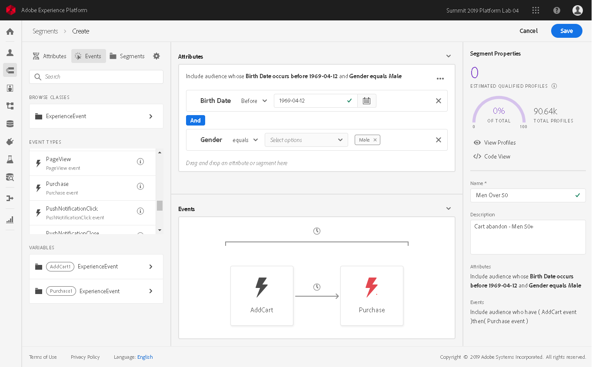

# Segment Builder

## Overview

The segment builder serves as a single workspace for Adobe Experience Platform for building audience segments from your [Unified Profile](../../../api-specification/markdown/narrative/technical_overview/unified_profile_architectural_overview/unified_profile_architectural_overview.md) data. Using the segment builder, the UI for using Segmentation Service, users can use a single segmentation workflow across solutions to generate audiences and power their consumer experiences.

### Terms used in this document

* __Segmentation__: Dividing a large group of individuals - customers, prospects, users, organizations - into smaller groups that share similar traits and will respond similarly to marketing strategies
* __Segment Definition__: The rule set defining how to subdivide a customer base, such as 'Men over 50'. Once conceptualized, segments are then defined in terms of the conditions that must be met to qualify for a segment
* __Audience__: The collection of individuals that meet the segment definition criteria

### How does segmentation work?

Segmentation deals with defining a particular subset of profiles from your profile store, or more specifically to describe the criteria distinguishing a marketable group of people among your profile store. For example, in an email campaign called 'Did you forget to buy your sneakers?', you may want an audience segment of all users who searched for running shoes within the last 30 days, but who did not complete a purchase. Or, you may want to target web content to display only for users with a certain rating in your rewards program.

When a segment has been conceptually defined, an organization's marketing department typically works with their data analysts to build the segment within Experience Platform. The data analyst reviews data being sent to Platform and selects which fields and values will be used to build the rules or conditions of the segment. The segment definition is then built using the segment builder or APIs. This document covers using the UI. For more information on building segment definitions using APIs, review the [Creating segments in Experience Platform via API](../../../api-specification/markdown/narrative/tutorials/creating_a_segment_tutorial/creating_a_segment_tutorial.md).

The segment rules themselves, whether created via API or the Segment Builder UI (described in this document), are ultimately defined using Predicate Query Language, or PQL. This is where marketing's conceptual segment 'Men over 50' gets described in the language built to retrieve profiles meeting the criteria (e.g. `person.age > 50 and person.gender = "male"`). If a suitable segment doesn’t already exist, a user can create a new segment.

Naturally, all data used in segment rules must be among the data uploaded to Platform. Consider a segment defined by an organization's rewards program "Member Rating", a proprietary attribute which isn't part of a standard schema. Using this data requires extending the principal Profile schema and adding a suitable field to that schema. Future uploads must then include that value. For more information on customizing XDM, visit [Schema Editor tutorial](../../../api-specification/markdown/narrative/technical_overview/schema_registry/schema_editor_tutorial/schema_editor_tutorial.md).

To gain a deeper understanding of the Unified Profile Service and the role of PQL in segmentation on Platform, please review the [API documentation](../../../api-specification/markdown/narrative/technical_overview/unified_profile_architectural_overview/unified_profile_architectural_overview.md#segmenting-your-base-creating-and-working-with-audiences).

---

## Using the segment builder

The segment builder is the visual development environment used to build segment definitions and serves as a common component of all solutions using Unified Profile.

The segment builder is accessible on Platform, under "Segments" when you choose "Create Segment". The segment builder provides a rich workspace that allows you to interface with your data elements to build and edit rules using drag and drop tiles to represent data properties, along with intuitive controls for building the rules of your segment.

### Left rail - Building blocks

The left rail provides access to drag and drop tiles representing any data element you might use to build a segment. Tiles are categorized under the type of data element.

**Attributes** - Profile data elements are accessible from within the "Attributes" tab. Beneath the search field is a hierarchical representation of Profile entities that can be expanded to reveal attributes, and where the attributes are tiles that can be dragged onto the rule builder canvas.  
**Events** - ExperienceEvent data elements are accessible from within the "Events" tab. The sections of this tab match the "Attributes" tab, where the entities and attributes reflect the ExperienceEvent schema.  
**Segments** - This tab lists all previously created segments. Dragging a segment onto the rule builder canvas results in that segment's attributes being added to the "Attributes" container, and the events from that segment are appended to the ExperienceEvent rules in the "Events" container.  
 
Any type of component can be searched by typing all or part of its name in the Search field of the left rail. For example, to build a rule based on the XDM field `ExperienceEvent.commerce.productViews`, type “product views” in the search field. The list immediately populates with fields that match that name, listing the object hierarchy to which it belongs.

> **Note:** Extension schema fields may take up to 24 hours to be available to Segmentation Service UI for use in building rules, beginning when data including values for that field begins hydrating Platform.

The left rail also provides you with configuration options under the gear icon, where you can choose to show all schema fields rather than the default which is to show only the fields that are populated in the data in your profile store.

### Rule builder canvas

In the center field of the Segment Builder, the rule builder canvas is where you'll construct the rules that combine to make up your segment definition. Dropping a tile from the left rail onto the rule builder canvas adds it to whatever container you drop it in, and presents options for building the rule relevant to the type of data element. 

* **String data** - A string attribute, such as the `homeAddress.countryCode` field from the "Attributes" tab, will place onto the rule builder canvas in the "Attributes" tab with options relevant to a string attribute. You can indicate that attribute must exist must not exist, or use comparison options such as "does not equal", "contains", or "starts with", where an additional field is presented to specify the value on which to base the comparison.
* **Date data** - A date attribute, such as `person.birthDate` presents with options such as "Today", "Yesterday", "This Month" and "This Year", allowing you to specify a rule relevant to "today" (the day the segment is built). Controls are also presented to allow you to articulate that the date must be relative to a date that you enter, where the options include "Before", "After", "From (to)", or just that the date be on a given date. Finally, options like "In Last", "During" and "Within" allow you to articulate that a date must have occurred in the last 2 weeks, that it must have occurred during the month of May, 2019, or that it must have occurred within 1 week of a particular date.
* **ExperienceEvents** - Any attribute from the "Events" tab of the left rail must be dragged onto the "Events" tab of the rule builder canvas. Event data is rendered with controls describing the rules of the event, like "Include" and "Exclude", as well as the number of times it must have or have not have occurred. Within this are controls similar to string and date data described above allowing you to describe the desired attribute of the event. When multiple events are used in segment rules, you are presented with options for defining the time relativity between any two events, as well as options for defining the time span during which all events of a group must have occurred. 
 * **Segments** - Embedded segments are added to the rule builder canvas such that the segment's event-based rules are added to the "Events" tab of the rule builder canvas, and attributes are added to the "Attributes" tab.

### Right rail - Segment properties

The right rail displays information to provide constant feedback as to what the results of applying the segment to your user base as you build segment rule. Each time a segment rule is added, removed, or changed, the estimate is re-run to remain relative to the edited state of the segment. Estimates generally run over 10-15 seconds, beginning with a rough estimate and refining as more records are read.

Unified Profile uses data samples to evaluate segments and estimate the number of profiles which would qualify. New data is loaded into memory each morning (between 12AM-2AM PT, which is 7-9AM UTC), and all segmentation queries are estimated using that day's sample data. Consequently, any new fields added or additional data collected will be reflected in estimates the following day.

You can view a paginated preview of the audience as you build by selecting "View Profiles" in the right rail.

---

## Building a segment

When creating a new segment project, you are asked for a segment name and description. The segment name is used to identify a particular segment from the collection of segments built in Segmentation Service and so should be descriptive yet concise and unique throughout your organization.

> **Note:** When planning a segment, remember that segments can be referenced from and combined with any other segment.  Consider the possibility that your rule may contain portions that could be reused.

### Rules

A rule refers to the smallest portion of a segment that resolves to a true or false and is joined to other rules by `AND` or `OR`. For example, there are two rules in the “Men over 50” segment, those with a gender of “male” and those with a birth-date of over 50 years prior to today.

To build a rule, first choose an attribute or event from the left rail on which the rule will be based. Drag the field onto the rule area, enabling controls for further configuring that rule. Extended schema fields may take up to 24 hours to be available to the Segment Builder UI for use in building rules, beginning when data including that field begins hydrating Platform.

A segment can be built from rules based on profile data, related time series data, or both.

### Containers

By default rules are evaluated in the order they are listed. Containers allow control of the order of execution by allowing nested queries.

Consider a campaign 'Order Product A Fast!' targeted to a segment of anyone who has purchased Product A more than three times in the last year, but who has never ordered it through your Quick Order feature. This rule could be defined using containers, where a container could represent 'All who have ordered Product A using Quick Order' and be referenced as an exclude from 'All who have ordered Product A more than 3 times in the last year'.

When adding rules to a container in the attributes section, they can be joined with AND logic (include all of) or using OR logic (include any of). When adding a rule to an event container, placing multiple rules within a container constrains the rules to be satisfied on the same event. For example, if two rules 'purchase exists' AND 'product contains "shoes"' were expressed within the same container, the resulting query would return only those profiles with a single experience event containing both a purchase and product containing "shoes."

#### Create a container

To create a new container, click the ellipses on the right side of the top of any container in the rules area to be presented with the option to add a container. The new container will appear as a child to the first container, but all containers can be dragged to move them to wherever they are needed at any time while building or editing the segment. 

By default, a container is an `include`, meaning to retrieve all profiles which meet the criteria defined. Any container can be configured as an `exclude` instead, meaning retrieve all except those who meet the criteria defined by the container. Click the ellipses on the right side of the top of any container to be presented with the option to change this setting.

A child container can have its contents extracted and added inline to its parent container by using its `Unwrap container` option. This results in the child container itself being deleted.

### Get feedback while you build

Each time your segment definition changes, your estimates are rebuilt. Use these figures and preview your profiles to ensure your changes are affecting your segment in the ways you expect.

See [Right rail - Segment properties](#right-rail---segment-properties) above, for specifics.

These estimates are generated based on data samples to evaluate segments and estimate the number of qualifying profiles. By using data samples stored in memory rather than an entire profile store, several performance gains can be realized without compromising the accuracy of your estimates.

Sample data is loaded into memory each morning (between 12AM-2AM PT, which is 7-9AM UTC), and all segmentation queries are estimated using that day's sample data. Consequently, any new fields added or additional data collected will be reflected in estimates the following day. 

You can determine when the last sample was updated by hovering over the information icon in the right rail, following "Estimated qualifying profiles".

The sample size depends on the overall number of entities in your profile store and breaks down into the following categories:

* __Up to 1 million profiles__: use full data set
* __1 to 20 million profiles__: use a sample set of 1 million profiles
* __Over 20 million profiles__: use a 5% sample size

Estimates can generally run over 10-15 seconds, beginning with a rough estimate and refining as more records are read.

---

## Using segments

The goal of Unified Segmentation is that any Adobe solution can refer to the segments centrally configured and maintained on Platform. 

### Segment types

Each segment can be configured to generate an audience by streaming in which the segment is evaluated on an ongoing basis. Support for snapshot segmentation (capturing all who meet the segment rules at the time of segmentation), is planned for an upcoming release.

#### Snapshot

A segment definition applied to profile data produces a list of profiles that meet the segment definition criteria at that time. The audience is then frozen, meaning no additions or removals occur automatically, though a snapshot can be updated at any time.

#### Streaming segmentation

Streaming segmentation provides a means to keep up and react to users' activity as actions are taken within their session or even past request. Once a segment has been built and saved, the segment definition is applied against incoming data on either the Unified Profile or the Unified Edge, depending on how the segment is activated (or used downstream). Additions and removals are processed regularly, and the actual segment membership evolves over time. 

#### Progressive segmentation

Progressive or multi-step snapshot segmentation is a common marketing use case where users begin with an initial snapshot or recipient list and apply rules to further segment the initial audience. For example, a marketer may want to start with an initial snapshot of people in the running shoe campaign, and then separate them into smaller segments such as perhaps:

* Male/female
* People who have opened and clicked on the email promotion
* People with a certain loyalty status

In this case these subsequent rules would be applied only to profiles who were part of the original snapshot (rather than the full profile store).

---

## Conclusion

Using Segmentation Service provides a consolidated workflow for building segments from Unified Profile data, regardless of the Adobe Experience Platform product in which you intend to use them. In summary:

* Use the drag and drop tiles on the left rail to add rules to your definition. You are able to base rules on XDM schema fields or other saved definitions
* As you build or edit your segment, the Segment Builder UI will display an estimation of the results of applying the definition to your entire profile store. These estimates are based on snapshots of your profile data which are loaded once per 24 hour period. The estimation information displayed includes the date of the sample being used to estimate. 
* The Segment Builder is a visual interface for the Unified Profile's Segment API, which you can learn more about by visiting [Creating segments in Experience Platform via API](../../../api-specification/markdown/narrative/tutorials/creating_a_segment_tutorial/creating_a_segment_tutorial.md).
