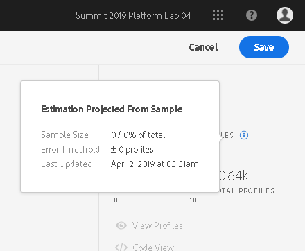
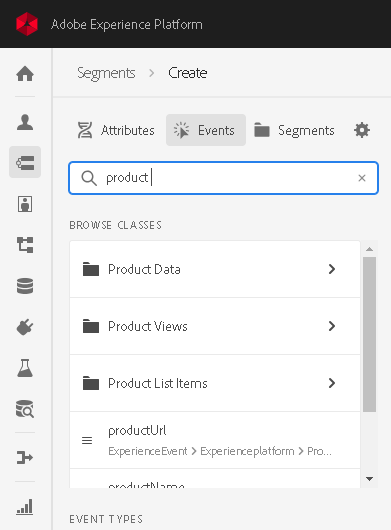

# Segment Builder

## Overview

The Segment Builder serves as a single workspace for Adobe Experience Platform for building segments from your Unified Profiles. Using Segment Builder, users can use a single segmentation workflow across solutions to generate audiences and power their consumer experiences.

### Terms used in this document

* __Segmentation__: Dividing a large group of customers, prospects, or consumers into smaller groups that share similar traits and will respond similarly to marketing strategies
* __Segment Definition__: The rule set defining how to subdivide a customer base, such as 'Men over 50'. Once conceptualized, segments are then defined in terms of the conditions that must be met to qualify for a segment
* __Audience__: The collection of profiles that meet the segment definition criteria

### How does segmentation work?

Segmentation deals with defining a particular subset of data from your profile store, a concrete example of which could be to describe the criteria distinguishing a marketable group of people among your profile store. For example, in an email campaign called 'Did you forget to buy your sneakers?', you may limit the recipients to the users among your user base who searched for running shoes within the last 30 days, but who did not complete a purchase. Or, you may want to target web content to display only for users with a certain rating in your rewards program.

When a customer segment has been conceptually defined, the marketing department typically works with their organization's data analysts to build the segment within Experience Platform. The data analyst reviews available data on Platform and selects which fields and values will be used to build the rules or conditions of the segment. Consider a segment defined by an organization's rewards program "Member Rating", a proprietary attribute which isn't part of a standard schema. A data analyst must ensure the XDM schema being used is an extension that includes a field for "Member Rating", and that the values for that field are included in the data being ingested into ACP.

The segment rules themselves, whether created via API or the Segment Builder UI (described in this document), are ultimately defined using Predicate Query Language, or PQL. This is where marketing's conceptual segment 'Men over 50' gets described in the language built to retrieve profiles meeting the criteria (e.g. `person.age > 50 and person.gender = "male"`). If a suitable segment doesn’t already exist, a user can create a new segment.

To gain a deeper understanding of the Unified Profile Service and the role of PQL in segmentation on Platform, please review the [API documentation](api-specification/markdown/narrative/technical_overview/unified_profile_architectural_overview/unified_profile_architectural_overview.md#segmenting-your-base-creating-and-working-with-audiences).

## Using the Segment Builder

The Segment Builder is the visual development environment used to build segment definitions and serves as a common component of all solutions using Unified Segmentation on Platform. 

### The UI

#### Header

The header displays estimates summarizing the results of applying the segment as it is defined in the rules area to your user base.  

Unified Profile Service uses data samples to evaluate segments and estimate the number of profiles which would qualify. New data is loaded into memory each morning (between 12AM-2AM PT, which is 7-9AM UTC), and all segmentation queries are estimated using that day's sample data. Consequently, any new fields added or additional data collected will be reflected in estimates the following day.

Each time a segment rule is added, removed, or changed, the estimate is re-run to remain relative to the edited state of the segment. The sample size depends on the overall number of profiles in the customer data and breaks down into the following categories:

* Up to 1 million profiles: use full data set
* 1 to 20 million profiles: use a sample set of 1 million profiles
* Over 20 million profiles: use a 5% sample size

Estimates generally run over 10-15 seconds, beginning with a rough estimate and refining as more records are read.

#### Left rail - Building blocks

The left rail provides access to draggable tiles representing any component you might use to build a segment. Such a component might be an XDM field, such as `person.age`, which a profile may be required to have a value greater than 50 to qualify for the segment. Segments can also be built using other segments. Consider the requirement for 'All customers who have placed any order, but have never ordered on mobile' which may then exclude the segment 'All customers who have ordered on mobile' from all profiles who have placed any order. 

XDM attributes can be accessed by drilling down into attributes from a principal schema such as Profile or ExperienceEvent. Previously saved segments are listed, and can be used to include or exclude results for the segment being built.

Any type of component can be searched by typing all or part of its name in the Search field of the left rail. For example, to build a rule based on the XDM field `ExperienceEvent.commerce.productViews`, type “product views” in the search field. The list immediately populates with fields that match that name, listing the object hierarchy to which it belongs.

When dealing with rules based on custom fields of XDM schema extensions, be aware that it may take up to 24 hours between the time data is ingested containing that data and the time your field to appears in the left rail to be used in a definition.

#### Rule Builder Canvas

In the center field of the Segment Builder, the rule builder canvas is where you'll construct the rules which will make up your segment.

### Building a segment

When creating a new segment project, you are asked for a segment name and description. The segment name is used to select a particular segment for use in solutions, such as Adobe Campaign, and so should be descriptive yet concise and unique throughout your organization.

 When planning a segment, remember that segments can be referenced from and combined with any other segment.  Consider the possibility that your rule may contain portions that could be reused

#### Rules

A rule refers to the smallest portion of a segment that resolves to a true or false and is joined to other rules by and or or. For example, there are two rules in the “Men over 50” segment, those with a gender of “male” and those with a birth-date of over 50 years prior to today.

To build a rule, find each component from the left rail that reflects the the rule will be based. Drag the field onto the rule area, enabling controls for further configuring that rule. Extended schema fields may take up to 24 hours to be available to the Segment Builder UI for use in building rules, beginning when data including that field begins hydrating Platform.

When adding a rule to a container, it will be appended to any existing rules in the container with the AND operator. Click the `AND` to access the option to change it to `OR`.

#### Rule types

A segment can be built from rules based on profile data, related experience events, or both.

##### Principal schema: Profile

Profile data refers to static information attached to a profile, such as email address or country of residence.

##### Principal schema: Experience event

An ExperienceEvent describes a touchpoint activity, and names an event and timestamp. This data identifies consumers who have had some interaction such as “anyone who has ordered twice in two weeks”.

#### Containers

By default rules are evaluated in the order they are listed. 
Containers allow control of the order of execution by allowing nested queries.

Consider a campaign 'Order Product A Fast!' targeted to a segment of anyone who has purchased Product A more than three times in the last year, but who has never ordered it through your Quick Order feature. This rule could be defined using containers, where a container could represent 'All who have ordered Product A using Quick Order' and be referenced as an `exclude` from 'All who have ordered Product A more than 3 times in the last year'.

When using containers with rules involving experience events or other time-series data, placing multiple rules within a container constrains the rules to be satisfied on the same event. For example, if two rules 'purchase exists' AND 'product contains "shoes"' were expressed within the same container, the resulting query would return only those profiles with a single experience event containing both a purchase and product containing "shoes."

##### Create a container

To create a new container, click the ellipses on the right side of the top of any container in the rules area to be presented with the option to add a container. The new container will appear as a child to the first container, but all containers can be dragged to move them to wherever they are needed at any time while building or editing the segment. 

##### Include or exclude

By default, a container is an `include`, meaning to retrieve all profiles which meet the criteria defined. Any container can be configured as an `exclude` instead, meaning retrieve all except those who meet the criteria defined by the container. Click the ellipses on the right side of the top of any container to be presented with the option to change this setting.

##### Unwrap 

A child container can have its contents extracted and added inline to its parent container by using its `Unwrap container` option. This results in the child container itself being deleted. 

#### Functions

This section describes the functions that can be used to build rules from XDM fields based on the field type.

##### String functions

For comparing against a string XDM field, you can use the string functions detailed in this section. With the exception of exists and does not exist, all string functions require a compare string as a parameter and allow enabling or disabling of case sensitivity.

* equals
* does not equal
* starts with
* does not start with
* ends with
* does not end with
* contains
* does not contain
* exists
* does not exist

##### Date/time functions

When working with timestamps, you are able to specify that the time be within the next 7, 14, 30, 90 days. Using the Custom Range option, you can enter a number of days, weeks, months or years in the past or future a timestamp can occur. Or, specify a month in which the timestamp must occur or must have occurred. 

## Using segments

The goal of Unified Segmentation is that any Adobe solution can refer to the segments centrally configured and maintained on Platform. 

### Segment types

#### Snapshot versus streaming segmentation

Each segment can be configured to generate an audience by streaming in which the segment is evaluated on an ongoing basis. Support for snapshot segmentation (capturing all who meet the segment rules at the time of segmentation), is planned for an upcoming release.

##### Snapshot

A segment definition applied to profile data produces a list of profiles that meet the segment definition criteria at that time. The audience is then frozen, meaning no additions or removals occur automatically, though a snapshot can be updated at any time.

##### Streaming segmentation

Streaming segmentation provides a means to keep up and react to users' activity as actions are taken within their session or even past request. Once a segment has been built and saved, the segment definition is applied against incoming data on either the Unified Profile or the Unified Edge, depending on how the segment is activated (or used downstream). Additions and removals are processed regularly, and the actual segment membership evolves over time. 

#### Progressive segmentation

Progressive or multi-step snapshot segmentation is a common marketing use case where users begin with an initial snapshot or recipient list and apply rules to further segment the initial audience. For example, a marketer may want to start with an initial snapshot of people in the running shoe campaign, and then separate them into smaller segments such as perhaps:

* Male/female
* People who have opened and clicked on the email promotion
* People with a certain loyalty status

In this case these subsequent rules would be applied only to profiles who were part of the original snapshot (rather than the full profile store).

## Conclusion

Using Adobe’s Segment Builder provides a consolidated workflow for building segments from Unified Profile data, regardless of the Adobe Experience Platform product in which you intend to use them. In summary:

* Use the drag and drop tiles on the left rail to add rules to your definition. You are able to base rules on XDM schema fields or other saved definitions
* Containers are used to scope and to control the order of execution of your rules. You are able to create a subset of data within a container to then include to your results, exclude. PQL also allows containers to be used for functions such as `count()` to glean the size of the results of the rules in that container
* As you build or edit your segment, the Segment Builder UI will display an estimation of the results of applying the definition to your entire profile store. These estimates are based on snapshots of your profile data which are loaded once per 24 hour period. The estimation information displayed includes the date of the sample being used to estimate. 
* The Segment Builder is a visual interface for the Unified Profile's Segment API, which you can learn more about [here](api-specification/markdown/narrative/technical_overview/unified_profile_architectural_overview/unified_profile_architectural_overview.md#5segmentingyourbasecreatingandworkingwithaudiences).
