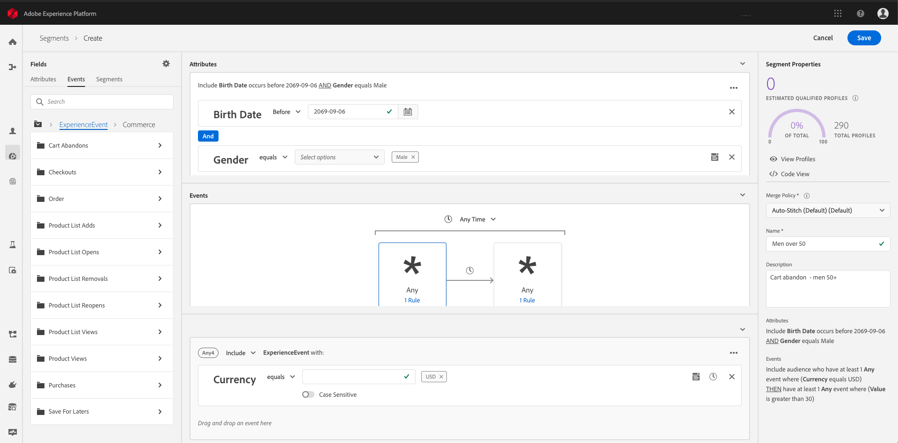
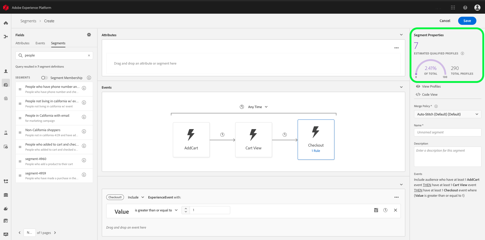

# Segmentation Service overview

Adobe Experience Platform Segmentation Service provides a user interface and RESTful API that allows you to create audience segments from your Real-time Customer Profile data. These segments are centrally configured and maintained on Platform, and are readily accessible to any Adobe solution. 

This overview will help you understand Segmentation Service and the role it plays in Adobe Experience Platform. The following topics are covered:
* [How does segmentation work?](#how-does-segmentation-work): Understand the big picture about segmentation and its role within Experience Platform.
* [Using Segment Builder](#using-segment-builder): Segment Builder is the UI for Segmentation Service within Adobe Experience Platform.
* [Segment building blocks](#segment-building-blocks): Understand the components required to make segmentation possible.
* [Rule builder canvas](#rule-builder-canvas): Add a new rule to the container of your choice.
* [Segment properties](#segment-properties): Understand the resulting segment properties from the rules created on the rule builder canvas.
* [Building a segment](#building-a-segment): Learn how rules influence the building of a segment.
* [Advanced segmentation service features](#advanced-segmentation-features): Learn how to create segments using multiple XDM classes and how contextual data can enhance your segment definitions.
* [Containers](#containers): Learn what this feature is and how it allows you to control segment rules. 
* [Get feedback while you build](#get-feedback-while-you-build): Learn the role estimates play in your segment definitions.
* [Segment types](#segment-types): Learn different ways to generate audiences using different segment types.

It is important to understand the following key terms used throughout this document:
* __Segmentation__: Dividing a large group of individuals (such as customers, prospects, users, or organizations) into smaller groups that share similar traits and will respond similarly to marketing strategies.
* __Segment Definition__: The rule set used to describe key characteristics or behavior of a target audience. Once conceptualized, segments are then defined in terms of the conditions that must be met to qualify for a segment.
* __Audience__: The resulting set of profiles that meet the criteria of a segment definition.

## How does segmentation work?

Segmentation is the process of defining a particular subset of profiles from your profile store, allowing you to describe criteria to distinguish a marketable group of people from your customer base. For example, in an email campaign called "Did you forget to buy your sneakers?", you may want an audience of all users who searched for running shoes within the last 30 days, but who did not complete a purchase. Alternatively, you may want to target an audience who did purchase running shoes within the last 30 days.

Once a segment has been conceptually defined, an organization's marketing department works with their data analysts to build the segment in Experience Platform. Upon reviewing the data being sent to Platform, the data analyst composes the segment definition by selecting which fields and values will be used to build the rules or conditions of the segment. This is done using either the Segment Builder or APIs. For information on building segment definitions using APIs, see the tutorial on [creating audience segments using APIs](../../../api-specification/markdown/narrative/tutorials/creating_a_segment_tutorial/creating_a_segment_tutorial.md).

Whether created using the API or using the Segment Builder, segments are ultimately defined using Profile Query Language (PQL). This is where the conceptual segment definition gets described in the language built to retrieve profiles meeting the criteria. For more information, see the [PQL overview](../../../api-specification/markdown/narrative/technical_overview/unified_profile_architectural_overview/unified_profile_pql.md).

 >**Note**: In the event a schema is extended, all future uploads must update newly added fields accordingly. For more information on customizing Experience Data Model (XDM), visit the [Schema Editor tutorial](../../../api-specification/markdown/narrative/tutorials/schema_editor_tutorial/schema_editor_tutorial.md).

## Using Segment Builder

As shown below, the Segment Builder provides a rich workspace that allows you to interact with Profile data elements. The workspace provides intuitive controls for building and editing segment rules, such as drag-and-drop tiles used to represent data properties. To access the Segment Builder within Experience Platform, click **Segments** in the left navigation, then click **Create Segment** in the top right corner of the screen. 

## Segment building blocks

Within the Segment Builder, the left rail provides access to the core building blocks of segments: attributes, events, and segments. Each building block appears in its own respective tab.  

* **Attributes** contains Profile data elements. Beneath the search field is a hierarchical representation of Profile entities that can be expanded to reveal attributes, where the attributes are tiles that can be dragged onto the [rule builder canvas](#rule-builder-canvas). 
   
* The **Events** tab is where you will find ExperienceEvent data elements. The sections of this tab reflect a schema that implements the XDM ExperienceEvent class.  

* **Segments** lists all previously created segments. Dragging a segment from this tab onto the rule builder canvas allows you to reuse it as a component of a new segment. When used as a component, a segment's attributes are added to the "Attributes" container, and the events from that segment are appended to the ExperienceEvent rules in the "Events" container.  
 
Any type of component can be searched for by typing all or part of its name in the search bar. For example, to build a rule based on the XDM field `ExperienceEvent.commerce.productViews`, start typing “product views” in the search field. As shown below, the search results begin to populate after the word "product" has been typed, listing the object hierarchy to which it belongs:

By default, only the populated schema fields from your data store are shown. To change your configuration settings and show all schema fields, click the gear icon in the left rail. 

> **Note:** Custom schema fields defined by your organization may take up to 24 hours to appear in the rule builder canvas and become available for use in building rules. More information on the rule builder canvas can be found in the following section.

## Rule builder canvas

A segment definition is a collection of rules used to describe key characteristics or behavior of a target audience. These rules are created using the *rule builder canvas*, located in the center of the Segment Builder. 

To add a new rule to the container of your choice, drag a tile from the left rail and drop it onto the rule builder canvas. To finish building the rule, you will be presented with context-specific options according to data type: 
  * String data
  * Date data
  * Experience events
  * Segments

To learn more about containers, visit the container section later in this document.

### String data

Any string attribute from the **Attributes** tab of the left rail must be dragged onto the **Attributes** tab of the rule builder canvas before presenting string relevant options. From these options, you can indicate that an attribute must exist or must *not* exist. Alternatively, you can use comparison statements such as "does not equal", "contains", or "starts with", where an additional field is presented to specify the value on which to base the comparison.

### Date data

A date attribute, such as the `person.birthDate` field presents relevant options including "Today", "Yesterday", "This Month" and "This Year", allowing you to specify a rule relevant to "today" (the day the segment is built). 

Date attributes present controls that allow you to specify time periods using "Before", "After", and "From (to)" options. Alternatively, you can also input a specific date. 

Finally, options like "In Last", "During" and "Within" allow you to articulate whether a date must have occurred within the last 2 weeks, that it must have occurred during the month of May 2019, or that it must have occurred within 1 week of a particular date.

### Experience Events

Any attribute from the **Events** tab of the left rail must be dragged onto the **Events** tab of the rule builder canvas. Event data is rendered using keywords "Include" and "Exclude", which describe the behavior of the event as well as the number of times it must (or must not) have occurred. Other event controls include string and date commands which allow you to create desired event attributes. 

As seen in the image below, when multiple events are used in segment rules, you are presented with options for defining the time relativity between any two events, as well as options for defining the time span during which all events of a group must have occurred. 

### Segments

When embedded segments are added to the rule builder canvas, event-based rules are added to the **Events** tab, and attributes are added to the **Attributes** tab.

## Segment properties
As shown below, when building a segment rule, the right-rail displays the resulting segment properties to help you understand the behavior of your target audience.

As you build your segment definitions, you can view a paginated preview of the audience by selecting **View Profiles** in the right-rail:

## Building a segment

When creating a new segment project, you are asked for a segment name and description. The segment name is used to identify a particular segment amongst the collection built by Segmentation Service. Segment names should therefore be descriptive, concise, and unique.

> **Note:** When planning a segment, remember that segments can be referenced from, and combined with, any other segment. Consider the possibility that your rule may contain reusable portions.

### Rules

A rule refers to the smallest portion of a segment that resolves to "true" or "false", and is joined to other rules by AND or OR operators. For example, there are two rules in the “Men over 50” segment: those with a gender of “male” and those with a birth-date of over 50 years prior to today.

To build a rule, select an attribute or event from the left rail and drag the field onto the rule area. This enables controls to configure the rule further. Extended schema fields may take up to 24 hours (from the time of ingestion into Experience Platform) to be available to the Segment Builder UI for use in building rules.

A segment can be built from rules based on profile data, related time series data, or both.

## Advanced segmentation features

Segmentation Service includes an expanded Segment Builder with two advanced segmentation features: multi-entity segmentation and segment payload. These advanced features will be discussed in more detail in the sections that follow.

### Multi-entity segmentation

With the advanced multi-entity segmentation feature, you can create segments using multiple XDM classes thereby adding extensions to person schemas. As a result, Segmentation Service can access additional fields during segment definition as if they were native to the profile data store.

Multi-entity segmentation provides the flexibility needed to identify audiences based on data relevant to your business needs. This process can be done quickly and easily without requiring expertise in querying databases. This enables you to add key data to your segments without having to make costly changes to data streams or wait for a back-end data merge. 

### Use case: price driven promotion
To illustrate the value of this advanced segmentation feature, consider a data architect collaborating with a marketer. 

In this example, the data architect is joining data for an individual (made up of schemas with XDM Profile and XDM ExperienceEvent as their base classes) to another class using a key. Once joined, the data architect or the marketer can use of these new fields during segment definition as if they were native to the base class schema.

**The problem**
The data architect and marketer both work for the same clothing retailer. The retailer has over 1,000 stores across North America and periodically lowers product prices throughout their lifecycle. As a result, the marketer wants to run a special campaign to give shoppers who have shopped for these items a chance to purchase them at the discounted price.

The data architect's resources include access to web data from customer browsing as well as cart addition data containing product SKU identifiers. He also has access to a separate "products" class, where additional product information (including product price) is stored. His guidance is to focus on customers who added a product to their cart within the last 14 days, but did not purchase the item, whose price has now dropped.

**The solution**
>Note: We will assume in this example that the data architect has already established an ID Namespace.

Using the APIs, the data architect relates the key from the ExperienceEvent schema with the "products" class. Doing so allows the data architect to make use of the additional fields from the "products" class as if they are native to the ExperienceEvent schema. As the final step of the configuration work, the data architect needs to bring the appropriate data into Real-time Customer Profile. This is done by enabling the "products" dataset for use with Profile. With the configuration work complete, either the data architect or the marketer can build the target segment in Segment Builder.

<!--to learn more, see the [multi-entity segmentation](to be completed) workflow--->

### Segment Payload

Segments can now carry a payload of contextual details to enable deep personalization of Adobe Solutions as well as external non-Adobe applications. These payloads can be added while defining your target segment.

With contextual data built into the segment itself, this advanced Segmentation Service feature allows you to better connect with your customer.

Segment Payload helps you answer questions surrounding your customer’s frame of reference such as:
* What: What product was purchased? What product should be recommended next?
* When: At what time and date did the purchase occur?
* Where: In which store or city did the customer make their purchase?

While this solution does not change the binary nature of segment membership, it does add additional context to each profile through an associated segment membership object. Each segment membership object has the capacity to include three kinds of contextual data:

* **Identifier**: this is the ID for the segment 
* **Attributes**: this would include information about the segment ID such as last qualification time, XDM version, status and so on.
* **Event data**: Specific aspects of experience events which resulted in the profile qualifying for the segment

Adding this specific data to the segment itself allows execution engines to personalize the experience for the customers in their target audience.

### Use cases

To illustrate the value of this advanced segmentation feature, consider three standard use cases that illustrate the challenges that were present in marketing applications prior to the Segment Payload enhancement:
* Email personalization
* Email retargeting
* Ad retargeting

**Email personalization**

A marketer building an email campaign may have attempted to build a segment for a target audience by using recent customer store purchases within the last three months. Ideally, this segment would require both the item name and the name of the store where the purchase was made. Prior to enhancement, the challenge was capturing the store identifier from the purchase event and assigning it to that customer’s profile.

**Email retargeting**

It is often complex to create and qualify segments for email campaigns targeting "cart abandonment". Prior to the enhancement, sending a discount coupon for the last product left in the cart along with a customer’s first name was difficult due to the availability of the required data. Data for which products were abandoned is tied to experience events which were formerly challenging to monitor and extract data from.

**Ad Retargeting**

Another traditional challenge for marketers has been creating ads to retarget customers with abandoned shopping cart items. While segment definitions addressed this challenge, prior to the enhancement, there was no formal method to differentiate between purchased products and abandoned products. Now you can target specific data sets during your segment definition.

<!--to learn more, see the [segment payloads workflow](to be completed)--->

## Containers

Segment rules are evaluated in the order they are listed. Containers allow control over the order of execution by allowing nested queries.

Consider a campaign "Order Product X Fast!" targeting a segment of anyone who has purchased Product X more than three times in the last year, but who has never ordered it through your Quick Order feature. This rule could be defined using containers, where a container could represent "All who have ordered Product X using Quick Order" whose behavior was defined to "exclude" the "All who have ordered Product X more than 3 times in the last year" criteria.

When adding rules to a container in the attributes section, they can be joined with either AND logic (include all of) or using OR logic (include any of). Placing multiple rules within a single container constrains the number of events that will pass the criteria. For example, if two rules "purchase exists" AND "product contains shoes" are expressed within the same container, the resulting query would only return profiles with a single event containing both a purchase and "shoes" product.

### Create a container

To create a new container, click the ellipses (...) on the top right side of the container (located in the rules area) to be presented with the option to add a container. While the new container initially appears as the child of the first container, you have the liberty to drag and move it (as well as any other container) while building or modifying the segment. 

By default, the behavior of a container is to include the retrieved  profiles satisfying the criteria defined. Alternatively, a container can exclude profiles meeting the container's criteria. To change this setting, click the dropdown menu located in the top left side of the container.

A child container can have its contents extracted and added inline to its parent container by using its "unwrap container" option, located in the dropdown menu in the top right corner of the child container. The child container is deleted in ths process.

## Get feedback while you build

Each time a segment definition is added, removed, or changed, its related estimate is rebuilt to provide a preview of the resulting target audience.

Estimates are generated by evaluating sample data (loaded into memory daily between 12AM-2AM PST / 7AM-9AM UTC) against a segment definition. As a result, sample data will not reflect new data fields or additional data collected until the following update cycle.

By using sample data stored in memory rather than an entire profile store, several performance gains can be achieved without compromising the accuracy of your estimates.

You can determine when the last sample was updated by hovering over the information icon in the right rail, following "Estimated qualifying profiles".

The sample size depends on the overall number of entities in your profile store and breaks down into the following categories:

* __Up to 1 million profiles__: use full data set
* __1 to 20 million profiles__: use a sample set of 1 million profiles
* __Over 20 million profiles__: use a 5% sample size

Estimates generally take 10-15 seconds to compile, starting with a rough estimate and refining as more records are read. 

## Segment types

A segment can be configured to generate an audience by using streaming data ingestion. This method causes the segment to be evaluated on an ongoing basis. Support for snapshot segmentation (capturing all who meet the segment rules at the time of segmentation), is planned for an upcoming release.

### Snapshot

A snapshot is the resulting audience of a segment definition applied to profile data, taken at a given instant. Once a snapshot is taken, no changes can be made to it. If changes are desired, a new snapshot must be created.

### Streaming segmentation

Streaming segmentation is an ongoing data selection process that updates your segments in response to user activity. Once a segment has been built and saved, the segment definition is applied against incoming data on either Real-time Customer Profile or the Edge service, depending on how the segment is activated (or used downstream). Segment additions and removals are processed regularly, ensuring your target audience remains relevant. 

### Progressive segmentation

Progressive or multi-step snapshot segmentation begins with an initial snapshot based on your pre-defined selection criteria before progressively adding additional criteria to further segment the initial audience. This strategy is popular among marketers because it allows them to personalize their messaging as they build relationships at scale. For example, a marketer developing a running shoe campaign may start with an initial snapshot of people before separating them into smaller segments such as:

* Male/female
* People who have opened and clicked on the email promotion
* People with a certain loyalty status

## Next steps

Segmentation Service provides a consolidated workflow to build segments from Real-time Customer Profile data. In summary:

* Segmentation is the process of defining a subset of profiles from your profile store, allowing you to characterize behavior of a desired marketable group. This process is completed by Segmentation Service.
* When planning a segment, keep in mind that a segment can be referenced from, and combined with, any other segment.
* A segment can be built from rules based on profile data, related time series data, or both.
* While segment rules are executed in the order they are listed, containers allow control over the order of execution by allowing nested queries.
* Every time a segment definition is changed, its related estimate is rebuilt, providing you with a preview of the resulting audience.
* Segmentation Service offers three segment types: snapshot, streaming segmentation and progressive segmentation.

<!--uncomment once advanced tutorial is live-->  
<!-- See the [advanced segmentation service tutorial]() to learn about multi-entity segmentation. -->

<!-- delete once Segment Builder UI tutorial is complete---->   
All functionalities provided in the Segment Builder can also be performed using APIs. See the tutorial on [creating segments using APIs](../../../api-specification/markdown/narrative/tutorials/creating_a_segment_tutorial/creating_a_segment_tutorial.md) for more information.