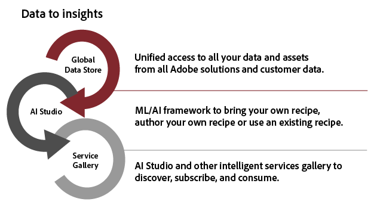
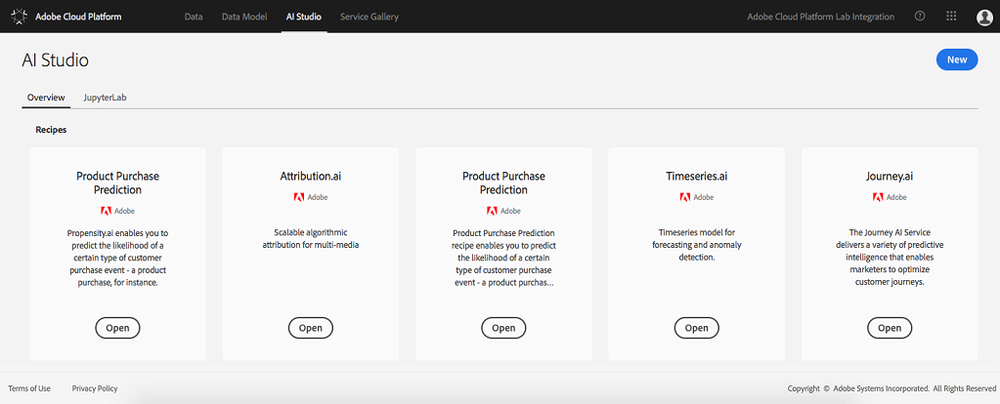
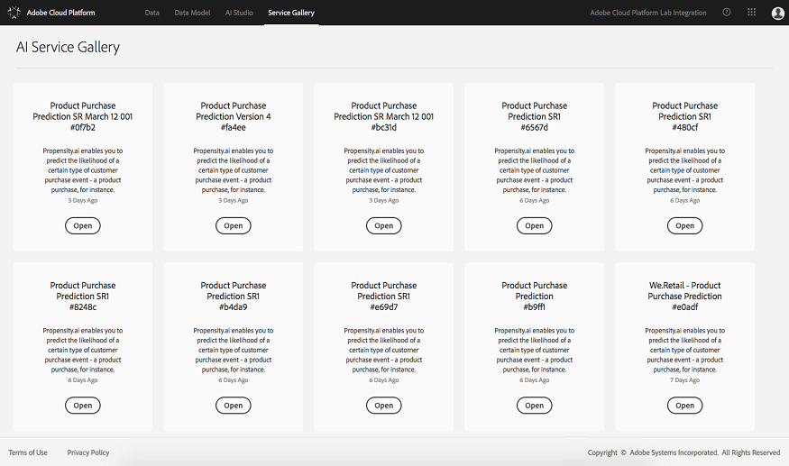
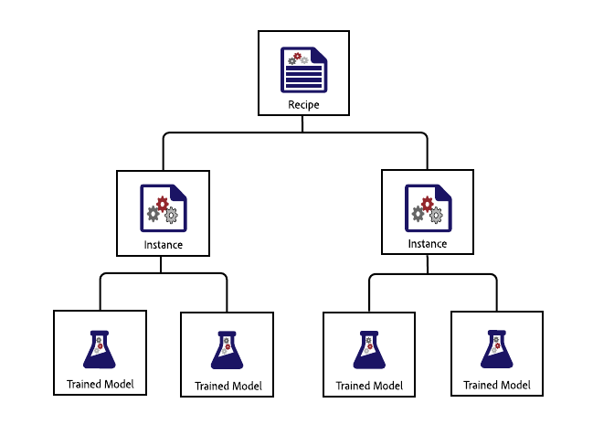
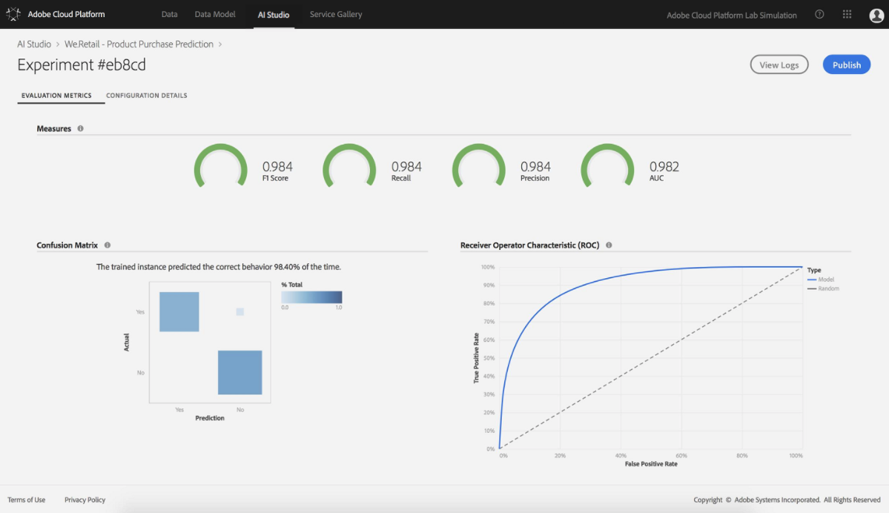

# Sensei Studio overview

## 1. Objective

The objective of this document is to give a data scientist an overview of AI Studio and how it ties into the Adobe Cloud Platform.

---

## 2. Overview

AI Studio uses Machine Learning (ML) and Artificial Intelligence (AI) to unleash insights from your data. Integrated into the Adobe Cloud Platform, AI Studio helps you make predictions using your content and data assets across Adobe solutions. Data scientists of all skill levels will find sophisticated, easy-to-use tools that support rapid development, training, and tuning of models - all the benefits of AI technology, without the complexity.

With AI Studio, you can automate personalized, targeted digital experiences in web, desktop, and mobile apps. Data scientists can easily create intelligent services adding the power of ML & AI learning to services which work with any Adobe services, including Adobe Target and Adobe Analytics Cloud. AI Studio brings experience-focused AI to bear across the enterprise, streamlining and accelerating data-to-insights-to-code with:

* A framework and an extensible runtime
* Integrated access to your data stored in Adobe Cloud Platform
* A unified data schema built on the Experience Data Model (XDM)
* Compute power essential for ML/AI and managing big datasets
* Prebuilt models to accelerate the leap into AI-driven experiences
* Simplified authoring, reuse, and modification of recipes for data scientists of varied skill levels
* Intelligent service publishing and sharing in just a few clicks—without a developer—and monitoring and retraining for continuous optimization of personalized customer experiences

---

## 3. Why AI Studio

Your data scientists can streamline the cumbersome process of uncovering insights in large datasets using AI Studio. Built on a common framework and runtime, AI Studio delivers advanced workflow management, model management, and scalability. Intelligent services support re-use of models, also known as recipes to power a variety of applications created using Adobe products and solutions. 

### 3.1 One-stop Data Access

Data is the cornerstone of AI and ML.

AI Studio is fully integrated with the Adobe Cloud Platform, including the Data Lake, Unified Profile, and Unified Edge. Explore all your organizational data stored in Adobe Cloud Platform at once, along with common big data and deep learning libraries, such as Spark ML, and TensorFlow. If you don’t find what you need, ingest your own datasets, or join common datasets using the XDM standardized schema.

### 3.2 Prebuilt Recipes

AI Studio includes prebuilt recipes for common business needs, like propensity and anomaly detection, so data scientist and developers don't have to start from scratch. The built-in recipe gallery offers recommendations for prebuilt recipes based on your business needs.

If you prefer, you can adapt a prebuilt recipe to your needs, import a recipe, or start from scratch to build a custom recipe. However you begin, once you train and hyper-tune a recipe, creating a custom intelligent service doesn’t require a developer—just a few clicks and you’re ready to build a targeted, personalized digital experience.

### 3.3 Workflow Focused on the Data Scientist

AI Studio is a completely integrated into Adobe Cloud Platform giving centralized access to tools for:

* __Data Exploration__ - Finding the right data and preparing it is the most labor-intensive part of building an effective recipe. AI Studio and the Adobe Cloud Platform help you get from data to insights more quickly.
* __Authoring__ -  With AI Studio, you decide how you want to author recipes. You can choose from prebuilt recipes, build a recipe from scratch, or even upload recipes authored outside the Adobe Cloud Platform.
* __Experimentation__ -  AI Studio brings tremendous flexibility to the experimentation process.
* __Operationalization__ -  Once you've settled on a recipe, it’s just a few clicks to create an intelligent service. No coding required—you can do it yourself, without enlisting a developer or engineer.

### 3.4 Continuous Improvement

AI Studio tracks where intelligent services are invoked and how they’re performing. As data rolls in, you can evaluate intelligent service accuracy to close the loop, and retrain the recipes as needed to improve performance. The result is continuous refinement in the precision of customer personalization.

### 3.5 Access to New Features and DataSets

Data scientists can take advantage of new technologies and datasets as soon as they are available through the Adobe services. Through frequent updates, we do the work of integrating datasets and technologies into the platform, so you don’t have to.

### 3.6 Security and Peace of Mind

Securing your data is a top priority for Adobe. We protect your data from the physical layer up, with hundreds of security processes and controls to help us comply with industry-accepted standards, regulations, and certifications.  We build security into our software and services using the Adobe Secure Product Lifecycle. To learn more about Adobe data and software security, compliance, and more, visit our security page at [https://www.adobe.com/security.html](https://www.adobe.com/security.html)

---

## 4. AI Studio In Action

Predictions and insights provide the information you need to deliver a highly personalized experience to each customer who visits your web site, contacts your call center, or engages in other digital experiences. Here’s how your day-to-day work happens with AI Studio.

### 4.1 Data Exploration and Preparation

On the Adobe Cloud Platform, your cross-channel data is centralized and stored in the XDM standardized schema, so data is easier to find, understand, and clean. A single store of data based on a common schema can save you countless hours of data exploration and preparation.

As you browse, use the R, Python, or Scala language with the integrated, hosted Jupyter Notebook to browse the catalog of data on the platform. Using one of these languages, you can also take advantage of Spark ML and TensorFlow. Start from scratch, or use one of the notebook templates provided for specific business problems.

As part of the data exploration workflow, you can also ingest additional data onto the platform and find reusable features extracted from shared datasets to help with data preparation.  

### 4.2 Authoring

If you can't find what you need among the prebuilt recipes out of the box, you might consider finding one close and modifying it to suit your business needs.

Or, create a recipe from scratch—taking advantage of the authoring runtime in Jupyter Notebook. Using the authoring runtime ensures that you can use the AI Studio experimentation workflow and convert the recipe later as a service so it can be stored in the recipe gallery and reused by others in your organization.

### 4.3 Experimentation

With a recipe in hand that incorporates your core algorithms, you can create one or more unique instances of the recipe, and change the parameters for each instance so you can experiment. You can then evaluate each unique recipe instance.

As you experiment, AI Studio keeps track of evaluation metrics for each unique recipe instance and each trained instance. You can check AI Studio’s evaluation metrics as you experiment to find the instance that performs best.

### 4.4 Operationalization

When you’ve selected the best trained recipe to address your business need, you can create an intelligent service in AI Studio without developer assistance. It’s just a couple of clicks — no coding required. Then, publish the intelligent service to Adobe I/O for deployment in digital experiences.

As your intelligent service is deployed, you can continue to track where it’s used and how it’s doing, retraining it to improve performance as more data becomes available.

### 4.5 Service Gallery 

You can also publish your intelligent service to the Service Gallery, where it’s available to specific people, specific organizations, or everyone who develops data solutions on the Adobe Cloud Platform. You can even share it with your external partners, and they can share their intelligent service with you. And the next time you’re starting a new recipe, you can check the Service Gallery to see if there’s a similar intelligent service you can use to get started. 

---

## 5. Conclusion

AI Studio streamlines and simplifies data science workflow, from data gathering to algorithms to intelligent services, for data scientists of all skill levels. With the sophisticated tools AI Studio provides, you can significantly shorten the time from data to insights.

More importantly, AI Studio puts the data science and algorithmic optimization capabilities of Adobe’s leading marketing platform in the hands of enterprise data scientists. For the first time, enterprises can bring proprietary algorithms to the platform, taking advantage of Adobe’s powerful AI capabilities to deliver highly personalized customer experiences at massive scale. 

With the marriage of brand expertise and Adobe’s AI prowess, enterprises have the power to drive more business value and brand loyalty by giving customers what they want, before they ask for it.