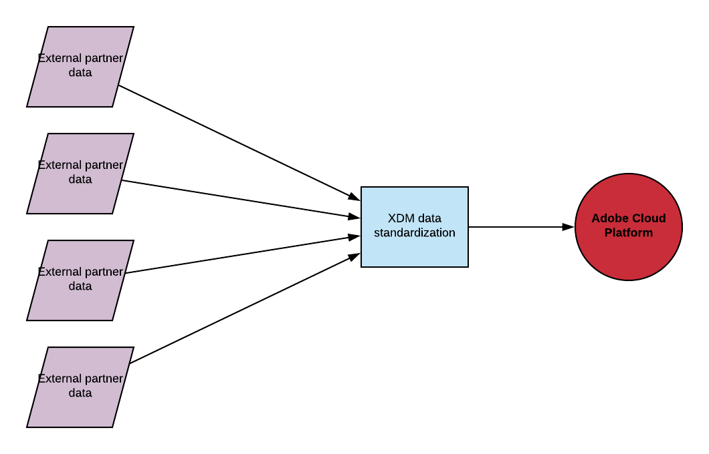
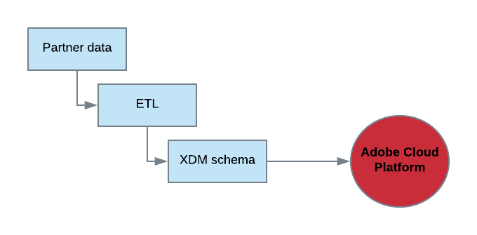
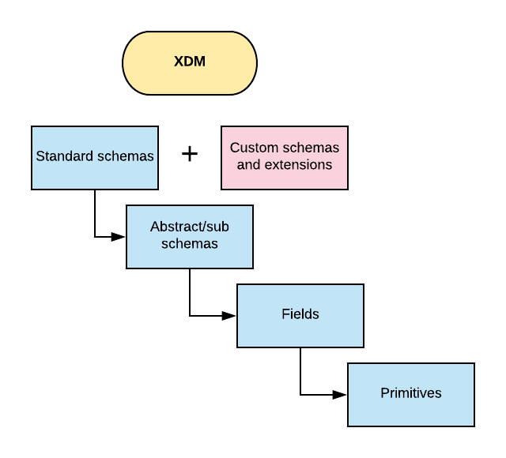
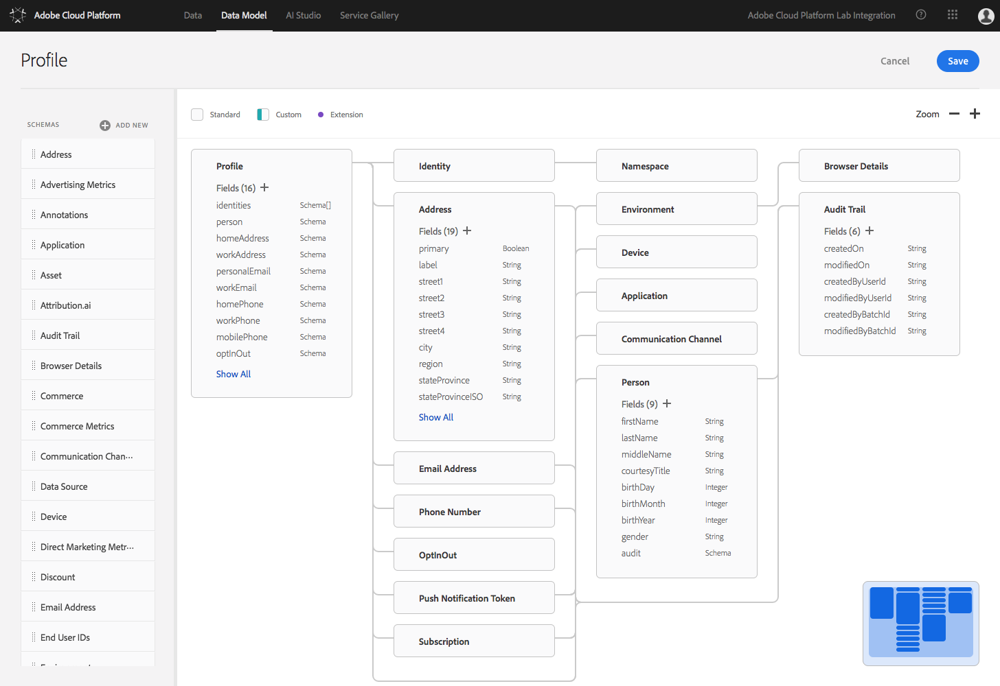
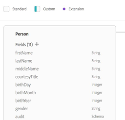

# Experience Data Model (XDM)
*Non-Technical Overview*

The [Experience Data Model (XDM)](https://www.adobe.io/open/standards/xdm.html) is an open, cross-Adobe initiative that expands and standardizes the way data is used in Customer Data Platforms (CDP). Specifically, XDM is a set of standard data schemas that allows data to flow effortlessly across all [Adobe Experience Cloud solutions and products](https://www.adobe.com/experience-cloud/overview.html), and to XDM compliant partner and customer implementations. This standard schema provides a common grammar to describe the building blocks of anything experience related. Adobe&#39;s data platform is built on XDM, and it provides specialized customer engagement functionality, such as identity, real-time edges services, machine learning, etc.

Adobe applications (like [Analytics](https://www.adobe.com/data-analytics-cloud/analytics.html?sdid=71KW71HP&amp;mv=search) and [Campaign](https://www.adobe.com/marketing-cloud/campaign.html?promoid=1FJDDMMS&amp;mv=other)) work with the same standardized XDM-based data, such that any data transformed into XDM is available to all solutions. The end-user advantage of this data standardization resides in a unified data environment within which data from many disparate sources becomes consolidated by way of a standard structure, and therefore available to the ever-evolving needs of data applications. This allows Adobe partners to tailor market campaigns using highly-defined customer profiles, and within the context of a precise, segmented market structure.

For example, campaign managers might utilize Adobe [Target](https://www.adobe.com/marketing-cloud/target.html) to create a campaign that isolates a specific audience segment. This requires structured data that can be queried and manipulated, which is the purview of XDM, and of [Adobe Cloud Platform (ACP)](https://www.adobe.com/enterprise/cloud-platform.html?s_cid=701140000027ooFAAQ&amp;s_iid=70130000000kYe0AAE&amp;sdid=4F569NLM&amp;mv=search&amp;edtamo=true&amp;s_kwcid=AL!3085!3!%7bcreative%7d!e!%7bplacement%7d!o!!adobe%20cloud%20platform&amp;ef_id=WqxP8AAAAKxLjTRz:20180317005857:s) in general. In an effort to facilitate this campaign, Adobe leverages XDM so as to offer partners all Experience Cloud solutions, such as Adobe Campaign and Adobe Target, which segment audiences for market campaigns.

Ultimately, XDM offers Adobe partners a secure and standardized data platform into which partners might model data for use with any number of Adobe solutions, and thus increase access to potential customers.

Figure 1. (Data Standardization)

Data that cannot interrelate with external solutions suffers from data isolation. The design of XDM solves the problem of data isolation by means of standard schemas, sub schemas, and fields–essentially an information environment that standardizes data from sources using varying data formats and protocols. This standardization allows partner data to transverse seamlessly across ACP, which eliminates any data translation problems. In this manner, data becomes malleable for purposes of data management and articulation. If not for XDM standardization, data would remain otherwise isolated at its source, and therefore unable to find accord with the broad spectrum of Adobe Experience solutions.

# The Function of XDM

As the standard data vernacular spanning the entire Cloud Platform, XDM employs a standard data schema structure to drive (by way of Experience solutions and products) personalized market campaigns across multiple channels.

For instance, marketers demand meaningful information about customers, such that they might customize campaigns to a specific profile segment. XDM facilitates profile segmentation by standardizing data and then leveraging Unified Profile (UP) to segment an audience. In this instance, UP provides partners access to XDM-modeled data, which can be segmented based on specific campaign data needs, e.g. all men under forty who live in the Pacific Northwest.

If desiring information pertaining to a person, such as name and address, one would utilize the Profile standard schema. If requiring information on an event, such as the date and time a person logged on to a website, one would leverage the ExperienceEvent standard schema.

# How XDM Works

The transferring of partner data into XDM schemas begins with the mapping of data. Data wranglers isolate fields from their own data store and align them with the corresponding XDM schema syntax and semantics. This mapping provides for the seamless introduction of partner datasets into XDM schemas. The next step involves the extraction of data, which requires the partner to generate a dataset from its own data store. Once this dataset is created, it is then ready for transformation. This transformation includes translating a partner dataset into an XDM schema-compatible arrangement. The final step entails the transference/loading of this dataset from a partner system to the Adobe Cloud Platform. Once ingested into the ACP, partner data becomes standardized and, therefore, compatible with all Experience solutions. Comporting one&#39;s data with XDM schema structure mitigates data housing and translation problems, such that customer segmentation, marketing campaigns, etc. become effortless, exact, and predictable.

 

Figure 2. (From Data Isolation to Adobe Solutions)

Standardizing data within the XDM schema structure allows partners to leverage Adobe solutions and products for any number of market campaign purposes. That is, ACP provides an infrastructure to work with standard schemas, define them, bring data into the Platform by way of standard schemas, and then leverage the UP service to build audience segments and audience queries based on these standard schemas.

# Components of XDM

XDM is comprised of an hierarchical data structure based on proprietary standard data schemas, abstract/sub schemas, fields, and primitives. This hierarchical structure is primarily governed (syntax and semantics) by way of JSON-Schema.

 

Figure 3. (Components of XDM Schema)

This normalizing data environment also includes the option of customizing standard XDM schemas. This is accomplished through the use of extensibility, or _extensions,_ the likes of which provision the user of XDM to align non-standard datasets with standard XDM schemas. In essence, extending standard data schemas allows for a sophisticated, personalized data structure, one that facilitates a more refined and precise market campaign.

# Key XDM Standard Schemas

The ACP requires data normalization via a standard schema, specifically XDM; which is to say, a commensurate schema structure that provides for a seamless interrelationship between partner data and Adobe solutions. As such, Adobe provides standard schemas into which data might be ingested for use within, say, Campaign or Target. Over time, Adobe has evolved and increased its range of standard schemas to include (but not limited to) ExperienceEvent and Profile standard schemas.

### ExperienceEvent

The ExperienceEvent standard schema aids in the capture of events that occur in time, i.e. _what_ occurred and _when_. Adobe Analytics relies on such data for scrutinizing singular fluctuations in observable behavior, e.g. website visits, product views, hardware and software use, etc. These fact-records are immutable and without aggregation, and therefore without interpretation–the benefit of which being the broad application of highly-defined data. This kind of data offers end-users of XDM an unobstructed viewpoint from which to survey changes in events that occur in windows of time, and therefore to track trends and customize market campaigns to meet precise industry specifications.

ExperienceEvent events can be either explicit or implicit. Explicit events are direct observations of a human action taking place during a point in time. Implicit events are events that are being raised without direct human action, but still relate to a human. Examples of implicit events are scheduled email sending of newsletters, battery voltage reaching a certain threshold, a credit card settling. And while not all events are easily categorized across all data sources, it is extremely valuable to harmonize, when possible, similar events into similar types for processing.

### Profile

The Profile standard schema is a single representation of the attributes of both identified and partially-identified persons. Profiles that are highly-identified can be used for personal communications or focused market campaigns, as they contain detailed personal information (such as names, genders, dates of birth, geo-locations) and contact information (such as phone numbers and email addresses).

Profiles that are less mature and deficient in concrete identifying characteristics contain only anonymous behavioral events, such as browser cookies. Nevertheless, this sparse data can be used to create the foundation of a highly-identified profile. That is, by way of storing information on interests and preferences of an anonymous person, the Profile standard schema accommodates more and more robust and detailed data. And as the individual interacts more frequently with the user interface of a brand, the further refined the profile becomes in classifiable details, until eventually this person signs-on to notifications, subscriptions, purchases, and other connections with the brand that enrich and round out the profile.

# XDM Workspace

Understanding and directing one&#39;s data is essential for market segmentation, and thus reaching one&#39;s intended audience. The XDM user interface, termed _XDM Workspace_, allows partners to do exactly this. XDM Workspace affords one the ability to view, create, and extend data schemas, such that Adobe partners might target an exact customer segment with precisely articulated data.

 

Figure 4. (XDM Workspace UI)

# XDM Extensibility

Adobe&#39;s standard schemas offer partners the ability to model data into a common data environment governed by standardizing syntax and semantics. This normalization of data allows for the interoperability between partner data and Adobe solutions–including Analytics. Moreover, XDM schema protocols provision the end-user to add new custom schemas, or to _extend_ XDM standard schemas, features that personalize schemas to the unique specifications maintained by Adobe partners.

 

Figure 5. (XDM Abstract Schema w/o Extension)

 

Figure 6. (XDM Abstract Schema w/ Two Extensions)

The two examples above show the abstract schema  &quot;Person,&quot; the first without any extensions, and the second with two extensions. Though each Adobe standard schema maintains a normalizing structure into which data might be modeled, partners of Adobe may choose to add additional (extended) fields, or to create a custom schema altogether.

In any case, all Adobe standard schemas, extended schemas, and custom schemas cannot be destroyed, only deprecated. This ensures that data remains intact, and that it is never lost or duplicated. These schemas are maintained in the Adobe XDM registry, a clearinghouse for all schemas.

# XDM and Adobe Solutions

XDM promotes compelling and relevant digital experiences via the Adobe Cloud Platform in general, and Experience solutions and products specifically. That is, the Adobe Solutions paradigm supports platform thinking, with a strong extensible, but easy-to-adopt platform of core services, which enable customers and partners to extend Adobe solutions and products to support unique and differentiated use cases. Moreover, by means of ACP solutions, XDM offers a reduction in time-to-value and provides partners repeatable solutions for any market campaign.

# Contact Information

- Slack: xdm-questions
- Email:  [grp-xdm@adobe.com](mailto:grp-xdm@adobe.com)
