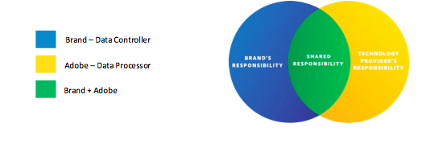
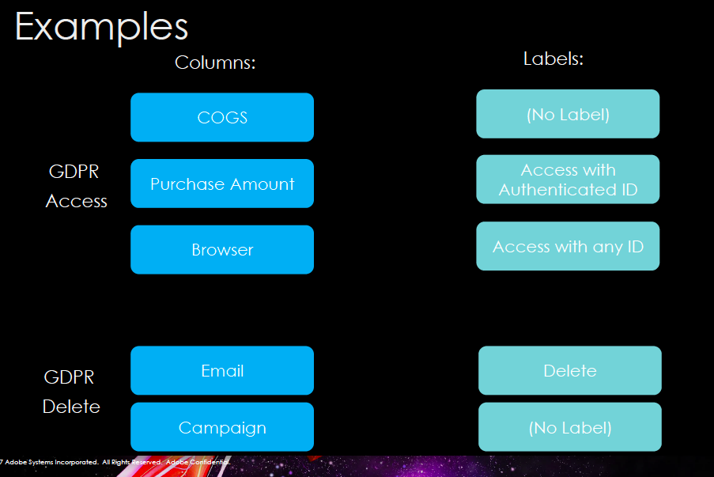
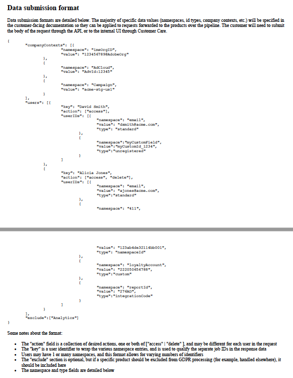
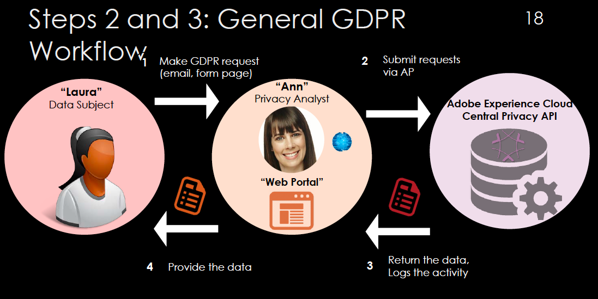

Adobe Experience Cloud GDPR Whitepaper

Length: ~10-12 pages

Draft

# Adobe Experience Cloud and GDPR

Implementing the Adobe Experience GDPR API for streamlined GDPR requests\*

**[****DATE****]**

## Content

- What is GDPR and why it matters
- Adobe and data governance
- Roles and responsibilities: How Adobe supports brands&#39; GDPR compliance
- Key steps to GDPR readiness
- Adobe Experience Cloud&#39;s GDPR API: How It Works
  - Prepare before the GDPR deadline in 4 steps
  - Submit data requests via the Adobe Experience Cloud GDPR API
- Example workflow: Submitting GDPR requests to Adobe Experience Cloud

## Introduction

The way we look at it, data privacy is a key part of how brands create and sustain consumer trust. As the May 25, 2018 deadline for GDPR compliance approaches, consider it an opportunity to &quot;lean in&quot; to what Adobe Experience Cloud is all about – customer centricity and advancing the customer experience. Now is the time to reevaluate customer experience and customer journey best practices as they relate to data collection, transparency and consumer choice. In addition, preparing for GDPR and designing systems and policies with privacy in mind today is a smart investment in your organization&#39;s future – a necessity for global brands as well as any organizations that engage in digital marketing, particularly in highly regulated industries.

Adobe Experience Cloud&#39;s role as one of your GDPR data processors is to assist you in managing consumer data from across Adobe Experience Cloud solutions to meet GDPR obligations. Adobe Experience Cloud already has a strong foundation of certified security controls and privacy by design. In addition, Adobe Experience Cloud has made enhancements to its products to support GDPR readiness, including developing the Adobe Experience Cloud API for submitting GDPR processing requests to Adobe Experience Cloud. A key benefit of this API is that it enables brands to scale their response by handling potential high volumes of consumer information requests via automation.

_\* Disclaimer: This whitepaper_ _is intended to provide general information and guidance_ _is a guideline_ _and does not represent legal counsel. Seek the advice of your legal counsel for meeting the requirements in the regions where you operate._]

This whitepaper will provide you with a brief overview of key GDPR principles important to data collection practices, suggested key steps to GDPR readiness, and sets out the roles and responsibilities of brands that use Adobe Experience Cloud. In addition, you will find the technical documentation you need to implement the API in order to submit GDPR data requests to Adobe Experience Cloud.

[CALLOUT]

**Adobe Experience Cloud solutions supported by the GDPR API**

This whitepaper helps Adobe Experience Cloud customers using the following solutions. Here are the Solutions addressed by the GDPR API. For customers using older other versions of Adobe Experience Cloud solutions (see notes below), you will need to obtain documentation for those versions in order to implement the GDPR API, please consult product documentation for information on GDPR readiness.

- Analytics Cloud
  - Adobe Analytics
  - Adobe Audience Manager
- Advertising Cloud
  - Adobe Media Optimizer
- Marketing Cloud
  - Adobe Campaign\*
  - Adobe Experience Manager\*\*
  - Adobe Social
  - Adobe Target
- Platform Services

[END CALLOUT]

## What is the General Data Protection Regulation (GDPR) and why it matters

GDPR is the European Union&#39;s new privacy law that harmonizes and modernizes data protection requirements. The new rules have a broad definition of personal data and a wide reach, affecting any brand that markets products or services to individuals in the EU. GDPR goes into effect on May 25, 2018.

One of the key requirements of GDPR is enabling consumers&#39; rights regarding personal data that a brand may have collected, including the rights to access and deletion.

There are four principles of GDPR that brands should closely consider as they review data collection practices related to the Experience Cloud:

1. **Focus on collecting only the data you need:** To become GDPR ready it&#39;s important for brands to take stock of the data being collected, and not collect more data than necessary.
2. **Obtain appropriate consent:** GDPR is a good opportunity to re-consider your consent management strategy and practices. Under GDPR (and the related ePrivacy requirements), consent must be specific and unambiguous and their must be a clear affirmative action by the site or app visitor.  … It also must be presented separately, y… easily understood and distinguishable from other content.
3. **Remove personal identifiers where possible:**  Brands should As brands review data used to identify consumers, it&#39;s important to consider the role for privacy enhancing techniques like data hashing, either making that data obfuscation or data anonym us or pseudonymous. Making data pseudonymous means replacing personal identifiers with another unique identifier usually generated through hashing, encryption, or tokens. Doing this will help minimize your compliance obligations.
4. **Honor data access and delete requests:** Consumers have certain rights related to personal data brands collect and maintain about them, including the rights to access or delete information about them. To prepare to respond to these requests, brands should set data retention policies with their processors, such as Adobe Experience Cloud. Applying appropriate, secure, and timely retention policies is an important part of GDPR readiness. Not only will this help address requirements related to not keeping data longer than necessary, but it will also assist in reducing the processing times associated with individual rights requests (e.g., consumer rights to access and delete personal data).

[CALLOUT]

**What is personal data?**

&quot;Personal data&quot; is any information relating to an identified or identifiable natural person (&quot;data subject&quot;). An identifiable natural person is one who can be identified, directly or indirectly, in particular by reference to an identifier such as a name, an identification number, location data, an online identifier or to one or more factors specific to the physical, physiological, genetic, mental, economic, cultural or social identity of that person.

_ __Source:_ [_https://gdpr-info.eu/art-4-gdpr/_](https://gdpr-info.eu/art-4-gdpr/)

[END CALLOUT]

## Adobe and data governance

To back up a moment, before diving into Adobe Experience Cloud&#39;s GDPR API, it is worth stating that a the key step in to GDPR readiness is having a robust data governance platform, like the Adobe Cloud Platform, in place to help address protect data protection and privacy consumer privacy.  /personal information and mitigate security risks.

The Adobe Cloud Platform (ACP) provides an integrated solution that connects a brand&#39;s data governance infrastructure with the tools it uses to create and manage consumer experiences. The data governance features of Adobe Cloud Platform enable the direct linkage of data governance policy to data usage. ACP, as a data and intelligence platform that enables all of Adobe&#39;s marketing and consumer experience solutions in Adobe Experience Cloud, centralizes the collection and storage of all consumer experience-related data and offers data governance actors (e.g., stewards, scientists, engineers, marketers) the features they need to help define and enforce data governance rules that activate that data for the Experience Business. For more information about ACP data governance features, see the

[CALLOUT]

**What is data governance?**

Data governance is having a system in place consisting of the people and digital tools required to exercise authority, control and shared decision-making. It means creating a team to control data governance and giving that team the tools they need to govern data effectively and efficiently in real time. It encompasses both the strategies and the technologies required to ensure data and its use complies with the regulations, restrictions, and policies governing that use: data catalogs, data lineage, data usage labeling, data access policies, and more.

[END CALLOUT]

## Roles and responsibilities: How Adobe Experience Cloud supports brands&#39; GDPR readiness

GDPR sets clearly lays out the obligations for the various parties involved with GDPR readiness. The obligation to meet the GDPR principles regarding data collection (see p.2) falls upon brands, also known as data controllers. However, the journey to GDPR readiness is in part shared between data controllers (brands), and technology vendors or data processors like Adobe Experience Cloud. There are three parties to become familiar with. Each of these parties is defined below within the context of Adobe Experience Cloud.

| Data subjects | Adobe Experience Cloud&#39;s customers&#39; consumers |
| ----- | ----- |
| Data controllers | Adobe Experience Cloud&#39;s customers |
| Data processor | Adobe Experience Cloud |

Adobe Experience Cloud&#39;s role is to help our be a strong partner to our customers (the data controllers) respond to requests from their consumers (data subjects)by helping to streamline the when it process for customers to submit GDPR requests comes individual rights requests (e.g., (access or delete requests) related ) to data maintained in the Adobe Experience Cloud. We&#39;ll help controllers/our customers meet their obligations by turning around GDPR requests in a timely fashion.

**You are the data controller.** As the data controller, you determine the personal data Adobe Experience Cloud will process and store on your behalf. If you use Adobe cloud solutions, we may process personal data for you depending on the products and solutions you use and the information you choose to send to your Adobe account or service. As a controller, you will provide privacy notices to individuals who engage with your brands detailing how you collect and use information, and obtain consents, if needed. If those individuals want to know what data you maintain about them or decide they want to discontinue their relationship with you, you will respond to those requests. You also are responsible for updating your brand&#39;s data governance, privacy and security policies and procedures.

**We are the data processor.** When Adobe Experience Cloud provides software and services to a brand, we&#39;re acting as a data processor for the personal data you ask us to process and store as part of providing the services to you. As a data processor, we only process personal data in accordance with your brand&#39;s permission and instructions — for example, as set out in your agreement with us. Where your data is in one of Adobe&#39;s cloud solutions and you need our assistance with any individual consumer requests, we will partner with you through processes, products, services, and tools to help you respond.

## Key steps to GDPR readiness

Although every brand will determine its own GDPR-preparation strategy, we suggest that brands assess their GDPR readiness by thinking through five key steps. These include:

1. Inventory your digital properties, including mobile apps and websites, to assess which cookies, tags, or other data are necessary.
2. Map your customer journey and tell your privacy story through meaningful notices and choices.
3. Develop a consent management strategy with an eye toward customer experience.
4. Think about how you will authenticate user identity to address data subject access requests.
5. Identify or capitalize on existing processes to help respond to data subject access requests, including appointing a privacy point of contact.

GDPR puts increased emphasis on data collection best practices, transparency from data controllers, and consumer choice—all of which play a meaningful role in the customer journey. Some key considerations:

| **Topic** | **Questions to ask**   |
| --- | --- |
| Data minimization | What data do I need and not need to collect for my marketing efforts to be effective? |
| Consent/opt-in | How do I provide delightful customer experiences with consent and without unwanted surprises? Consider the value proposition for consumer privacy, which will drive conversion and loyalty. |
| Required levels of notice and/or consent | Is notice enough? Is there another legal basis for certain data processing activities (e.g., product development and enhancements), such as legitimate interest, where you wouldn&#39;t need consent?   |
| Anonymization and pseudonymization of data | How will we anonymize or pseudonymize personal data? Pseudonymizing data (i.e., replacing personal details with another unique identifier, typically generated through some kind of hashing, encryption or tokenization function) will minimize the risk of data and privacy breaches and claims. For example, &quot;John Smith bought product X&quot; could be pseudonymized to &quot;Visitor 15436 bought product X.&quot; |

[CALLOUT]

_Tip: Operate from the presumption that_ _under the wide definition_ _personal data_ _much_ _most_ _of the_ _consumer_ _data you have is not anonymous_ _(unless you take special privacy enhancing measures)__. Think about a sliding scale based on the sensitivity of the data, which guides a risk-based approach._

[END CALLOUT]

## Adobe Experience Cloud&#39;s GDPR API: How It Works

Adobe Experience Cloud&#39;s GDPR API automates consumer GDPR access and delete requests across Adobe platform components. Overall, the process consists of three steps:
1. In advance of GDPR and as part of good data hygiene, the Controller should prepares ahead of GDPR by curating and labeling data in Adobe Experience Cloud solutions;
2. Upon request of a consumer to learn what data the brand has or to delete their data, the Controller collects identify verification data from the data subject and submits it via the Adobe Experience Cloud API;
3. Adobe Experience Cloud responds to GDPR requests/returns data to the controller.

Using the GDPR API involves some up-front preparation on the part of brands. The following section outlines the technical documentation for these preparatory steps, as well as how to submit requests to Adobe Experience Cloud through the API.

## Prepare before the GDPR deadline in 4 steps

### 1. Review Adobe Experience Cloud requirements

 Following are the basic requirements you must have in place to implement the GDPR API:

| Identify your organizations&#39; Marketing Cloud Org ID(s) (e.g., your IMS login such as 58303AC75434B69B0A4C98C6@AdobeOrg)  |
| --- |
| Confirm your ability to authenticate and obtain a user access token from Adobe Experience Cloud  |
| Obtain Adobe.IO application API key(s) (e.g., acp\_customer\_alpha\_gdpr)  |
| Confirm access to any HTTP utility for submitting calls   |
| Inventory all Adobe Experience Cloud products you use and make sure you know if they are connected to your Marketing Cloud Org ID(s). If any products are not connected with a Marketing Cloud Org ID, then note the legacy organizational ID for that product. This is important because a GDPR request needs one or more Marketing Cloud org IDs followed by multiple legacy org IDs. You could have multiple Marketing Cloud org IDs and if you wish to address data stored under any of those IDs, you must submit a separate request for each Marketing Cloud org ID. If a brand only has legacy org IDs and no Marketing Cloud org IDs, then you will need to talk to your Customer Success Manager or to Adobe Customer Care to be provisioned with a new Marketing Cloud Org ID, which will allow you to issue GDPR requests via the API.  |
| Curate your data in Adobe Application Manager (AAM) if relevant. Organize a process to obtain data subject identity mapping to Adobe identifiers when using onboarders or hashing mechanisms; e.g., hashed CRM ID in AAM.  |

### 2. Curate and label your data

Before sending GDPR requests to Adobe Experience Cloud, you must identify what personal data Adobe Experience Cloud should process and store on your behalf. This involves going into Adobe Experience Cloud products or services in which you house complex data types, e.g., Adobe Analytics, Platform, or Campaign, to identify and label the data types that should be referenced in a GDPR request. This is the controller&#39;s responsibility because database data schemas will vary by customer and solution.

When you identify fields that contain any GDPR-relevant data, you can use the general data governance labels in Adobe Cloud Platform&#39;s Data Usage Labeling &amp; Enforcement (DULE) framework to indicate the datasets and columns that are relevant to GDPR requests. The DULE features enable data stewards to apply labels (metadata) to data, either as it&#39;s ingested or after, to categorize it according to what kind of Data Usage Policies apply to it. For more information about the DULE framework, please see the Adobe Cloud Platform Data Governance whitepaper.

[CALLOUT]

**How to label data: An Example**

Let&#39;s say… The controller plans to collect email addresses and cookie IDs which are then stored in Adobe Analytics, from data subjects to process their GDPR requests. These cookie IDs are stored in a Report Suite in Adobe Analytics. To create a label for email addresses and cookie IDs, the controller must supply a label of their own or use the Adobe Cloud Platform&#39;s Data Usage Labeling &amp; Enforcement (DULE) framework in Analytics when it becomes available.

The controller then takes that label and hard codes the label from this activity the label into and codes it as an API parameter in Experience Cloud&#39;s GDPR API. When to tell Adobe Analytics receives this GDPR request from the API call, it can identify that the supplied data refers to a cookie ID in a particular Report Suite, and return that data or process the deletion via email address and give Adobe Experience Cloud the location of where the email address is stored.

[END CALLOUT]

_Caption: Data curation in Adobe Analytics: creating labels for columns in a fictitious Analytics Report Suite to activate it for GDPR requests processing._

[CALLOUT]

**Determining what is &quot;personal data&quot;**

Examples of personal data that can be sent to Adobe Experience Cloud include name, email address, certain persistent identifiers and IP addresses. For a more detailed list of examples, see [https://www.adobe.com/privacy/marketing-cloud.html#collect](https://www.adobe.com/privacy/marketing-cloud.html#collect).

[END CALLOUT]

### 3. Set up your data subject user portal and deploy Adobe Cloud Experience&#39;s JavaScript library

We have developed a JavaScript tag as part of the GDPR API. The Adobe Experience Cloud JavaScript (AdobePrivacy.js) is a lightweight JavaScript library that helps you collect different types of Adobe cookies in a format compatible with the GDPR API. Controllers could choose to deploy AdobePrivacy.js on the portals in which they interact with data subjects.  Then, when you interact with data subjects (e.g., via your data subject user portal or contact method through which you enable consumers to submit their requests), AdobePrivacy.js enables you to more easily collect relevant IDs so that you can submit these identities along with data subject as part of access and delete requests via the GDPR API. For certain workflows in solutions such as AdCloud, the JavaScript library completes a GDPR delete request within the user&#39;s browser by deleting relevant Adobe cookies on the client side, i.e., from the same browsing session.

The AdobePrivacy.js enables two methods for the controller to call:

| retrieveIdentities (callback) | Use to collect IDs for access and delete requests |
| --- | --- |
| removeIdentities (callback) | Use to remove IDs from the browser for delete requests |

It is important to note that AdobePrivacy.js is not consumer facing that is, web site or app visitors will not submit requests directly to the Adobe Experience Cloud GDPR API. Rather, does not handle GDPR requests by itself. The consumer IDs collected by the controller need to be it gathers need to be submitted by the controller via the Adobe Experience Cloud GDPR API.

Steps to AdobePrivacy.js implementation, if you have decided set up a portal to interact with data subject to receive GDPR requests:

1. Add AdobePrivacy.js to your data subject user portal page
2. Implement callback for &quot;retrieveIdentities&quot; and store the result in your system until you are ready to submit to Adobe
3. Also call &quot;removeIdentities&quot; for delete requests
4. Self-host AdobePrivacy.js if required
5. Start process of security approval, if needed, to implement AdobePrivacy.js. Engage the right stakeholders; e.g., conduct a security and privacy review, according to your organization&#39;s policies.

### 4. Determine how you will enable consumer data requests

If consumers/data subjects want to know what data you maintain about them or decide they want to discontinue their relationship with you, the data controller is responsible for responding to those requests. The controller determines how the organization will interact with data subjects (e.g., through a data subject user portal) and manages interactions with the data subject. It also is the controller&#39;s responsibility to close the loop with the data subject when the request is fulfilled. In other words, Adobe Experience Cloud, as the data processor, will not be receiving requests directly from data subjects; rather, only from data controllers.

You also may want to ensure your mobile apps and websites will have relevant pop-up notices and supporting materials about consumers&#39; rights regarding their personal information.

[CALLOUT]

**Consumer consent management**

You will need to provide privacy notices to individuals who engage with your brand detailing how you collect and use information, and obtain consents, if needed. Adobe Experience Cloud currently does not offer a consent management solution. A list of some of the emerging privacy vendors in this space, some of which offer consent products, can be found at: [https://iapp.org/media/pdf/resource\_center/Tech-Vendor-Directory-1.4-electronic.pdf](https://iapp.org/media/pdf/resource_center/Tech-Vendor-Directory-1.4-electronic.pdf).

[END CALLOUT]

**Submit data requests via the Adobe Experience Cloud GDPR API**

Integrating the GDPR API helps data controllers orchestrate data collection across the majority of Adobe Experience Cloud solutions. In response to your query, We help you find relevant data about your consumers in our solutions, we return or delete it to you, the data controller, and return a receipt of deletion to the controller.

[CALLOUT]

**Note:** Data controllers will need to submit multiple requests via the GDPR API if a brand uses more than one product, e.g., Adobe Analytics, Target, AAM, Campaign, etc.

Also, we cannot process consumer/data subject data across devices, as the API uses a cookie ID to locate personal data; consumers/data subjects must submit access/delete requests separately from every device used (e.g., mobile, laptop, desktop, tablet). It is the controller&#39;s responsibility to clarify this with their consumers/data subjects.

[END CALLOUT]

Following are steps to prepare for submitting GDPR requests using HTTP as one option, as well as more detailed information about the GDPR API.

- Obtain an IMS user access token
  - If not familiar with Adobe IMS integration, one possible option would be as follows:
    - Login to Marketing Cloud UI ( [adobe.com](http://marketing.adobe.com/))
      - Open Developer Tools
      - Login
      - Retrieve user object and token
      - User object is outputted into the console
- Find your Marketing Cloud rganization ID
  - One way to do this: from the console tool, type &quot;window.digitalData.user&quot;
- Assemble request header:
  - x-gw-ims-org-id: &lt;org ID&gt;
  - x-api-key: &lt;obtained from Adobe&gt;
  - Authorization: Bearer &lt;token from first step&gt;
- Assemble request body
  - Mandatory fields
    - Company context
    - IMS org ID
    - Other legacy account identifiers if necessary
  - User ID collections
    - Contain a unique user identifier (key)
    - Action type per user (access/delete)
    - Qualifying namespaces (i.e. &quot;email&quot;)
    - Values
    - Types
  - Optional - any exclusions by product name
- Submit request and capture return data (job ID&#39;s per user)
  - Make an HTTP request to API programmatically 
    OR
  - Download/access an HTTP utility and submit a request

Following is more detailed information about the Adobe Experience Cloud GDPR API. The resource path for all requests to the service is: http://privacy.adobe.io/data/privacy/gdpr. The following method types are listed below:

| **API Name** | **Method type** | **Path** | **Description** | **Input parameters** | **Response** |
| --- | --- | --- | --- | --- | --- |
| Access/Delete | POST | /data/privacy/gdpr | Create one or many **ACCESS/DELETE** requests to retrieve or delete all data corresponding to the provided user id&#39;s | _Header:_ x-gw-ims-org-id: &lt;org ID originating request&gt; x-api-key: &lt;application key for Adobe IO&gt; Authorization: Bearer &lt;token&gt; Content-Type: application/json Body: See JSON body below | 202 Accepted 400 - Bad request - if the JSON body fails to process properly 500 - Server error - unforeseen service issues |
| Status | GET | /data/privacy/gdpr/{jobId} | Retrieve the status of a job | _Header:_ x-gw-ims-org-id: &lt;org ID originating request&gt; x-api-key: &lt;application key for Adobe IO&gt; Authorization: Bearer &lt;token&gt; Content-Type: application/json _Path parameters:_ **jobId** - returned from an Access/Delete request _Query parameters:_ **data** (true/false - default false) includes all additional request and response data received to this point | 200 success - JSON body with data regarding the status of the job 404 Not Found 406 Not acceptable - format not supported 500 - Server error - unforeseen service issues |
| Status (all) | GET | /data/privacy/gdpr/ | Retrieve status of all jobs for the requesting user | _Header:_ x-gw-ims-org-id: &lt;org ID originating request&gt; x-api-key: &lt;application key for Adobe IO&gt; Authorization: Bearer &lt;token&gt; Content-Type: application/json _Query parameters (optional):_ **data** (true/false - default false) includes all additional request and response data received to this point **start** - day to begin job search **end** - day to end job search **groupBy** (organization, jobId) | 200 success - JSON body with records from audit table 404 Not Found - no jobs within the scope of the requesting user 406 Not acceptable - format not supported 500 - Server error - unforeseen service issues |

## Example workflow: Submitting GDPR requests using Adobe Experience Cloud GDPR API

Following is an example workflow for clarification purposes only; its purpose is to help brands understand how a GDPR data request workflow could be structured. This is not a specific recommendation of how a brand should structure its GDPR data request workflow.

1. Data subject Laura submits access/delete request via Brand X&#39;s privacy portal other mechanism or UI set up to accept GDPR requests from the data subject
2. Brand X&#39;s privacy analyst Ann collects details from Laura that are necessary to execute a GDPR request to Adobe Experience Cloud (e.g., using Adobe Experience Cloud GDPR JavaScript), including obtaining IDs about the data subject/Laura
3. Ann submits Laura&#39;s request and data subject IDs via integration with Adobe Experience Cloud GDPR API
4. Adobe Experience Cloud processes Laura&#39;s request/finds relevant data in Adobe Experience Cloud solutions, returns the data to Ann or deletes it and returns a receipt of deletion to Ann
5. Ann reviews the data returned by Adobe Experience Cloud, per a pre-determined internal process to ensure the request was processed correctly.
6. Ann then returns the relevant requested data or confirmation of deletion to data subject Laura

## Conclusion

GDPR compliance can be a brand-building opportunity to advance customer centricity and customer experience. It is also a way for brands engaged in digital marketing to future-proof data privacy systems and policies, particularly for global brands and organizations in highly regulated industries. Another way to look at it: consumer consent/opt-in can be a new KPI to measure customer engagement, loyalty, satisfaction and trust. Possibly music to a marketer&#39;s ears! Although GDPR readiness is a complex undertaking, Adobe Experience Cloud is ready to support our customers in streamlining GDPR data requests for Adobe Experience Cloud solutions.

[https://www.adobe.com/privacy/general-data-protection-regulation.html](https://www.adobe.com/privacy/general-data-protection-regulation.html)

Use Adobe Community Forum to ask questions, give feedback?

For any additional questions contact askprivacy@adobe.com
