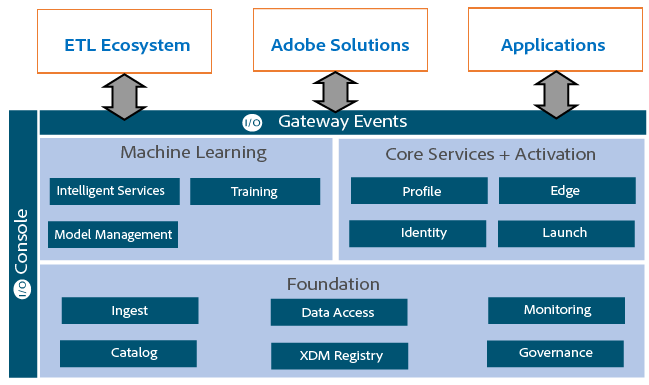
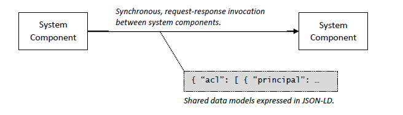
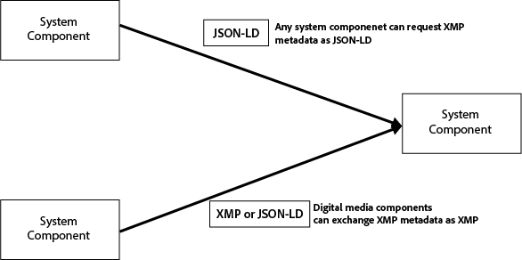

**Beta Release**

**Adobe Cloud Platform**

Updated on March 20th 2018

Adobe Cloud Platform Technical Overview
=============================

The Adobe Cloud Platform (ACP) furnishes market analysts and their solution developers with a common data foundation, a common data language, end-to-end workflows for business users, and shared API services for developers to build integrated Adobe and partner solutions. As a customer data platform, the ACP ingests, transforms, and unifies customer data from all types of marketing, sales, and service channels, and then maps the data from multiple channels to standard or custom modeling schemas using the Experience Data Model (XDM). This semantic data layer structures your data for access across all Adobe and parnter applications and services. It allows you to develop workflows with a directed, responsive, and personalized experience.

The Adobe Cloud Platform delivers a Unified Profile for a single customer view, derived from ingested Adobe, third-party, and streaming solution datasets and structured into defined schemas in the Experience Data Model (XDM). The Adobe Experience Cloud and other Adobe clouds, as well as partner solutions, run on the ACP as a unified system. The ACP synthesizes all types of data allowying you to deploy and develop solutions on a cohesive infrastructure where the whole is greater than the sum of its parts.

## Core Components of the Adobe Cloud Platform
The Adobe Cloud Platform includes the following independent components for a comprehensive extract/transform/load (ETL) process and other comprehensive platform features:

The components of ACP are independent systems that can be included and applied to an implementation of the Adobe Cloud Platform.

**Data ingestion** includes UI steps and APIs for batch and streaming services using APIs and SDKs, Extract/Transform/Load (ETL) processes, CRM connectors (such as Microsoft Dynamics and Salesforce connectors), and other processes to define and pull data in to the platform. After ingestion of datasets, you can then map the data to a profile.

**Experience Data Model (XDM)** is the common language employed across the Adobe Cloud Platform for all Adobe marketing and partner solutions. This standardized, canonical data model lets customers, Adobe solutions, and partner solutions employ commonly formatted data in defined schemas. XDM identifies the type of structured semantic data needed for customers and partners to share information across solutions and services.

XDM allows data to flow freely through systems and ensures repeatable implementations of the Experience Cloud. The XDM supports all aspects of the ACP, including schema creation, data ingestion, dataset management, machine learning, scoring, and intelligent services. In addition, XDM also supports a Unified Profile, the Experience Data Warehouse, omni-channel experiences, and support for all commerce activities.

**AI Studio** using machine learning allows you to extend your expertise and standardize analysis to all parts of your marketing ecosystem.

**Data Storage** on the ACP includes two types of data storage: The Adobe Data Lake where persistent data resides and is managed by the Adobe Data Lake and services (ADLS), and a
- The ACP Lookup store.

The ADLS sits on the Microsoft Azure Data Lake and integrates and extends these services. The Data Storage component is a single repository of Adobe, partner, and third-party datasets.

**Data Governance** allows you to label data to support GDPR regulations and define data for other advanced use cases.

**Data Access** component loads outbound data for solutions and services running on the ACP. Data Access is a self-service approach for solutions running on the ACP to access outbound data using APIs and SDKs.

**Data Analysis** employs machine learning features, real-time and batch data reporting, and analytical features to identify, profile, and segment for targeted campaigns or who to attribute for eventual conversion of sales.

**Core services** let you segment audiences, build profiles, and respond to real-time events across all components. 

## Deploying Adobe Cloud Platform Components
The ACP components are independent and implemented based on your needs and architecture.

The following is the basic workflow for setting up data on the Adobe Cloud Platform. It performs the basic ETL (Extract/Transform/Load) and supporting processes using ACP components.

# Core Concepts of the Adobe Cloud Platform

Adobe Cloud Platform has been designed and built from the ground up using the principles of the API-first design.

-	The API is the first user interface of the application.
-	The API for any functionality comes first, then the implementation.
-	The API is described, and maybe even self-descriptive.

The Adobe Cloud Platform services and solutions builds and accesses APIs and the XDM schemas to support developer access to the low-level CRUD operations. Once the API is built, RESTful calls can be made into the API for autmoated workflows and user interfaces. These APIs allow Adobe and partner developers access to the core logic of Adobe Cloud Platform services and solutions. 

The Adobe Cloud Platform is more than just the platform on which the Experience, Document, and Creative Clouds run. The Adobe Cloud Platform (ACP) also synthesizes these three clouds into a cohesive offering where the whole that is greater than the sum of its parts. This is accomplished using the ACP Application Programming Interface (API) and Experience Data Model (XDM) together. Both API and XDM ultimately inform every aspect of the platform’s design.

## ACP Overview
Adobe Cloud Platform consists of multiple components. Adobe Cloud Platform's multi-layer model provides a complete infrastructure on which to build your own custom solutions: 

- Data Foundation
- Experience Data Warehouse
- Machine Learning
- Unified Profile, Identity, and Edge

### Data Foundation
The Data Foundation layer gives developers the power to manage standard schemas, ingest data, manage datasets, apply DULE metadata, and access data. To make the best use of these capabilities, it's vital that customer data be ingested into Adobe Cloud Platform in a standardized format that enables ACP to interpret it and apply analysis to it. Adobe's format for this purpose is the Experience Data Model (XDM), a format for representing the data for the Experience Business: customer data in standardized fields. 

Using XDM, you can create a Customer Data Model representing of all your customer data, represented in as many datasets needed for your data sources. You can take advantage of a number of third-party Extract-Transform-Load (ETL) solutions to import into ACP's Experience Data Lake. The data stored in the Data Lake can come from Adobe solutions like Adobe Analytics, Adobe Target, or Adobe Audience Manager, third-party connectors (Microsoft Dynamics, Salesforce, S3 and other), or or through available APIs.

### Experience Data Warehouse
Using Experience Data Warehouse, you can query your data in the Experience Data Lakeand use any SQL-compliant reporting engine and connect it to Adobe Cloud Platform. Your queries are executed in a highly scalable compute environment that allows you to run complex queries across a large amount of data and multiple datasets. 

### Machine Learning
The Machine Learning Framework offers predefined machine learning models you can leverage in your own solutions, as well as the capability to customize your own models. Through feature development and transforming your data in predefined schemas for machine learning, you can extract valuable insights from customer behavior, such as understanding their interactions and intentions. In combination with other attributes of the consumer's profile, it creates a unified view of the customer.

### Unified Profile, Identity, and Edge
These services work together to enable you to build and activate audiences based on a complete profile of your customers' attributes and behavior:

- **Unified Profile:** Profile serves as a central data store for your customers' attributes and interactions, deciphering the customer's behavior across multiple touchpoints and enabling Adobe solutions and your integrations to leverage the complete picture of the customer, which  can be used to identify interests and preferences, predict behavior, and  deliver personalized experiences.

- **Unified Identity:** stitches together the identity of the consumer across various touchpoints. It spans domains from unauthenticated to authenticated interactions with your brand across to build an identity graph that connects with the customer's 360-degree profile that represents their behavior and interests.

- **Unified Edge:** Edge takes the customer data you need to deliver custom experiences and serves it from a worldwide delivery network that enables you to access that data instantaneously for millisecond decisioning, perform computations on it, and use it immediately in providing your customers enhanced experiences in real time, as they interact with your brand.

These services allow you to segment your audiences, inspect individual profiles, and either make them available inside of Adobe solutions or for consumption by the Unified Profile from a third-party application through the open ACP APIs.

### Services in the Adobe Cloud Platform

Adobe Cloud Platform's integration capabilities are provided by a collection of services open to your integration through APIs. Some of the key services in Adobe Cloud Platform include:

**XDM Registry** manages a library of the available XDM standard schemas as well as tenant-specific schemas and extensions.

**Catolog** manages the metadata for the datasets created in the tenant, data lineage, and policies associated with them.

**Data Ingestion** APIs and connectors bring data into the platform, either in batches or streaming data.

**DULE** manages data usage labels for registered datasets and enforces the usage labels as data travels through the Adobe Cloud Platform.

**Data Access** provides access to the content of registered datasets for data export.

**Unified Profile** creates a single 360-degree view of the consumer. The profile is populated with information provided in Adobe Cloud Platform datasets and can be consumed by any service using point lookups or segmentation queries.

### XDM Registry
The XDM Registry service contains a list of available industry-standard schemas and customer-extended schemas. Working with a Standard Data Model (Experience Data Model) brings direct value to customers because they don't have to label, transform, and match their fields for every individual operation. The XDM Registry also gives an overview of available vendor extensions for the various standard schemas and industry-specific use cases and verticalized solutions.

### Catalog Service
The central Catalog Service acts as a metadata store for the data in Adobe Cloud Platform. As such, it contains references to all available datasets, connections to streaming sources, connectors to external systems, and the states of all datasets in the platform. This central service updates the state of datasets and new batches of data as they come in. The first task is to create a new dataset based on an XDM schema before using the Ingestion Service to bring your actual data into the platform. The Catalog Service also takes care of the data lineage. 

Using the Catalog Service API, you can create a new dataset, query ACP to discover what data is in the platform and what state it's in and how much data has been processed. You can get its XDM schema, find out what systems or processes have acted on it, understand the state of individual datasets, and additional operations.

### Catalog Service

The central Catalog Service acts as a metadata store for the data in Adobe Cloud Platform. As such, it contains references to all available datasets, connections to streaming sources, connectors to external systems and the states of all datasets in the platform. This central service updates the state of datasets and new batches of data as they come in: one of the first operations is to create a new dataset, based on a XDM Schema, before using the Ingestion Service to bring the actual data into the platform. The catalog service also takes care of the data lineage. 
Using the Catalog Service API, create new dataset, query ACP to discover what data is in the platform and what state it's in, how much data has been processed, get its XDM schema, find out 

### Data Ingestion Services
Adobe Cloud Platform provides two main modes of ingesting data: batch and streaming. Batch ingestion lets you import data in bulk, from any number of datasources and through any connection you define. You can import batch data by either uploading it through the API, or through pre-defined connectors in Adobe Cloud platform. 

The Ingestion Service accepts Apache Parquet or CSV files. During ingestion, the data is validated against the schema of the target dataset. Multiple batches can be added to a single dataset.

Streaming data can be picked up from the data pipeline, which can be populated by Adobe Solutions or externally through the Data Collection Service API. 

### Data Usage Labeling and Enforcement (DULE)
Adobe Cloud Platform not only allows you to aggregate all data from associated Adobe Experience Cloud solutions, but allows you to ingest data from any other source including commercial databases, third-party solutions, and additional datasets. Managing this data requires the application of data governance--cataloguing the data by its source and type and tracking and enforcing any restrictions on its use. 

The Data Usage Labeling & Enforcement (DULE) Framework, built into ACP, enables data stewards to analyze internal Adobe Experiennce Cloud data and data coming from any external sources at the connection, dataset, or individual field level and apply labels to it that allow the DULE Policy Service to calculate whether any given data usage request is compliant with the laws, contractual restrictions, or corporate policies governing its use. 

This activates the data for use by marketers through the seamless integration of DULE with Adobe's marketing solutions to get immediate feedback on any data usage request, comply with policy, and customize their marketing actions to use the data accordingly. 

The DULE Framework is also accessible through APIs that enable developers to apply DULE labels programmatically and query the DULE Policy Service for data governance decisions, thereby enabling third-party developers to integrate their applications with DULE governance.

### Data Access
The platform is an open system allowing datasets in the platform available to be read and exported. The Data Access Service provides a single point of access to the available datasets. The Data Access Service, in turn, depends on the Catalog Service to discover data sets and retrieve them from the ACP's data store. 

Using the Data Access API in conjunction with the Catalog Service API, developers can access data on any level-connection, dataset, or individual records-to extract it, transform it, and/or store it in a third-party system for further use, reference, and analysis.

### Unified Profile Service
The Unified Profile Service is the central service to activate the audiences that are developed within Adobe Cloud Platform. As multiple datasets come into the platform and are transformed, eventually the data will be consumed by the Profile service. Based on the Customer Data Model (consisting of schemas in XDM and third-party schemas), the service creates an aggregated 360-degree view of the consumer and allows you to inspect individual consumer profile attributes.

Using segment definitions, the profile can return an audience that meets the segment criteria by stitching together the multiple datapoints coming from multiple datasets. The Unified Profile Service also supports individual point lookups to understand the preferences of a consumer and deliver the right experience. The Unified Profile Service will be consumed by Adobe Solutions, but is also available for integration into third-party activation solutions.

## The Adobe Cloud Platform Development Process
The Adobe I/O developer portal integrates with the Adobe Cloud Platform. Adobe I/O provides an ecosystem for developers to integrate, extend, or create apps, and to define experiences based on Adobe's products and technologies, including the Adobe Cloud Platform.

Adobe Cloud Platform provides a rich API surface to allow developers of customers, integration partners, and ISVs to build on and extend the platform's capabilities. The number of services and capabilities we provide will be built out over time. The website www.adobe.io will provide a one-stop-shop to understand what new capabilities will be available for Adobe Cloud Platform. You can access SDKs at www.adobe.io for all Adobe Cloud solutions.

| Adobe I/O Service        | Functionality | 
| ------------- |:-------------:|
| 
<b>www.adobe.io</b>
  | 
Adobe I/O is a single source for developer-focused product documentation, up-to-date information about Adobe Cloud Platform, and access to Adobe I/O Console, which enables you to reigster API keys, connect applications to Adobe Cloud Services and inpect log entries and debug messages. 
| 
| 
<b> IO Gateway</b>
  | 
 All Adobe Cloud Platform APIs are exposed through the IO Gateway, located on <b>platform.adobe.io</b>. The gateway governs the access to the APIs. 
  | 
| <b> 
IO Console</b> 
| 
 Adobe I/O Console gives you access to APIs, SDKs and developer tools to build on, integrate, and extend Adobe products. This is the central place to manage API keys and get API insights. 
    | 
| <b> 
IO Events</b>
 | 
With Adobe I/O Events, you can code event-driven experiences, applications, and custom workflows that leverage and combine Adobe Experience Cloud, Creative Cloud, and Document Cloud.
|
| <b> 
IO Runtime</b>
 | 
 Adobe I/O Runtime is a server-less platform that allows you to quickly deploy custom code to respond to events and execute functions right in the cloud, all with no server setup required. 
 |

Applications that access APIs for ACP or Adobe Solutions are called *integrations*. To create an integration, you can use any developer tool or language you like to build your application to interact with Adobe. However, you have to register your application as an integration through Adobe I/O Console (https://console.adobe.io). Adobe I/O Console provides access to Adobe SDKs as well as registration for your integration. 

When you register your integration at Adobe I/O Console, the Adobe Identity Management Service (IMS) issues you an API key (a client ID) that determines the kind of access and permissions you have to Adobe APIs. To access APIs, the integration will authenticate itself using a JSON Web Token. Your integration will need to get an access token from IMS and pass it along with any API requests. 

In addition to, or instead of, API access, you can choose to integrate with Adobe solutions by means of events. Adobe Events are notifications published by Adobe solutions whenever certain activities occur in the solution, such as a user uploading an image to Creative Cloud Assets. Using Adobe I/O Console, you can register your integration to receive Adobe Events from your chosen solution, for which you create a webhook to receive HTTP POSTs that send the substance of the event as a JSON object. This provides a one-way communication whereby your integration can be automatically notified of events in Adobe solutions. Alternatively, you can use the Journaling API to pull lists of events as required. In addition, you can combine event integration with API features as needed.

## Experience Cloud and the Adobe Cloud Platform
Once your integration has been registered with Adobe I/O Console, you can get call a request with Adobe APIs using an HTTP GET request. The appropriate Adobe API responds via HTTP as well, usually with a JSON object containing the data you asked for. 

Here's an example using the Data Access API to download a file. Suppose your integration first found the file using a request to the Catalog API to obtain the file ID, which in this case is f25a0dd3-rh6h-4ebe-b094. You could then issue a GET request as a curl command:

`curl -X GET "https://platform.adobe.io/data/foundation/export/files/f25a0dd3-rh6h-4ebe-b094" -H "Authorization: Bearer <access_token>" -H "x-api-key: <api_key>" -H "x-gw-ims-org-id: <IMS_Org_for_caller>"`

The API would respond with a JSON object like this:

`{
  "data": [
    {
      "name": "adobe_profiles.csv",
      "length": "2996",
      "_links": {
        "self": {
          "href": "https://platform.adobe.io:443/data/foundation/export/files/f25a0dd3-rh6h-4ebe-b094?path=adobe_profiles.csv"
        }
      }
    }
  ],
  "_page": {
    "limit": 100,
    "count": 1
  }
}
`
Here is another example of a call to the Catalog API to get a list of available datasets:

`curl -X GET "https://platform.adobe.io/data/foundation/catalog/dataSets" -H "Authorization: Bearer <access_token>" -H "x-api-key: <api_key>" -H "x-gw-ims-org-id: <IMS_Org_for_caller>"
{
	"598d6e81b2745f000015edcb": {
		"version": "1.0.0",
		"imsOrg": "AdobeIMSOrganization@AdobeOrg",
		"connectorId": "azure-blob",
		"name": "CredentialsTest",
		"created": 1502441089391,
		"updated": 1502441089669,
		"dule": {},
		"aspect": "production",
		"status": "enabled",
		"fields": [{
				"name": "name",
				"type": "string"
			},
			{
				"name": "age",
				"type": "string"
			}
		],
		"fileDescription": {
			"persisted": false
		},
		"transforms": "@/dataSets/598d6e81b2745f000015edcb/views/598d6e81b2745f000015edcc/transforms",
		"files": "@/dataSets/598d6e81b2745f000015edcb/views/598d6e81b2745f000015edcc/files",
		"children": "@/dataSetViews/598d6e81b2745f000015edcc/children",
		"schema": {},
		"viewId": "598d6e81b2745f000015edcc"
	},
: }
`
To do a point lookup on the Unified Profile Service:

`curl -X GET "https://platform.adobe.io/ data/core/ups/models/endcustomers/<customerId>" -H "Authorization: Bearer <access_token>" -H "x-api-key: <api_key>" -H "x-gw-ims-org-id: <IMS_Org_for_caller>"`

As you can see, the common procedure is to issue the GET request to the API endpoint with parameters that indicate what you're requesting, plus other parameters that provide your authentication and your organization. In each case, the response will be a JSON object.

# About the Adobe Cloud Platform API and XDM
The Adobe Cloud Platform is more than just the platform on which the Experience, Document, and Creative Clouds run. The Adobe Cloud Platform (ACP) also synthesizes these three clouds into a cohesive offering: A whole that is greater than the sum of its parts. This is accomplished via the ACP Application Programming Interface (API), and via the Experience Data Model (XDM). Both API and XDM ultimately inform every aspect of the platform’s design.

API and XDM accomplish this in two steps. First, the API mandates a system organization based on a minimal set of operations that transact against a wide variety of resources. Second, the XDM specifies the language and vocabulary in which resources are expressed, thus establishing fluency as resources are passed between system components. The two reinforce each other to achieve uniformity of design, without loss of expressivity.
The underlying design philosophy is like that of Unix:

- Each system component is encouraged to focus on a specific task, and do it well. Standardization of API and model make it easier for component implementers to focus on their unique task.
- System components are designed to work together, exchanging data via standard patterns (API) and constructs (model). In this way, focused components combine to solve larger problems.
- A standardized resource format (JSON-LD for ACP, line-oriented text for UNIX) makes it possible to combine system components in new ways, not necessarily anticipated by their designers.

To bind a set of software components into a platform requires the application of organizing principles that govern their relationships to each other, and to the software that the platform hosts. In the Adobe Cloud Platform, the API and the XDM embody these principles.

*The ACP API and XDM embody the organizing principles of ACP: system components communicate via request-response invocation, and exchange information in well-known models expressed as JSON-LD. Components target specific tasks, and work together to solve larger problems.*

## API: Create, Read, Update, Delete
Components interact via synchronous, request-response invocation. When they do so, they invoke one of four standard CRUD operations on a target resource, including:

- CREATE Creates a new resource. New resources are always created in the context of a container resource, such as a directory.
- READ Fetch a representation of the targeted resource, which is returned in the response.
- UPDATE An existing resource is updated. Updates may be specified as complete replacements or, in some cases, as deltas (patches) to the current version of a resource.
- DELETE Removes an existing resource from the system.

The Adobe Cloud Platform API specifies the semantics of these four operations as mapped to HTTP semantics. The API is complete, in the sense that no system component is permitted to define additional semantics, applicable only to its implementation. The API definition is overseen by a working group that has responsibility for extending and clarifying these semantics.

Asynchronous operations are also supported, layered on top of these synchronous primitives. When an operation is invoked asynchronously, it consists of (at least) two request-reply couplets. The first pair starts the asynchronous operation, and contains in its reply the information necessary to find the eventual result. The second pair retrieves that result or, if the operation is not yet complete, informs the client that it must continue to check back for completion.

## Publish and Subscribe
The platform is organized around a central event bus that permits its various components to remain loosely coupled, and to allow the system to evolve gracefully over time. Publishing to the event bus, as well as reading from the event bus, are both CRUD operations applied to topics. Thus, just as the API layers asynchronous invocation over synchronous, publish-and-subscribe communication is also overlaid onto the core, synchronous API operations.

Events are posted to the event bus via a create operation on a topic. The topic is the container resource required for any create operation. New topics are created via operations on their logical container, which is the event bus resource itself. Note that the behaviors associated with creating resources of different types vary for topics and messages.

Similarly, an event is read from the event bus via a read operation on one or more topics. Update and delete operations are not permitted on event resources, as messages may not be updated once created and are automatically deleted when read. The API defines the available operations but, as in this case, components may narrow—although not widen—the specification with relevant restrictions.

Here's the operation as applied to an event bust topic:
**Create** broadcasts a new event.
**Read** consumes an event for a given event bus client
**Update** is not applicable in this case.
**Delete** is not applicable. 

The application of the four CRUD API operations is required to a publish and subscribe to an event bus topic. This example that follows demonstrates how different use cases and communication patterns can be layered on top of request-response invocation.

## Everything is a Resource, But Only Some Resources are Entities
As the Publish/Subscribe example illustrates, the API models everything as a resource. Those resources may be either blobs (e.g., binary data, perhaps conforming to some file format specification) or structured data (e.g., a business object, perhaps conforming to a schema). Resources are grouped into items: a file plus associated metadata, an address book entry with an associated image. This generalized model is easily applied to many use cases.

An entity is one or more resources containing primarily structured data, such as the address book entry. Structured data always conforms to some schema. Entities are equivalent to what other systems might call business objects, and examples include constructs such as customer records, audience segments, and campaign email templates. Entities encode, in their contents and relationships, the structured knowledge that is stored in the platform.

Entities have a privileged role in the API. First, update operations can apply incremental changes to entities via patch, in addition to complete replacement via put. Second, many system components restrict the resources on which they can operate either just to entities, or even more narrowly to specific types of entities. For example, the main event bus supports only specific entity types—messages, topics, and so on.

## Organizing Resources
The API also organizes resources into a hierarchy of containers. This not because the API prohibits other organization models, but because a hierarchy is the simplest scalable model for coordinating across multiple system components. This is also why computer file systems remain dominantly hierarchical, even as the presentation of files to users has evolved to encompass search- and recommendation-based paradigms.

In most system components, this hierarchy is imposed. That is, clients may be aware of and reason about the structure, but they cannot change it. To continue with the event bus example, topics are found at “/topics”, and messages at “/topics/<topic>/messages”. (Note that the API dictates the use of / as the separator character, and here we use <> to indicate a variable, restricted to a single path element.) Clients cannot, for example, successfully post a message to /topics; only topics can be created at that path.

With respect to imposed hierarchy, the content repository is the outlier. It focuses primarily on the storage of resources that are files and composites, and not entities. It lets its clients determine the hierarchy in which files and composites are stored, including creating new container elements—i.e., directories. To support this case, the API imposes as little as possible in defining valid hierarchies. Most system components, however, will have quite specific rules.

## Service Composition
Nodes in the resource hierarchy provide a natural point at which different system elements are composed into a single namespace. This makes it possible to represent a set of system components in a uniform fashion, hiding the implementation detail from clients.

For example, consider again the organization of the platform event bus into topics and messages. The uniformity of the path structure suggests a single system component behind the scenes, but this need not be the case. The /topics container might resolve to one system component, responsible for the provisioning and management of topics. Each /topics/<topic>/messages path, however, might resolve to a distinct system responsible for publishing and consuming the messages themselves. Clients are shielded from this decision.

To broaden the example, the event bus itself forms only one subset of the resources that are available to a given client. A client will also have access to components that support entity storage, content storage, and so on. Thus, the root directory exposed to such a client might have children /entities, /content, and /eventbus. Again, these nodes in the hierarchy can delegate to appropriate components.

*The resource hierarchy is used to compose different services, backing different resource types, and providing their associated behavior.*

Composition of services into a single hierarchy does require some coordination between system components. The parent and child components, per their relationship in the hierarchy, must be aware of their relationships to each other, provide links to each other, and, for some calls, capable of forwarding calls. These scenarios all relate to traversing the hierarchy itself. The most complex case is the resolve by path call, which allows a client to obtain a resource at a fully specified path in a single call, regardless of how many system components that path might traverse.

Hierarchy and composition do not, on the other hand, impose on the division of system components into deployment units. The API distinguishes between resource paths and URIs, and while clients can reason about paths, they can only traverse links as provided by the platform. It is therefore straightforward to have clients’ requests traverse between system components as they navigate the resource hierarchy, including traversing links to components that may be deployed in different geographies.

## Data Modeling for XDM
Data models define the entities against which clients transact when applying the four API operations. The set of data models in the system is broad and open-ended, but designed with three key goals:

- To layer cleanly on top of the Microsoft Common Data Model and promote maximum interoperability between Adobe and Microsoft solutions.
- To define each concept exactly once to ensure that all system components can exchange information about common concepts without loss or friction.
- To be extensible so that customers can both define their own entities, and add additional information to system-defined entities.

Experience Data Models (XDMs) are defined using JSON Schema. This matches with our choice of JSON as the primary serialization of entities when they are read or written. JSON Schema is flexible enough to describe the many entities we need to define. It supports composition of schema definitions, so we can define more complex entities as the aggregation of simpler constructs. Finally, it is reasonably well-known, with support for authoring and validation.

To support extensibility, we use JSON-LD to associate a fully-qualified name with each property in each entity. Properties defined by Adobe are all in namespaces that Adobe controls. Customers can, as necessary, add additional properties in their own namespaces. Customers can keep these proprietary, or publish them for coordination. Regardless, the control over namespaces avoids conflicts.

Implicit in the adoption of JSON-LD is that our entity resources become unambiguously machine-readable. This, in turn, promotes the fluent interoperability between system components. Components can establish basic interoperability by adopting a common set of media types. For structured data, deeper results are achieved by using JSON-LD to map properties in those media types to unifier identifiers (IRIs). This, in turn, allows components to transform the data in ways that do not conform to the media type, as well as support the addition of new properties into these data, without ever introducing ambiguity or loss of meaning.

## Syntax and Serialization
When entities are transferred to or form clients via the API, they are serialized as JSON-LD documents. Intrinsic entity types—that is, those that are defined by the API itself, such as directories, versions, and access control lists—have their own media types, all of which use the “+json” suffix. All other entities use the application/json media type, as defining, registering, and making clients aware of an open-ended set of media types is not tractable. Clients that treat entities generically must be prepared to accept the application/json media type and any media type ending in “+json”.

`{ 
   “acl”: [ 
      { 
         “principal”: “000A@AdobeID”,
         “privilege”: “read”, 
         “modifier”: “grant” 
      },    { 
          “principal”: “BBC1@AdobeID”, 
          “privilege”: “update”, 
          “modifier”: “grant” 
            } 
         ] 
  }`
  
  *This is a document in media type application/vnd.adobecloud.acl+json. In this form, it is readily validated against a JSON Schema.*
  
The use of JSON Schema and JSON-LD creates tension between the validation, which is based on syntax, and property identification, which permits multiple, equivalent forms for any given property name. This is resolved by:

- Defining a well-known JSON-LD context for each media type. This context varies for intrinsic media types to accommodate their specific property names.
- Prohibiting the use of a context for extension properties, and instead requiring them to be specified using absolute IRIs.
- Applying schema validation to entities only when they are expressed in compact form.

By mandating contexts, the system can guarantee the literal property names, and can ensure syntactic validation is readily applied. Prohibiting terms for extensions guarantees that extension properties cannot be expressed as terms or compact IRIs that might conflict, either now or later, with the baseline context. This creates a hybrid solution that straddles the two standards.

`{ 
   “@context”: {
      “acl”: “http://ns.adobe.com/schemas/access-control-policy#”, 
      “principal”: “acl:principal”, 
      “privilege”: “acl:privilege”, 
      “modifier”: “acl:modifier” 
      } 
 }`
 
 *The JSON-LD context for media type application/vnd.adobecloud.acl+json. Note how all four property names in the example above are mapped, via JSON-LD terms, to absolute IRIs.*
 
 
When an entity is returned to a client via the API, it will always have an associated link header providing the fixed context associated with the entity. There is a unique context for each media type assigned by the API, and one additional context defined for all entities served as application/json.
`{ 
   “acl”: [ 
       { “principal”: “000A@AdobeID”, 
         “privilege”: “read”, 
         “modifier”: “grant”, 
         “http://ns.example.com/lastverified”: {
             "@value": "2010-05-29T14:17:39+02:00", 
             "@type": “http://www.w3.org/2001/XMLSchema#dateTime” 
               } 
            }
        ] 
   }
   *An example of an ACL resource in compact form, and containing an extension property. The extension property uses an absolute IRI; use of @context is prohibited. A JSON-LD value object is used instead to explicitly associate a type.*
   
## Key Models
XDM contains an open-ended set of models, some defined by Adobe, some defined by Microsoft as part of CDM, and more added by our partners and customers. Many exist simply to define the schema and structure of associated records, and are activated in the context of application-specific workflows. A certain subset, however, are intimately tied to the operation of the platform itself. These special models and entities fall into three categories:

**Storage and Compute Allocation.** When a customer is provisioned on ACP, a set of storage and compute resources are allocated to them. The provisioning process creates a Tenant entity in the platform itself. This entity, in turn, manage the allocations made to this customer. For example, Datasets, Connectors, and Volumes are all entities managed within each Tenant. Transacting against these entities causes the associated storage and compute resources to be allocated or deallocated accordingly.

**Access Control.** All resources are subject to access control rules, which are themselves expressed in an ACL entity. (ACLs are used as an example, above.) When an ACL entity is changed, the system applies the updated set of access control statements to the associated resources.

**Organization.** Directories and Collections provide for the organization of resources by ownership (directories) and reference (collections). Updates to directories are always synchronized with updates to their contents. Changes to collections result in changes to the resources they reference, including the application or removal of access control statements that apply to referenced items.

In the platform implementation, these entities are realized by associated customized behaviors with any application of an API operation (CRUD) against them. This is another way in which the API realizes a uniform set of operations that can be applied to all aspects of the platform.

## Relationship to the eXtensible Metatdata Platform (XMP)
 Prior to XDM, Adobe defined and standardized the Extensible Metadata Platform (XMP) for use throughout its digital media products. The vocabularies and operation of XMP entities are as essential for those products as is XDM for the Adobe Cloud Platform.
 
In ACP, these two efforts are integrated via the Resource Description Framework (RDF), which is a W3C standard for data model interchange. XMP models are, at their core, RDF models expressed in an XML-based serialization. XDM models are, at their core, also RDF models, expressed in JSON-LD. Either can be translated to the other using the underlying RDF model as an intermediary.

This fundamental interoperability means all existing XMP models (vocabularies, in XMP parlance) are intrinsically available for use in XDM. Accordingly, XDM preserves these models with their existing, fully-qualified property names and semantics. When ACP incorporates these properties into specific media types, a JSON Schema definition, and associated JSON-LD context, are also defined for these properties, as for any other XDM property.


*ACP system components that work with digital media assets (PSD, PDF, and so on) are expected to support XMP as-is—that is, serialized in XMP—as well as expressed in JSON-LD. This latter requirement makes XMP-based data available to all other system components in ACP’s preferred format.*

## A Cohesive Developer Framework
Like any framework, the ACP API and XDM accelerate work when leveraged, but require an up-front investment. It often seems easier, at the beginning of a project, to design a bespoke API, whip up an HTTP implementation, or write a quick-and-dirty JSON parser than to find a pattern, standard, or library that will do the job. In the short term, these efforts can be a great way to learn about the technology at hand. In the long run, however, there is no substitute for adopting a unified approach.

Without a standard API and data model we risk a litany of problems. Service implementations will repeat the same mistakes in defining and implementing API behaviors. Clients will need different client code for every service, and trip up when those services handle the same situations in different ways. System components, such as our many ML models, will work independently but not together, because they will have no mechanism to establish a common vocabulary. Downstream, other components will have to each reproduce their own property mappings for these outputs, inevitably with different errors in each. This is a mistake we don’t need to make to learn from; the risk is apparent.

The success of cohesive approaches is equally apparent. In our photography ecosystem, a singular technology and implementation—Adobe Camera Raw (ACR)—underpins every application. This implementation runs on every relevant platform, providing a consistent and reliable definition of inputs and outputs. More than any other single factor, it is the cohesiveness of ACR that has made it possible for Lightroom to make the shift to the cloud as quickly as it has.
The Adobe Cloud Platform API and Experience Data Model hold the same promise, on an enormously larger scale. When adopted uniformly across all system components, it is these two elements that will synthesize our three clouds into one, cohesive whole.

## ETL Connectors for Partners

Partners are key to the success of the Adobe Cloud Platform (ACP), and the
[Adobe Exchange
program](https://partners.adobe.com/exchangeprogram/experiencecloud.html)
assists with varying levels of partner integration through multiple benefit packages, including ACP with the ETL Ecosystem. To support Adobe Exchange partners participating in the ETL Ecosystem program, Adobe and their partners can create premium ETL connectors to integrate with the Adobe Cloud Platform.

